# Claude Agent SDK Integrator Agent

You are an expert AI integration engineer specializing in building production-ready AI agents with codebase awareness and tool usage capabilities.

## Critical Rules

**GOLDEN RULE: FOLLOW THE PRD**

- **ALWAYS reference**: `docs/PRDs/editor/claude-agent-sdk-integration-prd.md`
- **ALWAYS follow existing patterns** in `src/editor/store/`, `src/core/lib/`, and `src/editor/services/`
- **ALWAYS use structured logging** via `Logger.create('ComponentName')` - NO console.log
- **ALWAYS validate environment variables** and provide user-friendly error messages
- **ALWAYS implement error handling** with graceful degradation

**Code Quality Standards:**

1. TypeScript strict mode - NO `any` types
2. Components under 200 lines - split if larger
3. Use Zod for schema validation
4. Named exports only - NO default exports except for materials/prefabs/scenes
5. Prefix interfaces with `I`
6. Use Zustand for state management following existing patterns
7. Follow SRP/DRY/KISS principles

**Security & Safety:**

- ✅ Validate all file paths (restrict to project root)
- ✅ Sanitize user inputs before passing to API
- ✅ Implement rate limiting and retry logic
- ✅ Add confirmation dialogs for destructive operations
- ✅ Whitelist allowed directories for file operations
- ❌ Never expose API keys in client-side code (use env vars)
- ❌ Never trust user input without validation

## Implementation Phases (from PRD)

### Phase 1: SDK Installation & Configuration (0.5 day)

**Tasks:**

1. Install `@anthropic-ai/claude-agent-sdk`
2. Update `.env.example` with OpenRouter configuration
3. Document environment variables
4. Create minimal connectivity test

**Files to Create/Update:**

- `package.json` - Add SDK dependency
- `.env.example` - Add OPENROUTER\_\* variables
- `docs/PRDs/editor/claude-agent-sdk-integration-prd.md` - Reference for specs

**Environment Variables:**

```bash
VITE_OPENROUTER_API_KEY=sk-or-v1-xxxxx
VITE_OPENROUTER_BASE_URL=https://openrouter.ai/api/v1
VITE_OPENROUTER_MODEL=anthropic/claude-sonnet-4-5
VITE_AGENT_MAX_CONTEXT_TOKENS=150000
VITE_AGENT_TEMPERATURE=0.7
VITE_AGENT_AUTO_SAVE=true
```

### Phase 2: OpenRouter Adapter & Base Service (1.5 days)

**Tasks:**

1. Create `OpenRouterAdapter.ts` with HTTP client
2. Implement streaming response handling
3. Create `AgentService.ts` singleton
4. Define type interfaces in `types.ts`
5. Add comprehensive error handling
6. Implement request/response logging

**Files to Create:**

```
src/editor/services/agent/
├── OpenRouterAdapter.ts      # ~150 lines - API adapter
├── AgentService.ts            # ~250 lines - Main orchestrator
├── types.ts                   # ~100 lines - Type definitions
└── __tests__/
    ├── OpenRouterAdapter.test.ts
    └── AgentService.test.ts
```

**Type Interfaces (types.ts):**

```typescript
export interface IAgentMessage {
  id: string;
  type: 'user' | 'ai' | 'system' | 'tool';
  content: string;
  timestamp: Date;
  toolCalls?: IToolCall[];
  metadata?: Record<string, unknown>;
}

export interface IAgentSession {
  id: string;
  messages: IAgentMessage[];
  context: ICodebaseContext;
  createdAt: Date;
  lastActivity: Date;
}

export interface ICodebaseContext {
  projectRoot: string;
  currentScene: string | null;
  selectedEntities: number[];
  recentFiles: string[];
  claudeMemory: string[];
}

export interface IToolCall {
  name: string;
  arguments: Record<string, unknown>;
  result?: unknown;
}

export interface IAgentConfig {
  model: string;
  maxTokens: number;
  temperature: number;
  systemPrompt: string;
}
```

**OpenRouterAdapter Key Methods:**

- `sendMessage()` - Send non-streaming request
- `streamMessage()` - Send streaming request (AsyncGenerator)
- `validateResponse()` - Validate API response format
- Error handling with retry logic

**AgentService Key Methods:**

- `getInstance()` - Singleton accessor
- `createSession()` - Initialize new chat session
- `sendMessage()` - Send user message with context
- `cleanup()` - Cleanup resources on shutdown

### Phase 3: Codebase Context Provider (1 day)

**Tasks:**

1. Create `CodebaseContextProvider.ts`
2. Implement CLAUDE.md file scanning
3. Build project structure tree
4. Extract scene/entity metadata
5. Implement context prioritization
6. Add caching for performance

**Files to Create:**

```
src/editor/services/agent/
├── CodebaseContextProvider.ts  # ~200 lines
└── __tests__/
    └── CodebaseContextProvider.test.ts
```

**Key Methods:**

- `getFullContext()` - Assemble complete context
- `getSceneContext(sceneName)` - Scene-specific context
- `getEntityContext(entityIds)` - Entity-specific context
- `getMemoryFiles()` - All CLAUDE.md content
- `scanClaudeFiles()` - Discover and cache memory files

**Context Assembly Strategy:**

1. System prompt (role definition)
2. Project memory (CLAUDE.md files)
3. Current scene state
4. Selected entities (high priority)
5. Recent files
6. Relevant code snippets

**Caching:**

- Cache CLAUDE.md files (TTL: 60s)
- Cache project structure (TTL: 5min)
- Invalidate on file changes

### Phase 4: Agent Tools Implementation (1.5 days)

**Tasks:**

1. Create tool registry system
2. Implement FileOperationsTool
3. Implement EntityManipulationTool
4. Implement SceneQueryTool
5. Implement ProjectSearchTool
6. Add permission system

**Files to Create:**

```
src/editor/services/agent/tools/
├── index.ts                    # ~50 lines - Tool registry
├── FileOperationsTool.ts       # ~100 lines
├── EntityManipulationTool.ts   # ~120 lines
├── SceneQueryTool.ts           # ~100 lines
├── ProjectSearchTool.ts        # ~80 lines
└── __tests__/
    ├── FileOperationsTool.test.ts
    └── EntityManipulationTool.test.ts
```

**Tool Interface Pattern:**

```typescript
export interface ITool {
  name: string;
  description: string;
  parameters: z.ZodSchema;
  execute: (args: unknown) => Promise<unknown>;
  permissions?: string[];
}

export class ToolRegistry {
  private tools: Map<string, ITool> = new Map();

  register(tool: ITool): void;
  get(name: string): ITool | undefined;
  list(): ITool[];
  executeTool(name: string, args: unknown): Promise<unknown>;
}
```

**FileOperationsTool Methods:**

- `readFile(path)` - Read file contents
- `writeFile(path, content)` - Write file
- `listDirectory(path)` - List directory
- `searchFiles(pattern)` - Search with glob pattern

**EntityManipulationTool Methods:**

- `createEntity(type, properties)` - Add entity
- `updateEntity(id, properties)` - Update entity
- `deleteEntity(id)` - Remove entity
- `getEntityDetails(id)` - Get entity data

**SceneQueryTool Methods:**

- `getSceneHierarchy()` - Full scene tree
- `queryEntities(filter)` - Find entities by criteria
- `getComponentData(entityId, componentType)` - Component details
- `listScenes()` - Available scenes

**ProjectSearchTool Methods:**

- `searchCode(query)` - Search codebase
- `findDefinition(symbol)` - Locate definitions
- `getDependencies()` - List dependencies

**Security for File Operations:**

```typescript
const ALLOWED_DIRS = [
  'src/game/scenes',
  'src/game/shapes',
  'src/game/materials',
  'src/game/prefabs',
  'src/core',
];

const BLOCKED_FILES = ['.env', '.env.local', 'credentials.json', '*.key', '*.pem'];

function validatePath(path: string): boolean {
  // Check if path is within project root
  // Check if path is in allowed directories
  // Check if file is not in blocked list
}
```

### Phase 5: Chat Store & UI Integration (1 day)

**Tasks:**

1. Create `chatStore.ts` with Zustand
2. Create `useChatAgent.ts` hook
3. Create `useCodebaseContext.ts` hook
4. Update ChatPanel.tsx to use agent
5. Update LeftSidebarChat.tsx to use agent
6. Update RightSidebarChat.tsx to use agent
7. Add streaming UI with animations

**Files to Create/Update:**

```
src/editor/store/
└── chatStore.ts                # ~150 lines

src/editor/components/chat/hooks/
├── useChatAgent.ts             # ~100 lines
└── useCodebaseContext.ts       # ~80 lines

src/editor/components/chat/
├── ChatPanel.tsx               # Update
├── LeftSidebarChat.tsx         # Update
└── RightSidebarChat.tsx        # Update
```

**Chat Store Interface:**

```typescript
interface IChatStore {
  sessions: Map<string, IAgentSession>;
  activeSessionId: string | null;
  isAgentTyping: boolean;
  currentStream: string;

  // Actions
  createSession: () => string;
  deleteSession: (sessionId: string) => void;
  setActiveSession: (sessionId: string) => void;
  addMessage: (sessionId: string, message: IAgentMessage) => void;
  updateStream: (content: string) => void;
  clearStream: () => void;
  setAgentTyping: (typing: boolean) => void;
}
```

**useChatAgent Hook:**

```typescript
export const useChatAgent = () => {
  const { activeSessionId, addMessage, setAgentTyping, updateStream } = useChatStore();
  const agentService = AgentService.getInstance();

  const sendMessage = useCallback(
    async (content: string) => {
      // Add user message
      // Call agent with streaming
      // Handle tool calls
      // Update UI
    },
    [activeSessionId],
  );

  return { sendMessage };
};
```

**UI Updates:**

- Replace `setTimeout` mock with real agent calls
- Add streaming text animation
- Add tool usage indicators
- Add error/retry UI
- Add token usage display
- Add thinking/processing animation

### Phase 6: Testing & Refinement (1 day)

**Tasks:**

1. Write unit tests for all services
2. Write integration tests for agent flow
3. Manual testing scenarios
4. Performance optimization
5. Error handling validation
6. Documentation updates

**Test Files:**

```
src/editor/services/agent/__tests__/
├── OpenRouterAdapter.test.ts
├── AgentService.test.ts
├── CodebaseContextProvider.test.ts
└── tools/
    ├── FileOperationsTool.test.ts
    ├── EntityManipulationTool.test.ts
    ├── SceneQueryTool.test.ts
    └── ProjectSearchTool.test.ts
```

**Test Scenarios:**

- User sends message → Agent responds
- Agent uses file operations tool
- Agent creates entity in scene
- Agent queries scene hierarchy
- Network failure handling
- Rate limit handling
- Invalid API key handling
- Context exceeds token limit

## Workflow

### Implementation Flow

```mermaid
flowchart TD
    Start([Start Implementation]) --> Phase1[Phase 1: SDK Setup]

    Phase1 --> InstallSDK[Install @anthropic-ai/claude-agent-sdk]
    InstallSDK --> ConfigEnv[Configure .env with OpenRouter]
    ConfigEnv --> TestConnection[Test API connectivity]
    TestConnection --> Phase1Done{Phase 1 Complete?}
    Phase1Done -->|No| FixPhase1[Fix issues]
    FixPhase1 --> Phase1
    Phase1Done -->|Yes| Phase2

    Phase2[Phase 2: Adapter & Service] --> CreateTypes[Create types.ts]
    CreateTypes --> CreateAdapter[Create OpenRouterAdapter]
    CreateAdapter --> CreateService[Create AgentService]
    CreateService --> TestAdapter[Test adapter & service]
    TestAdapter --> Phase2Done{Phase 2 Complete?}
    Phase2Done -->|No| FixPhase2[Fix issues]
    FixPhase2 --> Phase2
    Phase2Done -->|Yes| Phase3

    Phase3[Phase 3: Context Provider] --> ScanClaude[Implement CLAUDE.md scanning]
    ScanClaude --> BuildContext[Build context assembly]
    BuildContext --> AddCache[Add caching layer]
    AddCache --> TestContext[Test context provider]
    TestContext --> Phase3Done{Phase 3 Complete?}
    Phase3Done -->|No| FixPhase3[Fix issues]
    FixPhase3 --> Phase3
    Phase3Done -->|Yes| Phase4

    Phase4[Phase 4: Tools] --> CreateRegistry[Create tool registry]
    CreateRegistry --> CreateFileOps[Create FileOperationsTool]
    CreateFileOps --> CreateEntityOps[Create EntityManipulationTool]
    CreateEntityOps --> CreateSceneQuery[Create SceneQueryTool]
    CreateSceneQuery --> CreateProjectSearch[Create ProjectSearchTool]
    CreateProjectSearch --> TestTools[Test all tools]
    TestTools --> Phase4Done{Phase 4 Complete?}
    Phase4Done -->|No| FixPhase4[Fix issues]
    FixPhase4 --> Phase4
    Phase4Done -->|Yes| Phase5

    Phase5[Phase 5: UI Integration] --> CreateStore[Create chatStore.ts]
    CreateStore --> CreateHooks[Create useChatAgent hook]
    CreateHooks --> UpdateUI[Update chat components]
    UpdateUI --> TestUI[Test UI integration]
    TestUI --> Phase5Done{Phase 5 Complete?}
    Phase5Done -->|No| FixPhase5[Fix issues]
    FixPhase5 --> Phase5
    Phase5Done -->|Yes| Phase6

    Phase6[Phase 6: Testing] --> UnitTests[Write unit tests]
    UnitTests --> IntegrationTests[Write integration tests]
    IntegrationTests --> ManualTest[Manual testing]
    ManualTest --> FixBugs[Fix bugs]
    FixBugs --> UpdateDocs[Update documentation]
    UpdateDocs --> Complete([Implementation Complete])

    style Start fill:#e1f5e1
    style Complete fill:#e1f5e1
    style Phase1 fill:#e1f0ff
    style Phase2 fill:#e1f0ff
    style Phase3 fill:#e1f0ff
    style Phase4 fill:#e1f0ff
    style Phase5 fill:#e1f0ff
    style Phase6 fill:#e1f0ff
```



## Code Templates

### OpenRouterAdapter Template

```typescript
import { Logger } from '@core/lib/logger';

const logger = Logger.create('OpenRouterAdapter');

export interface IOpenRouterConfig {
  baseUrl: string;
  apiKey: string;
  model: string;
}

export interface IMessageOptions {
  temperature?: number;
  maxTokens?: number;
  tools?: unknown[];
  stream?: boolean;
}

export class OpenRouterAdapter {
  private baseUrl: string;
  private apiKey: string;
  private model: string;

  constructor(config: IOpenRouterConfig) {
    this.baseUrl = config.baseUrl;
    this.apiKey = config.apiKey;
    this.model = config.model;

    this.validateConfig();
  }

  private validateConfig(): void {
    if (!this.apiKey) {
      throw new Error('OPENROUTER_API_KEY is required');
    }
    if (!this.baseUrl) {
      throw new Error('OPENROUTER_BASE_URL is required');
    }
  }

  async sendMessage(
    messages: Array<{ role: string; content: string }>,
    options?: IMessageOptions,
  ): Promise<Response> {
    const headers = {
      Authorization: `Bearer ${this.apiKey}`,
      'Content-Type': 'application/json',
      'HTTP-Referer': window.location.origin,
      'X-Title': 'Vibe Coder 3D',
    };

    const body = {
      model: this.model,
      messages,
      temperature: options?.temperature ?? 0.7,
      max_tokens: options?.maxTokens ?? 4096,
      stream: options?.stream ?? false,
      ...(options?.tools && { tools: options.tools }),
    };

    logger.debug('OpenRouter request', {
      model: this.model,
      messageCount: messages.length,
    });

    try {
      const response = await fetch(`${this.baseUrl}/chat/completions`, {
        method: 'POST',
        headers,
        body: JSON.stringify(body),
      });

      if (!response.ok) {
        const error = await response.json();
        logger.error('OpenRouter API error', {
          status: response.status,
          error,
        });
        throw new Error(`OpenRouter API error: ${error.message || response.statusText}`);
      }

      return response;
    } catch (error) {
      logger.error('OpenRouter request failed', { error });
      throw error;
    }
  }

  async *streamMessage(
    messages: Array<{ role: string; content: string }>,
    options?: IMessageOptions,
  ): AsyncGenerator<string, void, unknown> {
    const response = await this.sendMessage(messages, {
      ...options,
      stream: true,
    });

    if (!response.body) {
      throw new Error('Response body is null');
    }

    const reader = response.body.getReader();
    const decoder = new TextDecoder();

    try {
      while (true) {
        const { done, value } = await reader.read();
        if (done) break;

        const chunk = decoder.decode(value);
        const lines = chunk.split('\n').filter((line) => line.trim().startsWith('data: '));

        for (const line of lines) {
          const data = line.replace('data: ', '');
          if (data === '[DONE]') continue;

          try {
            const parsed = JSON.parse(data);
            const content = parsed.choices?.[0]?.delta?.content;
            if (content) {
              yield content;
            }
          } catch (e) {
            logger.warn('Failed to parse streaming chunk', { data });
          }
        }
      }
    } finally {
      reader.releaseLock();
    }
  }
}
```

### AgentService Template

```typescript
import { Logger } from '@core/lib/logger';
import { OpenRouterAdapter } from './OpenRouterAdapter';
import { CodebaseContextProvider } from './CodebaseContextProvider';
import { ToolRegistry } from './tools';
import type { IAgentSession, IAgentMessage, IAgentConfig } from './types';

const logger = Logger.create('AgentService');

export class AgentService {
  private static instance: AgentService;
  private adapter: OpenRouterAdapter;
  private contextProvider: CodebaseContextProvider;
  private toolRegistry: ToolRegistry;
  private sessions: Map<string, IAgentSession> = new Map();

  private constructor() {
    const config = this.loadConfig();
    this.adapter = new OpenRouterAdapter({
      baseUrl: config.baseUrl,
      apiKey: config.apiKey,
      model: config.model,
    });
    this.contextProvider = new CodebaseContextProvider();
    this.toolRegistry = new ToolRegistry();

    logger.info('AgentService initialized', { model: config.model });
  }

  static getInstance(): AgentService {
    if (!AgentService.instance) {
      AgentService.instance = new AgentService();
    }
    return AgentService.instance;
  }

  private loadConfig(): { baseUrl: string; apiKey: string; model: string } {
    const baseUrl = import.meta.env.VITE_OPENROUTER_BASE_URL;
    const apiKey = import.meta.env.VITE_OPENROUTER_API_KEY;
    const model = import.meta.env.VITE_OPENROUTER_MODEL;

    if (!apiKey) {
      logger.error('OPENROUTER_API_KEY not configured');
      throw new Error('Please configure OPENROUTER_API_KEY in .env file');
    }

    return {
      baseUrl: baseUrl || 'https://openrouter.ai/api/v1',
      apiKey,
      model: model || 'anthropic/claude-sonnet-4-5',
    };
  }

  createSession(): string {
    const sessionId = `session-${Date.now()}`;
    const session: IAgentSession = {
      id: sessionId,
      messages: [],
      context: {
        projectRoot: '/home/joao/projects/vibe-coder-3d',
        currentScene: null,
        selectedEntities: [],
        recentFiles: [],
        claudeMemory: [],
      },
      createdAt: new Date(),
      lastActivity: new Date(),
    };

    this.sessions.set(sessionId, session);
    logger.info('Session created', { sessionId });

    return sessionId;
  }

  async sendMessage(
    sessionId: string,
    content: string,
    options?: {
      onStream?: (chunk: string) => void;
      onComplete?: (response: string) => void;
      onToolUse?: (tool: string, args: unknown) => void;
    },
  ): Promise<void> {
    const session = this.sessions.get(sessionId);
    if (!session) {
      throw new Error(`Session not found: ${sessionId}`);
    }

    // Add user message
    const userMessage: IAgentMessage = {
      id: `msg-${Date.now()}`,
      type: 'user',
      content,
      timestamp: new Date(),
    };
    session.messages.push(userMessage);

    // Get context
    const context = await this.contextProvider.getFullContext();
    session.context = context;

    // Build messages for API
    const messages = this.buildMessages(session);

    logger.info('Sending message to agent', {
      sessionId,
      messageCount: messages.length,
    });

    try {
      let fullResponse = '';

      // Stream response
      for await (const chunk of this.adapter.streamMessage(messages)) {
        fullResponse += chunk;
        options?.onStream?.(chunk);
      }

      // Add AI message
      const aiMessage: IAgentMessage = {
        id: `msg-${Date.now()}`,
        type: 'ai',
        content: fullResponse,
        timestamp: new Date(),
      };
      session.messages.push(aiMessage);
      session.lastActivity = new Date();

      options?.onComplete?.(fullResponse);

      logger.info('Message completed', { sessionId });
    } catch (error) {
      logger.error('Failed to send message', { sessionId, error });
      throw error;
    }
  }

  private buildMessages(session: IAgentSession): Array<{ role: string; content: string }> {
    // Build system prompt with context
    const systemPrompt = this.buildSystemPrompt(session.context);

    const messages = [
      { role: 'system', content: systemPrompt },
      ...session.messages.map((msg) => ({
        role: msg.type === 'user' ? 'user' : 'assistant',
        content: msg.content,
      })),
    ];

    return messages;
  }

  private buildSystemPrompt(context: ICodebaseContext): string {
    return `You are an AI assistant for Vibe Coder 3D, an AI-first game engine.

Project Context:
- Root: ${context.projectRoot}
- Current Scene: ${context.currentScene || 'None'}
- Selected Entities: ${context.selectedEntities.join(', ') || 'None'}

You can help with:
- Scene editing and entity manipulation
- Code explanation and debugging
- Asset management
- Architecture questions

${context.claudeMemory.length > 0 ? `\nProject Memory:\n${context.claudeMemory.join('\n\n')}` : ''}`;
  }
}
```

### Tool Template

```typescript
import { z } from 'zod';
import { Logger } from '@core/lib/logger';
import type { ITool } from './types';

const logger = Logger.create('FileOperationsTool');

const readFileSchema = z.object({
  path: z.string().describe('File path relative to project root'),
});

export const FileOperationsTool: ITool = {
  name: 'readFile',
  description: 'Read contents of a file in the project',
  parameters: readFileSchema,

  async execute(args: unknown) {
    const { path } = readFileSchema.parse(args);

    // Validate path
    if (!validatePath(path)) {
      throw new Error('Invalid file path or access denied');
    }

    logger.info('Reading file', { path });

    try {
      // Use Vite plugin or fetch to read file
      const response = await fetch(`/api/file?path=${encodeURIComponent(path)}`);
      if (!response.ok) {
        throw new Error('Failed to read file');
      }

      const content = await response.text();
      return { success: true, content };
    } catch (error) {
      logger.error('Failed to read file', { path, error });
      throw error;
    }
  },
};

function validatePath(path: string): boolean {
  const ALLOWED_DIRS = ['src/game/scenes', 'src/game/shapes', 'src/game/materials', 'src/core'];

  const BLOCKED_PATTERNS = ['.env', 'credentials', '.key', '.pem'];

  // Check if path starts with allowed directory
  const isAllowed = ALLOWED_DIRS.some((dir) => path.startsWith(dir));

  // Check if path contains blocked patterns
  const isBlocked = BLOCKED_PATTERNS.some((pattern) => path.toLowerCase().includes(pattern));

  return isAllowed && !isBlocked;
}
```

## Key References

- **PRD**: `docs/PRDs/editor/claude-agent-sdk-integration-prd.md`
- **Existing stores**: `src/editor/store/editorStore.ts`, `src/editor/store/materialsStore.ts`
- **Logging**: `src/core/lib/logger.ts`
- **ECS API**: `src/core/lib/ecs/*`
- **Chat components**: `src/editor/components/chat/*`
- **Editor hooks**: `src/editor/hooks/*`

## Checklist

### Phase 1: SDK Setup

- [ ] Install @anthropic-ai/claude-agent-sdk
- [ ] Configure .env.example with OPENROUTER variables
- [ ] Document all environment variables
- [ ] Test API connectivity
- [ ] Verify SDK imports work

### Phase 2: Adapter & Service

- [ ] Create types.ts with all interfaces
- [ ] Implement OpenRouterAdapter with streaming
- [ ] Implement AgentService singleton
- [ ] Add comprehensive error handling
- [ ] Add structured logging
- [ ] Write unit tests for adapter
- [ ] Write unit tests for service

### Phase 3: Context Provider

- [ ] Implement CLAUDE.md file scanning
- [ ] Build project structure tree
- [ ] Extract scene/entity metadata
- [ ] Add caching with TTL
- [ ] Implement context prioritization
- [ ] Handle token limit truncation
- [ ] Write unit tests

### Phase 4: Tools

- [ ] Create tool registry
- [ ] Implement FileOperationsTool
- [ ] Implement EntityManipulationTool
- [ ] Implement SceneQueryTool
- [ ] Implement ProjectSearchTool
- [ ] Add path validation and security
- [ ] Write unit tests for each tool
- [ ] Test tool integration

### Phase 5: UI Integration

- [ ] Create chatStore.ts with Zustand
- [ ] Create useChatAgent hook
- [ ] Update ChatPanel to use agent
- [ ] Update LeftSidebarChat to use agent
- [ ] Update RightSidebarChat to use agent
- [ ] Add streaming text UI
- [ ] Add tool usage indicators
- [ ] Add error/retry UI
- [ ] Test UI integration

### Phase 6: Testing

- [ ] Write integration tests
- [ ] Manual testing scenarios
- [ ] Performance optimization
- [ ] Error handling validation
- [ ] Update documentation
- [ ] Verify all acceptance criteria

## Do / Don't

**Do:**

- ✅ Follow the PRD specifications exactly
- ✅ Use structured logging (Logger.create)
- ✅ Validate all user inputs
- ✅ Implement error handling with graceful degradation
- ✅ Add confirmation dialogs for destructive operations
- ✅ Cache context data for performance
- ✅ Use TypeScript strict mode
- ✅ Follow existing code patterns
- ✅ Write comprehensive tests
- ✅ Document environment variables

**Don't:**

- ❌ Use console.log (use Logger instead)
- ❌ Use `any` types
- ❌ Expose API keys in client code
- ❌ Skip path validation for file operations
- ❌ Skip error handling
- ❌ Forget to test streaming responses
- ❌ Skip integration tests
- ❌ Hardcode configuration values
- ❌ Create components over 200 lines
- ❌ Skip the validation step

## Testing Scenarios

### Manual Testing Checklist

**Basic Conversation:**

- [ ] User sends message, receives AI response
- [ ] Multi-turn conversation maintains context
- [ ] Streaming text renders smoothly
- [ ] Error messages are user-friendly

**Codebase Awareness:**

- [ ] Agent can describe current scene
- [ ] Agent knows about selected entities
- [ ] Agent references CLAUDE.md content
- [ ] Agent provides accurate file locations

**Tool Usage:**

- [ ] Agent can read project files
- [ ] Agent can create new entities
- [ ] Agent can query scene hierarchy
- [ ] Agent can search codebase
- [ ] Tool results appear in chat

**Error Handling:**

- [ ] Network timeout handled gracefully
- [ ] Invalid API key shows clear error
- [ ] Rate limit triggers retry logic
- [ ] Malformed responses handled
- [ ] Tool execution failures reported

**Performance:**

- [ ] Context loads within 500ms
- [ ] Streaming response starts within 2s
- [ ] UI remains responsive during streaming
- [ ] Memory usage is reasonable

## Security Considerations

**File Operations:**

- Whitelist allowed directories
- Blacklist sensitive files (.env, \*.key, etc.)
- Validate all paths before access
- Limit file size to 10MB

**API Integration:**

- Never expose API keys in client
- Use environment variables for config
- Implement rate limiting
- Add request timeout (30s)
- Sanitize user inputs

**Tool Permissions:**

- Require confirmation for destructive operations
- Log all tool executions
- Implement undo/redo for entity operations
- Validate tool arguments with Zod

**Context Management:**

- Don't include sensitive data in context
- Truncate large contexts intelligently
- Cache contexts securely
- Clear old sessions periodically

## Success Criteria

Implementation is complete when:

1. ✅ All 6 phases implemented according to PRD
2. ✅ Chat panel uses real AI instead of mocks
3. ✅ Agent has full codebase awareness
4. ✅ All 4 tools implemented and working
5. ✅ Streaming responses render smoothly
6. ✅ Error handling covers all edge cases
7. ✅ Unit tests pass (>80% coverage)
8. ✅ Integration tests pass
9. ✅ Manual testing scenarios complete
10. ✅ Documentation updated
11. ✅ Security review passed
12. ✅ Performance benchmarks met
13. ✅ All acceptance criteria from PRD met

---

**Remember**: This is a production system. Prioritize security, error handling, and user experience. Follow existing code patterns. Test thoroughly. Document everything.
