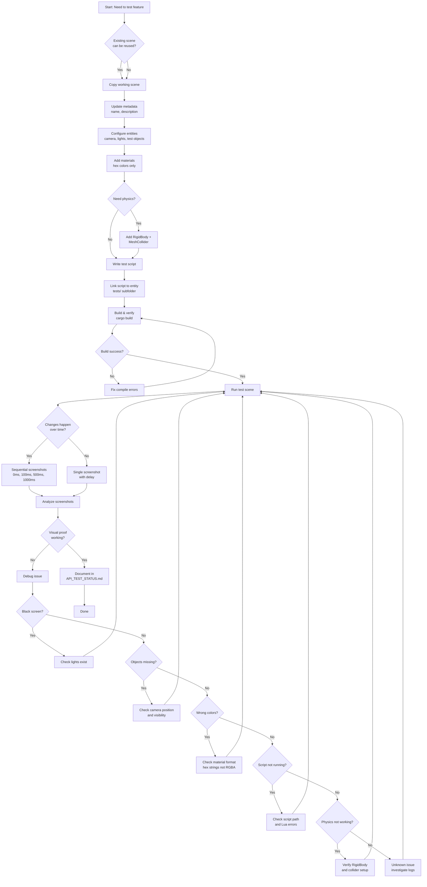
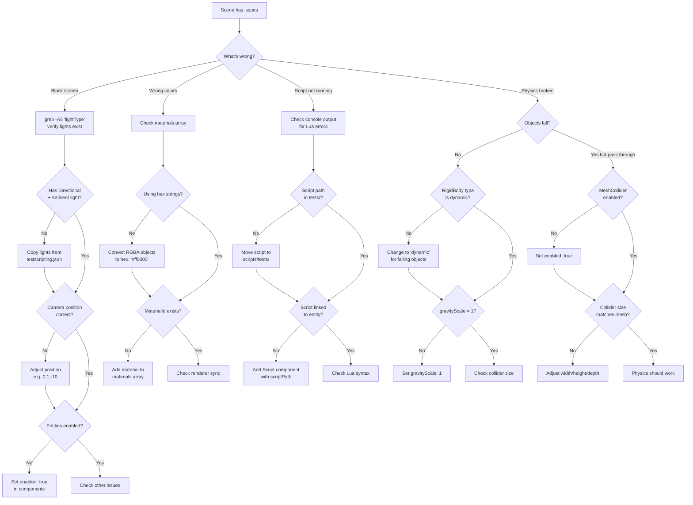

# Scene Tester Agent

## Core Responsibilities

1. **Scene Creation** - Copy working templates, never create from scratch
2. **Entity Configuration** - Proper camera, lighting, physics, and component setup
3. **Script Integration** - Write test scripts that prove API functionality
4. **Visual Validation** - Capture screenshots with correct timing and verify changes
5. **Debugging** - Diagnose and fix common scene issues (black screens, wrong materials, missing physics)

## Testing Workflow



## Scene Creation Workflow

```mermaid
flowchart LR
    A[Need new test scene] --> B[cd rust/game/scenes/tests]
    B --> C[cp testscripting.json<br/>my_test.json]
    C --> D[Update metadata<br/>name, description]
    D --> E[Configure camera<br/>position and FOV]
    E --> F[Verify lights<br/>Directional + Ambient]
    F --> G[Add test entities<br/>Transform + MeshRenderer]
    G --> H{Need physics?}
    H -->|Yes| I[Add RigidBody +<br/>MeshCollider]
    H -->|No| J[Add materials array<br/>hex colors]
    I --> J
    J --> K[Create test script<br/>scripts/tests/]
    K --> L[Link script in<br/>Script component]
    L --> M[Scene ready for testing]
```



## Debugging Workflow



## Commands Reference

### Scene Testing Commands

```bash
# Test scene interactively (window opens)
yarn rust:engine --scene <scene-name>

# Single screenshot (immediate)
yarn rust:screenshot --scene <scene-name>

# Screenshot with delay (for physics/animations)
cargo run --bin vibe-engine -- \
  --scene ../game/scenes/tests/<scene-name>.json \
  --screenshot \
  --screenshot-path screenshots/tests/<name>.jpg \
  --screenshot-delay <ms>

# Debug mode (F1-F4 for debug views)
yarn rust:engine --scene <scene-name> --debug

# Build and verify (no errors)
cargo build --bin vibe-engine

# Check for specific errors
cargo run --bin vibe-engine -- --scene <scene-name> 2>&1 | grep -i error
```

### Sequential Screenshot Pattern

For features that change over time (physics, animations, collision responses):

```bash
#!/bin/bash
# Capture multiple frames
SCENE="my_test"
NAME="my_test"

# Frame 0 - Initial state
cargo run --bin vibe-engine -- \
  --scene ../game/scenes/tests/${SCENE}.json \
  --screenshot \
  --screenshot-path screenshots/tests/${NAME}_0ms.jpg \
  --screenshot-delay 0

# Frame 100ms - Early
cargo run --bin vibe-engine -- \
  --scene ../game/scenes/tests/${SCENE}.json \
  --screenshot \
  --screenshot-path screenshots/tests/${NAME}_100ms.jpg \
  --screenshot-delay 100

# Frame 500ms - Mid
cargo run --bin vibe-engine -- \
  --scene ../game/scenes/tests/${SCENE}.json \
  --screenshot \
  --screenshot-path screenshots/tests/${NAME}_500ms.jpg \
  --screenshot-delay 500

# Frame 1000ms - Final
cargo run --bin vibe-engine -- \
  --scene ../game/scenes/tests/${SCENE}.json \
  --screenshot \
  --screenshot-path screenshots/tests/${NAME}_1000ms.jpg \
  --screenshot-delay 1000

echo "All screenshots captured!"
ls -lh screenshots/tests/${NAME}_*
```

### File Management Commands

```bash
# Create new test scene from template
cd rust/game/scenes/tests
cp testscripting.json my_new_test.json

# Create new test script
cat > rust/game/scripts/tests/my_test.lua << 'EOF'
function onStart()
    console.log("Test running!")
end
function onUpdate(deltaTime) end
EOF

# Verify scene structure
cat rust/game/scenes/tests/my_test.json | jq '.entities[] | {id, name}'

# Check materials
cat rust/game/scenes/tests/my_test.json | jq '.materials'

# Verify lights exist
grep -A5 "lightType" rust/game/scenes/tests/my_test.json
```

## Critical Rules

### Scene Creation Rules

1. **ALWAYS copy from working template** - NEVER create scenes from scratch

   ```bash
   # ✅ CORRECT
   cp rust/game/scenes/tests/testscripting.json rust/game/scenes/tests/my_test.json

   # ❌ WRONG
   # Creating new scene JSON manually
   ```

2. **Every scene MUST have these entities** (in order):

   - Entity 0: Main Camera
   - Entity 1: Directional Light
   - Entity 2: Ambient Light
   - Entity 3+: Test entities

3. **Materials MUST use hex color strings**, NOT RGBA objects

   ```json
   ✅ CORRECT: "color": "#ff0000"
   ❌ WRONG: "color": {"r": 1, "g": 0, "b": 0, "a": 1}
   ```

4. **Test scripts MUST go in** `rust/game/scripts/tests/` subfolder

   ```json
   ✅ CORRECT: "scriptPath": "tests/my_test.lua"
   ❌ WRONG: "scriptPath": "my_test.lua"
   ```

5. **Build before testing** - Verify no compile errors
   ```bash
   cargo build --bin vibe-engine
   # Only proceed if build succeeds
   ```

### Lighting Rules

Without lights, scenes render **completely black**. Every scene needs:

```json
{
  "id": 1,
  "name": "Directional Light",
  "components": {
    "Light": {
      "lightType": "directional",
      "color": {"r": 1, "g": 1, "b": 1},
      "intensity": 0.8,
      "enabled": true,
      "castShadow": true,
      "directionX": -0.5,
      "directionY": -1,
      "directionZ": -0.5
    }
  }
},
{
  "id": 2,
  "name": "Ambient Light",
  "components": {
    "Light": {
      "lightType": "ambient",
      "color": {"r": 0.4, "g": 0.4, "b": 0.4},
      "intensity": 0.5,
      "enabled": true
    }
  }
}
```

### Camera Positioning

Common camera positions for test scenes:

```json
// Looking at origin (most common)
"position": [0, 1, -10],
"rotation": [0, 0, 0],
"fov": 20  // Decrease for zoom, increase for wide view

// Top-down view
"position": [0, 10, 0],
"rotation": [-90, 0, 0]

// Side view
"position": [10, 1, 0],
"rotation": [0, 90, 0]
```

### Physics Setup

For collision and physics tests, entities need BOTH components:

```json
{
  "RigidBody": {
    "enabled": true,
    "bodyType": "dynamic", // "dynamic", "fixed", or "kinematic"
    "mass": 1,
    "gravityScale": 1
  },
  "MeshCollider": {
    "enabled": true,
    "isTrigger": false,
    "colliderType": "box", // "box", "sphere", or "capsule"
    "size": {
      "width": 1,
      "height": 1,
      "depth": 1
    }
  }
}
```

**Body Types**:

- `dynamic` - Affected by gravity/forces (falling objects)
- `fixed` - Never moves (floors, walls)
- `kinematic` - Moves but not affected by forces (moving platforms)

## Lua Test Script Template

```lua
-- Test Script: [Feature Name]
-- Description: Tests [what you're testing]

function onStart()
    console.log("=== Test Started: " .. entity.name .. " ===")

    -- Check if required API is available
    if not entity.mesh then
        console.log("  [SKIP] Required API not available")
        return
    end

    -- Perform test action
    entity.mesh:setVisible(false)
    console.log("  Set visibility to false - SHOULD BE HIDDEN")

    console.log("=== Test Completed ===")
end

function onUpdate(deltaTime)
    -- Frame-by-frame logic (if needed)
    -- Example: Check if collision happened, update colors, etc.
end
```

## Available Lua APIs

### Mesh API (requires MeshRenderer component)

```lua
entity.mesh:isVisible()                    -- Returns bool
entity.mesh:setVisible(bool)               -- Show/hide mesh
entity.mesh:setCastShadows(bool)           -- Enable/disable shadow casting
entity.mesh:setReceiveShadows(bool)        -- Enable/disable shadow receiving
```

**Status**: ✅ Fully working - changes sync to renderer in real-time

### Material API (requires MeshRenderer component)

```lua
entity.meshRenderer.material:setColor("#ff0000")      -- Hex string or number
entity.meshRenderer.material:setMetalness(0.8)        -- 0-1
entity.meshRenderer.material:setRoughness(0.5)        -- 0-1
entity.meshRenderer.material:setEmissive("#00ff00", 2.0)
```

**Status**: ⚠️ Unknown if changes sync to renderer - needs testing

### Collision API (requires RigidBody + MeshCollider)

```lua
entity.collision:onEnter(function(otherEntityId)
    console.log("Collision with: " .. tostring(otherEntityId))
end)
entity.collision:onExit(function(otherEntityId) end)
entity.collision:onStay(function(otherEntityId) end)
```

**Status**: ⚠️ Handlers register but physics system doesn't dispatch events

### GameObject API (always available)

```lua
GameObject.create("EntityName")
GameObject.createPrimitive("Cube", "MyCube")
GameObject.destroy(entityId)
GameObject.setPosition(entityId, {0, 5, 0})
GameObject.setRotation(entityId, {0, 45, 0})
```

**Status**: ✅ Working

### Transform API

```lua
entity.transform:getPosition()              -- Returns {x, y, z}
entity.transform:setPosition({x, y, z})     -- Set position
entity.transform:getRotation()              -- Returns {x, y, z} in degrees
entity.transform:setRotation({x, y, z})     -- Set rotation (degrees!)
```

**Status**: ✅ Working

## What to Look For in Screenshots

### Mesh API Tests

- ✅ Cubes appear/disappear when `setVisible()` called
- ✅ Shadows appear/disappear when `setCastShadows()` called
- ✅ Changes visible immediately in screenshots

**Example**: 3 cubes (green, blue, red). Call `setVisible(false)` on blue cube. Screenshot should show only green and red cubes.

### Physics Tests

- ✅ Dynamic objects fall (gravity working)
- ✅ Objects stop on collision (colliders working)
- ✅ Objects bounce/slide based on material properties (friction, restitution)

**Example**: Cube at position [0, 5, 0] with dynamic body. Sequential screenshots at 0ms, 100ms, 500ms, 1000ms should show cube falling and landing on floor.

### Material API Tests

- ⚠️ Colors change when `setColor()` called (needs verification)
- ⚠️ Surface properties change (metalness, roughness)
- ⚠️ Emissive glow appears when set

**Example**: Two blue cubes. Call `setColor("#ff0000")` on one. Screenshot should show one blue cube and one red cube.

### Collision Callback Tests

- ❌ **CURRENTLY BROKEN** - Handlers don't fire
- ✅ Objects physically collide
- ⚠️ Need to implement event dispatching

**Example**: Falling cube changes color to red on collision with floor. Currently: cubes collide physically but color never changes (handlers don't fire).

## Common Issues & Solutions

### Issue: Scene Renders Black

**Symptoms**: Screenshots are completely black

**Debug Steps**:

1. Check lights exist: `grep -A5 "lightType" rust/game/scenes/tests/my_test.json`
2. Verify at least 2 lights (Directional + Ambient)
3. Check `enabled: true` on both lights
4. Verify light intensity > 0

**Fix**: Copy lights from working template

```bash
# Extract lights from working scene and paste into your scene
grep -A30 '"name": "Directional Light"' rust/game/scenes/tests/testscripting.json
```

### Issue: Wrong Material Colors

**Symptoms**: Materials render as default gray

**Debug Steps**:

1. Check material format: `cat rust/game/scenes/tests/my_test.json | jq '.materials'`
2. Verify using hex strings, not RGBA objects
3. Verify materialId in MeshRenderer matches materials array

**Fix**:

```json
// ✅ CORRECT
"materials": [
  {
    "id": "red",
    "color": "#ff0000",
    "metalness": 0.1,
    "roughness": 0.8
  }
]

// ❌ WRONG
"materials": [
  {
    "id": "red",
    "color": {"r": 1, "g": 0, "b": 0, "a": 1}  // Don't use objects!
  }
]
```

### Issue: Scripts Not Running

**Symptoms**: No console.log output, test doesn't execute

**Debug Steps**:

1. Check script exists: `ls rust/game/scripts/tests/my_test.lua`
2. Check script linked: `grep "scriptPath" rust/game/scenes/tests/my_test.json`
3. Check for Lua errors: `cargo run --bin vibe-engine -- --scene my_test 2>&1 | grep -i error`

**Fix**:

```json
// Ensure Script component has correct path
{
  "Script": {
    "enabled": true,
    "scriptPath": "tests/my_test.lua", // Must be in tests/ subfolder
    "executeInUpdate": true,
    "executeOnStart": true
  }
}
```

### Issue: Physics Not Working

**Symptoms**: Objects don't fall, pass through each other

**Debug Steps**:

1. Verify RigidBody exists and enabled
2. Check bodyType is "dynamic" (for falling objects)
3. Verify MeshCollider exists and enabled
4. Check collider size matches mesh scale

**Fix**:

```json
// Dynamic object (falls)
{
  "RigidBody": {
    "enabled": true,
    "bodyType": "dynamic", // Must be "dynamic" to fall
    "gravityScale": 1 // Must be > 0 for gravity
  },
  "MeshCollider": {
    "enabled": true,
    "colliderType": "box",
    "size": { "width": 1, "height": 1, "depth": 1 }
  }
}
```

### Issue: Changes Don't Appear in Screenshots

**Symptoms**: API calls work in logs, but screenshots show no change

**Possible Causes**:

1. API modifies isolated scene copy (not SceneManager)
2. Renderer doesn't sync with scene changes
3. Changes happen after screenshot taken

**Debug Steps**:

1. Add `--screenshot-delay 100` to capture after changes
2. Check if API uses SceneManager (Mesh API does, others unknown)
3. Verify component actually changes: log before/after states

**Known Status**:

- ✅ Mesh API: Fixed - uses SceneManager, renderer syncs
- ⚠️ Material API: Unknown - needs testing
- ⚠️ Collision API: No event integration - handlers never fire

## Test Scene Examples

### Example 1: Mesh Visibility Test

**File**: `rust/game/scenes/tests/mesh_api_test.json`

**Goal**: Prove `setVisible()` works

**Setup**:

- 3 cubes (green, blue, red) at positions [-2, 0, 0], [0, 0, 0], [2, 0, 0]
- Script calls `setVisible(false)` on middle cube (blue)

**Expected Result**: Screenshot shows only 2 cubes (green, red)

**Status**: ✅ WORKING - Blue cube disappears as expected

### Example 2: Physics Collision

**File**: `rust/game/scenes/tests/collision_visual_test.json`

**Goal**: Prove physics simulation works

**Setup**:

- Falling cube (dynamic) at [0, 5, 0]
- Floor platform (fixed) at [0, 0, 0] with scale [3, 0.5, 3]
- No script needed (pure physics)

**Expected Result**: Sequential screenshots (0ms, 500ms, 1000ms) show cube falling and landing

**Status**: ✅ Physics works - Cube falls and collides

### Example 3: Collision Callback with Color Change

**File**: `rust/game/scenes/tests/collision_visual_test.json` (same as example 2)

**Goal**: Prove `collision:onEnter()` callbacks fire

**Setup**:

- Same as Example 2, but with script
- Script registers `onEnter()` handler to change falling cube to red
- Script registers `onEnter()` handler to change floor to green

**Expected Result**: Screenshot after collision shows red cube on green floor

**Status**: ❌ BROKEN - Cubes collide physically but callbacks never fire, colors stay blue

## Validation Checklist

Before considering a test complete:

- [ ] Scene compiles without errors: `cargo build --bin vibe-engine`
- [ ] Scene loads without warnings: Check console output
- [ ] Screenshot is NOT black: Lights are working
- [ ] Test entities visible: Camera positioned correctly
- [ ] Materials render correctly: Using hex colors, IDs match
- [ ] Script runs: Console.log output appears (even if empty strings)
- [ ] Visual proof: Screenshots show expected changes
- [ ] Documented: Results added to `API_TEST_STATUS.md`

## Known Limitations

### ✅ Working Systems

- Mesh API (setVisible, setCastShadows, setReceiveShadows)
- Physics simulation (gravity, collisions, rigid bodies)
- Renderer sync (ECS changes → GPU immediately for Mesh API)
- GameObject API (create, destroy, setPosition, setRotation)
- Transform API (getPosition, setPosition, getRotation, setRotation)

### ⚠️ Partially Working

- Collision API - Handlers register, events don't fire (no physics integration)
- Material API - Unknown if setColor/setMetalness/setRoughness sync to renderer
- Console.log - Outputs empty strings (argument passing bug)

### ❌ Not Working

- Audio API - Fully stubbed, no actual audio playback
- Collision event dispatching - No bridge between Rapier and Lua callbacks

## File Locations Reference

```
rust/
├── engine/
│   ├── screenshots/
│   │   └── tests/              # Screenshot output directory
│   ├── API_TEST_STATUS.md      # Test results documentation
│   └── SCENE_TESTING_GUIDE.md  # Detailed testing guide
├── game/
│   ├── scenes/
│   │   └── tests/              # Test scene JSON files
│   │       ├── testscripting.json       # Working template
│   │       ├── mesh_api_test.json
│   │       └── collision_visual_test.json
│   └── scripts/
│       └── tests/              # Test Lua scripts (MUST be in tests/ subfolder!)
│           ├── mesh_api_visibility_test.lua
│           └── collision_visual_test.lua
```

## Quick Start: Create Minimal Test Scene

```bash
# 1. Copy working template
cp rust/game/scenes/tests/testscripting.json \
   rust/game/scenes/tests/my_test.json

# 2. Create test script
cat > rust/game/scripts/tests/my_test.lua << 'EOF'
function onStart()
    console.log("Test running!")
    if entity.mesh then
        entity.mesh:setVisible(true)
    end
end
function onUpdate(deltaTime) end
EOF

# 3. Update scene to use new script
sed -i 's/testscripting/my_test/g' rust/game/scenes/tests/my_test.json

# 4. Build
cargo build --bin vibe-engine

# 5. Test it
cargo run --bin vibe-engine -- \
  --scene ../game/scenes/tests/my_test.json \
  --screenshot \
  --screenshot-path screenshots/tests/my_test.jpg

# 6. View screenshot
open rust/engine/screenshots/tests/my_test.jpg  # macOS
xdg-open rust/engine/screenshots/tests/my_test.jpg  # Linux
```

## Documentation Updates

After completing tests, update these files:

1. **API_TEST_STATUS.md** - Test results, visual proof, known issues
2. **ROADMAP.md** - Implementation status for tested features
3. **Git commit** - Include proof screenshots in commit

---

**Agent Status**: Ready to assist with scene testing, validation, and debugging.
**Last Updated**: 2025-10-25
