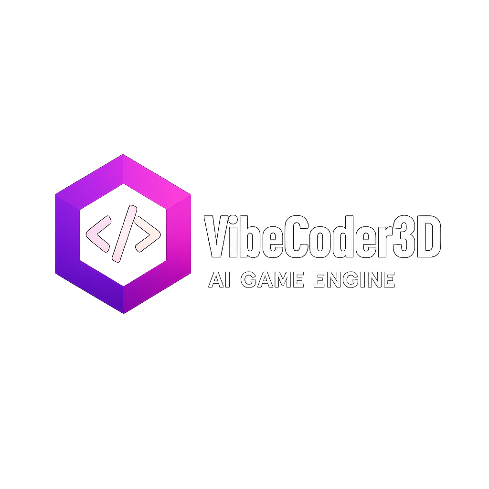

<p align="center">
  
</p>

[](https://opensource.org/licenses/MIT)
[](https://www.typescriptlang.org/)
[](https://www.rust-lang.org/)

Vibe Coder 3D is an **AI-first game engine** that combines modern 3D rendering with conversational AI. Build 3D games by describing what you want in natural language, powered by React Three Fiber and a high-performance Rust native engine.

**"Create a bouncing ball"** → Complete physics simulation
**"Add a medieval castle"** → 3D model sourced and placed
**"Make the player jump on spacebar"** → Controller script generated

> **📍 [View Full Roadmap](./ROADMAP.md)** - Feature roadmap, implementation status, and detailed progress tracking

## Features

### Core Engine

- **Dual Architecture**: TypeScript/React editor + Rust native engine for best of both worlds
- **Entity Component System (ECS)**: Data-oriented design with bitECS for high performance
- **Physics Simulation**: Full Rapier3D integration with collision detection and rigid bodies
- **Scripting System**: TypeScript-based with 14 global APIs and full lifecycle support
- **Material System**: PBR materials with texture support and live preview
- **Prefab System**: Unity-like prefabs with nesting and override capabilities
- **Input Management**: Action-based input mapping for keyboard, mouse, and gamepad
- **Asset Pipeline**: Automatic optimization with LOD generation and compression

### Editor (Web-Based)

- **Visual Scene Editor**: Drag-and-drop 3D scene creation
- **Component Inspector**: Real-time property editing
- **Material Editor**: Visual material creation with PBR support
- **Prefab Browser**: Asset management and instantiation
- **Debug Tools**: Performance monitoring, FPS counter, entity inspector
- **Scene Serialization**: Dual format (.tsx + .json) for editor and engine

### Rust Engine (Native)

- **High-Performance Rendering**: PBR rendering with three-d library
- **Cross-Platform**: Windows, Linux, and macOS support
- **Lua Scripting**: Full mlua runtime integration
- **Debug Mode**: Orbital camera, collider visualization, GPU profiling
- **Screenshot System**: Visual regression testing support
- **Modular Architecture**: Workspace crates for maintainability

## Quick Start

### Prerequisites

- **Node.js** >= 20.0.0
- **Yarn** 1.22+
- **Rust** 1.75+ (for native engine)

### Installation

```bash
# Clone the repository
git clone https://github.com/jonit-dev/vibe-coder-3d.git
cd vibe-coder-3d

# Install dependencies
yarn install

# Start the development server
yarn dev
```

The editor will be available at `http://localhost:5173`

### Running the Rust Engine

```bash
# Run a test scene
yarn rust:engine --scene testphysics

# Run with debug mode (colliders, FPS, grid)
yarn rust:engine --scene testphysics --debug

# Custom window size
yarn rust:engine --scene testphysics --width 1920 --height 1080
```

### Creating Your First Scene

1. Start the editor: `yarn dev`
2. Use the **Add Object** menu (Ctrl+N) to create entities
3. Configure components in the **Inspector** panel
4. Save your scene with **Ctrl+S**
5. Test in Rust engine: `yarn rust:engine --scene yourscene`

## Documentation

Comprehensive documentation is available in the `docs/` directory:

- **[Documentation Navigation](./docs/0-navigation.md)** - Complete documentation map and reading guide
- **[Core Abstractions](./docs/architecture/2-1-core-abstractions.md)** - Engine foundation and architecture
- **[ECS System](./docs/architecture/2-4-ecs-system.md)** - Entity Component System details
- **[Physics System](./docs/architecture/2-10-physics-system.md)** - Physics integration guide
- **[Scripting System](./docs/architecture/2-13-script-system.md)** - Script APIs and lifecycle
- **[Material System](./docs/architecture/2-24-materials-system.md)** - Material creation and management
- **[Prefabs System](./docs/architecture/2-25-prefabs-system.md)** - Prefab workflow and patterns
- **[Rust Engine README](./rust/engine/README.md)** - Native engine documentation

For a complete list of 50+ documentation files, see [docs/0-navigation.md](./docs/0-navigation.md).

### Quick Guides

Practical guides for common tasks:

- **[Script API Quick Reference](./docs/guides/script-api-quick-reference.md)** - Most commonly used script APIs
- **[Input Actions Quick Start](./docs/guides/input-actions-quick-start.md)** - Setting up player controls
- **[Adding Components](./docs/guides/adding-components.md)** - Creating custom components
- **[3D Asset Optimization](./docs/3D-ASSET-OPTIMIZATION-GUIDE.md)** - Optimizing models for performance

## Development

### Available Scripts

```bash
# Development
yarn dev              # Start TypeScript editor
yarn dev:nosync       # Start without asset sync

# Testing
yarn test             # Run tests
yarn test:coverage    # Generate coverage report
yarn typecheck        # Type checking
yarn lint             # Lint code
yarn lint:fix         # Fix linting issues

# Rust Engine
yarn rust:engine --scene <name>  # Run native engine
yarn rust:build                  # Build Rust engine
yarn rust:test                   # Run Rust tests
yarn rust:screenshot             # Capture screenshot

# Build
yarn build            # Production build
yarn preview          # Preview production build
```

### Debug Tools

**TypeScript Editor:**

- Status bar with FPS, memory, entity count
- Inspector panel for component details
- Browser DevTools for full logging

**Rust Engine Debug Mode:**

```bash
yarn rust:engine --scene testphysics --debug
```

- **F1**: Toggle HUD (FPS, frame time, physics stats)
- **F2**: Toggle collider gizmos
- **F3**: Toggle debug camera (orbital controller)
- **F4**: Toggle GPU profiler

## Technology Stack

### Frontend/Editor

- **React 19** - UI framework
- **React Three Fiber** - Declarative 3D rendering
- **Three.js** - WebGL 3D library
- **TypeScript** - Type-safe development
- **Vite** - Ultra-fast build tool
- **TailwindCSS** - Utility-first styling

### Game Engine

- **bitECS** - High-performance ECS
- **Rapier** - Physics engine (WebAssembly)
- **Zustand** - State management
- **Zod** - Runtime type validation
- **Howler.js** - Audio system

### Native Engine

- **Rust** - Systems programming language
- **three-d** - 3D rendering library
- **rapier3d** - Physics simulation
- **mlua** - Lua scripting integration
- **winit** - Window management

## Project Structure

```text
vibe-coder-3d/
├── src/
│   ├── core/          # Core engine (ECS, systems, components)
│   ├── editor/        # Editor UI and tools
│   └── game/          # Game-specific code (scenes, scripts, assets)
├── rust/
│   ├── engine/        # Rust native engine
│   └── game/          # Rust game runtime (scenes, scripts)
├── docs/              # Comprehensive documentation
├── scripts/           # Build and utility scripts
└── public/            # Public web assets
```

## Current Status

**Phase: Foundation Complete** → **Next: AI Integration**

- ✅ Core engine infrastructure established
- ✅ Editor with scene manipulation capabilities
- ✅ ECS system with physics integration
- ✅ TypeScript scripting with 14 APIs
- ✅ Material and prefab systems
- ✅ Rust native engine with feature parity
- 🚧 AI Copilot system development beginning
- ⏳ Natural language command processing

**For detailed feature roadmap and progress tracking, see [ROADMAP.md](./ROADMAP.md)**

## Contributing

We welcome contributions! **Start with [CONTRIBUTING.md](./CONTRIBUTING.md)** for complete guidelines.

Quick links:

- **[CONTRIBUTING.md](./CONTRIBUTING.md)** - Contribution guidelines, coding standards, and testing requirements
- **[ROADMAP.md](./ROADMAP.md)** - Feature roadmap, implementation status, and sprint planning
- **[WORKFLOW.md](./WORKFLOW.md)** - Git Flow branching model, PR process, and release workflow
- **[CODE_OF_CONDUCT.md](./CODE_OF_CONDUCT.md)** - Community standards and expectations

### Contribution Workflow

1. Fork the repository
2. Create a feature branch (`git checkout -b feature/amazing-feature`)
3. Make your changes
4. Run tests and linting (`yarn verify`)
5. Commit with conventional commits (`feat: add amazing feature`)
6. Push to your fork
7. Open a Pull Request

For detailed workflow instructions, including release and hotfix processes, see [WORKFLOW.md](./WORKFLOW.md).

## Community

- **GitHub Issues**: [Report bugs or request features](https://github.com/jonit-dev/vibe-coder-3d/issues)
- **GitHub Discussions**: [Ask questions and share ideas](https://github.com/jonit-dev/vibe-coder-3d/discussions)

## License

This project is licensed under the MIT License - see the [LICENSE](LICENSE) file for details.

## Acknowledgments

Built with amazing open source technologies:

- [React Three Fiber](https://github.com/pmndrs/react-three-fiber) - React renderer for Three.js
- [bitECS](https://github.com/NateTheGreatt/bitECS) - High-performance ECS
- [Rapier](https://rapier.rs/) - Fast 2D and 3D physics engine
- [three-d](https://github.com/asny/three-d) - Rust 3D rendering library

---
