# Documentation Navigation Map

This document provides a comprehensive guide to navigating the Vibe Coder 3D documentation, showing the relationships and recommended reading paths between all documents.

_All documents are now organized with numeric prefixes for logical reading order (X-Y-filename.md format)_

## 📋 Recent Updates

**Documentation Consistency Review (Latest):**

- ✅ **ECS Documentation Updated**: Aligned with actual BitECS implementation and modern architecture
- ✅ **Physics Integration Clarified**: Updated to reflect multiple physics components and current patterns
- ✅ **AI Implementation Status**: Clarified that AI system is planned but not yet implemented
- ✅ **File Naming Consistency**: All documents follow X-Y-filename.md convention
- ✅ **Technical Accuracy**: Documentation now matches actual codebase implementation

## 🗺️ Documentation Flow

```mermaid
graph TD
    %% Entry Points
    Start([New to Project?]) --> Overview[📋 Overview]
    DevStart([Developer?]) --> Architecture[🏗️ Architecture]
    ContribStart([Contributor?]) --> Implementation[🔧 Implementation]

    %% Overview Flow
    Overview --> ProjectOverview[1-1 Project Overview]
    Overview --> VisionSummary[1-2 AI-First Vision]
    Overview --> Roadmap[1-3 Roadmap]
    Overview --> GettingStarted[1-4 Getting Started]

    %% Architecture Flow
    Architecture --> CoreAbstractions[2-1 Core Abstractions]
    Architecture --> TechnicalStack[2-2 Technical Stack]
    Architecture --> ProjectStructure[2-3 Project Structure]
    Architecture --> ECS[2-4 ECS System]
    Architecture --> AICopilot[2-5 AI Copilot Architecture]
    Architecture --> GameEditor[2-6 Game Editor]
    Architecture --> EventSystem[2-7 Event System]
    Architecture --> StateManagement[2-8 State Management]
    Architecture --> Rendering[2-9 Rendering Pipeline]
    Architecture --> Physics[2-10 Physics System]
    Architecture --> Input[2-11 Input System]
    Architecture --> Audio[2-12 Audio System]
    Architecture --> UI[2-13 UI System]
    Architecture --> CameraSystem[2-14 Camera System]
    Architecture --> Networking[2-15 Networking]
    Architecture --> GameLoop[2-16 Game Loop]
    Architecture --> Tags[2-17 Tags System]
    Architecture --> Tooling[2-18 Tooling]
    Architecture --> DynamicComponents[2-19 Dynamic Component System]
    Architecture --> CoreComponents[2-20 Core Components]

    %% Research Flow
    Research[🔬 Research] --> BasicFeatures[3-1 Basic Engine Features]
    Research --> KeyAbstractions[3-2 Key Engine Abstractions]
    Research --> ModularArchitecture[3-3 Modular Architecture Strategy]
    Research --> AIEditorAPI[3-4 AI Editor API Integration]
    Research --> ArchitectureResearch[3-5 Architecture Research]
    Research --> PerformanceResearch[3-7 Performance Research]
    Research --> StackResearch[3-8 Stack Research]
    Research --> TerrainGeneration[3-9 Terrain Generation]

    %% Implementation Flow
    Implementation --> GameEditorTasks[4-1 Game Editor Tasks]
    Implementation --> AIImplementationPlan[4-2 AI-First Engine Implementation Plan]
    Implementation --> ECSRefactor[4-3 ECS Refactor Status]
    Implementation --> EditorProjectPlan[4-4 Editor Project Relationship Plan]
    Implementation --> SceneSerialization[4-5 Game Editor Scene Serialization]
    Implementation --> TSyringeRemoval[4-6 TSyringe Removal Status]
    Implementation --> HierarchySystem[4-7 Unity-Like Hierarchy System]
    Implementation --> ScriptSystem[4-8 Unity-Like Script System]
    Implementation --> InGameUI[4-9 In-Game UI System]
    Implementation --> ParticleSystem[4-10 Particle System]
    Implementation --> CommandSystem[4-11 Command System]
    Implementation --> AssetPipeline[4-12 Asset Pipeline]
    Implementation --> CollisionDetection[4-13 Collision Detection System]
    Implementation --> NetworkingSystem[4-14 Networking System]

    %% Supporting Documentation
    Patterns[🎨 Patterns] --> GamePatterns[5-1 Game Patterns]
    Performance[📊 Performance] --> PerformanceReport[6-1 Performance Report]
    Refactoring[🔄 Refactoring] --> RefactoringSuggestions[7-1 Refactoring Suggestions]
    Refactoring --> EditorRefactor[7-2 Editor Refactor Summary]
    Refactoring --> FolderRefactoring[7-3 Folder Refactoring]

    %% Cross-References
    ProjectOverview -.-> TechnicalStack
    VisionSummary -.-> AICopilot
    Roadmap -.-> AIImplementationPlan
    CoreAbstractions -.-> ECS
    CoreAbstractions -.-> Physics
    AICopilot -.-> AIImplementationPlan
    GameEditor -.-> ScriptSystem
    GameEditor -.-> HierarchySystem
    GameEditor -.-> SceneSerialization
    ECS -.-> ScriptSystem
    EventSystem -.-> StateManagement
    PerformanceResearch -.-> PerformanceReport

    %% Implementation Dependencies
    AIImplementationPlan -.-> ScriptSystem
    AIImplementationPlan -.-> HierarchySystem
    ScriptSystem -.-> ECS
    HierarchySystem -.-> ECS
    SceneSerialization -.-> StateManagement

    style Start fill:#e1f5fe
    style Overview fill:#f3e5f5
    style Architecture fill:#e8f5e8
    style Implementation fill:#fff3e0
    style Research fill:#fce4ec
    style Patterns fill:#f1f8e9
    style Performance fill:#e0f2f1
    style Refactoring fill:#fff8e1
```

## 📚 Reading Paths

### 🎯 For New Contributors

**Recommended Path: Understanding the Vision**

1. **[1-1 Project Overview](./overview/1-1-project-overview.md)** - Start here to understand what we're building
2. **[1-2 AI-First Vision](./overview/1-2-ai-first-vision.md)** - Understand the revolutionary approach
3. **[2-2 Technical Stack](./architecture/2-2-technical-stack.md)** - Learn about our technology choices
4. **[2-1 Core Abstractions](./architecture/2-1-core-abstractions.md)** - Understand the engine foundation
5. **[4-2 AI-First Implementation Plan](./implementation/4-2-ai-first-engine-implementation-plan.md)** - See the development roadmap

### 🏗️ For System Architects

**Recommended Path: Technical Architecture**

1. **[2-1 Core Abstractions](./architecture/2-1-core-abstractions.md)** - Engine foundation
2. **[2-5 AI Copilot Architecture](./architecture/2-5-ai-copilot-architecture.md)** - AI system design
3. **[2-4 ECS System](./architecture/2-4-ecs-system.md)** - Entity Component System
4. **[2-7 Event System](./architecture/2-7-event-system.md)** - Communication patterns
5. **[2-8 State Management](./architecture/2-8-state-management.md)** - Application state
6. **[2-6 Game Editor](./architecture/2-6-game-editor.md)** - Editor architecture

### 🔧 For Feature Developers

**Recommended Path: Implementation Focus**

1. **[2-3 Project Structure](./architecture/2-3-project-structure.md)** - Codebase organization
2. **[2-4 ECS System](./architecture/2-4-ecs-system.md)** - Core system understanding
3. **[4-8 Unity-Like Script System](./implementation/4-8-unity-like-script-system.md)** - Script implementation
4. **[4-7 Unity-Like Hierarchy System](./implementation/4-7-unity-like-hierarchy-system.md)** - Hierarchy implementation
5. **[4-5 Game Editor Scene Serialization](./implementation/4-5-game-editor-scene-serialization.md)** - Scene system

### 🚀 For DevOps Engineers

**Recommended Path: Deployment Focus**

1. **[2-2 Technical Stack](./architecture/2-2-technical-stack.md)** - Technology foundation
2. **[3-7 Performance Research](./research/3-7-performance-research.md)** - Optimization strategies
3. **[Deployment Strategy](./deployment/8-1-deployment-strategy.md)** - Multi-platform deployment
4. **[2-18 Tooling](./architecture/2-18-tooling.md)** - Development workflow

### 🎮 For Game Developers

**Recommended Path: Game Development**

1. **[1-4 Getting Started](./overview/1-4-getting-started.md)** - Getting started
2. **[5-1 Game Patterns](./patterns/5-1-game-patterns.md)** - Development patterns
3. **[4-8 Unity-Like Script System](./implementation/4-8-unity-like-script-system.md)** - Scripting system
4. **[2-10 Physics System](./architecture/2-10-physics-system.md)** - Physics system
5. **[2-11 Input System](./architecture/2-11-input-system.md)** - Input handling

## 🔗 Document Relationships

### Core Dependencies

| Document                        | Depends On                | Enables                                 |
| ------------------------------- | ------------------------- | --------------------------------------- |
| **1-1 Project Overview**        | -                         | All other documents                     |
| **1-2 AI-First Vision**         | 1-1 Project Overview      | 2-5 AI Copilot Architecture             |
| **2-1 Core Abstractions**       | 2-2 Technical Stack       | 2-4 ECS, 2-10 Physics, 2-9 Rendering    |
| **2-5 AI Copilot Architecture** | 2-1 Core Abstractions     | 4-2 AI Implementation Plan              |
| **2-4 ECS System**              | 2-1 Core Abstractions     | 4-8 Script System, 4-7 Hierarchy System |
| **2-6 Game Editor**             | 2-4 ECS, 2-7 Event System | All Implementation Plans                |

### Implementation Dependencies

| Implementation Plan         | Prerequisites                                      | Outputs                     |
| --------------------------- | -------------------------------------------------- | --------------------------- |
| **4-2 AI-First Engine**     | 2-5 AI Copilot Architecture, 2-1 Core Abstractions | Working AI system           |
| **4-8 Script System**       | 2-4 ECS, 2-6 Game Editor                           | Entity scripting capability |
| **4-7 Hierarchy System**    | 2-4 ECS, 2-7 Event System                          | Scene hierarchy             |
| **4-5 Scene Serialization** | 2-8 State Management, 4-7 Hierarchy System         | Save/load functionality     |

### Cross-Reference Matrix

| From → To                     | Relationship                 | Purpose                 |
| ----------------------------- | ---------------------------- | ----------------------- |
| Overview → Architecture       | Strategic to Technical       | Implementation guidance |
| Architecture → Implementation | Design to Code               | Development roadmap     |
| Implementation → Performance  | Features to Optimization     | Performance planning    |
| Research → All                | Investigation to Application | Informed decisions      |

## 🎯 Quick Reference

### By Development Phase

**Phase 1: Foundation (Weeks 1-2)**

- [2-1 Core Abstractions](./architecture/2-1-core-abstractions.md)
- [2-4 ECS System](./architecture/2-4-ecs-system.md)
- [2-7 Event System](./architecture/2-7-event-system.md)

**Phase 2: AI Integration (Weeks 3-14)**

- [2-5 AI Copilot Architecture](./architecture/2-5-ai-copilot-architecture.md)
- [4-2 AI-First Implementation Plan](./implementation/4-2-ai-first-engine-implementation-plan.md)

**Phase 3: Editor Features (Weeks 15-22)**

- [2-6 Game Editor](./architecture/2-6-game-editor.md)
- [4-8 Script System](./implementation/4-8-unity-like-script-system.md)
- [4-7 Hierarchy System](./implementation/4-7-unity-like-hierarchy-system.md)
- [4-5 Scene Serialization](./implementation/4-5-game-editor-scene-serialization.md)

**Phase 4: Optimization & Deployment (Weeks 23-32)**

- [6-1 Performance Report](./performance/6-1-performance-report.md)
- [3-7 Performance Research](./research/3-7-performance-research.md)
- [Deployment Strategy](./deployment/8-1-deployment-strategy.md)

### By Role

**Project Manager**: Overview → Roadmap → Implementation Plans
**Tech Lead**: Architecture → Implementation → Performance
**Developer**: Getting Started → Architecture → Implementation
**DevOps**: Architecture → Research → Deployment

### By Document Type

**Foundation Documents**: 1-X (Overview), 2-1 to 2-5 (Core Architecture)
**System Architecture**: 2-6 to 2-20 (Detailed Systems)
**Research & Analysis**: 3-X (Research), 6-X (Performance)
**Implementation Plans**: 4-X (Implementation)
**Best Practices**: 5-X (Patterns), 7-X (Refactoring)

## 🔄 Maintenance

This navigation map is updated when:

- New documents are added with proper numeric prefixes
- Document relationships change
- Implementation phases are updated
- New cross-references are identified
- Document reorganization occurs

## 📋 Document Organization Rules

- **1-X**: Overview and vision documents (`1-0-overview-readme.md`)
- **2-X**: Architecture and technical design
- **3-X**: Research and investigations
- **4-X**: Implementation plans and guides (`4-0-implementation-readme.md`)
- **5-X**: Patterns and best practices
- **6-X**: Performance and optimization
- **7-X**: Refactoring and code improvement
- **8-X**: Deployment (`8-0-deployment-readme.md`, `8-1-deployment-strategy.md`)

---

_This navigation map ensures no document exists in isolation and provides clear paths for different audiences to find the information they need. The numeric prefixes create a logical reading order while maintaining flexibility for future additions._
