# Documentation Navigation Map

This document provides a comprehensive guide to navigating the Vibe Coder 3D documentation, showing the relationships and recommended reading paths between all documents.

## 🗺️ Documentation Flow

```mermaid
graph TD
    %% Entry Points
    Start([New to Project?]) --> Overview[📋 Overview]
    DevStart([Developer?]) --> Architecture[🏗️ Architecture]
    ContribStart([Contributor?]) --> Implementation[🔧 Implementation]

    %% Overview Flow
    Overview --> ProjectOverview[Project Overview]
    Overview --> VisionSummary[AI-First Vision Summary]
    Overview --> Roadmap[Roadmap]

    %% Architecture Flow
    Architecture --> CoreAbstractions[Core Abstractions]
    Architecture --> TechnicalStack[Technical Stack]
    Architecture --> ProjectStructure[Project Structure]
    Architecture --> AICopilot[AI Copilot Architecture]
    Architecture --> GameEditor[Game Editor]
    Architecture --> ECS[ECS]
    Architecture --> Physics[Physics]
    Architecture --> Rendering[Rendering]
    Architecture --> EventSystem[Event System]
    Architecture --> StateManagement[State Management]
    Architecture --> GameLoop[Game Loop]
    Architecture --> CameraSystem[Camera System]
    Architecture --> Input[Input]
    Architecture --> Audio[Audio]
    Architecture --> UI[UI]
    Architecture --> Networking[Networking]
    Architecture --> Tags[Tags]
    Architecture --> Tooling[Tooling]

    %% Implementation Flow
    Implementation --> AIImplementationPlan[AI-First Engine Implementation Plan]
    Implementation --> ScriptSystem[Unity-Like Script System]
    Implementation --> HierarchySystem[Unity-Like Hierarchy System]
    Implementation --> SceneSerialization[Game Editor Scene Serialization]

    %% Supporting Documentation
    Research[🔬 Research] --> ArchitectureResearch[Architecture Research]
    Research --> StackResearch[Stack Research]
    Research --> GameEnginePatterns[Game Engine Patterns]
    Research --> PerformanceTips[Performance Tips]
    Research --> TerrainGeneration[Terrain Generation]

    Patterns[🎨 Patterns] --> GamePatterns[Game Patterns]

    GettingStarted[🚀 Getting Started] --> SimpleScene[Simple Scene]

    Deployment[🚀 Deployment] --> DeploymentStrategy[Deployment Strategy]

    %% Cross-References
    ProjectOverview -.-> TechnicalStack
    VisionSummary -.-> AICopilot
    Roadmap -.-> AIImplementationPlan
    CoreAbstractions -.-> ECS
    CoreAbstractions -.-> Physics
    AICopilot -.-> AIImplementationPlan
    GameEditor -.-> ScriptSystem
    GameEditor -.-> HierarchySystem
    GameEditor -.-> SceneSerialization
    ECS -.-> ScriptSystem
    EventSystem -.-> StateManagement
    PerformanceTips -.-> DeploymentStrategy

    %% Implementation Dependencies
    AIImplementationPlan -.-> ScriptSystem
    AIImplementationPlan -.-> HierarchySystem
    ScriptSystem -.-> ECS
    HierarchySystem -.-> ECS
    SceneSerialization -.-> StateManagement

    %% Deployment Dependencies
    DeploymentStrategy -.-> AIImplementationPlan
    DeploymentStrategy -.-> PerformanceTips

    style Start fill:#e1f5fe
    style Overview fill:#f3e5f5
    style Architecture fill:#e8f5e8
    style Implementation fill:#fff3e0
    style Research fill:#fce4ec
    style Patterns fill:#f1f8e9
    style GettingStarted fill:#e0f2f1
    style Deployment fill:#fff8e1
```

## 📚 Reading Paths

### 🎯 For New Contributors

**Recommended Path: Understanding the Vision**

1. **[Project Overview](./overview/project-overview.md)** - Start here to understand what we're building
2. **[AI-First Vision Summary](./overview/ai-first-vision-summary.md)** - Understand the revolutionary approach
3. **[Technical Stack](./architecture/technical-stack.md)** - Learn about our technology choices
4. **[Core Abstractions](./architecture/core-abstractions.md)** - Understand the engine foundation
5. **[AI-First Implementation Plan](./implementation/ai-first-engine-implementation-plan.md)** - See the development roadmap

### 🏗️ For System Architects

**Recommended Path: Technical Architecture**

1. **[Core Abstractions](./architecture/core-abstractions.md)** - Engine foundation
2. **[AI Copilot Architecture](./architecture/ai-copilot-architecture.md)** - AI system design
3. **[ECS](./architecture/ecs.md)** - Entity Component System
4. **[Event System](./architecture/event-system.md)** - Communication patterns
5. **[State Management](./architecture/state-management.md)** - Application state
6. **[Game Editor](./architecture/game-editor.md)** - Editor architecture

### 🔧 For Feature Developers

**Recommended Path: Implementation Focus**

1. **[Project Structure](./architecture/project-structure.md)** - Codebase organization
2. **[ECS](./architecture/ecs.md)** - Core system understanding
3. **[Unity-Like Script System](./implementation/unity-like-script-system.md)** - Script implementation
4. **[Unity-Like Hierarchy System](./implementation/unity-like-hierarchy-system.md)** - Hierarchy implementation
5. **[Game Editor Scene Serialization](./implementation/game-editor-scene-serialization.md)** - Scene system

### 🚀 For DevOps Engineers

**Recommended Path: Deployment Focus**

1. **[Technical Stack](./architecture/technical-stack.md)** - Technology foundation
2. **[Performance Tips](./research/performance-tips.md)** - Optimization strategies
3. **[Deployment Strategy](./deployment/deployment.md)** - Multi-platform deployment
4. **[Tooling](./architecture/tooling.md)** - Development workflow

### 🎮 For Game Developers

**Recommended Path: Game Development**

1. **[Simple Scene](./getting-started/simple-scene.md)** - Getting started
2. **[Game Patterns](./patterns/game-patterns.md)** - Development patterns
3. **[Unity-Like Script System](./implementation/unity-like-script-system.md)** - Scripting system
4. **[Physics](./architecture/physics.md)** - Physics system
5. **[Input](./architecture/input.md)** - Input handling

## 🔗 Document Relationships

### Core Dependencies

| Document                    | Depends On        | Enables                         |
| --------------------------- | ----------------- | ------------------------------- |
| **Project Overview**        | -                 | All other documents             |
| **AI-First Vision Summary** | Project Overview  | AI Copilot Architecture         |
| **Core Abstractions**       | Technical Stack   | ECS, Physics, Rendering         |
| **AI Copilot Architecture** | Core Abstractions | AI Implementation Plan          |
| **ECS**                     | Core Abstractions | Script System, Hierarchy System |
| **Game Editor**             | ECS, Event System | All Implementation Plans        |

### Implementation Dependencies

| Implementation Plan     | Prerequisites                              | Outputs                     |
| ----------------------- | ------------------------------------------ | --------------------------- |
| **AI-First Engine**     | AI Copilot Architecture, Core Abstractions | Working AI system           |
| **Script System**       | ECS, Game Editor                           | Entity scripting capability |
| **Hierarchy System**    | ECS, Event System                          | Scene hierarchy             |
| **Scene Serialization** | State Management, Hierarchy System         | Save/load functionality     |

### Cross-Reference Matrix

| From → To                     | Relationship                 | Purpose                 |
| ----------------------------- | ---------------------------- | ----------------------- |
| Overview → Architecture       | Strategic to Technical       | Implementation guidance |
| Architecture → Implementation | Design to Code               | Development roadmap     |
| Implementation → Deployment   | Features to Operations       | Release planning        |
| Research → All                | Investigation to Application | Informed decisions      |

## 🎯 Quick Reference

### By Development Phase

**Phase 1: Foundation (Weeks 1-2)**

- [Core Abstractions](./architecture/core-abstractions.md)
- [ECS](./architecture/ecs.md)
- [Event System](./architecture/event-system.md)

**Phase 2: AI Integration (Weeks 3-14)**

- [AI Copilot Architecture](./architecture/ai-copilot-architecture.md)
- [AI-First Implementation Plan](./implementation/ai-first-engine-implementation-plan.md)

**Phase 3: Editor Features (Weeks 15-22)**

- [Game Editor](./architecture/game-editor.md)
- [Script System](./implementation/unity-like-script-system.md)
- [Hierarchy System](./implementation/unity-like-hierarchy-system.md)
- [Scene Serialization](./implementation/game-editor-scene-serialization.md)

**Phase 4: Deployment (Weeks 23-32)**

- [Deployment Strategy](./deployment/deployment.md)
- [Performance Tips](./research/performance-tips.md)

### By Role

**Project Manager**: Overview → Roadmap → Implementation Plans
**Tech Lead**: Architecture → Implementation → Deployment
**Developer**: Getting Started → Architecture → Implementation
**DevOps**: Architecture → Research → Deployment

## 🔄 Maintenance

This navigation map is updated when:

- New documents are added
- Document relationships change
- Implementation phases are updated
- New cross-references are identified

---

_This navigation map ensures no document exists in isolation and provides clear paths for different audiences to find the information they need._
