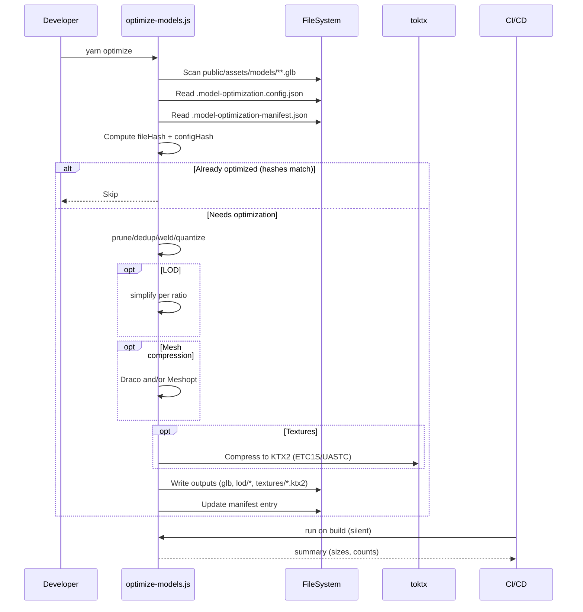

# 3D Asset Optimization Pipeline (GLB-only)

## Overview

- **Context & Goals**

  - Optimize runtime performance and load times by reducing GLB sizes and texture bandwidth for assets served from `/assets/models`.
  - Standardize a repeatable, fully-automated pipeline that runs in CI and locally via Yarn scripts.
  - Produce optional LOD variants for scalable rendering quality/perf across devices.
  - Ensure idempotency via a manifest that prevents reprocessing of unchanged inputs or config.

- **Current Pain Points**
  - Inconsistent model optimization; some models are large and uncompressed.
  - Missing texture compression to KTX2 and lack of power-of-two sizing.
  - No LOD variants for distance-based rendering.
  - Reprocessing wastes CPU; manifest lacks config-awareness.

## Proposed Solution

- **High‑level Summary**

  - Accept GLB inputs only (export upstream handled elsewhere), operate on `public/assets/models/**`.
  - Apply geometry transforms: prune, dedup, weld, quantize, optional simplify (LOD).
  - Apply mesh compression (Draco and/or Meshopt) and compress textures to KTX2 with KHR_texture_basisu.
  - Add texture resizing to power-of-two with max dimension caps.
  - Extend manifest to include input hash and pipeline config hash; skip reprocessing when unchanged.

- **Architecture & Directory Structure**
  ```
  vibe-coder-3d/
  ├── scripts/
  │   └── optimize-models.js           # Pipeline entrypoint (extended)
  ├── public/
  │   └── assets/
  │       └── models/                  # GLB inputs + outputs served by app
  │           └── <ModelName>/
  │               ├── glb/             # canonical GLB(s)
  │               ├── lod/             # optional LOD variants (e.g., LOD0/1/2)
  │               └── textures/        # external textures (if not embedded)
  ├── docs/
  │   └── PRDs/
  │       └── 3d-asset-optimization-pipeline.md
  ├── .model-optimization-manifest.json # Tracks inputs + config hash + outputs
  └── .model-optimization.config.json   # Declarative pipeline config (versioned)
  ```

## Implementation Plan

1. **Phase 1: Baseline + Config (0.5 day)**

   1. Introduce `.model-optimization.config.json` (quantization, compression, texture policy, LOD policy, pipelineVersion).
   2. Extend manifest schema to include `fileHash`, `configHash`, `outputs`, `variants`.
   3. Wire config hashing into the existing script; skip when both hashes match.

2. **Phase 2: Geometry Optimizations (0.5 day)**

   1. Keep `prune`, `dedup`, `weld`, `quantize` (already present).
   2. Add option for `simplify` (MeshoptSimplifier) gated by config.
   3. Add LOD generation loop with per-LOD simplify ratios; place outputs in `lod/`.

3. **Phase 3: Mesh Compression (0.5–1 day)**

   1. Add Draco compression path (continue to use `draco3dgltf`).
   2. Add Meshopt compression path via either:
      - glTF-Transform Meshopt extension + `meshoptimizer` dependency, or
      - `gltfpack` CLI (if we choose CLI path; configurable).
   3. Choose method per-config: `compression: "draco" | "meshopt" | "both"`.

4. **Phase 4: Texture Pipeline (0.5–1 day)**

   1. Enforce power-of-two and max-dimension resizing (external or embedded textures) using `sharp` or `imagemagick`.
   2. Convert textures to **KTX2** using `textureCompress` with `toktx` encoder (prefer ETC1S for general, UASTC for high-quality normals).
   3. Add/ensure `KHR_texture_basisu` on output; preserve sRGB/linear spaces.

5. **Phase 5: CI Integration & DX (0.5 day)**

   1. Update `package.json` scripts and build to run optimization silently.
   2. Add logging summary + stats (size before/after, triangle count deltas).
   3. Document usage and troubleshooting.

6. **Phase 6: Tests & Validation (0.5 day)**
   1. Unit test manifest hashing + skip logic.
   2. Integration test end-to-end on sample assets (size reduction assertions, presence of KTX2/Draco/Meshopt).

## File and Directory Structures

```
public/assets/models/<ModelName>/
├── glb/
│   └── <ModelName>.glb               # canonical optimized glb (LOD0)
├── lod/
│   ├── <ModelName>.lod1.glb          # optional (~50% tris)
│   └── <ModelName>.lod2.glb          # optional (~25% tris)
└── textures/
    ├── albedo.ktx2
    ├── normal.ktx2
    └── orm.ktx2
```

## Technical Details

- **Config file**: `.model-optimization.config.json`

  ```json
  {
    "pipelineVersion": 1,
    "geometry": {
      "quantize": { "position": 14, "normal": 10, "texcoord": 12, "color": 8, "generic": 12 },
      "simplify": { "enabled": true, "ratio": 0.6, "error": 0.001 }
    },
    "compression": {
      "method": "draco", // "meshopt" | "both"
      "draco": { "encodeSpeed": 5, "decodeSpeed": 5 },
      "meshopt": { "level": "medium" }
    },
    "textures": {
      "resize": { "enabled": true, "max": 2048, "powerOfTwo": true },
      "ktx2": { "enabled": true, "mode": "ETC1S", "quality": 128, "uastcZstandard": 18 }
    },
    "lod": { "enabled": true, "ratios": [1.0, 0.5, 0.25] }
  }
  ```

- **Manifest schema**: `.model-optimization-manifest.json`

  ```json
  {
    "optimized": {
      "public/assets/models/FarmHouse/glb/farm_house_basic_shaded.glb": {
        "fileHash": "sha256:...",
        "configHash": "sha256:...",
        "outputs": {
          "lod0": { "path": ".../glb/farm_house_basic_shaded.glb", "size": 123456 },
          "lod1": { "path": ".../lod/farm_house_basic_shaded.lod1.glb", "size": 65432 },
          "lod2": { "path": ".../lod/farm_house_basic_shaded.lod2.glb", "size": 32100 }
        },
        "timestamp": 1730000000000
      }
    }
  }
  ```

- **Script extension sketch** (ESM, Node):

  ```ts
  // scripts/optimize-models.js (sketch only)
  import { NodeIO } from '@gltf-transform/core';
  import { ALL_EXTENSIONS } from '@gltf-transform/extensions';
  import {
    prune,
    dedup,
    weld,
    quantize,
    simplify,
    textureCompress,
  } from '@gltf-transform/functions';
  import draco3d from 'draco3dgltf';
  // Optional Meshopt path A: gltf-transform + meshoptimizer
  // import { MeshoptDecoder, MeshoptEncoder } from 'meshoptimizer';
  // Optional Meshopt path B: run `gltfpack` via child_process for EXT_meshopt

  const io = new NodeIO().registerExtensions(ALL_EXTENSIONS).registerDependencies({
    'draco3d.decoder': await draco3d.createDecoderModule(),
    'draco3d.encoder': await draco3d.createEncoderModule(),
    // 'meshopt.decoder': MeshoptDecoder,
    // 'meshopt.encoder': MeshoptEncoder,
  });

  // 1) Geometry transforms
  await document.transform(
    prune(),
    dedup(),
    weld(),
    quantize({
      /* from config */
    }),
  );

  // 2) LOD generation (if enabled): clone document, apply simplify() per ratio
  // 3) Mesh compression per config: Draco and/or Meshopt
  // 4) Textures: resize (sharp/imagemagick) then textureCompress({encoder: 'toktx', ...})
  // 5) Write outputs + update manifest entry with fileHash + configHash
  ```

- **Texture resizing**:

  - Prefer `sharp` (Node) for in-process resizing of external textures; for embedded textures, export via IO to buffers, resize, reattach.
  - Alternatively, call `magick`/`convert` (ImageMagick) as a child process if preferred.

- **KTX2 compression**:

  - Use `textureCompress({ encoder: 'toktx', slots: ['baseColorTexture','normalTexture', ...], quality, uastc, etc })` from `@gltf-transform/functions`.
  - Ensure `toktx` binary availability in CI image and local dev PATH.

- **Mesh compression**:
  - Draco: keep current dependency `draco3dgltf` and add encode step.
  - Meshopt: choose one:
    - Transform path: register meshopt encoder/decoder and emit `EXT_meshopt_compression`.
    - CLI path: `gltfpack -cc -tc -kn -ke -km -si <ratio> -o out.glb in.glb`.

## Usage Examples

```bash
# Local dev (silent):
yarn optimize

# Force re-run (ignore manifest):
yarn optimize:force

# CI (build): automatically runs optimize silently
```

```json
// package.json (scripts excerpt)
{
  "scripts": {
    "optimize": "node scripts/optimize-models.js",
    "optimize:force": "node scripts/optimize-models.js --force",
    "build": "node scripts/sync-assets.js --once --silent && node scripts/optimize-models.js --silent && tsc && vite build"
  }
}
```

## Testing Strategy

- **Unit Tests**

  - Manifest hashing and skip logic (`fileHash`, `configHash`).
  - Config parsing + defaults; invalid config surfaces actionable errors.
  - Texture policy: power-of-two enforcement decisions.

- **Integration Tests**
  - End-to-end run on sample GLB with embedded + external textures.
  - Assert presence of KHR_texture_basisu and KTX2 outputs.
  - Assert Draco/Meshopt compression presence per-config and size reductions.
  - Validate LOD variants exist and triangle counts decrease monotonically.

## Edge Cases

| Edge Case                          | Remediation                                                              |
| ---------------------------------- | ------------------------------------------------------------------------ |
| Embedded non-POT textures          | Extract, resize to POT, re-embed, then KTX2 compress.                    |
| Unsupported image formats          | Convert to PNG/JPEG before KTX2; log warning.                            |
| Animation data precision loss      | Loosen quantization for joints/morph weights via config.                 |
| Normal map quality loss with ETC1S | Use UASTC for normals; per-slot config.                                  |
| Draco vs Meshopt incompatibilities | Make compression mutually exclusive per-output; prefer one per asset.    |
| Missing `toktx` binary             | Skip KTX2 with warning; exit non-zero in CI if `strictTextures` enabled. |
| LOD artifacts                      | Tune simplify error/ratio; allow model-level overrides.                  |

## Sequence Diagram



## Risks & Mitigations

| Risk                             | Mitigation                                                                         |
| -------------------------------- | ---------------------------------------------------------------------------------- |
| Increased complexity in pipeline | Centralize config; document presets; add telemetry summary.                        |
| Binary tool availability (toktx) | Provide dev container/CI image with preinstalled tools; verify on start.           |
| Quality regressions              | Start conservative; allow per-model overrides; snapshot testing of visuals.        |
| Decode perf tradeoffs            | Prefer Meshopt for web if chosen; test on target devices; allow fallback to Draco. |

## Timeline

- Total: ~2.5–3.5 days
  - Phase 1: 0.5 day
  - Phase 2: 0.5 day
  - Phase 3: 0.5–1 day
  - Phase 4: 0.5–1 day
  - Phase 5: 0.5 day
  - Phase 6: 0.5 day

## Acceptance Criteria

- Pipeline operates on GLB-only inputs in `public/assets/models/**`.
- Manifest prevents reprocessing when `fileHash` and `configHash` match.
- Geometry passes: prune, dedup, weld, quantize applied.
- Optional LOD variants produced when enabled; triangle counts reduced.
- Mesh compression path(s) configurable: Draco and/or Meshopt.
- Textures resized to POT and compressed to KTX2 with KHR_texture_basisu.
- Build and local scripts run optimization silently with clear summary.
- Tests pass validating size reduction and metadata presence.

## Conclusion

This pipeline makes model optimization consistent, fast, and safe by standardizing geometry, mesh, and texture compression steps with robust skip logic. It scales across devices via LODs and balances quality/performance through a single declarative config.

## Assumptions & Dependencies

- Inputs are GLB; export from DCC tools is out of scope here.
- Node 18+, Yarn, `@gltf-transform/*` (core, extensions, functions), `draco3dgltf` available.
- KTX2 requires `toktx` binary; install in CI image and advise local installation.
- Meshopt requires either `meshoptimizer` (Node) or `gltfpack` CLI; choose per-config.
- Image processing requires `sharp` or ImageMagick available in environment.
