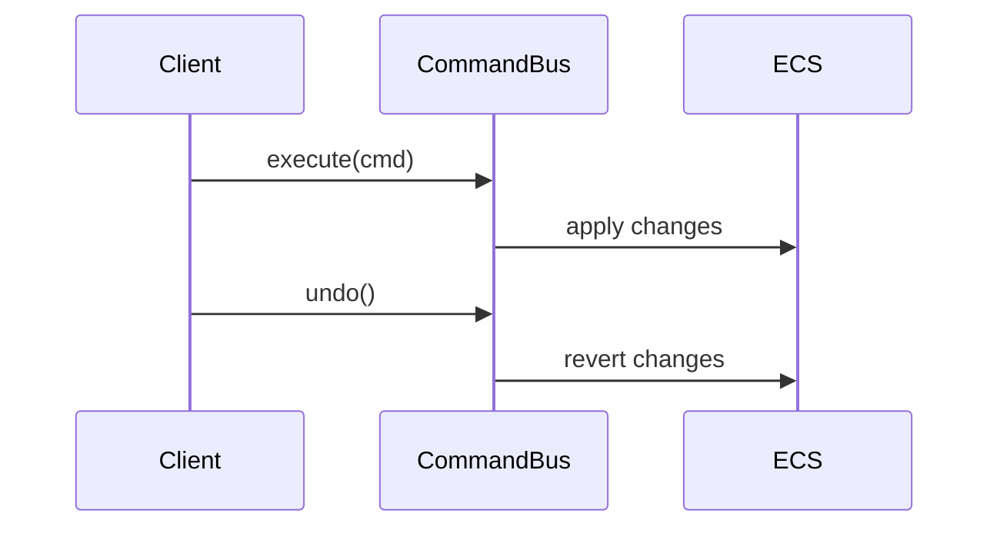

# Command System PRD

## Overview

### Context & Goals

- Provide undo/redo for gameplay/editor operations.
- Enable AI/behavior scripts to enqueue reversible actions.
- Standardize transactional changes across ECS.

### Current Pain Points

- No unified command contract or history.
- Hard to revert multi-entity operations safely.
- Limited observability for action auditing.

## Proposed Solution

### High‑level Summary

- Define `ICommand` with `do/undo/serialize` and idempotency.
- Maintain command stacks with grouping and checkpoints.
- Emit events for telemetry and AI integration.
- Persist compact history (optional caps, pruning).

### Architecture & Directory Structure

```
/src/core/
  ├── lib/commands/
  │   ├── CommandBus.ts
  │   ├── CommandHistory.ts
  │   └── commands/
  │       ├── TransformCommands.ts
  │       └── ComponentCommands.ts
  └── systems/
      └── CommandSystem.ts
```

## Implementation Plan

1. Phase 1: Contracts (0.5 day)

   1. Define `ICommand` and bus/history APIs
   2. Add grouping and checkpoint semantics

2. Phase 2: Core Commands (0.5 day)

   1. Transform add/update/remove
   2. Generic component add/remove/update

3. Phase 3: Integration (0.5 day)
   1. Event emission for telemetry
   2. Script API bridge for AI

## File and Directory Structures

```
/docs/implementation/
  └── 4-11-command-system-prd.md
```

## Technical Details

```ts
export interface ICommand<T = unknown> {
  id: string;
  do(context?: T): Promise<void> | void;
  undo(context?: T): Promise<void> | void;
  serialize?(): Record<string, unknown>;
}

export interface ICommandBus {
  execute(cmd: ICommand): Promise<void>;
  undo(): Promise<void>;
  redo(): Promise<void>;
  beginGroup(label?: string): void;
  endGroup(): void;
}
```

### Editor Integration

```ts
// 1) Wrap component mutations in CommandBus
// src/editor/components/menus/AddComponentMenu.tsx
// instead of componentManager.addComponent(...)
await commandBus.execute(new AddComponentCommand({ entityId, type: componentType, data: defaultData }));

// src/editor/components/inspector/adapters/*
// replace updateComponent/removeComponent calls similarly via commands

// 2) Toolbar bindings (undo/redo)
// src/editor/store/editorStore.ts
import { commandBus } from '@/core/lib/commands/CommandBus';
undo: async () => { await commandBus.undo(); },
redo: async () => { await commandBus.redo(); },

// 3) Command examples
// src/core/lib/commands/commands/ComponentCommands.ts
export class AddComponentCommand implements ICommand {
  constructor(private p: { entityId: number; type: string; data: unknown }) {}
  async do() { componentManager.addComponent(this.p.entityId, this.p.type, this.p.data); }
  async undo() { componentManager.removeComponent(this.p.entityId, this.p.type); }
}

export class UpdateComponentCommand implements ICommand {
  constructor(private p: { entityId: number; type: string; prev: unknown; next: unknown }) {}
  async do() { componentManager.updateComponent(this.p.entityId, this.p.type, this.p.next); }
  async undo() { componentManager.updateComponent(this.p.entityId, this.p.type, this.p.prev); }
}

// 4) System registration (optional for telemetry/cleanup)
// src/core/systems/CommandSystem.ts
registerSystem({ id: 'core.commands', order: 10, update: () => commandBus.flush() });

// 5) Script API bridge (for AI)
// src/core/lib/scripting/ScriptAPI.ts
export const createCommandAPI = (bus: ICommandBus) => ({
  execute: (cmd: ICommand) => bus.execute(cmd),
  undo: () => bus.undo(),
  redo: () => bus.redo(),
});
```

## Usage Examples

```ts
await commandBus.execute(new SetTransform({ entityId, position }));
await commandBus.undo();
```

## Testing Strategy

- Unit: idempotency, grouping behavior, history bounds.
- Integration: ECS changes reversible across systems.

## Edge Cases

| Edge Case          | Remediation                                |
| ------------------ | ------------------------------------------ |
| Long chains        | Cap history; periodic checkpoints          |
| Non-reversible ops | Gate behind safeguards; skip serialization |

## Sequence Diagram



## Risks & Mitigations

| Risk               | Mitigation                                    |
| ------------------ | --------------------------------------------- |
| Inconsistent state | Snapshot before group; validation after apply |
| Performance        | Batch updates; coalesce trivial commands      |

## Timeline

- Total: ~1.5 days (Contracts 0.5, Core 0.5, Integration 0.5)

## Acceptance Criteria

- Reversible transform/component changes.
- Grouped actions undo/redo atomically.
- Events emitted for telemetry.

## Conclusion

Creates a robust foundation for undoable gameplay/editor operations and AI control.

## Assumptions & Dependencies

- Event bus available; ECS component manager supports diffing.
