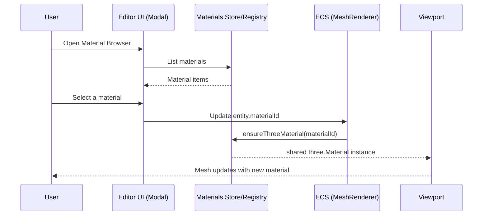

# Material System PRD

## Overview

### Context & Goals

- Establish a Unity-like material workflow with reusable material assets and per-entity overrides.
- Decouple materials from `MeshRenderer` inline data; prefer `materialId` references to shared assets.
- Provide editor UX to create/browse/edit materials via modals and assign them to one or many renderers.
- Optimize runtime by caching and reusing Three.js material instances; reduce duplication and GC.

### Current Pain Points

- Materials are edited inline on `MeshRenderer`, causing duplication and inconsistent styling.
- No dedicated material library; textures are managed via `AssetSelector` but materials are not first-class assets.
- Hard to reuse a look across multiple entities or scenes; no assignment flow or batch apply.
- Potential performance overhead from per-entity material objects with identical settings.

## Proposed Solution

### High‑level Summary

- Introduce a first-class Material Asset (JSON) with a Zod-validated schema and an in-engine `MaterialRegistry`.
- `MeshRenderer` primarily references `materialId` (and optional `materials[]` for submeshes). Inline `material` stays as an override path.
- Add editor modals: Material Browser (search/assign/duplicate), Material Create/Edit Modal, and a Material Inspector.
- Implement runtime material caching and instancing: shared instances per asset, with optional per-entity overrides layered at render time.
- Migration path: convert existing inline material data into saved assets and update `materialId` references.

### Architecture & Directory Structure

```
/src/core/materials/
  ├── Material.types.ts          # Zod schema + TS types for materials
  ├── MaterialRegistry.ts        # In-memory registry, asset IO, Three.js converters
  ├── MaterialConverter.ts       # Asset → Three.js material factory
  └── MaterialOverrides.ts       # Apply partial overrides at draw-time

/src/editor/components/materials/
  ├── MaterialBrowserModal.tsx   # Unity-like browser with search/preview/assign
  ├── MaterialCreateModal.tsx    # Create/duplicate material assets
  ├── MaterialInspector.tsx      # Edit asset fields + texture selectors
  └── hooks/useMaterials.ts      # Store + commands for CRUD/assign

/src/editor/store/
  └── materialsStore.ts          # Zustand store for asset list, selection, filters

/public/assets/materials/
  └── *.mat.json                 # Material asset files
```

## Implementation Plan

1. Phase 1: Core Assets & Registry (0.5 day)

   1. Define `IMaterialDefinition` Zod schema + types.
   2. Implement `MaterialRegistry` with load/save/list APIs.
   3. Implement `MaterialConverter` (asset → Three.js) with caching.

2. Phase 2: Editor UX & Modals (0.75 day)

   1. Build `MaterialBrowserModal` (search/sort/preview/assign/remove).
   2. Build `MaterialCreateModal` (from template / duplicate existing).
   3. Build `MaterialInspector` with `AssetSelector` for textures.

3. Phase 3: Integration with MeshRenderer (0.5 day)

   1. Update `MeshRendererSection` to show `materialId` picker + "Edit".
   2. Support batch assign from selection and context menus.
   3. Keep inline `material` as overrides; show "Make Unique" to detach.

4. Phase 4: Submesh & Migration (0.5 day)

   1. Optional `materials: string[]` for multiple material slots.
   2. Data migration utility: inline `material` → new asset + assign id.
   3. Backward-compatible load: prefer `materialId`; apply overrides.

5. Phase 5: Quality & Perf (0.25 day)
   1. Perf instrumentation; avoid material churn; instance reuse.
   2. Validation and error surfaces in editor.

## File and Directory Structures

```
/docs/PRDs/
  └── 4-16-material-system-prd.md

/src/core/materials/
  ├── Material.types.ts
  ├── MaterialRegistry.ts
  ├── MaterialConverter.ts
  └── MaterialOverrides.ts

/src/editor/components/materials/
  ├── MaterialBrowserModal.tsx
  ├── MaterialCreateModal.tsx
  ├── MaterialInspector.tsx
  └── hooks/useMaterials.ts

/src/editor/store/
  └── materialsStore.ts

/public/assets/materials/
  └── default.mat.json
```

## Technical Details

```ts
// src/core/materials/Material.types.ts
import { z } from 'zod';

export const MaterialShaderSchema = z.enum(['standard', 'unlit']);
export const MaterialTypeSchema = z.enum(['solid', 'texture']);

export const MaterialDefinitionSchema = z.object({
  id: z.string(),
  name: z.string(),
  shader: MaterialShaderSchema.default('standard'),
  materialType: MaterialTypeSchema.default('solid'),
  // Main
  color: z.string().default('#cccccc'),
  metalness: z.number().default(0),
  roughness: z.number().default(0.7),
  // Emission
  emissive: z.string().default('#000000'),
  emissiveIntensity: z.number().default(0),
  // Textures
  albedoTexture: z.string().optional(),
  normalTexture: z.string().optional(),
  metallicTexture: z.string().optional(),
  roughnessTexture: z.string().optional(),
  emissiveTexture: z.string().optional(),
  occlusionTexture: z.string().optional(),
  // Texture xform
  normalScale: z.number().default(1),
  occlusionStrength: z.number().default(1),
  textureOffsetX: z.number().default(0),
  textureOffsetY: z.number().default(0),
});

export type IMaterialDefinition = z.infer<typeof MaterialDefinitionSchema>;

export interface IMaterialAssetMeta {
  id: string;
  name: string;
  path: string; // /assets/materials/whatever.mat.json
}
```

```ts
// src/core/materials/MaterialRegistry.ts
import type { IMaterialDefinition } from './Material.types';

export class MaterialRegistry {
  private static instance: MaterialRegistry | null = null;
  static getInstance(): MaterialRegistry {
    if (!this.instance) this.instance = new MaterialRegistry();
    return this.instance;
  }

  private idToDef = new Map<string, IMaterialDefinition>();
  private idToThree = new Map<string, any>(); // three.Material

  list(): IMaterialDefinition[] {
    return [...this.idToDef.values()];
  }
  get(id: string): IMaterialDefinition | undefined {
    return this.idToDef.get(id);
  }
  upsert(def: IMaterialDefinition): void {
    this.idToDef.set(def.id, def);
    this.idToThree.delete(def.id);
  }
  remove(id: string): void {
    this.idToDef.delete(id);
    this.idToThree.delete(id);
  }

  ensureThreeMaterial(id: string): any {
    /* build or reuse three material */
  }
  updateInstanceParams(id: string): void {
    /* refresh existing instances safely */
  }
}
```

```ts
// src/core/materials/MaterialConverter.ts
import type { IMaterialDefinition } from './Material.types';

export function createThreeMaterialFrom(def: IMaterialDefinition, textures: Record<string, any>) {
  // Build MeshStandardMaterial or MeshBasicMaterial depending on shader
  // Attach maps if provided; apply numeric params
}
```

```ts
// src/core/materials/MaterialOverrides.ts
import type { IMaterialDefinition } from './Material.types';

export interface IMaterialOverrides {
  color?: string;
  metalness?: number;
  roughness?: number;
  emissive?: string;
  emissiveIntensity?: number;
  // ... and selected texture/transform fields as needed
}

export function applyOverrides(
  base: IMaterialDefinition,
  overrides?: IMaterialOverrides,
): IMaterialDefinition {
  return { ...base, ...(overrides || {}) };
}
```

```tsx
// src/editor/components/materials/MaterialBrowserModal.tsx
import React from 'react';
import { Modal } from '@/editor/components/shared/Modal';

export interface IMaterialBrowserModalProps {
  isOpen: boolean;
  onClose: () => void;
  onSelect: (materialId: string) => void;
}

export const MaterialBrowserModal: React.FC<IMaterialBrowserModalProps> = ({
  isOpen,
  onClose,
  onSelect,
}) => {
  // list + search + preview; click to select → onSelect(id); supports Duplicate/Delete
  return (
    <Modal isOpen={isOpen} onClose={onClose} title="Select Material" maxWidth="w-[720px]">
      {/* grid list, search input, preview pane */}
    </Modal>
  );
};
```

```tsx
// src/editor/components/materials/MaterialCreateModal.tsx
import React from 'react';
import { Modal } from '@/editor/components/shared/Modal';

export interface IMaterialCreateModalProps {
  isOpen: boolean;
  onClose: () => void;
  onCreate: (name: string, template?: string) => void;
}

export const MaterialCreateModal: React.FC<IMaterialCreateModalProps> = ({
  isOpen,
  onClose,
  onCreate,
}) => {
  // name + template selection (Standard/Unlit, Solid/Texture)
  return <Modal isOpen={isOpen} onClose={onClose} title="Create Material" />;
};
```

```tsx
// src/editor/components/materials/MaterialInspector.tsx
import React from 'react';
import { AssetSelector } from '@/editor/components/shared/AssetSelector';

export interface IMaterialInspectorProps {
  materialId: string;
  readOnly?: boolean;
}

export const MaterialInspector: React.FC<IMaterialInspectorProps> = ({ materialId }) => {
  // edit shader, type, color, maps; persist to asset & registry
  return (
    <div className="p-3 space-y-3">
      {/* shader/type selectors, color, metalness/roughness */}
      <AssetSelector label="Albedo" basePath="/assets/textures" />
    </div>
  );
};
```

```ts
// MeshRenderer integration concept (schema remains compatible)
// Prefer materialId; optional materials[] for submeshes in future
type MeshRendererData = {
  meshId: string;
  materialId: string; // primary path
  materials?: string[]; // optional multi-slot
  material?: {
    /* existing inline overrides retained */
  };
};
```

## Usage Examples

```ts
// 1) Create a new material asset (editor command)
materials.create({ name: 'BrushedMetal', shader: 'standard', metalness: 0.9, roughness: 0.3 });

// 2) Assign to selected entities from the browser modal
materials.assignToSelection('BrushedMetal');

// 3) Edit a material
materials.update('BrushedMetal', { roughness: 0.25 });

// 4) Per-entity tweak without breaking sharing
materials.applyOverride(entityId, { roughness: 0.5 });
```

```tsx
// Inspector: replace inline texture fields with a Material field + actions
<ComponentField
  label="Material"
  type="button"
  value={meshRenderer.materialId}
  onClick={() =>
    openMaterialBrowser({ onSelect: (id) => setMeshRenderer({ ...meshRenderer, materialId: id }) })
  }
  rightActions={[{ label: 'Edit', onClick: () => openMaterialInspector(meshRenderer.materialId) }]}
/>
```

## Testing Strategy

- Unit: Zod validation; registry CRUD; converter mapping; override application.
- Integration: Assign material to entity updates viewport; batch apply; duplicate/delete flows.
- Persistence: Save/load scenes keep `materialId` references; assets survive reloads.
- Performance: Ensure material caching prevents churn; measure frame stability when reassigning at scale.

## Edge Cases

| Edge Case                       | Remediation                                                    |
| ------------------------------- | -------------------------------------------------------------- |
| Missing `materialId`            | Fallback to `default` asset; show warning in inspector.        |
| Invalid texture paths           | Gracefully skip map; show inline error; keep color-only.       |
| Asset edited while in use       | Update cached instance params; avoid disposal churn.           |
| Multi-submesh mismatch          | Clamp or pad `materials[]`; surface slot mapping in inspector. |
| Large batch reassign            | Debounce renderer updates; apply in frame-safe chunks.         |
| Inline overrides + shared asset | Apply overrides at draw-time; do not mutate shared asset.      |

## Sequence Diagram



## Risks & Mitigations

| Risk                                    | Mitigation                                                              |
| --------------------------------------- | ----------------------------------------------------------------------- |
| Data migration errors                   | Provide backup and revert; keep inline path backward compatible.        |
| Memory bloat from many unique instances | Strong caching; discourage per-entity clones; overrides are param-only. |
| Inconsistent UX                         | Reuse shared `Modal`; follow existing inspector field patterns.         |
| Performance during mass edits           | Batch updates; memoize; avoid material re-creation.                     |

## Timeline

- Total: ~2.5 days
  - Core & Registry: 0.5 day
  - Editor UX & Modals: 0.75 day
  - MeshRenderer Integration: 0.5 day
  - Submesh & Migration: 0.5 day
  - Perf polish: 0.25 day

## Acceptance Criteria

- Can create, duplicate, delete material assets in `/public/assets/materials`.
- `MeshRenderer` shows a Material field; Material Browser modal assigns to single/multiple entities.
- Editing a material asset updates all referencing entities in the viewport.
- Inline overrides work without breaking shared asset reuse; no material churn or console errors.
- Scenes persist `materialId` references; reload restores assignments and looks.

## Conclusion

This introduces a reusable, Unity-like material workflow: a material library with clean editor UX, shared runtime instances for performance, and compatible overrides for flexibility. It modularizes materials away from `MeshRenderer` internals and aligns with the project’s asset-first architecture.

## Assumptions & Dependencies

- Three.js materials are the render target; editor viewport already renders via Three/R3F components.
- Zod available for schema validation; path aliases (`@/...`) used per tsconfig.
- Tailwind for UI styling; `Modal` component is the standard for dialogs.
- Asset base path accessible via `ProjectAssetService`; materials live under `/public/assets/materials`.
