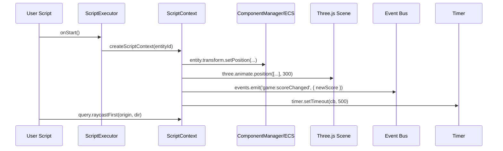

🧠 Planning documents standards rule loaded!

# Script API Expansion & Versatility PRD

## Overview

- **Context & Goals**:
  - Unify and expand the scripting API to cover common gameplay needs while preserving sandbox safety and performance budgets.
  - Align `src/game/scripts/script-api.d.ts` with runtime implementations in `src/core/lib/scripting/ScriptAPI.ts` and generate types from source to prevent drift.
  - Introduce additional subsystems to scripts: Events, Audio, Timers/Scheduling, Queries/Tags, Entity Ops (spawn/destroy/enable), and Input Actions.
  - Improve ergonomics (async helpers, typed parameters, scene/entity queries) without breaking existing scripts.

- **Current Pain Points**:
  - Drift between declaration file (`IScriptEntityAPI`, `IScriptThreeAPI`…) and runtime interfaces (`IEntityScriptAPI`, `IThreeJSAPI`…).
  - Input API is mocked in runtime; no action mapping or gamepad parity.
  - No first‑class access to event bus, audio, timers, or tag queries from scripts.
  - Limited entity hierarchy/query utilities; parameters are untyped blobs.

## Proposed Solution

- **High‑level Summary**:
  - Standardize API naming and surface; add a thin compatibility layer for existing global names to avoid breaking changes.
  - Add new script APIs: Event, Audio, Timer/Scheduler, Query/Tags, Prefab/EntityOps, and enrich Three helpers (raycast utils, visibility, animate already returns Promises).
  - Replace mock input with real Input Service, add action querying, and basic gamepad support passthrough.
  - Introduce typed parameters via Zod schemas and optional codegen for editor UX and script hints.
  - Generate `script-api.d.ts` from runtime TypeScript sources during dev (via existing Vite plugin) to keep types in sync.

- **Architecture & Directory Structure**:
  ```
  src/core/lib/scripting/
  ├── ScriptAPI.ts                 # Align + extend (source of truth)
  ├── adapters/
  │   ├── dtsGenerator.ts         # Generate script-api.d.ts from TS interfaces
  │   ├── compatAliases.ts         # Back-compat global name aliases (IScript* → I*)
  │   └── scheduler.ts             # Frame-budgeted timers (setTimeout/interval-like)
  ├── apis/
  │   ├── EventAPI.ts             # eventBus access (on/off/emit scoped)
  │   ├── AudioAPI.ts             # play/stop, positional tie-ins
  │   ├── TimerAPI.ts             # timers, nextTick, frame waiters
  │   ├── QueryAPI.ts             # tags, raycasts, entity queries
  │   └── PrefabAPI.ts            # spawn/destroy/enable/disable clones
  └── ScriptExecutor.ts           # Wire new APIs into context

  src/plugins/
  └── vite-plugin-script-api.ts    # Ensure d.ts generation step is hooked (dev)

  src/game/scripts/script-api.d.ts # Generated; do not hand edit
  ```

## Implementation Plan

- **Phase 1: API Alignment (0.5 day)**
  1. Normalize names across runtime and d.ts (keep `IEntityScriptAPI`, `IThreeJSAPI`, `IInputAPI`).
  2. Add `compatAliases.ts` to expose legacy global names (`IScriptEntityAPI`, `IScriptThreeAPI`) mapped to the canonical ones.
  3. Audit ScriptExecutor context construction; ensure new fields are optional and back‑compatible.

- **Phase 2: Input & Time (0.5 day)**
  1. Replace mock Input in `ScriptSystem` with a real input provider (hook/service adapter).
  2. Add `input.actions.isPressed(name)` and basic gamepad passthrough.
  3. Expose `time: { time, deltaTime, frameCount }` and add `TimerAPI` with frame‑budgeted scheduler.

- **Phase 3: Events & Audio (0.75 day)**
  1. `EventAPI` with `on`, `off`, `emit`, auto‑scoped to entity and auto‑cleanup on destroy.
  2. `AudioAPI` bridging `SoundManager`/Howler: `play(url, opts)`, `stop(handle)`, optional positional binding to current entity.

- **Phase 4: Query/Tags & Entity Ops (0.75 day)**
  1. `QueryAPI`: tag queries, `findByTag(name)`, `raycastAll`, `raycastFirst`, world position helpers.
  2. `PrefabAPI`: `spawn(prefabId, overrides?)`, `destroy(entityId)`, `setActive(entityId, active)` with ECS checks.

- **Phase 5: Type Generation & Parameters (0.5 day)**
  1. Generate `script-api.d.ts` from runtime interfaces (Vite dev). Add banner "AUTO‑GENERATED".
  2. Add optional `parametersSchema?: z.ZodSchema` per script; validate at runtime; expose typed `parameters`.

- **Phase 6: Tests & Docs (0.5 day)**
  1. Unit tests for each API and context lifecycle cleanup.
  2. Update docs: `docs/architecture/2-11-input-system.md`, `2-12-audio-system.md`, `2-7-event-system.md` cross‑links.

## File and Directory Structures

```
/src/core/lib/scripting/
├── ScriptAPI.ts
├── ScriptExecutor.ts
├── apis/
│   ├── EventAPI.ts
│   ├── AudioAPI.ts
│   ├── TimerAPI.ts
│   ├── QueryAPI.ts
│   └── PrefabAPI.ts
└── adapters/
    ├── dtsGenerator.ts
    ├── compatAliases.ts
    └── scheduler.ts

/src/game/scripts/
└── script-api.d.ts  (generated)
```

## Technical Details

### Canonical interfaces (source of truth)
```ts
// src/core/lib/scripting/ScriptAPI.ts (additions only)
export interface IEventAPI {
  on<T extends string>(type: T, handler: (payload: unknown) => void): () => void;
  off<T extends string>(type: T, handler: (payload: unknown) => void): void;
  emit<T extends string>(type: T, payload: unknown): void;
}

export interface IAudioAPI {
  play(url: string, options?: Record<string, unknown>): number;
  stop(handleOrUrl: number | string): void;
  attachToEntity?(follow: boolean): void;
}

export interface ITimerAPI {
  setTimeout(cb: () => void, ms: number): number;
  clearTimeout(id: number): void;
  setInterval(cb: () => void, ms: number): number;
  clearInterval(id: number): void;
  nextTick(): Promise<void>;
  waitFrames(count: number): Promise<void>;
}

export interface IQueryAPI {
  findByTag(tag: string): number[]; // entity IDs
  raycastFirst(origin: [number, number, number], dir: [number, number, number]): unknown | null;
  raycastAll(origin: [number, number, number], dir: [number, number, number]): unknown[];
}

export interface IPrefabAPI {
  spawn(prefabId: string, overrides?: Record<string, unknown>): number; // entityId
  destroy(entityId?: number): void; // default current
  setActive(entityId: number, active: boolean): void;
}

export interface IScriptContext {
  // existing fields ...
  events: IEventAPI;
  audio: IAudioAPI;
  timer: ITimerAPI;
  query: IQueryAPI;
  prefab: IPrefabAPI;
  parameters: Record<string, unknown>; // validated when schema provided
}
```

### Context wiring
```ts
// src/core/lib/scripting/ScriptExecutor.ts (inside createScriptContext)
return {
  entity: createEntityAPI(entityId),
  time: timeInfo,
  input: inputInfo,
  math: createMathAPI(),
  console: createConsoleAPI(entityId),
  three: createThreeJSAPI(entityId, getMeshRef, getSceneRef),
  events: createEventAPI(entityId),
  audio: createAudioAPI(entityId, () => getMeshRef()),
  timer: createTimerAPI(entityId),
  query: createQueryAPI(entityId, () => getSceneRef()),
  prefab: createPrefabAPI(entityId),
  parameters,
};
```

### Event API
```ts
// src/core/lib/scripting/apis/EventAPI.ts
import { emitter } from '@/core/lib/events';
export function createEventAPI(entityId: number): IEventAPI {
  const subscriptions = new Set<() => void>();
  return {
    on: (type, handler) => {
      emitter.on(type as any, handler as any);
      const off = () => emitter.off(type as any, handler as any);
      subscriptions.add(off);
      return off;
    },
    off: (type, handler) => emitter.off(type as any, handler as any),
    emit: (type, payload) => emitter.emit(type as any, payload as any),
  };
}
```

### Timer API (frame‑budgeted)
```ts
// src/core/lib/scripting/apis/TimerAPI.ts
export function createTimerAPI(entityId: number): ITimerAPI {
  // Internally backed by a scheduler that ticks per frame with budgets
  return scheduler.createScoped(entityId);
}
```

### Query API
```ts
// src/core/lib/scripting/apis/QueryAPI.ts
export function createQueryAPI(entityId: number, getScene: () => THREE.Scene | null): IQueryAPI {
  return {
    findByTag: (tag) => /* map tag registry refs to entityIds */ [],
    raycastFirst: (o, d) => createThreeJSAPI(entityId, () => null, getScene).raycast(o, d)[0] ?? null,
    raycastAll: (o, d) => createThreeJSAPI(entityId, () => null, getScene).raycast(o, d),
  };
}
```

### DTS generation (dev only)
```ts
// src/core/lib/scripting/adapters/dtsGenerator.ts
// Walk ScriptAPI.ts interfaces, emit a global ambient d.ts mirroring names and JSDoc.
```

## Usage Examples

```ts
// 1) Timed color pulse with audio cue
async function onStart() {
  if (three.mesh) {
    three.material.setColor('#44ccff');
    audio.play('/assets/sfx/ready.wav');
    await three.animate.scale([1.2, 1.2, 1.2], 300);
    await timer.waitFrames(5);
    await three.animate.scale([1, 1, 1], 200);
  }
}
```

```ts
// 2) Input actions + events
function onUpdate(dt) {
  if (input.isKeyPressed('w') || input.actions?.isPressed?.('moveForward')) {
    entity.transform.translate(0, 0, -dt * 2);
  }
}

function onStart() {
  const off = events.on('game:scoreChanged', (e) => console.log('Score', e));
}
```

```ts
// 3) Queries and parameters
function onStart() {
  const targetColor = (parameters.color as string) || '#ff0000';
  const hits = query.raycastAll([0, 1, 0], [0, -1, 0]);
  if (hits.length && three.mesh) three.material.setColor(targetColor);
}
```

## Testing Strategy

- **Unit Tests**:
  - EventAPI: subscribe/emit/off, auto‑cleanup on destroy.
  - TimerAPI: timeout/interval/nextTick/waitFrames; frame budget adherence.
  - AudioAPI: play/stop, positional attach when entity has mesh.
  - QueryAPI: raycast results against a known scene; tags mapping.
  - PrefabAPI: spawn/destroy with ECS world; active toggling.

- **Integration Tests**:
  - ScriptSystem lifecycle: onStart/onUpdate/onDestroy invoking new APIs without errors.
  - d.ts generation: verify generated `script-api.d.ts` exports expected names.
  - Input provider: real key press triggers action inside script.

## Edge Cases

| Edge Case | Remediation |
| --- | --- |
| Long‑running timers blocking frame | Scheduler slices work; cap per‑frame callbacks; warn via console.
| Event listener leak | Auto‑unsubscribe on `onDestroy`; scoped off function set.
| Missing scene/mesh for raycast/audio attach | Return empty results/no‑op, log debug message.
| d.ts drift from runtime | Generate from source each dev boot; add CI check.
| Old global names used in scripts | Provide alias globals; deprecate with console warnings.
| Input device differences | Fallbacks for unsupported gamepad features; document mapping.

## Sequence Diagram



## Risks & Mitigations

| Risk | Mitigation |
| --- | --- |
| Security surface increases | Keep whitelist, proxies; no direct Three mutables; scoped events.
| Performance regressions | Frame budgets in scheduler; Promises resolved via RAF; benchmarks.
| Breaking changes in API names | Provide compatibility aliases; deprecation warnings; migration doc.
| Type drift | Automated d.ts generation and CI check.
| Input provider variability | Feature detection; no‑op stubs when not supported.

## Timeline

- Total: ~3.5 days
  - Phase 1: 0.5d
  - Phase 2: 0.5d
  - Phase 3: 0.75d
  - Phase 4: 0.75d
  - Phase 5: 0.5d
  - Phase 6: 0.5d

## Acceptance Criteria

- `script-api.d.ts` is auto‑generated from `ScriptAPI.ts`, includes Events/Audio/Timer/Query/Prefab APIs.
- Scripts can use `events`, `audio`, `timer`, `query`, `prefab` without runtime errors.
- Input in scripts uses real provider; action querying works.
- Back‑compat names continue to work with deprecation notices.
- Unit and integration tests pass; CI check prevents d.ts drift.

## Conclusion

This plan establishes a consistent, ergonomic, and safe Script API that covers essential gameplay scenarios and scales with future needs. It reduces maintenance (type drift), increases capability (events, audio, timers, queries), and stays performant via budgeted scheduling.

## Assumptions & Dependencies

- `mitt` event bus (`docs/architecture/2-7-event-system.md`).
- `howler.js` integration and `SoundManager` (`docs/architecture/2-12-audio-system.md`).
- Three.js + R3F for scene access; entity mesh registration via `ThreeJSEntityRegistry`.
- Zod for parameter validation; TS path aliases per `tsconfig`.
- No physics API expansion in this phase; add later if required by `2-10-physics-system.md`.


