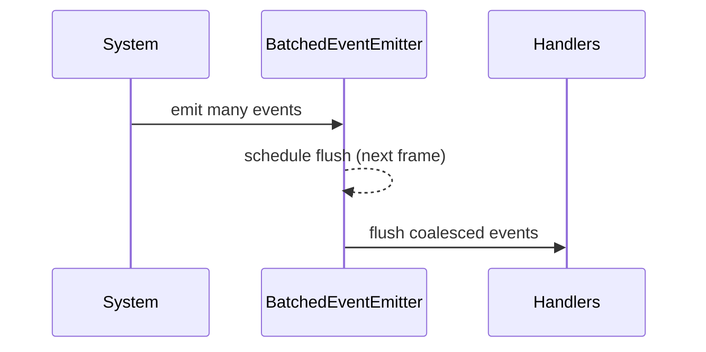

# PRD: Performance Optimization Sweep (Pooling, Event Batching, Profiling)

## 1. Overview

- **Context & Goals**

  - Reduce GC pressure and frame spikes in large scenes (>1k entities).
  - Batch high-frequency events to avoid redundant recomputation and cascading updates.
  - Introduce runtime instrumentation to identify system bottlenecks.
  - Maintain compatibility with Three.js integration and editor flows.

- **Current Pain Points**
  - Frequent object allocations in systems (e.g., transform calculations) and component bridges.
  - Events are emitted individually (`mitt`) without batching/debouncing.
  - No standardized profiling hooks; hard to attribute time to systems.

## 2. Proposed Solution

- **High‑level Summary**

  - Add lightweight object pools for hot-path allocations (math objects, component wrappers, arrays).
  - Implement a batched event emitter with frame-aware flush (16ms debounce) and coalescing.
  - Provide profiling utilities (marks, scoped timers) and optional integration with DevTools.
  - Add micro-benchmarks and performance gates in CI.

- **Architecture & Directory Structure**

```text
src/
  core/
    lib/
      perf/
        ObjectPool.ts
        BatchedEventEmitter.ts
        Profiler.ts
      events/
        eventBus.ts                 # Wrapper around mitt; can delegate to BatchedEventEmitter
    systems/
      transformSystem.ts           # Updated to reuse pools and avoid clones
```

## 3. Implementation Plan

- **Phase 1: Object Pools (0.5 day)**

  1. Implement generic `ObjectPool<T>` with `acquire/release`, warm-up, and size limits.
  2. Provide math-specialized pools (e.g., `Vector3`, `Quaternion`) with reset functions.
  3. Update hot-path systems to use pooled objects; eliminate unnecessary `.clone()` calls.

- **Phase 2: Event Batching (0.5 day)**

  1. Implement `BatchedEventEmitter` supporting `emit`, `on`, `off`, and frame-scheduled `flush()`.
  2. Coalesce identical events (e.g., last-wins for `component:updated` per entity/component).
  3. Integrate via `eventBus.ts` wrapper; keep opt-in flag to toggle batching for diagnostics.

- **Phase 3: Profiling (0.5 day)**

  1. Implement `Profiler` with `time(name, fn)`, `mark/measure`, and accumulated stats.
  2. Add optional console summaries every N frames in dev mode.
  3. Wrap critical systems and serialization imports with `Profiler.time`.

- **Phase 4: Benchmarks & CI (0.5 day)**
  1. Add micro-benchmarks for transform system, entity queries, and event storms.
  2. Add CI threshold checks to guard regressions.

## 4. File and Directory Structures

```text
/src/core/lib/perf/
├── BatchedEventEmitter.ts
├── ObjectPool.ts
└── Profiler.ts
/src/core/lib/events/
└── eventBus.ts
```

## 5. Technical Details

```ts
// src/core/lib/perf/ObjectPool.ts
export interface IObjectPool<T> {
  acquire(): T;
  release(item: T): void;
  warmup(count: number): void;
}
export class ObjectPool<T> implements IObjectPool<T> {
  /* ... */
}
```

```ts
// src/core/lib/perf/BatchedEventEmitter.ts
export class BatchedEventEmitter<TEvents extends Record<string, any>> {
  emit<K extends keyof TEvents>(type: K, data: TEvents[K]): void {
    /* ... */
  }
  on<K extends keyof TEvents>(type: K, handler: (event: TEvents[K]) => void): () => void {
    /* ... */
  }
  off<K extends keyof TEvents>(type: K, handler: (event: TEvents[K]) => void): void {
    /* ... */
  }
  flush(): void {
    /* ... */
  }
}
```

```ts
// src/core/lib/perf/Profiler.ts
export interface IProfiler {
  time<T>(name: string, fn: () => T): T;
}
export const Profiler: IProfiler = {
  /* ... */
};
```

```ts
// src/core/lib/events/eventBus.ts
export const eventBus = {
  emit(/* ... */) {
    /* delegate to batched or direct */
  },
  on(/* ... */) {
    /* ... */
  },
  off(/* ... */) {
    /* ... */
  },
};
```

## 6. Usage Examples

```ts
// Pools
const v = vector3Pool.acquire();
// ... use v ...
vector3Pool.release(v);
```

```ts
// Batched events
eventBus.emit('component:updated', { entityId, componentId, data });
// flushed on next frame
```

```ts
// Profiling
Profiler.time('transformSystem', () => transformSystem());
```

## 7. Testing Strategy

- **Unit Tests**

  - Pool acquire/release semantics; warmup; size limits; resets.
  - BatchedEventEmitter coalescing and flush ordering.
  - Profiler accuracy and overhead bounds.

- **Integration Tests**
  - Event storms do not starve frames; updates processed in batches.
  - Transform system allocations drop measurably with pools.

## 8. Edge Cases

| Edge Case            | Remediation                                              |
| -------------------- | -------------------------------------------------------- |
| Event handler throws | Wrap and isolate per-callback errors; continue flushing. |
| Pool item leaked     | Dev-only leak detection; warn after GC cycles.           |
| Profiling overhead   | Disable in production; guard with feature flags.         |

## 9. Sequence Diagram



## 10. Risks & Mitigations

| Risk                  | Mitigation                                                |
| --------------------- | --------------------------------------------------------- |
| Hidden regressions    | Add micro-benchmarks + CI gates; measure before/after.    |
| Over-batching latency | Allow priority events to bypass batching.                 |
| Complexity creep      | Keep APIs minimal; document patterns; focus on hot paths. |

## 11. Timeline

- Total: ~2 days
  - Phase 1: 0.5d
  - Phase 2: 0.5d
  - Phase 3: 0.5d
  - Phase 4: 0.5d

## 12. Acceptance Criteria

- Object allocations in hot systems reduced by >50% in profiles.
- Batched events reduce redundant handlers for rapid updates.
- Profiling utilities instrument core systems; overhead negligible in production.

## 13. Conclusion

Pooling, event batching, and profiling provide immediate performance wins and ongoing insight, enabling smoother frames and scalable scenes.

## 14. Assumptions & Dependencies

- Three.js remains the rendering backend; pools focus on its math objects.
- mitt remains available; batching added via wrapper.
