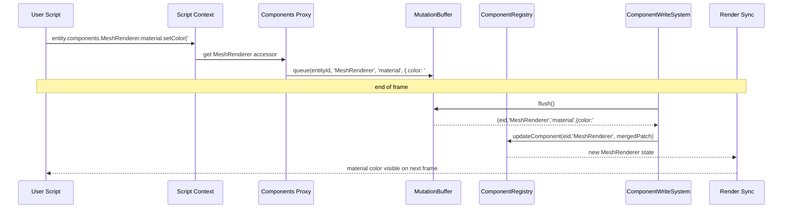

# ECS Components Chain API PRD

## Overview

- **Context & Goals**:

  - Enable ergonomic, chainable access to ECS component properties from scripts via `entity.components.*` (e.g., `entity.components.MeshRenderer.material.setColor('#ff00ff')`).
  - Unify ECS data changes and runtime effects while keeping strict safety and type discipline (Zod schemas, named exports, path aliases).
  - Maintain or improve performance: avoid per-frame object churn, use typed-array writes, and batch updates.
  - Integrate seamlessly with the existing Script System and `IEntityScriptAPI` while preserving current APIs (`transform`, `three`, `getComponent/setComponent`).

- **Current Pain Points**:
  - Scripts must call `getComponent/setComponent` or use `three.material.*` directly; no unified, chainable component API.
  - Component updates often merge whole objects rather than granular fields, risking unnecessary allocations and cache misses.
  - Inconsistent ergonomics between `transform` helpers and other components (e.g., `MeshRenderer`).
  - Potential duplication between ECS-level updates and Three.js direct state, making correctness and performance tuning harder.

## Proposed Solution

- **High‑level Summary**:

  - Add `components` to `IEntityScriptAPI`, exposing a lazy, typed Proxy of component accessors generated from `ComponentRegistry` descriptors.
  - Provide per-component accessors with safe, whitelisted operations (e.g., `MeshRenderer.material.setColor`, `setMetalness`, `enable/disable`).
  - Implement a `ComponentMutationBuffer` to coalesce granular field updates into minimal typed-array writes, flushed once per frame by a `ComponentWriteSystem`.
  - Cache accessors per entity and per component to avoid re-creating proxies; keep O(1) hot-path operations.
  - Preserve existing APIs; `three.material.*` remains available. ECS changes remain the source of truth; render sync systems consume ECS state.

- **Architecture & Directory Structure**:

```text
src/
├── core/
│   ├── lib/
│   │   ├── ecs/
│   │   │   ├── components/
│   │   │   │   └── accessors/
│   │   │   │       ├── ComponentAccessors.ts           # Accessor factory using descriptors
│   │   │   │       ├── MeshRendererAccessor.ts         # Hand-tuned ops for MeshRenderer
│   │   │   │       └── types.ts                        # IComponentAccessor<T>, operation types
│   │   │   ├── mutations/
│   │   │   │   ├── ComponentMutationBuffer.ts          # Coalesced writes per frame
│   │   │   │   └── __tests__/...                       # Buffer tests and perf checks
│   │   │   └── systems/
│   │   │       └── ComponentWriteSystem.ts             # Flush mutation buffer once/frame
│   │   └── scripting/
│   │       ├── apis/
│   │       │   └── ComponentsAPI.ts                    # entity.components proxy for scripts
│   │       └── ScriptAPI.ts                            # add `components` to IEntityScriptAPI
│   └── systems/
│       └── ScriptSystem.ts                             # wire context + scheduling order
└── docs/
    └── PRDs/
        └── 4-23-ecs-components-chain-api-prd.md        # This document
```

## Implementation Plan

1. **Phase 1: Foundations (0.5 day)**

   1. Define `IComponentAccessor<T>` and operation typing in `accessors/types.ts`.
   2. Scaffold `ComponentMutationBuffer` and frame-flush `ComponentWriteSystem`.
   3. Add `components` field to `IEntityScriptAPI` (type-only, not wired yet).

2. **Phase 2: Accessor Factory (0.75 day)**

   1. Implement `ComponentAccessors` to generate per-component accessors from `ComponentRegistry` descriptors.
   2. Use a lazy Proxy for `entity.components`, caching per-entity per-component instances (WeakMap cache).
   3. Provide base `get()`/`set(partial)` methods for any registered component via Zod-safe merges.

3. **Phase 3: MeshRenderer Specialization (0.5 day)**

   1. Implement `MeshRendererAccessor` with material helpers: `material.setColor`, `setMetalness`, `setRoughness`, `setEmissive`, `enable/disable`, texture setters by id.
   2. Map methods to minimal field deltas in the mutation buffer (typed-array fields, hashed strings for IDs).

4. **Phase 4: Buffering and Flush (0.5 day)**

   1. Implement coalescing rules: last-write-wins per entity+component+field; batch applying typed-array writes.
   2. Add `ComponentWriteSystem` into frame order before renderer sync; ensure deterministic flush timing.

5. **Phase 5: Script Integration and Types (0.5 day)**

   1. Wire `ComponentsAPI` into script context in `ScriptExecutor` creation; expose as `entity.components`.
   2. Update d.ts generation so `script-api.d.ts` includes `components` types with known accessors (at least MeshRenderer).
   3. Keep `getComponent/setComponent` working as-is; document deprecation path (no breakage).

6. **Phase 6: Tests, Perf, Docs (0.5 day)**
   1. Unit tests for buffer coalescing, accessor methods, and descriptor-driven `set()`.
   2. Integration tests from script lifecycles updating MeshRenderer color and seeing state reflected.
   3. Microbench: 10k chained calls coalesced in a frame; target negligible GC and O(entities) flush time.

## File and Directory Structures

```text
/src/core/lib/ecs/components/accessors/
├── ComponentAccessors.ts
├── MeshRendererAccessor.ts
└── types.ts

/src/core/lib/ecs/mutations/
├── ComponentMutationBuffer.ts
└── __tests__/
    └── ComponentMutationBuffer.test.ts

/src/core/lib/ecs/systems/
└── ComponentWriteSystem.ts

/src/core/lib/scripting/apis/
└── ComponentsAPI.ts
```

## Technical Details

```ts
// src/core/lib/ecs/components/accessors/types.ts
export interface IComponentAccessor<TData> {
  get(): TData | null;
  set(patch: Partial<TData>): void; // batched via mutation buffer
}

export interface IMeshRendererAccessor extends IComponentAccessor<MeshRendererData> {
  enable(value: boolean): void;
  material: {
    setColor(hex: string | number): void;
    setMetalness(value: number): void;
    setRoughness(value: number): void;
    setEmissive(hex: string | number, intensity?: number): void;
    setTexture(
      kind: 'albedo' | 'normal' | 'metallic' | 'roughness' | 'emissive' | 'occlusion',
      idOrPath: string,
    ): void;
  };
}
```

```ts
// src/core/lib/ecs/mutations/ComponentMutationBuffer.ts
export type ComponentFieldKey = `${number}:${string}:${string}`; // entityId:componentId:field

export class ComponentMutationBuffer {
  private pending = new Map<ComponentFieldKey, unknown>();

  queue(entityId: number, componentId: string, field: string, value: unknown): void {
    this.pending.set(`${entityId}:${componentId}:${field}`, value);
  }

  flush(
    apply: (entityId: number, componentId: string, field: string, value: unknown) => void,
  ): void {
    for (const [k, v] of this.pending) {
      const [eid, cid, field] = k.split(':');
      apply(Number(eid), cid, field, v);
    }
    this.pending.clear();
  }
}
```

```ts
// src/core/lib/ecs/components/accessors/ComponentAccessors.ts
import { componentRegistry } from '@/core/lib/ecs/ComponentRegistry';
import { ComponentMutationBuffer } from '@/core/lib/ecs/mutations/ComponentMutationBuffer';

const entityCache = new WeakMap<object, Map<string, unknown>>(); // context-bound cache

export function createComponentsProxy(entityId: number, buffer: ComponentMutationBuffer) {
  const cache = new Map<string, unknown>();
  entityCache.set(cache, cache);

  return new Proxy(
    {},
    {
      get(_, compId: string) {
        if (typeof compId !== 'string') return undefined;
        if (cache.has(compId)) return cache.get(compId);

        const descriptor = componentRegistry.get<any>(compId);
        if (!descriptor) return undefined;

        // Base accessor with get/set; specialized accessors may augment
        const baseAccessor = {
          get(): any | null {
            return componentRegistry.getComponentData(entityId, compId) ?? null;
          },
          set(patch: any): void {
            // Decompose patch into field-level updates for coalescing
            for (const [field, value] of Object.entries(patch)) {
              buffer.queue(entityId, compId, field, value);
            }
          },
        } as any;

        // Allow specialization (e.g., MeshRenderer)
        const specialized = attachSpecializedAccessors(entityId, compId, baseAccessor, buffer);
        cache.set(compId, specialized);
        return specialized;
      },
    },
  );
}

function attachSpecializedAccessors(
  entityId: number,
  compId: string,
  base: any,
  buffer: ComponentMutationBuffer,
) {
  if (compId === 'MeshRenderer') {
    base.enable = (value: boolean) => base.set({ enabled: !!value });
    base.material = {
      setColor: (hex: string | number) => base.set({ material: { color: hex } }),
      setMetalness: (v: number) =>
        base.set({ material: { metalness: Math.max(0, Math.min(1, v)) } }),
      setRoughness: (v: number) =>
        base.set({ material: { roughness: Math.max(0, Math.min(1, v)) } }),
      setEmissive: (hex: string | number, intensity?: number) =>
        base.set({ material: { emissive: hex, emissiveIntensity: intensity ?? 1 } }),
      setTexture: (kind: string, id: string) => base.set({ material: { [`${kind}Texture`]: id } }),
    };
  }
  return base;
}
```

```ts
// src/core/lib/systems/ComponentWriteSystem.ts
import { componentRegistry } from '@/core/lib/ecs/ComponentRegistry';

export function createComponentWriteSystem(buffer: ComponentMutationBuffer) {
  return function componentWriteSystem() {
    buffer.flush((entityId, componentId, field, value) => {
      // Apply as minimal merge to avoid object churn
      const current = componentRegistry.getComponentData<any>(entityId, componentId) || {};
      const patch = {
        ...current,
        [field]:
          typeof value === 'object' && value !== null
            ? { ...(current as any)[field], ...(value as any) }
            : value,
      };
      componentRegistry.updateComponent(entityId, componentId, patch);
    });
  };
}
```

```ts
// src/core/lib/scripting/apis/ComponentsAPI.ts
import { ComponentMutationBuffer } from '@/core/lib/ecs/mutations/ComponentMutationBuffer';
import { createComponentsProxy } from '@/core/lib/ecs/components/accessors/ComponentAccessors';

export function createComponentsAPI(entityId: number, sharedBuffer: ComponentMutationBuffer) {
  return createComponentsProxy(entityId, sharedBuffer);
}
```

## Usage Examples

```ts
// 1) Change color on start
function onStart(): void {
  entity.components.MeshRenderer.material.setColor('#ff00ff');
}
```

```ts
// 2) Toggle visibility and tweak PBR
function onUpdate(dt: number): void {
  entity.components.MeshRenderer.enable(true);
  entity.components.MeshRenderer.material.setMetalness(0.7);
  entity.components.MeshRenderer.material.setRoughness(0.25);
}
```

```ts
// 3) Generic set for future components (schema-driven)
function onStart(): void {
  entity.components.Camera.set({ fov: 70, near: 0.1, far: 500 });
}
```

## Testing Strategy

- **Unit Tests**:

  - ComponentMutationBuffer coalesces field updates; last-write-wins per field.
  - MeshRendererAccessor calls enqueue correct field deltas for color/metalness/roughness/emissive/texture.
  - `set(partial)` validates and decomposes nested patches without allocating deep clones excessively.

- **Integration Tests**:
  - Script lifecycle uses `entity.components.MeshRenderer.material.setColor` and ECS state reflects the change post-flush.
  - Multiple chained calls in one frame are coalesced and flushed once before render sync.
  - Backward compatibility: `getComponent/setComponent` still work alongside chain API.

## Edge Cases

| Edge Case                       | Remediation                                                                                              |
| ------------------------------- | -------------------------------------------------------------------------------------------------------- |
| Component missing on entity     | `get()` returns null; `set()` becomes no-op with a debug message. Optional auto-add behind feature flag. |
| Invalid method/value range      | Clamp numeric ranges (e.g., 0..1 for PBR). Validate via Zod before enqueue.                              |
| Excessive chained calls         | Coalesce in buffer, constant-time map writes; single flush per frame.                                    |
| Three.js object missing         | ECS state updated; renderer sync no-ops if mesh not present; log at debug level.                         |
| Concurrent updates from systems | Last-write-wins semantics; ordering is deterministic: systems -> chain buffer -> flush -> renderer.      |
| Deep nested patches             | Shallow field-level enqueue; accessor specializations decompose patches to avoid deep merges.            |

## Sequence Diagram



## Risks & Mitigations

| Risk                           | Mitigation                                                                          |
| ------------------------------ | ----------------------------------------------------------------------------------- |
| Proxy overhead on hot paths    | Cache proxies per entity+component; micro-bench and inline critical paths.          |
| Object allocation from merges  | Field-level enqueue; shallow merges only at flush; reuse buffers.                   |
| API surface growth             | Start with MeshRenderer and base `set()`; expand via descriptors; document clearly. |
| Divergence from Three.js state | Keep renderer sync as consumer of ECS; avoid direct Three writes from chain API.    |
| Back-compat breakage           | Preserve `getComponent/setComponent` and `three.*`; mark chain API additive.        |

## Timeline

- Total: ~3.25 days
  - Phase 1: 0.5 day
  - Phase 2: 0.75 day
  - Phase 3: 0.5 day
  - Phase 4: 0.5 day
  - Phase 5: 0.5 day
  - Phase 6: 0.5 day

## Acceptance Criteria

- `IEntityScriptAPI` exposes `components` with at least `MeshRenderer` accessor methods implemented.
- Chain API updates are reflected in ECS typed-array-backed state and visible after a single-frame flush.
- Coalesced updates: N chained calls to the same field in one frame apply once with final value.
- No regressions: existing scripts using `transform` and `three.material.*` keep working.
- Unit and integration tests pass; microbench confirms minimal allocations and stable frame times.
- `script-api.d.ts` includes `components` typings; docs updated.

## Conclusion

This plan introduces a safe, ergonomic, and high-performance chain API for ECS components, aligning with existing architecture and Script API patterns. It centralizes state changes through ECS, coalesces writes, and preserves current capabilities—improving developer experience while protecting frame budgets.

## Assumptions & Dependencies

- Uses existing `ComponentRegistry`, Zod schemas, and typed-array BitECS storage.
- Render synchronization consumes ECS state (no direct Three writes from chain API).
- Script context wiring in `ScriptExecutor` is the integration point; `script-api.d.ts` generation remains in place.
- Path aliases (`@/`) and named exports only; prefer Zod for new schemas.
