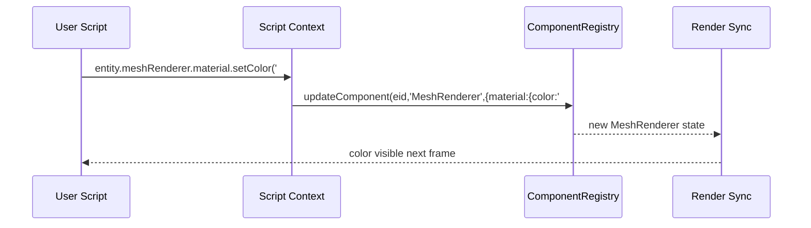

# Script API Direct Component Access (KISS) PRD

## Overview

- **Context & Goals**:

  - Keep the Script API simple: expose direct optional component accessors like `entity.meshRenderer`, `entity.transform` (already exists), etc.
  - Ensure these direct accessors WORK reliably for manipulating ECS-backed state from scripts.
  - Maintain performance with minimal object churn by applying small ECS patches; no proxy trees or extra buffers.
  - Preserve existing APIs (`transform`, `three`, `getComponent/setComponent`).

- **Current Pain Points**:
  - Direct component manipulation via Script API (e.g., `entity.meshRenderer`) is missing/broken.
  - Inconsistent ergonomics between `transform` helpers and other components (e.g., `MeshRenderer`).
  - Risk of unnecessary allocations from large object merges when setting component data.
  - Drift between ECS updates and direct Three.js changes.

## Proposed Solution

- **High‑level Summary**:

  - Add direct optional fields to `IEntityScriptAPI`: `meshRenderer?`, and optionally `rigidBody?`, `camera?`, `meshCollider?` next.
  - Each accessor provides `get()`, `set(patch)`, and minimal helpers (e.g., `material.setColor`, `enable`).
  - No proxies or mutation buffers; operations call `componentRegistry.updateComponent` with small patches.
  - Preserve `transform` helpers and `three.*`; keep `getComponent/setComponent` for advanced use.

- **Architecture & Directory Structure**:

```text
src/
├── core/
│   ├── lib/
│   │   └── scripting/
│   │       ├── apis/
│   │       │   └── DirectComponentsAPI.ts   # (optional) helpers per component
│   │       └── ScriptAPI.ts                  # add direct fields to IEntityScriptAPI
│   └── systems/
│       └── ScriptSystem.ts                   # no changes needed
└── docs/
    └── PRDs/
        └── 4-23-ecs-components-chain-api-prd.md
```

## Implementation Plan

1. **Phase 1: Foundations (0.25 day)**

   1. Add optional direct fields to `IEntityScriptAPI`: `meshRenderer?` (optionally others later).
   2. Create simple per-component helpers that apply minimal patches.

2. **Phase 2: MeshRenderer Accessor (0.5 day)**

   1. Implement `get()`, `set(patch)`, `enable(boolean)`.
   2. Implement `material.setColor/metalness/roughness/emissive/texture`, clamping 0..1 where needed.

3. **Phase 3: Context Wiring (0.25 day)**

   1. In `createEntityAPI`, set `entity.meshRenderer` only if component exists.
   2. Keep `transform` and `three` as-is; no scheduler/order changes.

4. **Phase 4: Tests & Docs (0.5 day)**
   1. Unit tests for MeshRenderer direct calls (minimal patches, clamping).
   2. Integration tests from scripts verifying ECS/renderer reflect updates.
   3. Update `script-api.d.ts` generation if present to include new fields.

## File and Directory Structures

```text
/src/core/lib/scripting/apis/
└── DirectComponentsAPI.ts (optional)
```

## Technical Details

```ts
// src/core/lib/ecs/components/accessors/types.ts
export interface IComponentAccessor<TData> {
  get(): TData | null;
  set(patch: Partial<TData>): void; // batched via mutation buffer
}

export interface IMeshRendererAccessor extends IComponentAccessor<MeshRendererData> {
  enable(value: boolean): void;
  material: {
    setColor(hex: string | number): void;
    setMetalness(value: number): void;
    setRoughness(value: number): void;
    setEmissive(hex: string | number, intensity?: number): void;
    setTexture(
      kind: 'albedo' | 'normal' | 'metallic' | 'roughness' | 'emissive' | 'occlusion',
      idOrPath: string,
    ): void;
  };
}
```

```ts
// src/core/lib/ecs/mutations/ComponentMutationBuffer.ts
export type ComponentFieldKey = `${number}:${string}:${string}`; // entityId:componentId:field

export class ComponentMutationBuffer {
  private pending = new Map<ComponentFieldKey, unknown>();

  queue(entityId: number, componentId: string, field: string, value: unknown): void {
    this.pending.set(`${entityId}:${componentId}:${field}`, value);
  }

  flush(
    apply: (entityId: number, componentId: string, field: string, value: unknown) => void,
  ): void {
    for (const [k, v] of this.pending) {
      const [eid, cid, field] = k.split(':');
      apply(Number(eid), cid, field, v);
    }
    this.pending.clear();
  }
}
```

```ts
// src/core/lib/ecs/components/accessors/ComponentAccessors.ts
import { componentRegistry } from '@/core/lib/ecs/ComponentRegistry';
import { ComponentMutationBuffer } from '@/core/lib/ecs/mutations/ComponentMutationBuffer';

const entityCache = new WeakMap<object, Map<string, unknown>>(); // context-bound cache

export function createComponentsProxy(entityId: number, buffer: ComponentMutationBuffer) {
  const cache = new Map<string, unknown>();
  entityCache.set(cache, cache);

  return new Proxy(
    {},
    {
      get(_, compId: string) {
        if (typeof compId !== 'string') return undefined;
        if (cache.has(compId)) return cache.get(compId);

        const descriptor = componentRegistry.get<any>(compId);
        if (!descriptor) return undefined;

        // Base accessor with get/set; specialized accessors may augment
        const baseAccessor = {
          get(): any | null {
            return componentRegistry.getComponentData(entityId, compId) ?? null;
          },
          set(patch: any): void {
            // Decompose patch into field-level updates for coalescing
            for (const [field, value] of Object.entries(patch)) {
              buffer.queue(entityId, compId, field, value);
            }
          },
        } as any;

        // Allow specialization (e.g., MeshRenderer)
        const specialized = attachSpecializedAccessors(entityId, compId, baseAccessor, buffer);
        cache.set(compId, specialized);
        return specialized;
      },
    },
  );
}

function attachSpecializedAccessors(
  entityId: number,
  compId: string,
  base: any,
  buffer: ComponentMutationBuffer,
) {
  if (compId === 'MeshRenderer') {
    base.enable = (value: boolean) => base.set({ enabled: !!value });
    base.material = {
      setColor: (hex: string | number) => base.set({ material: { color: hex } }),
      setMetalness: (v: number) =>
        base.set({ material: { metalness: Math.max(0, Math.min(1, v)) } }),
      setRoughness: (v: number) =>
        base.set({ material: { roughness: Math.max(0, Math.min(1, v)) } }),
      setEmissive: (hex: string | number, intensity?: number) =>
        base.set({ material: { emissive: hex, emissiveIntensity: intensity ?? 1 } }),
      setTexture: (kind: string, id: string) => base.set({ material: { [`${kind}Texture`]: id } }),
    };
  }
  return base;
}
```

```ts
// src/core/lib/systems/ComponentWriteSystem.ts
import { componentRegistry } from '@/core/lib/ecs/ComponentRegistry';

export function createComponentWriteSystem(buffer: ComponentMutationBuffer) {
  return function componentWriteSystem() {
    buffer.flush((entityId, componentId, field, value) => {
      // Apply as minimal merge to avoid object churn
      const current = componentRegistry.getComponentData<any>(entityId, componentId) || {};
      const patch = {
        ...current,
        [field]:
          typeof value === 'object' && value !== null
            ? { ...(current as any)[field], ...(value as any) }
            : value,
      };
      componentRegistry.updateComponent(entityId, componentId, patch);
    });
  };
}
```

```ts
// src/core/lib/scripting/apis/ComponentsAPI.ts
import { ComponentMutationBuffer } from '@/core/lib/ecs/mutations/ComponentMutationBuffer';
import { createComponentsProxy } from '@/core/lib/ecs/components/accessors/ComponentAccessors';

export function createComponentsAPI(entityId: number, sharedBuffer: ComponentMutationBuffer) {
  return createComponentsProxy(entityId, sharedBuffer);
}
```

## Usage Examples

```ts
// 1) Change color on start
function onStart(): void {
  entity.meshRenderer?.material.setColor('#ff00ff');
}
```

```ts
// 2) Toggle visibility and tweak PBR
function onUpdate(dt: number): void {
  entity.meshRenderer?.enable(true);
  entity.meshRenderer?.material.setMetalness(0.7);
  entity.meshRenderer?.material.setRoughness(0.25);
}
```

```ts
// 3) Generic set for future components (schema-driven)
function onStart(): void {
  entity.camera?.set({ fov: 70, near: 0.1, far: 500 } as any);
}
```

## Testing Strategy

- **Unit Tests**:

  - MeshRenderer direct calls apply minimal patches; clamping works.
  - Absent components leave fields undefined (safe optional chaining in scripts).

- **Integration Tests**:
  - Script lifecycle uses `entity.meshRenderer.material.setColor` and ECS/renderer reflect updates.
  - Backward compatibility: `getComponent/setComponent` still work alongside direct accessors.

## Edge Cases

| Edge Case                       | Remediation                                                                                              |
| ------------------------------- | -------------------------------------------------------------------------------------------------------- |
| Component missing on entity     | `get()` returns null; `set()` becomes no-op with a debug message. Optional auto-add behind feature flag. |
| Invalid method/value range      | Clamp numeric ranges (e.g., 0..1 for PBR). Validate via Zod before enqueue.                              |
| Excessive chained calls         | Coalesce in buffer, constant-time map writes; single flush per frame.                                    |
| Three.js object missing         | ECS state updated; renderer sync no-ops if mesh not present; log at debug level.                         |
| Concurrent updates from systems | Last-write-wins semantics; ordering is deterministic: systems -> chain buffer -> flush -> renderer.      |
| Deep nested patches             | Shallow field-level enqueue; accessor specializations decompose patches to avoid deep merges.            |

## Sequence Diagram



## Risks & Mitigations

| Risk                           | Mitigation                                                                          |
| ------------------------------ | ----------------------------------------------------------------------------------- |
| Proxy overhead on hot paths    | Cache proxies per entity+component; micro-bench and inline critical paths.          |
| Object allocation from merges  | Field-level enqueue; shallow merges only at flush; reuse buffers.                   |
| API surface growth             | Start with MeshRenderer and base `set()`; expand via descriptors; document clearly. |
| Divergence from Three.js state | Keep renderer sync as consumer of ECS; avoid direct Three writes from chain API.    |
| Back-compat breakage           | Preserve `getComponent/setComponent` and `three.*`; mark chain API additive.        |

## Timeline

- Total: ~1.5 days
  - Phase 1: 0.25 day
  - Phase 2: 0.5 day
  - Phase 3: 0.25 day
  - Phase 4: 0.5 day

## Acceptance Criteria

- `IEntityScriptAPI` exposes direct optional fields (`meshRenderer`, optionally others later).
- Direct accessor calls update ECS state and are visible in render after next frame.
- No regressions: existing scripts using `transform` and `three.material.*` keep working.
- Unit and integration tests pass; `script-api.d.ts` includes new fields; docs updated.

## Conclusion

This plan keeps the API simple and familiar while making direct component access actually work. It updates ECS via minimal patches, preserves existing patterns, and avoids additional abstraction layers—improving ergonomics with zero proxy overhead.

## Assumptions & Dependencies

- Uses existing `ComponentRegistry`, Zod schemas, and typed-array BitECS storage.
- Render synchronization consumes ECS state (no direct Three writes from chain API).
- Script context wiring in `ScriptExecutor` is the integration point; `script-api.d.ts` generation remains in place.
- Path aliases (`@/`) and named exports only; prefer Zod for new schemas.
