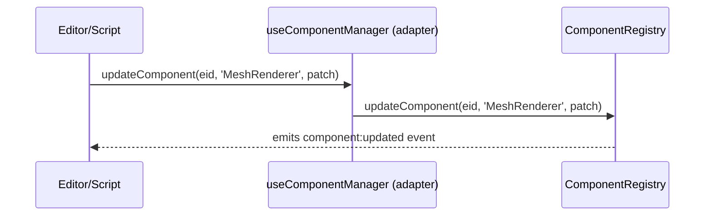

🧠 Planning documents standards rule loaded!

# ComponentManager Deprecation & Migration to ComponentRegistry (Single Source of Truth) PRD

## Overview

- **Context & Goals**

  - Consolidate on `ComponentRegistry` as the single source of truth (SoT) for ECS components.
  - Remove drift, duplicated logic, and conflicting APIs between `ComponentManager` (legacy) and `ComponentRegistry` (current).
  - Preserve editor, serialization, and streaming flows via thin adapters that already return the registry instance.
  - Keep Zod validation, compatibility checks, and event emission centralized in the registry.

- **Current Pain Points**
  - Two pathways to manage components (`ComponentManager` vs `ComponentRegistry`) cause confusion and bugs.
  - Legacy exports and stores (`ComponentManagerStore`, public `ComponentManager` export) encourage new code to depend on dead-end APIs.
  - Docs still reference `ComponentManager`, encouraging outdated usage patterns.
  - Tests and adapters mock a “componentManager” shape, obscuring the actual source-of-truth API.

## Proposed Solution

- **High‑level Summary**

  - Deprecate `ComponentManager` class and its store; replace with `ComponentRegistry` throughout.
  - Keep existing adapter interfaces (`IComponentManagerAdapter`) but implement them as thin shims over `ComponentRegistry` to avoid churn.
  - Remove `ComponentManager` from the public exports; introduce a deprecation façade for one release cycle (optional).
  - Update editor hooks, serialization, streaming, and docs to refer to the registry explicitly.
  - Enforce Zod schemas and compatibility checks through the registry only.

- **Architecture & Directory Structure**

```text
src/
├── core/
│   ├── index.ts                      # Stop exporting ComponentManager
│   ├── context/
│   │   └── ComponentManagerStore.ts  # Remove (or replace with RegistryStore if needed)
│   └── lib/
│       └── ecs/
│           ├── ComponentRegistry.ts  # SoT for all component operations
│           └── ComponentManager.ts   # Legacy: deprecate; proxy to registry or delete after one cycle
│
├── editor/
│   └── hooks/
│       └── useComponentManager.ts    # Keep as adapter returning componentRegistry (already done)
│
└── docs/
    ├── architecture/
    │   ├── 2-4-ecs-system.md         # Update: mention ComponentRegistry only
    │   └── 2-19-dynamic-component-system.md  # Verify alignment
    └── PRDs/
        └── 4-24-component-manager-deprecation-to-component-registry-prd.md (this file)
```

## Implementation Plan

1. **Phase 1: Inventory & Adapters (0.25 day)**

   1. Confirm remaining usages of `ComponentManager` and “componentManager” adapters.
   2. Keep `useComponentManager` returning `componentRegistry` (already implemented).

2. **Phase 2: Deprecation & API Surface (0.5 day)**

   1. Remove `ComponentManager` from `src/core/index.ts` public exports.
   2. Optional: Replace `src/core/lib/ecs/ComponentManager.ts` with a deprecation façade that proxy-calls `componentRegistry` and logs a warning; mark for removal next release.
   3. Remove `src/core/context/ComponentManagerStore.ts`; replace usages with registry-centric flow or delete if unused.

3. **Phase 3: Call-site Refactors (0.5 day)**

   1. Update docs and in-code comments to reference `ComponentRegistry` as SoT.
   2. Ensure editor hooks, serialization (`EntitySerializer`, `SceneLoader`, `SceneDeserializer`, `SceneSerializer`), and streaming serializer use the registry via adapters.
   3. Replace any direct imports/instantiations of `ComponentManager` if present (none expected in runtime paths).

4. **Phase 4: Tests & Cleanup (0.5 day)**
   1. Update tests/mocks to reflect adapter returning the registry instance; keep the “componentManager” name in mock boundaries for minimal churn.
   2. Remove stale architecture references to `ComponentManager`.
   3. CI green; ship deprecation notes in changelog.

## File and Directory Structures

```text
/src/core/lib/ecs/
├── ComponentRegistry.ts  # definitive API: add/update/remove/get, events, schemas
└── ComponentManager.ts   # (deprecated) proxy or delete in next cycle

/src/editor/hooks/
└── useComponentManager.ts # returns componentRegistry; call sites unchanged

/src/core/index.ts
└── (remove) export { ComponentManager } from './lib/ecs/ComponentManager';

/src/core/context/
└── ComponentManagerStore.ts # remove or replace with registry-centric store only if needed
```

## Technical Details

```ts
// src/editor/hooks/useComponentManager.ts (kept)
import { componentRegistry } from '@/core/lib/ecs/ComponentRegistry';

export const useComponentManager = () => {
  return componentRegistry;
};
```

```ts
// src/core/lib/ecs/ComponentManager.ts (optional transitional façade)
// Deprecated: use ComponentRegistry.
import { componentRegistry } from './ComponentRegistry';

export class ComponentManager {
  // Methods proxy to componentRegistry; log deprecation once per session.
  static #warned = false;
  static #warn() {
    if (!this.#warned) {
      console.warn('[DEPRECATED] Use ComponentRegistry instead of ComponentManager.');
      this.#warned = true;
    }
  }

  constructor() {
    ComponentManager.#warn();
  }

  addComponent(eid: number, type: string, data: unknown) {
    return componentRegistry.addComponent(eid, type, data);
  }
  updateComponent(eid: number, type: string, data: Record<string, unknown>) {
    return componentRegistry.updateComponent(eid, type, data);
  }
  removeComponent(eid: number, type: string) {
    return componentRegistry.removeComponent(eid, type);
  }
  getComponentData<T>(eid: number, type: string): T | undefined {
    return componentRegistry.getComponentData<T>(eid, type);
  }
  getComponentsForEntity(eid: number) {
    return componentRegistry.getComponentsForEntity(eid);
  }
}
```

```ts
// src/core/index.ts (remove legacy export)
// export { ComponentManager } from './lib/ecs/ComponentManager'; // delete
export { ComponentRegistry, componentRegistry } from './lib/ecs/ComponentRegistry';
```

```md
// docs/architecture/2-4-ecs-system.md (update excerpt)

- Usage: Components are added/removed/queried through the `ComponentRegistry` singleton.
- Adapters in editor/serialization return the registry for legacy “componentManager” hook names.
```

## Usage Examples

```ts
// Before (conceptual)
const cm = useComponentManager();
cm.updateComponent(eid, 'MeshRenderer', { enabled: true });

// After (same call-sites, now definitively registry-backed)
const cm = useComponentManager();
cm.updateComponent(eid, 'MeshRenderer', { enabled: true });

// Direct (preferred for new code)
import { componentRegistry } from '@/core/lib/ecs/ComponentRegistry';
componentRegistry.addComponent(eid, 'RigidBody', { enabled: true, bodyType: 'dynamic' });
```

## Testing Strategy

- **Unit Tests**
  - Registry: add/update/remove/get flows; Zod validation and incompatibility checks.
  - Adapters: `useComponentManager` returns registry; mocks still work with the same shape.
- **Integration Tests**
  - Serialization (Entity/Scene/Streaming): round-trip scenes using registry-backed adapters.
  - Editor flows (play mode backup/restore): use registry for snapshot/restore without regressions.

## Edge Cases

| Edge Case                                        | Remediation                                                                       |
| ------------------------------------------------ | --------------------------------------------------------------------------------- |
| Legacy imports of `ComponentManager` in app code | Keep transitional façade logging deprecation for one release; document migration. |
| Tests mocking `ComponentManager`                 | Keep hook adapter shape; update imports to mock adapter or registry.              |
| Scenes with unknown components                   | Registry validation errors surface clearly; skip unknowns with warnings.          |
| Incompatible component combos                    | Use `ComponentRegistry.areComponentsIncompatible` checks before add.              |

## Sequence Diagram



## Risks & Mitigations

| Risk                                                | Mitigation                                                     |
| --------------------------------------------------- | -------------------------------------------------------------- |
| Hidden runtime direct imports of `ComponentManager` | Grep/CI check; façade logs; remove export from public API.     |
| Adapter mismatch with registry API                  | Keep adapter returning same registry instance; add type tests. |
| Doc drift                                           | Update architecture docs; add changelog entry; link PRD.       |

## Timeline

- Total: ~1.75 days
  - Phase 1: 0.25 day
  - Phase 2: 0.5 day
  - Phase 3: 0.5 day
  - Phase 4: 0.5 day

## Acceptance Criteria

- `ComponentRegistry` is the only public/official component management API.
- `ComponentManager` export removed from `src/core/index.ts`; façade (if kept) logs deprecation.
- Editor hooks, serialization, streaming continue to function via registry-backed adapter.
- Docs updated to reference `ComponentRegistry` only; legacy mentions clarified.
- Tests pass; no regressions in play mode backup/restore and scene IO.

## Conclusion

Migrating fully to `ComponentRegistry` simplifies the ECS stack, eliminates duplication, and centralizes validation and compatibility logic. A thin adapter layer preserves call-sites while we remove legacy exports, ensuring a low-risk migration.

## Assumptions & Dependencies

- Path aliases (`@/`, `@core/`) remain stable; named exports only.
- Zod schemas remain the validation mechanism for component data.
- No external packages depend on the `ComponentManager` export (or are updated in lockstep).
