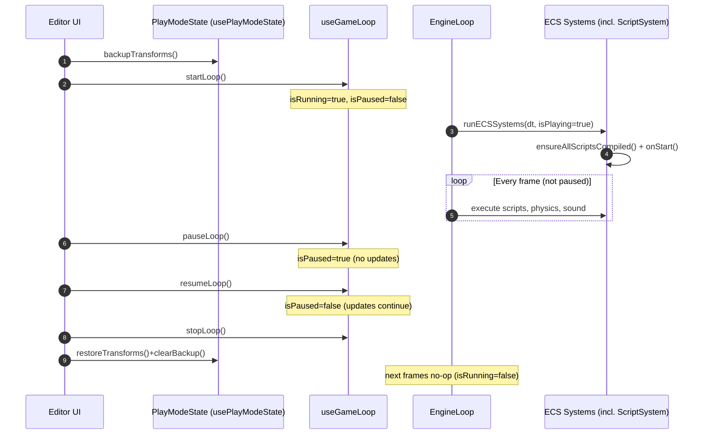

# Play Modes (Start/Pause/Stop) PRD — ECS & Script API Integration

🧠 Planning documents standards rule loaded!

## 1. Overview

- **Context & Goals**:
  - Introduce consistent play mode semantics: start, pause, stop.
  - Ensure scripts execute on start and update during play; halt during pause.
  - On stop, rollback the scene to the pre-play original state (entities and components).
  - Align editor controls and engine loop with ECS and Script API lifecycle.
- **Current Pain Points**:
  - Pause semantics are not fully specified across time, physics, and scripts.
  - Stop requires deterministic rollback for editor predictability.
  - Script lifecycle on play/stop edges is partially implicit.
  - No shared contract for systems beyond scripts (audio, physics) to honor play states.

## 2. Proposed Solution

- **High‑level Summary**:
  - Define a Play Mode State Machine with explicit transitions: Idle → Playing → Paused → Playing → Stopped → Idle.
  - Centralize play state in `useGameLoop` and propagate `isPlaying`/`isPaused` to all systems.
  - On Play: snapshot full ECS state, compile scripts, run `onStart` once, start updates.
  - On Pause: freeze time-based updates (delta=0 for systems), retain visuals; allow editor interactions.
  - On Stop: restore snapshot (entities/components), clear transient runtime, reset script lifecycle.
- **Architecture & Directory Structure**:
  ```
  /src/core/
  ├── components/
  │   └── EngineLoop.tsx              # Calls runECSSystems(delta, isPlaying)
  ├── lib/
  │   ├── gameLoop.ts                 # Zustand loop store: isRunning, isPaused
  │   ├── scene/overrides/            # Existing overrides infra
  │   └── serialization/              # SceneSerializer & SceneDiff utilities
  ├── systems/
  │   ├── ScriptSystem.ts             # ensureAllScriptsCompiled, lifecycle, update
  │   ├── soundSystem.ts              # consumes isPlaying for autoplay/resume
  │   └── ...
  /src/editor/
  ├── hooks/
  │   └── usePlayModeState.ts         # Snapshot/rollback of entities/components
  └── components/layout/TopBarPlaybackControls.tsx
  ```

## 3. Implementation Plan

- Phase 1: Define Play State Semantics (0.5 day)
  1. Document Play, Pause, Stop contracts for systems and scripts.
  2. Ensure `EngineLoop` passes `isPlaying` and respects `isPaused` for all systems.
  3. Validate `useGameLoop` transitions are correct and idempotent.
- Phase 2: Snapshot & Rollback Integration (1 day)
  1. Confirm `usePlayModeState` backs up all components and entities.
  2. On Play, trigger `backupTransforms()`; on Stop, `restoreTransforms()` + `clearBackup()`.
  3. Ensure removal of entities created during play; remove components added during play.
- Phase 3: Script Lifecycle Edges (0.75 day)
  1. On entering play: `ensureAllScriptsCompiled()` and clear `startedEntities`.
  2. Guarantee `onStart` runs once per entity per play session; `onUpdate` runs only while playing and not paused.
  3. On stop: execute `onDestroy` for scripts that require teardown when components are removed.
- Phase 4: Pause Semantics & Time Control (0.5 day)
  1. Freeze delta application (no updates while paused) without destroying runtime state.
  2. Optionally introduce timescale = 0 while paused to unify time behavior.
  3. Ensure audio and timers respect pause (no progression).
- Phase 5: Editor UX Wiring (0.5 day)
  1. Hook TopBar Play/Pause/Stop to `useGameEngineControls` and `usePlayModeState`.
  2. Provide status toasts: started (snapshot), paused, stopped (restored).
  3. Disable/enable relevant toolbar buttons based on state.

## 4. File and Directory Structures

```
/docs/PRDs/
└── 4-25-play-modes-ecs-script-api-prd.md
/src/core/components/EngineLoop.tsx
/src/core/lib/gameLoop.ts
/src/core/systems/ScriptSystem.ts
/src/editor/hooks/usePlayModeState.ts
/src/editor/components/layout/TopBarPlaybackControls.tsx
```

## 5. Technical Details

- Play Mode State Machine (conceptual)
  ```ts
  export type PlayState = 'idle' | 'playing' | 'paused';
  // Derived from useGameLoop: isRunning => playing|paused, !isRunning => idle
  ```
- Engine Loop contract
  ```ts
  // EngineLoop.tsx
  runECSSystems(deltaTime, isPlaying);
  // Skip updates when paused via useGameLoop guards
  ```
- Script system edges
  ```ts
  // On play edge
  startedEntities.clear();
  ensureAllScriptsCompiled();
  // Per frame while playing and not paused
  executeScripts(deltaTime);
  // On stop edge (indirect via rollback & component removal)
  // exitQuery triggers onDestroy for removed script components
  ```
- Snapshot/rollback
  ```ts
  // usePlayModeState.ts
  backupTransforms(); // On Play
  restoreTransforms(); // On Stop
  clearBackup();
  ```

## 6. Usage Examples

- Start (Play)
  ```ts
  backupTransforms();
  startEngine(); // useGameLoop.startLoop()
  ```
- Pause
  ```ts
  pauseEngine(); // useGameLoop.pauseLoop() – systems observe isPaused
  ```
- Stop
  ```ts
  stopEngine();
  restoreTransforms();
  clearBackup();
  ```

## 7. Testing Strategy

- Unit Tests
  - Ensure `useGameLoop` transitions: start→pause→resume→stop are idempotent.
  - Script lifecycle: `onStart` triggers once per play; `onUpdate` not called while paused.
  - `usePlayModeState`: backups include all components; restore removes entities/components created during play.
- Integration Tests
  - Play → Pause → Resume: transforms unchanged while paused; resume continues updates.
  - Play → Stop: scene equals pre-play snapshot (deep compare selected entities/components).
  - Audio and timers do not progress while paused; restart cleanly on resume.

## 8. Edge Cases

| Edge Case                     | Remediation                                                |
| ----------------------------- | ---------------------------------------------------------- |
| Entity created during play    | Detect on stop and delete (not in backup).                 |
| Component added during play   | Remove during restore if not in backup.                    |
| Component removed during play | Restore from backup on stop.                               |
| Script with compile error     | Skip execution; surface error; still restore on stop.      |
| Long pause then resume        | No time jump: paused prevents `update` path.               |
| Multiple Play without Stop    | Idempotent: snapshot only when transitioning idle→playing. |

## 9. Sequence Diagram



## 10. Risks & Mitigations

| Risk                                   | Mitigation                                                                      |
| -------------------------------------- | ------------------------------------------------------------------------------- |
| Partial snapshot misses component data | Use registry-driven full-component backup; add tests.                           |
| Scripts retain stale runtime           | Clear started set on play; onDestroy via exitQuery; reset executors as needed.  |
| Audio keeps playing on pause           | Ensure sound system observes isPaused; gate playback timers.                    |
| Performance during backup/restore      | Perform structuredClone per component; consider chunking for very large scenes. |

## 11. Timeline

- Total: ~3.25 days
  - Phase 1: 0.5d
  - Phase 2: 1.0d
  - Phase 3: 0.75d
  - Phase 4: 0.5d
  - Phase 5: 0.5d

## 12. Acceptance Criteria

- Start triggers snapshot, scripts `onStart`, and per-frame `onUpdate` while playing.
- Pause freezes updates across ECS, scripts, audio, and timers; visuals remain interactive in editor.
- Stop restores pre-play entities/components, removes play-created entities/components, and resets script lifecycle state.
- Top bar controls reflect correct enabled/disabled states and provide status messages.
- No residual runtime mutations remain after Stop (idempotent rollback).

## 13. Conclusion

This PRD formalizes play/pause/stop semantics tightly integrated with the ECS and Script API. It ensures deterministic editor behavior, reliable script lifecycle management, and predictable rollback, improving iteration speed and user trust.

## 14. Assumptions & Dependencies

- Scripts are executed by `DirectScriptExecutor`; lifecycle hooks are supported.
- `usePlayModeState` reliably serializes component data via registry; structuredClone is available.
- All systems (physics, sound) read `isRunning`/`isPaused` and `isPlaying` from loop/props.
- Existing serialization/override subsystems are available for future persistence, but not required for rollback.
