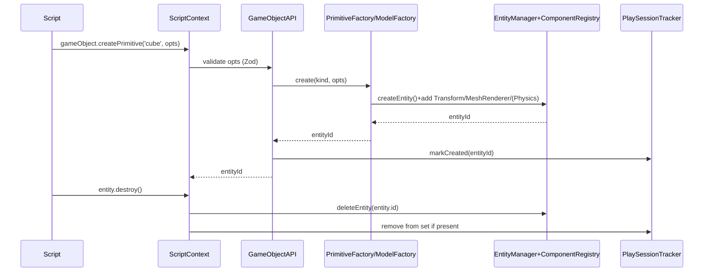

🧠 Planning documents standards rule loaded!

# PRD: GameObject Script API — Runtime CRUD for Entities and Models

## 1. Overview

- **Context & Goals**:

  - Enable gameplay scripts to create, read, update, and delete entities at runtime with safe, deterministic APIs.
  - Provide ergonomic helpers to spawn primitives (cube, sphere, plane, etc.) and custom models (GLB/GLTF) with transform and material options.
  - Integrate with Play Mode semantics so play-created entities are cleaned up on Stop and do not mutate the editor scene.
  - Maintain sandbox integrity and performance via mutation buffers and Zod-validated options.

- **Current Pain Points**:
  - `IEntityScriptAPI.destroy()` is stubbed; scripts cannot reliably delete or clone entities.
  - No first-class script API to create primitives or load arbitrary models on the fly.
  - No unified tracking of play-created entities for deterministic Stop rollback.
  - Options for creation (transform, renderer, physics) are not typed/validated in the Script API.

## 2. Proposed Solution

- **High‑level Summary**:

  - Introduce `IGameObjectAPI` in the Script API context for runtime CRUD: `createEntity`, `createPrimitive`, `createModel`, `clone`, `destroy`, `setActive`, `setParent`, and `attachComponents`.
  - Implement `PrimitiveFactory` and `ModelFactory` that map high-level options to ECS components via `ComponentRegistry` and `EntityManager` with mutation-buffer semantics.
  - Implement `PlaySessionTracker` to register entity IDs created during play; ensure automatic cleanup on Stop.
  - Wire `entity.destroy()` to the same deletion path and implement null‑safe `entities.get(...)` wrappers.
  - Validate creation/update options using Zod; fail fast with descriptive errors in the sandboxed console.

- **Architecture & Directory Structure**:

```
src/core/lib/scripting/
├── ScriptAPI.ts                   # add IGameObjectAPI to IScriptContext; implement destroy()
├── ScriptExecutor.ts              # attach gameObject to script context
├── apis/
│   ├── GameObjectAPI.ts          # create/destroy/clone/setParent/setActive/attachComponents
│   ├── EntitiesAPI.ts            # (existing/extended) safe wrappers and refs resolution
│   └── PrefabAPI.ts              # (existing) remains for prefab-based spawns
├── factories/
│   ├── PrimitiveFactory.ts       # primitives → ECS components
│   ├── ModelFactory.ts           # model spawn (GLB/GLTF) → ECS components
│   └── crud.types.ts             # Zod schemas for options
└── adapters/
    └── PlaySessionTracker.ts     # track play-created entities for Stop cleanup

src/core/lib/ecs/
└── EntityManager.ts               # used for create/delete; no behavioral changes

docs/PRDs/4-28-gameobject-script-api-crud-prd.md
```

## 3. Implementation Plan

- **Phase 1: API Surface (0.5 day)**

  1. Define `IGameObjectAPI` in `ScriptAPI.ts` and extend `IScriptContext` with `gameObject`.
  2. Implement `entity.destroy()` and `entities.exists(...)` using `EntityManager` and `ComponentRegistry` checks.
  3. Add Zod schemas in `crud.types.ts` for creation options (transform, renderer, physics, model path).

- **Phase 2: Factories (0.75 day)**

  1. `PrimitiveFactory.create(kind, options)` → adds `Transform`, `MeshRenderer` with primitive geometry; optional `RigidBody`/`MeshCollider`.
  2. `ModelFactory.create(path|assetId, options)` → adds `Transform`, `MeshRenderer` variant referencing model; optional physics.
  3. Both return `entityId` and register with `PlaySessionTracker` during play.

- **Phase 3: GameObject API (0.5 day)**

  1. `createEntity`, `createPrimitive`, `createModel`, `clone`, `attachComponents`, `setParent`, `setActive`, `destroy` with Zod validation.
  2. Ensure mutation buffer batching and log safe errors to sandbox console.

- **Phase 4: Context Wiring & d.ts (0.5 day)**

  1. Attach `gameObject` in `ScriptExecutor` context construction.
  2. Ensure `script-api.d.ts` generation includes `IGameObjectAPI` and new options.

- **Phase 5: Examples & Docs (0.25 day)**

  1. Add `game/scripts/examples/gameobject-crud-demo.ts` demonstrating primitives, model spawn, and cleanup.
  2. Update `docs/guides/script-api-quick-reference.md` with CRUD examples.

- **Phase 6: Tests (0.5 day)**
  1. Unit tests for Zod validation, factories, and tracker cleanup.
  2. Integration tests for play-created entity lifecycle and Stop rollback.

## 4. File and Directory Structures

```
/src/core/lib/scripting/
├── ScriptAPI.ts
├── ScriptExecutor.ts
├── apis/
│   ├── GameObjectAPI.ts
│   ├── EntitiesAPI.ts
│   └── PrefabAPI.ts
├── factories/
│   ├── PrimitiveFactory.ts
│   ├── ModelFactory.ts
│   └── crud.types.ts
└── adapters/
    └── PlaySessionTracker.ts

/src/game/scripts/
└── examples/
    └── gameobject-crud-demo.ts
```

## 5. Technical Details

### Interfaces and API Surface

```ts
// src/core/lib/scripting/ScriptAPI.ts (additions)
export interface IGameObjectAPI {
  createEntity: (name?: string, parent?: number) => number;
  createPrimitive: (
    kind: 'cube' | 'sphere' | 'plane' | 'cylinder' | 'cone' | 'torus',
    options?: IPrimitiveOptions,
  ) => number;
  createModel: (model: string, options?: IModelOptions) => number; // path or asset id
  clone: (source: number, overrides?: Partial<ICloneOverrides>) => number;
  attachComponents: (entityId: number, components: Array<{ type: string; data: unknown }>) => void;
  setParent: (entityId: number, parent?: number) => void;
  setActive: (entityId: number, active: boolean) => void;
  destroy: (target?: number) => void; // default: current entity
}

export interface IPrimitiveOptions {
  name?: string;
  parent?: number;
  transform?: {
    position?: [number, number, number];
    rotation?: [number, number, number];
    scale?: [number, number, number] | number;
  };
  material?: { color?: string; metalness?: number; roughness?: number };
  physics?: {
    body?: 'dynamic' | 'kinematic' | 'static';
    collider?: 'box' | 'sphere' | 'mesh';
    mass?: number;
  };
}

export interface IModelOptions extends Omit<IPrimitiveOptions, 'physics'> {
  // physics optional; if provided and mesh collider requested, fallback to convex when mesh unavailable
  physics?: { body?: 'dynamic' | 'kinematic' | 'static'; collider?: 'mesh' | 'box'; mass?: number };
}

export interface ICloneOverrides {
  name?: string;
  parent?: number;
  transform?: IPrimitiveOptions['transform'];
}
```

### Zod Schemas

```ts
// src/core/lib/scripting/factories/crud.types.ts
import { z } from 'zod';

export const TransformSchema = z.object({
  position: z.tuple([z.number(), z.number(), z.number()]).optional(),
  rotation: z.tuple([z.number(), z.number(), z.number()]).optional(),
  scale: z.union([z.number(), z.tuple([z.number(), z.number(), z.number()])]).optional(),
});

export const PrimitiveOptionsSchema = z.object({
  name: z.string().optional(),
  parent: z.number().int().nonnegative().optional(),
  transform: TransformSchema.optional(),
  material: z
    .object({
      color: z.string().optional(),
      metalness: z.number().min(0).max(1).optional(),
      roughness: z.number().min(0).max(1).optional(),
    })
    .optional(),
  physics: z
    .object({
      body: z.enum(['dynamic', 'kinematic', 'static']).optional(),
      collider: z.enum(['box', 'sphere', 'mesh']).optional(),
      mass: z.number().positive().optional(),
    })
    .optional(),
});

export const ModelOptionsSchema = PrimitiveOptionsSchema.extend({
  physics: z
    .object({
      body: z.enum(['dynamic', 'kinematic', 'static']).optional(),
      collider: z.enum(['mesh', 'box']).optional(),
      mass: z.number().positive().optional(),
    })
    .optional(),
});
```

### Factories

```ts
// src/core/lib/scripting/factories/PrimitiveFactory.ts (skeleton)
export interface IPrimitiveFactory {
  create(
    kind: 'cube' | 'sphere' | 'plane' | 'cylinder' | 'cone' | 'torus',
    options?: IPrimitiveOptions,
  ): number;
}

export function createPrimitiveFactory(): IPrimitiveFactory {
  return {
    create(kind, options) {
      // 1) validate with PrimitiveOptionsSchema
      // 2) const eid = EntityManager.getInstance().createEntity(options?.name ?? kind)
      // 3) componentRegistry.addComponent(eid, 'Transform', ...)
      // 4) componentRegistry.addComponent(eid, 'MeshRenderer', { primitive: kind, material: ... })
      // 5) optional physics components based on options.physics
      // 6) return eid
      return 0;
    },
  };
}
```

```ts
// src/core/lib/scripting/factories/ModelFactory.ts (skeleton)
export interface IModelFactory {
  create(modelPathOrAssetId: string, options?: IModelOptions): number;
}

export function createModelFactory(): IModelFactory {
  return {
    create(model, options) {
      // Similar to PrimitiveFactory, but MeshRenderer references model asset/path
      // Ensure default scale/position, apply material overrides if allowed
      return 0;
    },
  };
}
```

### GameObject API implementation

```ts
// src/core/lib/scripting/apis/GameObjectAPI.ts (skeleton)
export function createGameObjectAPI(): IGameObjectAPI {
  const primitives = createPrimitiveFactory();
  const models = createModelFactory();
  return {
    createEntity: (name, parent) => {
      // via EntityManager; attach PersistentId; optional parent link
      return 0;
    },
    createPrimitive: (kind, options) => primitives.create(kind, options),
    createModel: (model, options) => models.create(model, options),
    clone: (source, overrides) => {
      // deep copy supported components; apply overrides
      return 0;
    },
    attachComponents: (entityId, components) => {
      // loop add via ComponentRegistry
    },
    setParent: (entityId, parent) => {
      // update Transform parent linkage if supported
    },
    setActive: (entityId, active) => {
      // toggle Active component or runtime visibility flag
    },
    destroy: (target) => {
      // EntityManager.deleteEntity(target ?? current)
    },
  };
}
```

### Play-created entities tracking

```ts
// src/core/lib/scripting/adapters/PlaySessionTracker.ts (skeleton)
export class PlaySessionTracker {
  private static instance: PlaySessionTracker;
  private createdDuringPlay = new Set<number>();
  static getInstance() {
    return (this.instance ??= new PlaySessionTracker());
  }
  markCreated(eid: number) {
    this.createdDuringPlay.add(eid);
  }
  cleanupOnStop(deleteFn: (eid: number) => void) {
    this.createdDuringPlay.forEach((eid) => deleteFn(eid));
    this.createdDuringPlay.clear();
  }
}
```

## 6. Usage Examples

```ts
// Spawn a cube and pulse its scale
function onStart() {
  const cubeId = gameObject.createPrimitive('cube', {
    name: 'TempCube',
    transform: { position: [0, 1, 0], scale: 1.2 },
    material: { color: '#44ccff', roughness: 0.6 },
    physics: { body: 'dynamic', collider: 'box', mass: 1 },
  });

  const cube = entities.get(cubeId);
  three.animate.scale([1.4, 1.4, 1.4], 300).then(() => three.animate.scale([1, 1, 1], 200));
}
```

```ts
// Spawn a GLB model and set as child of current entity
function onStart() {
  const modelId = gameObject.createModel('/assets/models/robot.glb', {
    parent: entity.id,
    transform: { position: [0, 0, 0], scale: 1 },
  });
}
```

```ts
// Destroy on a key press
function onUpdate(dt: number) {
  if (input.isKeyPressed('x')) {
    entity.destroy();
  }
}
```

## 7. Testing Strategy

- **Unit Tests**:

  - Zod validation rejects invalid transforms, material ranges, and physics options.
  - `PrimitiveFactory` creates required components and respects options.
  - `ModelFactory` assigns model reference and default transforms; errors log on bad path.
  - `GameObjectAPI.destroy` removes all components and entity safely.
  - `PlaySessionTracker` records and cleans up on Stop.

- **Integration Tests**:
  - In Play mode, scripts call `createPrimitive`/`createModel`; entities appear with expected components.
  - On Stop, all play-created entities are removed; pre-existing scene remains identical.
  - Cloning an entity preserves components and applies overrides.
  - Optional physics: dynamic cubes fall; mesh collider toggles affect collision.

## 8. Edge Cases

| Edge Case                                    | Remediation                                                      |
| -------------------------------------------- | ---------------------------------------------------------------- |
| Invalid model path or asset id               | Fail fast with console warning; create placeholder; allow retry. |
| Negative or zero scale                       | Clamp or reject via schema; log warning.                         |
| Parent entity missing or deleted             | Create at root; warn; allow reassignment later.                  |
| Mesh collider requested but mesh unavailable | Fallback to box collider or disable with warning.                |
| Rapid create/destroy loops                   | Batch via mutation buffer; coalesce deletes per frame.           |
| Thousands of entities spawned                | Warn on budgets; suggest instancing; expose perf metrics.        |

## 9. Sequence Diagram



## 10. Risks & Mitigations

| Risk                                          | Mitigation                                                     |
| --------------------------------------------- | -------------------------------------------------------------- |
| Type drift between runtime and d.ts           | Generate d.ts from `ScriptAPI.ts`; add CI check.               |
| Performance regressions due to many creations | Batch via mutation buffer; advise instancing; add guardrails.  |
| Play/Stop ordering issues                     | Use `PlaySessionTracker.cleanupOnStop` hooked into Stop event. |
| Security surface increase in scripts          | Keep whitelist; validate options; sandbox console warnings.    |
| Asset loading failures or latency             | Show loading placeholders; retry; debounce repeated loads.     |

## 11. Timeline

- Total: ~3.0 days
  - Phase 1: 0.5 day
  - Phase 2: 0.75 day
  - Phase 3: 0.5 day
  - Phase 4: 0.5 day
  - Phase 5: 0.25 day
  - Phase 6: 0.5 day

## 12. Acceptance Criteria

- `gameObject` is available in the Script API context with methods documented above.
- `entity.destroy()` removes the current entity without runtime errors.
- Scripts can spawn primitives and GLB models at runtime with validated options.
- Entities created during play are removed on Stop; editor scene remains unchanged.
- Unit and integration tests described above pass in CI.

## 13. Conclusion

This PRD introduces a cohesive, safe, and ergonomic GameObject Script API for runtime entity CRUD. It aligns with Play Mode semantics, validates inputs via Zod, and leverages existing ECS and rendering bindings to let creators prototype rapidly (add cubes and custom models) while preserving determinism and editor integrity.

## 14. Assumptions & Dependencies

- ECS via `EntityManager` and `ComponentRegistry` is the single source of truth for entity/component state.
- Rendering uses R3F/Three; models loaded via `@react-three/drei` `useGLTF` and existing model rendering path.
- Physics via `@react-three/rapier` remains optional per spawn.
- Script system uses the existing executor; `script-api.d.ts` is generated from `ScriptAPI.ts`.
- TS path aliases per `tsconfig`; Zod preferred for runtime validation.
