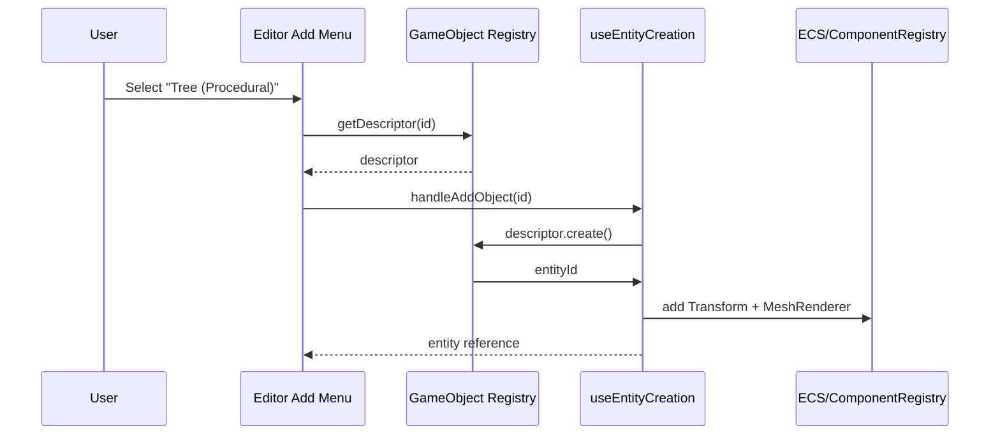

# Custom Game Objects PRD

## Overview

- Context & Goals: Enable users to author custom Three.js-based objects and consume them as first-class items in the editor’s Add menu or Game Object menu. Provide a stable and ergonomic registration and instantiation flow inside `src/game` so game teams can iterate safely.
- Context & Goals: Unify how custom objects are discovered, registered, and instantiated leveraging the existing extension points and Prefab pipeline where appropriate.
- Current Pain Points: No clear way for users to add bespoke Three.js constructs (e.g., previously our trees were custom-generated; now we want a clean path). Custom meshes are partially supported through `custom` MeshRenderer but lack a registry/authoring flow.
- Current Pain Points: Add menu is hardcoded via `GAME_OBJECT_CATEGORIES`, making external additions and organization cumbersome.

## Proposed Solution

- High‑level Summary:

  - Introduce a “Custom Game Object” registry in `src/game` using existing extension primitives: prefer Prefabs for data-defined structures and add a lightweight GameObject descriptor for code-defined Three.js constructors.
  - Add a discovery-and-registration pipeline in `src/game` (e.g., `gameObjects/` with an `index.ts`) called by `registerGameExtensions()` to auto-register objects.
  - Extend editor Add menu population to include registered custom objects under a new “Custom Objects” category.
  - Instantiate via existing editor creation hook `useEntityCreation` by delegating to PrefabManager or a typed GameObject factory for Three.js procedural content.

- Architecture & Directory Structure:

```
src/game/
├── gameObjects/             # New
│   ├── README.md
│   ├── index.ts             # registerAllGameObjects()
│   ├── types.ts             # IGameObjectDescriptor, schema
│   ├── trees/
│   │   ├── proceduralTree.ts
│   │   └── index.ts
│   ├── rocks/
│   │   └── proceduralRock.ts
│   └── ...
└── index.ts                 # calls registerAllGameObjects()

src/editor/
├── config/gameObjectMenuData.tsx  # add dynamic category injection
└── hooks/useEntityCreation.ts      # add generic createCustomGameObject(id)
```

## Implementation Plan

- Phase 1: Registry & Types (0.5 day)

  1. Create `src/game/gameObjects/types.ts` with `IGameObjectDescriptor` and Zod schema: `{ id, label, icon?, category?, create(params?) => entityId }`.
  2. Implement `registerGameObject(desc)` and in-memory registry in `src/core/lib/extension/GameExtensionPoints.ts` or a thin game-level helper mirroring Prefab registration.
  3. Add `getRegisteredGameObjects()` accessor.

- Phase 2: Game Directory & Registration (0.5 day)

  1. Create `src/game/gameObjects/index.ts` to export `registerAllGameObjects()`.
  2. Add example descriptors: `proceduralTree`, `proceduralRock` using Three.js procedural constructions mapped to MeshRenderer types already supported (or direct Model paths for assets).
  3. Call `registerAllGameObjects()` from `src/game/index.ts` inside `registerGameExtensions()`.

- Phase 3: Editor Integration (0.75 day)

  1. Extend `GAME_OBJECT_CATEGORIES` pipeline to merge a runtime-provided “Custom Objects” category sourced from `getRegisteredGameObjects()`.
  2. Add `createCustomGameObject(id)` in `useEntityCreation` that looks up the descriptor and invokes `create()` which will: create entity, add Transform, attach MeshRenderer with proper `meshType` or spawn via PrefabManager when descriptor specifies a prefab.
  3. Update `EnhancedAddObjectMenu` handling to accept dynamically injected items and dispatch to `handleAddObject` with the descriptor id.

- Phase 4: Authoring Docs & Examples (0.25 day)

  1. Add `src/game/gameObjects/README.md` explaining how to add custom objects.
  2. Provide at least two examples (procedural tree and custom rock) and a model-based example.

- Phase 5: Tests & Acceptance (0.25 day)
  1. Unit test registry add/get, duplicates, invalid id validation.
  2. Integration test: register objects, ensure the Add menu includes them, and creation yields entities with MeshRenderer + Transform.

## File and Directory Structures

```text
/home/jonit/projects/vibe-coder-3d/
├── src/
│   ├── game/
│   │   ├── gameObjects/
│   │   │   ├── index.ts
│   │   │   ├── types.ts
│   │   │   ├── trees/
│   │   │   │   ├── proceduralTree.ts
│   │   │   │   └── index.ts
│   │   │   └── rocks/
│   │   │       └── proceduralRock.ts
│   │   └── index.ts
│   └── editor/
│       ├── config/gameObjectMenuData.tsx
│       └── hooks/useEntityCreation.ts
└── docs/PRDs/4-29-custom-game-objects-prd.md
```

## Technical Details

```ts
// src/game/gameObjects/types.ts
export interface IGameObjectDescriptor {
  id: string; // must include namespace, e.g. "game.treeProcedural"
  label: string;
  icon?: React.ReactNode; // optional for editor menu
  category?: string; // e.g. "Custom Objects"
  create: (params?: Record<string, unknown>) => number; // returns entityId
}
```

```ts
// src/game/gameObjects/index.ts
export function registerAllGameObjects(): void {
  // import and register descriptors
}
```

```ts
// Descriptor example skeleton
export const TreeProcedural: IGameObjectDescriptor = {
  id: 'game.treeProcedural',
  label: 'Tree (Procedural)',
  create: () => {
    // create entity, add Transform, and MeshRenderer with meshType 'Tree'
    // optionally apply material defaults and return entityId
    return 0;
  },
};
```

```ts
// Editor merge into Add menu
// Pseudocode: pull registered objects and append a category
const customObjects = getRegisteredGameObjects().map((obj) => ({
  type: obj.id,
  label: obj.label,
  icon: obj.icon,
}));
// Add category if non-empty
```

## Usage Examples

```ts
// Register a new custom object
registerGameObject({
  id: 'game.rockProcedural',
  label: 'Rock (Procedural)',
  create: () => createRockEntity(),
});
```

```ts
// Instantiate from editor Add menu
handleAddObject('game.rockProcedural');
```

```ts
// Scene builder usage via API (optional)
const id = gameObjects.instantiate('game.treeProcedural', { scale: [2, 2, 2] });
```

## Testing Strategy

- Unit Tests:

  - Registry: add, duplicate detection, invalid id validation, list/get.
  - Descriptor `create` returns a valid entity id and attaches required components.

- Integration Tests:
  - Editor Add menu includes registered custom objects category when items exist.
  - Selecting a custom object creates an entity with Transform + MeshRenderer and renders in viewport.

## Edge Cases

| Edge Case                            | Remediation                                                  |
| ------------------------------------ | ------------------------------------------------------------ |
| Duplicate ids                        | Validate and reject with descriptive error.                  |
| Missing Transform/MeshRenderer       | Descriptor `create` helpers ensure minimal components.       |
| Invalid descriptor id (no namespace) | Enforce `namespace.name` via schema (e.g., `game.*`).        |
| Menu clutter with many items         | Group by `category`, optionally add subcategories in future. |
| Asset paths unavailable              | For model-based objects, show fallback mesh and log error.   |

## Sequence Diagram



## Risks & Mitigations

| Risk                                    | Mitigation                                                            |
| --------------------------------------- | --------------------------------------------------------------------- |
| Divergence from Prefab flow             | Allow both Prefab-backed and procedural descriptors; provide helpers. |
| Editor coupling to static menu          | Add dynamic aggregation step that appends custom objects category.    |
| Performance of heavy procedural objects | Recommend Prefab/instancing or pooling where needed.                  |
| API surface proliferation               | Keep a small `IGameObjectDescriptor` API and reuse existing systems.  |

## Timeline

- Total: ~2.25 days
  - Phase 1: 0.5 day
  - Phase 2: 0.5 day
  - Phase 3: 0.75 day
  - Phase 4: 0.25 day
  - Phase 5: 0.25 day

## Acceptance Criteria

- A `src/game/gameObjects/` folder exists with `index.ts` and `types.ts`.
- `registerAllGameObjects()` is invoked by `registerGameExtensions()`.
- Editor Add menu shows a “Custom Objects” category when at least one is registered.
- Selecting a custom object creates an entity with Transform + MeshRenderer (or Prefab-based equivalent), selectable and editable in the viewport.
- At least two example custom objects (procedural tree, rock) are implemented.

## Conclusion

This introduces a clear, typed path for teams to define custom Three.js-based game objects discoverable by the editor and instantiable at runtime. It leverages extension points and the Prefab pipeline for consistency, while enabling procedural authoring where needed.

## Assumptions & Dependencies

- Uses existing ECS `EntityManager` and `componentRegistry` for entity/component management.
- Depends on editor `GAME_OBJECT_CATEGORIES` being extendable at runtime (we will inject an additional category without breaking existing items).
- Zod is available for descriptor validation (consistent with existing patterns).
- Yarn, Tailwind, React hooks patterns per workspace rules; named exports, no barrels.
