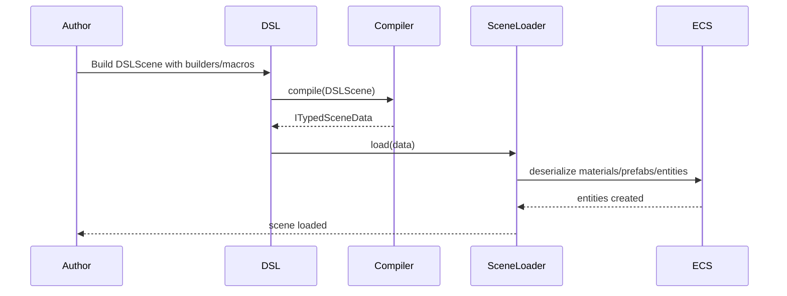

# Compact Scene DSL and Prefabization Plan

🧠 Planning documents standards rule loaded!

## Overview

- **Context & Goals**: Scenes like `Forest.tsx` are large, repeating verbose component payloads. We need a compact, LLM‑friendly scene format that compiles to existing `defineScene` data without changing runtime.
- **Context & Goals**: Reduce boilerplate for repeated objects (trees, grass, rocks) via declarative composition, presets, and arrays while preserving strong typing.
- **Context & Goals**: Enable reuse through prefabs and macros (scatter, ring, grid) to compress lines by 5–10x.
- **Current Pain Points**: Massive literal objects for `MeshRenderer.material` and `Transform` repeated hundreds of times; hard to diff and reason about; exceeds LLM context easily; copy‑paste variants error‑prone.

## Proposed Solution

- **High‑level Summary**:

  - Introduce a small declarative DSL that compiles to `ITypedSceneData` used by `defineScene` and `SceneLoader`. Keep runtime unchanged.
  - Provide composable helpers: `entity()`, `xform()`, `mesh()`, `light()`, `camera()`, `shape()`, `prefabRef()`, plus macros: `repeat()`, `scatter()`, `ring()`, `grid()`.
  - Add material presets and entity presets to avoid inline `material` repeats; prefer referencing `materials` by id with optional compact overrides only when needed.
  - Support input assets unchanged; just attach to the final `defineScene` payload.
  - Maintain Zod validation by compiling to the existing schemas.

- **Architecture & Directory Structure**:

```text
/src/game/scenes/
├── dsl/
│   ├── index.ts                  # Public DSL API
│   ├── builders.ts               # entity()/xform()/mesh()/light()/camera()
│   ├── macros.ts                 # repeat()/ring()/grid()/scatter()
│   ├── presets.ts                # materials/entity presets
│   ├── compile.ts                # compile(DSLScene) -> ITypedSceneData
│   └── types.ts                  # DSL types, narrow/compact forms
├── Forest.compact.tsx            # New compact scene using DSL
└── defineScene.ts                # (existing)
```

## Implementation Plan

- **Phase 1: DSL Foundations (0.5 day)**

  1. Create `types.ts` with minimal `DSLScene`, `DSLEntity`, compact unions for transforms and colors.
  2. Implement `builders.ts` helpers to construct typed mini objects with defaults.
  3. Implement `presets.ts` with common `materialPresets` and `entityPresets`.

- **Phase 2: Macros (0.5 day)**

  1. Implement `repeat(count, fn)`; `grid(nx, nz, spacing, fn)`.
  2. Implement `ring(count, radius, fn)` and `scatter(count, radius, seed, fn)`.
  3. Ensure macro outputs flatten to entity arrays with computed transforms.

- **Phase 3: Compiler (0.5 day)**

  1. `compile(scene: DSLScene): ITypedSceneData` mapping DSL to existing types.
  2. Map compact transform/color shorthands to full objects.
  3. Emit `materials` array and ensure `MeshRenderer.material` overrides are optional.

- **Phase 4: Forest Migration (0.5 day)**

  1. Create `Forest.compact.tsx` using DSL with presets and macros.
  2. Keep `Forest.tsx` for reference; register scene using `Forest.compact.tsx` compiled output.
  3. Validate visually and via unit tests.

- **Phase 5: Tests & Docs (0.5 day)**
  1. Unit tests for `compile()` and macros.
  2. Snapshot tests on a small scene.
  3. Update docs on authoring with DSL and migration guide.

## File and Directory Structures

```text
/src/game/scenes/dsl/
├── index.ts
├── builders.ts
├── macros.ts
├── presets.ts
├── compile.ts
└── types.ts
/src/game/scenes/Forest.compact.tsx
```

## Technical Details

```ts
// src/game/scenes/dsl/types.ts
export type Vec3 = [number, number, number];
export type ColorHex = `#${string}`;

export interface DSLTransform {
  p?: Vec3; // position
  r?: Vec3; // rotation
  s?: Vec3; // scale
}

export interface DSLMesh {
  mesh: string; // meshId
  mat: string; // materialId
  override?: Partial<{
    color: ColorHex;
    roughness: number;
    metalness: number;
  }>;
}

export interface DSLEntity {
  name?: string;
  parent?: number | string | null;
  xform?: DSLTransform;
  mesh?: DSLMesh;
  light?: Partial<{
    type: 'directional' | 'point' | 'spot' | 'ambient';
    color: { r: number; g: number; b: number };
    intensity: number;
    castShadow: boolean;
  }>;
  camera?: Partial<{ fov: number; isMain: boolean }>;
  customShape?: { id: string; params?: Record<string, unknown> };
  prefab?: { id: string; version?: number; uuid?: string; override?: Record<string, unknown> };
}

export interface DSLScene {
  meta: { name: string; version: number; timestamp: string; description?: string };
  materials?: Array<{
    id: string;
    name: string;
    color?: ColorHex;
    roughness?: number;
    metalness?: number;
    shader?: 'standard' | 'unlit';
    type?: 'solid' | 'texture';
  }>;
  entities: Array<DSLEntity | DSLEntity[]>; // flat or nested macro output
  inputAssets?: any[];
}
```

```ts
// src/game/scenes/dsl/builders.ts
export const xform = (
  p?: [number, number, number],
  r?: [number, number, number],
  s: [number, number, number] = [1, 1, 1],
) => ({ p, r, s });
export const mesh = (mesh: string, mat: string, override?: DSLEntity['mesh']['override']) => ({
  mesh,
  mat,
  override,
});
export const entity = (name: string, parts: Partial<DSLEntity> = {}): DSLEntity => ({
  name,
  ...parts,
});
export const light = (
  type: DSLEntity['light']['type'],
  init: Partial<NonNullable<DSLEntity['light']>> = {},
) => ({ light: { type, ...init } });
export const camera = (init: NonNullable<DSLEntity['camera']> = {}) => ({ camera: init });
export const shape = (id: string, params?: Record<string, unknown>) => ({
  customShape: { id, params },
});
export const prefabRef = (id: string, override?: Record<string, unknown>, version = 1) => ({
  prefab: { id, version, uuid: '', override },
});
```

```ts
// src/game/scenes/dsl/macros.ts
export const repeat = (count: number, fn: (i: number) => DSLEntity): DSLEntity[] =>
  Array.from({ length: count }, (_, i) => fn(i));
export const grid = (
  nx: number,
  nz: number,
  spacing: number,
  fn: (x: number, z: number, i: number) => DSLEntity,
): DSLEntity[] => {
  const out: DSLEntity[] = [];
  let i = 0;
  for (let x = 0; x < nx; x++) for (let z = 0; z < nz; z++) out.push(fn(x, z, i++));
  return out;
};
export const ring = (
  count: number,
  radius: number,
  fn: (angle: number, i: number) => DSLEntity,
): DSLEntity[] => {
  const out: DSLEntity[] = [];
  for (let i = 0; i < count; i++) out.push(fn((i / count) * Math.PI * 2, i));
  return out;
};
```

```ts
// src/game/scenes/dsl/compile.ts
import type { DSLScene, DSLEntity } from './types';
import type { ITypedSceneData } from '@core';

const v3 = (v?: [number, number, number]) => v ?? [0, 0, 0];

export function compile(scene: DSLScene): ITypedSceneData {
  const entities = (scene.entities.flat() as DSLEntity[]).map((e, idx) => ({
    id: idx,
    name: e.name ?? `Entity ${idx}`,
    parentId: e.parent ?? undefined,
    components: {
      Transform: {
        position: v3(e.xform?.p),
        rotation: v3(e.xform?.r),
        scale: e.xform?.s ?? [1, 1, 1],
      },
      ...(e.mesh && {
        MeshRenderer: {
          meshId: e.mesh.mesh,
          materialId: e.mesh.mat,
          enabled: true,
          castShadows: true,
          receiveShadows: true,
          modelPath: '',
          material: e.mesh.override
            ? {
                shader: 'standard',
                materialType: 'solid',
                color: '#cccccc',
                metalness: 0,
                roughness: 0.7,
                emissive: '#000000',
                emissiveIntensity: 0,
                normalScale: 1,
                occlusionStrength: 1,
                textureOffsetX: 0,
                textureOffsetY: 0,
                textureRepeatX: 1,
                textureRepeatY: 1,
                ...e.mesh.override,
              }
            : undefined,
        },
      }),
      ...(e.light && {
        Light: {
          lightType: e.light.type ?? 'directional',
          color: e.light.color ?? { r: 1, g: 1, b: 1 },
          intensity: e.light.intensity ?? 1,
          enabled: true,
          castShadow: e.light.castShadow ?? true,
        },
      }),
      ...(e.camera && {
        Camera: {
          fov: e.camera.fov ?? 60,
          near: 0.1,
          far: 150,
          projectionType: 'perspective',
          orthographicSize: 10,
          depth: 0,
          isMain: e.camera.isMain ?? false,
        },
      }),
      ...(e.customShape && {
        CustomShape: { shapeId: e.customShape.id, params: e.customShape.params ?? {} } as any,
      }),
      ...(e.prefab && {
        PrefabInstance: {
          prefabId: e.prefab.id,
          version: e.prefab.version ?? 1,
          instanceUuid: e.prefab.uuid || '',
          overridePatch: e.prefab.override ?? {},
        },
      }),
    },
  }));

  return {
    metadata: scene.meta,
    entities,
    materials: (scene.materials ?? []).map((m) => ({
      id: m.id,
      name: m.name,
      shader: m.shader ?? 'standard',
      materialType: m.type ?? 'solid',
      color: m.color ?? '#cccccc',
      metalness: m.metalness ?? 0,
      roughness: m.roughness ?? 0.7,
      emissive: '#000000',
      emissiveIntensity: 0,
      normalScale: 1,
      occlusionStrength: 1,
      textureOffsetX: 0,
      textureOffsetY: 0,
      textureRepeatX: 1,
      textureRepeatY: 1,
    })),
    prefabs: [],
    inputAssets: scene.inputAssets,
  } as ITypedSceneData;
}
```

## Usage Examples

```ts
// src/game/scenes/Forest.compact.tsx
import { defineScene } from './defineScene';
import { compile } from './dsl/compile';
import { entity, xform, mesh, light, camera, repeat, ring } from './dsl';

const scene = compile({
  meta: {
    name: 'Forest',
    version: 4,
    timestamp: new Date().toISOString(),
    description: 'Compact forest',
  },
  materials: [
    { id: 'forest-ground', name: 'Forest Ground', color: '#4a5c38', type: 'solid' },
    { id: 'pine-tree-1', name: 'Pine Tree v1', color: '#2a4c14' },
  ],
  entities: [
    entity('Main Camera', { xform: xform([0, 2, -15]), camera: { fov: 60, isMain: true } }),
    entity('Sun Light', {
      xform: xform([10, 15, 8], [-45, 30, 0]),
      light: { type: 'directional', intensity: 0.45 },
    }),
    entity('Forest Ground', { xform: xform(), mesh: mesh('terrain', 'forest-ground') }),
    // A ring of trees
    ring(8, 10, (angle, i) =>
      entity(`Pine ${i}`, {
        xform: xform([Math.cos(angle) * 10, 0, Math.sin(angle) * 10]),
        mesh: mesh('tree', 'pine-tree-1'),
      }),
    ),
    // Random grass clumps
    repeat(20, (i) =>
      entity(`Grass ${i}`, {
        xform: xform([i - 10, 0.05, (i % 5) - 5], undefined, [0.4, 0.3, 0.4]),
        mesh: mesh('sphere', 'grass'),
      }),
    ),
  ],
});

export default defineScene(scene);
```

```ts
// Minimal scene example
const minimal = compile({
  meta: { name: 'Minimal', version: 1, timestamp: '...' },
  entities: [entity('Camera', { camera: { isMain: true } })],
});
export default defineScene(minimal);
```

## Testing Strategy

- **Unit Tests**
  - `compile()` transforms: transforms/colors defaults, mesh overrides optional, camera defaults, light defaults.
  - Macros output counts and positions (ring/grid/repeat).
  - Materials defaults when fields omitted.
- **Integration Tests**
  - Load compiled scene via `SceneLoader.load()`; verify entities/components count.
  - Render smoke test in editor to confirm no schema violations.

## Edge Cases

| Edge Case                        | Remediation                                                |
| -------------------------------- | ---------------------------------------------------------- |
| Missing transform fields         | Default `p=[0,0,0]`, `r=[0,0,0]`, `s=[1,1,1]` in compile() |
| No materials array               | Emit empty; rely on existing ids or inline overrides       |
| Macro produces 0 entities        | Compile to empty array; no-op                              |
| Prefab override missing          | Use empty overridePatch                                    |
| CustomShape without MeshRenderer | Supported; MeshRenderer optional as today                  |

## Sequence Diagram



## Risks & Mitigations

| Risk                    | Mitigation                                                                     |
| ----------------------- | ------------------------------------------------------------------------------ |
| Divergence from schemas | Compile strictly to existing `ITypedSceneData`; keep unit tests vs Zod schemas |
| Over‑engineering DSL    | Keep helpers tiny; no runtime; simple functions only                           |
| Migration friction      | Keep legacy `.tsx` scenes working; add `.compact.tsx` variants first           |
| Debuggability           | Provide `DEBUG_COMPILE` flag to dump compiled output for inspection            |

## Timeline

- Total: ~2.5 days
  - Phase 1: 0.5
  - Phase 2: 0.5
  - Phase 3: 0.5
  - Phase 4: 0.5
  - Phase 5: 0.5

## Acceptance Criteria

- Forest scene has a `.compact.tsx` that loads identically to current `Forest.tsx` (entity/material parity within acceptable visual tolerance).
- DSL compiler outputs valid `ITypedSceneData` that passes existing loader/tests.
- Macros generate expected counts/positions; tests included.
- Documentation added under `docs/PRDs/` with usage examples.

## Conclusion

A compact DSL layered over current scene serialization will drastically reduce verbosity, improve readability, and fit LLM context limits, while preserving engine/runtime compatibility and type safety.

## Assumptions & Dependencies

- Existing `defineScene` and `SceneLoader` remain the single runtime integration points.
- `MeshRenderer.material` is optional and treated as override (verified in component definition).
- Material definitions via `IMaterialDefinition` retain defaults (Zod schema).
- No change to editor serialization; DSL is authoring sugar for code‑defined scenes.
