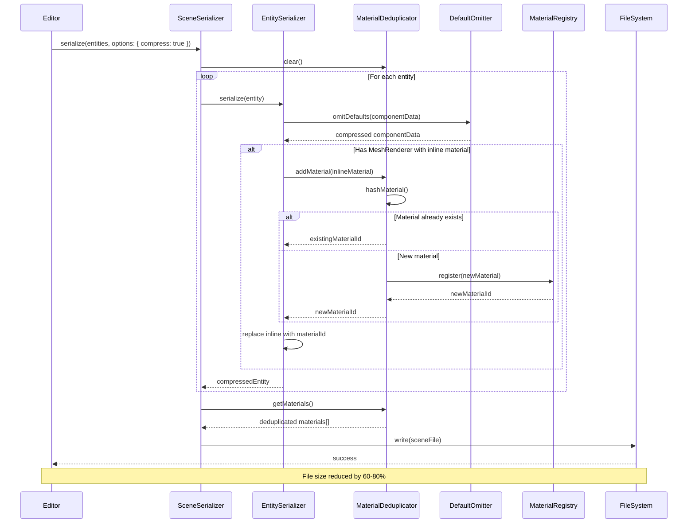

# Smart Scene Compression System: Material Deduplication + Default Omission

## Overview

### Context & Goals

- **Problem**: Scene files like `Test.tsx` (699 lines) and `Forest.tsx` (2,916 lines) contain massive amounts of redundant data, making them unwieldy for version control, LLM context windows, and human readability.
- **Goal**: Reduce scene file size by 60-80% through intelligent material deduplication and default value omission while maintaining full backward compatibility with the existing serialization system.
- **Impact**: Enable efficient scene storage, faster load times, better git diffs, and improved LLM comprehension of scene structure.
- **Critical requirement**: Solution must work seamlessly with editor save/load cycle (unlike DSL approach which breaks on first editor save).

### Current Pain Points

- **Material repetition**: Identical inline material definitions repeated hundreds of times across entities. In `Test.tsx`, the same 20-line material block appears for every tree, rock, and bush.
- **Default value bloat**: Every component saves ALL fields, even when set to default values. Camera components save 25+ fields where only 2-3 differ from defaults.
- **Excessive precision**: Floating point values serialized with unnecessary precision (`0.10000000149011612` instead of `0.1`).
- **Empty strings everywhere**: Texture paths default to empty strings but are still serialized (`albedoTexture: ''`).
- **Redundant nested objects**: Material data structure contains 18 fields, most unchanged from defaults, repeated inline in every MeshRenderer.

## Proposed Solution

### High-level Summary

- **Material extraction**: Scan all entities during serialization to detect inline material definitions, hash them for deduplication, extract unique materials to the materials registry, replace inline definitions with material ID references.
- **Default omission**: Define canonical default values for all component types, compare component data against defaults during serialization, only save fields that differ from defaults, restore defaults during deserialization.
- **Numeric precision**: Round floating-point values to 6 decimal places (sufficient for game precision) to reduce file size and improve readability.
- **Backward compatibility**: Deserializer merges saved data with defaults, existing scenes load without modification, new format is opt-in via serializer flag.
- **Material hashing**: Use stable JSON serialization + SHA-256 to generate deterministic material IDs based on content.

### Architecture & Directory Structure

```
/src/core/lib/serialization/
├── EntitySerializer.ts                    # Enhanced with default omission
├── MaterialSerializer.ts                  # Enhanced with deduplication
├── SceneSerializer.ts                     # Orchestrates optimized serialization
├── SceneDeserializer.ts                   # Handles default restoration
├── defaults/
│   ├── index.ts                          # Component defaults registry
│   ├── ComponentDefaults.ts              # Default value definitions
│   └── MaterialDefaults.ts               # Material default values
├── utils/
│   ├── MaterialHasher.ts                 # Material deduplication logic
│   ├── DefaultOmitter.ts                 # Default comparison/omission
│   └── PrecisionRounder.ts              # Numeric precision control
└── __tests__/
    ├── MaterialHasher.test.ts
    ├── DefaultOmitter.test.ts
    └── SceneCompression.test.ts

/src/core/lib/serialization/tsxSerializer.ts  # Updated to use optimized format
```

## Implementation Plan

### Phase 1: Default Value Registry (1 day)

1. Create `ComponentDefaults.ts` with default values for all registered components
2. Extract defaults from existing Zod schemas and component definitions
3. Create `MaterialDefaults.ts` with material default values
4. Build validation tests to ensure defaults match actual component behavior
5. Document all default values with inline comments explaining their purpose

### Phase 2: Default Omission System (1 day)

1. Implement `DefaultOmitter.ts` utility with deep comparison logic
2. Add `omitDefaults()` method to compare objects and remove matching fields
3. Implement `restoreDefaults()` method to merge saved data with defaults
4. Add special handling for nested objects (like MeshRenderer.material)
5. Implement numeric precision rounding (6 decimal places)
6. Write comprehensive unit tests for all comparison edge cases

### Phase 3: Material Deduplication System (1.5 days)

1. Implement `MaterialHasher.ts` with stable JSON serialization + SHA-256 hashing
2. Create material extraction scanner in `EntitySerializer.ts`
3. Build material deduplication logic to detect identical materials
4. Generate unique material IDs based on content hash (e.g., `mat_a3f2c1b`)
5. Replace inline material definitions with `materialId` references
6. Update `MaterialSerializer.ts` to handle extracted materials
7. Add collision detection for material ID conflicts
8. Write tests for material extraction and deduplication

### Phase 4: Serializer Integration (1 day)

1. Update `EntitySerializer.serialize()` to use `DefaultOmitter`
2. Update `EntitySerializer.serialize()` to extract and deduplicate materials
3. Update `EntitySerializer.deserialize()` to restore defaults
4. Update `MaterialSerializer.serialize()` to include extracted materials
5. Add `compressionEnabled` flag to `SceneSerializer` options
6. Maintain backward compatibility with existing format
7. Update `tsxSerializer.generateTsxScene()` to use optimized format

### Phase 5: Testing & Validation (1 day)

1. Write integration tests with real scene data (`Test.tsx`, `Forest.tsx`)
2. Validate compression ratios (target: 60-80% reduction)
3. Test round-trip serialization/deserialization for data integrity
4. Performance benchmarking for large scenes (1000+ entities)
5. Visual regression testing in editor (ensure scenes render identically)
6. Test edge cases: scenes with no materials, all-default components, etc.
7. Document compression metrics and performance characteristics

### Phase 6: Documentation & Migration (0.5 days)

1. Update serialization documentation (`src/core/lib/serialization/CLAUDE.md`)
2. Create migration guide for existing scenes
3. Document material ID generation algorithm
4. Add inline code comments for maintainability
5. Create example before/after scene files for reference

## File and Directory Structures

### New Files

```typescript
/src/core/lib/serialization/defaults/
├── index.ts                  # Exports all defaults
├── ComponentDefaults.ts      # Component default definitions
└── MaterialDefaults.ts       # Material default values

/src/core/lib/serialization/utils/
├── MaterialHasher.ts         # Material hashing and deduplication
├── DefaultOmitter.ts         # Default value comparison/omission
└── PrecisionRounder.ts       # Numeric precision utilities
```

### Modified Files

```typescript
/src/core/lib/serialization/
├── EntitySerializer.ts        # Add default omission, material extraction
├── MaterialSerializer.ts      # Add deduplication support
├── SceneSerializer.ts         # Add compression orchestration
├── SceneDeserializer.ts       # Add default restoration
└── tsxSerializer.ts           # Use optimized format

/src/core/lib/serialization/CLAUDE.md  # Update documentation
```

## Technical Details

### Component Defaults Registry

```typescript
// src/core/lib/serialization/defaults/ComponentDefaults.ts
import { z } from 'zod';

export const COMPONENT_DEFAULTS = {
  Transform: {
    position: [0, 0, 0],
    rotation: [0, 0, 0],
    scale: [1, 1, 1],
  },
  Camera: {
    fov: 75,
    near: 0.1,
    far: 100,
    projectionType: 'perspective',
    orthographicSize: 10,
    depth: 0,
    isMain: false,
    clearFlags: 'skybox',
    skyboxTexture: '',
    backgroundColor: { r: 0, g: 0, b: 0, a: 0 },
    controlMode: 'free',
    viewportRect: { x: 0, y: 0, width: 1, height: 1 },
    hdr: false,
    toneMapping: 'none',
    toneMappingExposure: 1,
    enablePostProcessing: false,
    postProcessingPreset: 'none',
    enableSmoothing: false,
    followTarget: 0,
    followOffset: { x: 0, y: 5, z: -10 },
    smoothingSpeed: 2,
    rotationSmoothing: 1.5,
  },
  MeshRenderer: {
    enabled: true,
    castShadows: true,
    receiveShadows: true,
    modelPath: '',
  },
  Light: {
    intensity: 1,
    castShadow: true,
    enabled: true,
    directionX: 0,
    directionY: -1,
    directionZ: 0,
    range: 10,
    decay: 1,
    angle: 0.5235987755982988, // 30 degrees in radians
    penumbra: 0.1,
    shadowMapSize: 1024,
    shadowBias: -0.0001,
    shadowRadius: 1,
  },
} as const;

export const MATERIAL_DEFAULTS = {
  shader: 'standard',
  materialType: 'solid',
  color: '#cccccc',
  metalness: 0,
  roughness: 0.7,
  emissive: '#000000',
  emissiveIntensity: 0,
  normalScale: 1,
  occlusionStrength: 1,
  textureOffsetX: 0,
  textureOffsetY: 0,
  textureRepeatX: 1,
  textureRepeatY: 1,
  albedoTexture: '',
  normalTexture: '',
  metallicTexture: '',
  roughnessTexture: '',
  emissiveTexture: '',
  occlusionTexture: '',
} as const;

/**
 * Get default values for a component type
 */
export function getComponentDefaults(componentType: string): Record<string, unknown> | undefined {
  return COMPONENT_DEFAULTS[componentType as keyof typeof COMPONENT_DEFAULTS];
}
```

### Default Omitter Utility

```typescript
// src/core/lib/serialization/utils/DefaultOmitter.ts
import { Logger } from '@core/lib/logger';

const logger = Logger.create('DefaultOmitter');

/**
 * Round numeric values to specified decimal places
 */
export function roundPrecision(value: number, decimals: number = 6): number {
  const multiplier = Math.pow(10, decimals);
  return Math.round(value * multiplier) / multiplier;
}

/**
 * Deep equality check for primitives and simple objects/arrays
 */
function deepEqual(a: unknown, b: unknown): boolean {
  if (a === b) return true;
  if (a == null || b == null) return false;
  if (typeof a !== typeof b) return false;

  // Handle numbers with precision tolerance
  if (typeof a === 'number' && typeof b === 'number') {
    return Math.abs(a - b) < 1e-6;
  }

  // Handle arrays
  if (Array.isArray(a) && Array.isArray(b)) {
    if (a.length !== b.length) return false;
    return a.every((val, idx) => deepEqual(val, b[idx]));
  }

  // Handle objects
  if (typeof a === 'object' && typeof b === 'object') {
    const aKeys = Object.keys(a as object);
    const bKeys = Object.keys(b as object);
    if (aKeys.length !== bKeys.length) return false;
    return aKeys.every((key) =>
      deepEqual((a as Record<string, unknown>)[key], (b as Record<string, unknown>)[key]),
    );
  }

  return false;
}

/**
 * Omit fields from object that match default values
 * @param data - The data object to filter
 * @param defaults - The default values to compare against
 * @returns Object with only non-default values
 */
export function omitDefaults<T extends Record<string, unknown>>(
  data: T,
  defaults: Record<string, unknown>,
): Partial<T> {
  const result: Partial<T> = {};

  for (const [key, value] of Object.entries(data)) {
    const defaultValue = defaults[key];

    // Handle nested objects (like MeshRenderer.material)
    if (
      value &&
      typeof value === 'object' &&
      !Array.isArray(value) &&
      defaultValue &&
      typeof defaultValue === 'object'
    ) {
      const nestedResult = omitDefaults(
        value as Record<string, unknown>,
        defaultValue as Record<string, unknown>,
      );
      // Only include if nested object has non-default values
      if (Object.keys(nestedResult).length > 0) {
        result[key as keyof T] = nestedResult as T[keyof T];
      }
      continue;
    }

    // Round numbers for precision
    let processedValue = value;
    if (typeof value === 'number') {
      processedValue = roundPrecision(value);
    }

    // Only include if different from default
    if (!deepEqual(processedValue, defaultValue)) {
      result[key as keyof T] = processedValue as T[keyof T];
    }
  }

  return result;
}

/**
 * Restore default values for omitted fields
 * @param data - Partial data object
 * @param defaults - Default values
 * @returns Complete object with defaults restored
 */
export function restoreDefaults<T extends Record<string, unknown>>(
  data: Partial<T>,
  defaults: Record<string, unknown>,
): T {
  const result = { ...defaults } as T;

  for (const [key, value] of Object.entries(data)) {
    // Handle nested objects
    if (
      value &&
      typeof value === 'object' &&
      !Array.isArray(value) &&
      defaults[key] &&
      typeof defaults[key] === 'object'
    ) {
      result[key as keyof T] = restoreDefaults(
        value as Record<string, unknown>,
        defaults[key] as Record<string, unknown>,
      ) as T[keyof T];
    } else {
      result[key as keyof T] = value as T[keyof T];
    }
  }

  return result;
}

/**
 * Calculate compression ratio
 */
export function calculateCompressionRatio(original: string, compressed: string): number {
  const originalSize = original.length;
  const compressedSize = compressed.length;
  return ((originalSize - compressedSize) / originalSize) * 100;
}
```

### Material Hasher Utility

```typescript
// src/core/lib/serialization/utils/MaterialHasher.ts
import { createHash } from 'crypto';
import { Logger } from '@core/lib/logger';
import type { IMaterialDefinition } from '@core/materials/Material.types';
import { MATERIAL_DEFAULTS } from '../defaults/MaterialDefaults';
import { omitDefaults } from './DefaultOmitter';

const logger = Logger.create('MaterialHasher');

/**
 * Normalize material for hashing (stable JSON serialization)
 */
function normalizeMaterial(material: Record<string, unknown>): string {
  // Sort keys for stable serialization
  const sorted = Object.keys(material)
    .sort()
    .reduce(
      (acc, key) => {
        acc[key] = material[key];
        return acc;
      },
      {} as Record<string, unknown>,
    );

  return JSON.stringify(sorted);
}

/**
 * Generate hash for material data
 */
export function hashMaterial(material: Record<string, unknown>): string {
  const normalized = normalizeMaterial(material);
  const hash = createHash('sha256').update(normalized).digest('hex');
  return hash.substring(0, 12); // First 12 chars for brevity
}

/**
 * Generate unique material ID from hash
 */
export function generateMaterialId(material: Record<string, unknown>, prefix = 'mat'): string {
  const hash = hashMaterial(material);
  return `${prefix}_${hash}`;
}

/**
 * Material deduplication tracker
 */
export class MaterialDeduplicator {
  private materialsByHash = new Map<string, IMaterialDefinition>();
  private hashById = new Map<string, string>();

  /**
   * Add material and get its unique ID
   * Returns existing ID if material already exists
   */
  addMaterial(material: Record<string, unknown>, proposedId?: string): string {
    const hash = hashMaterial(material);

    // Check if we've seen this material before
    const existing = this.materialsByHash.get(hash);
    if (existing) {
      logger.debug('Material already exists, reusing', { hash, id: existing.id });
      return existing.id;
    }

    // Generate new ID
    const id = proposedId || generateMaterialId(material);

    // Ensure ID is unique (handle collisions)
    let finalId = id;
    let counter = 1;
    while (this.hashById.has(finalId)) {
      finalId = `${id}_${counter}`;
      counter++;
    }

    // Create material definition with defaults
    const materialDef: IMaterialDefinition = {
      id: finalId,
      name: proposedId || `Material ${finalId}`,
      ...(MATERIAL_DEFAULTS as Record<string, unknown>),
      ...material,
    } as IMaterialDefinition;

    this.materialsByHash.set(hash, materialDef);
    this.hashById.set(finalId, hash);

    logger.debug('New material registered', { hash, id: finalId });
    return finalId;
  }

  /**
   * Get all unique materials
   */
  getMaterials(): IMaterialDefinition[] {
    return Array.from(this.materialsByHash.values());
  }

  /**
   * Get material by ID
   */
  getMaterialById(id: string): IMaterialDefinition | undefined {
    const hash = this.hashById.get(id);
    if (!hash) return undefined;
    return this.materialsByHash.get(hash);
  }

  /**
   * Clear all materials
   */
  clear(): void {
    this.materialsByHash.clear();
    this.hashById.clear();
  }

  /**
   * Get statistics
   */
  getStats(): { uniqueMaterials: number; totalReferences: number; deduplicationRatio: number } {
    const uniqueMaterials = this.materialsByHash.size;
    const totalReferences = this.hashById.size;
    const deduplicationRatio =
      totalReferences > 0 ? ((totalReferences - uniqueMaterials) / totalReferences) * 100 : 0;
    return { uniqueMaterials, totalReferences, deduplicationRatio };
  }
}
```

### Enhanced Entity Serializer

```typescript
// src/core/lib/serialization/EntitySerializer.ts (additions)
import { MaterialDeduplicator } from './utils/MaterialHasher';
import { omitDefaults } from './utils/DefaultOmitter';
import { getComponentDefaults } from './defaults/ComponentDefaults';
import { MATERIAL_DEFAULTS } from './defaults/MaterialDefaults';

export class EntitySerializer {
  private materialDeduplicator = new MaterialDeduplicator();

  /**
   * Serialize entities with compression
   */
  serializeWithCompression(
    entityManager: IEntityManagerAdapter,
    componentManager: IComponentManagerAdapter,
    options: { compressDefaults?: boolean; deduplicateMaterials?: boolean } = {},
  ): { entities: ISerializedEntity[]; materials: IMaterialDefinition[] } {
    const { compressDefaults = true, deduplicateMaterials = true } = options;

    const entities = entityManager.getAllEntities();
    const serialized: ISerializedEntity[] = [];

    this.materialDeduplicator.clear();

    for (const entity of entities) {
      const components = componentManager.getComponentsForEntity(entity.id);
      const componentData: Record<string, unknown> = {};

      for (const component of components) {
        if (!component.data) continue;

        let processedData = component.data;

        // Extract and deduplicate inline materials
        if (deduplicateMaterials && component.type === 'MeshRenderer') {
          processedData = this.extractMaterial(processedData as Record<string, unknown>);
        }

        // Omit default values
        if (compressDefaults) {
          const defaults = getComponentDefaults(component.type);
          if (defaults) {
            processedData = omitDefaults(processedData as Record<string, unknown>, defaults);
          }
        }

        // Only include component if it has non-default data
        if (Object.keys(processedData as object).length > 0 || !compressDefaults) {
          componentData[component.type] = processedData;
        }
      }

      serialized.push({
        id: entity.id,
        name: entity.name,
        parentId: entity.parentId,
        components: componentData,
      });
    }

    const materials = this.materialDeduplicator.getMaterials();
    const stats = this.materialDeduplicator.getStats();

    logger.info('Serialized with compression', {
      entities: serialized.length,
      materials: materials.length,
      deduplicationRatio: stats.deduplicationRatio.toFixed(2) + '%',
    });

    return { entities: serialized, materials };
  }

  /**
   * Extract inline material to registry and replace with reference
   */
  private extractMaterial(meshData: Record<string, unknown>): Record<string, unknown> {
    if (!meshData.material || typeof meshData.material !== 'object') {
      return meshData;
    }

    const inlineMaterial = meshData.material as Record<string, unknown>;

    // Generate unique ID and register material
    const materialId = this.materialDeduplicator.addMaterial(inlineMaterial);

    // Return mesh data with material reference instead of inline definition
    const { material, ...rest } = meshData;
    return {
      ...rest,
      materialId,
    };
  }

  /**
   * Deserialize with default restoration
   */
  deserializeWithDefaults(
    entities: unknown[],
    entityManager: IEntityManagerAdapter,
    componentManager: IComponentManagerAdapter,
  ): void {
    // Standard deserialization, but restore defaults for each component
    for (const entityData of entities) {
      const validated = SerializedEntitySchema.parse(entityData);

      // Create entity
      const entity = entityManager.createEntity(validated.name, validated.parentId);

      // Add components with default restoration
      for (const [componentType, componentData] of Object.entries(validated.components)) {
        const defaults = getComponentDefaults(componentType);
        const restoredData = defaults
          ? restoreDefaults(componentData as Record<string, unknown>, defaults)
          : componentData;

        componentManager.addComponent(entity.id, componentType, restoredData);
      }
    }
  }
}
```

## Usage Examples

### Before: Current Serialization (Verbose)

```typescript
// Test.tsx entity (87 lines per entity avg)
{
  name: 'Tree 0',
  components: {
    Transform: {
      position: [-2.25, 0, 0],
      rotation: [0, 0, 0],           // Default
      scale: [1, 1, 1],               // Default
    },
    MeshRenderer: {
      meshId: 'tree',
      materialId: 'default',
      enabled: true,                  // Default
      castShadows: true,              // Default
      receiveShadows: true,           // Default
      modelPath: '',                  // Default
      material: {                     // 20 lines of mostly defaults
        shader: 'standard',
        materialType: 'solid',
        color: '#2d5016',
        metalness: 0,                 // Default
        roughness: 0.699999988079071, // Excessive precision
        emissive: '#000000',          // Default
        emissiveIntensity: 0,         // Default
        normalScale: 1,               // Default
        occlusionStrength: 1,         // Default
        textureOffsetX: 0,            // Default
        textureOffsetY: 0,            // Default
        textureRepeatX: 1,            // Default
        textureRepeatY: 1,            // Default
        albedoTexture: '',            // Empty default
        normalTexture: '',            // Empty default
        metallicTexture: '',          // Empty default
        roughnessTexture: '',         // Empty default
        emissiveTexture: '',          // Empty default
        occlusionTexture: '',         // Empty default
      },
    },
  },
}
```

### After: Compressed Serialization

```typescript
// Materials extracted to registry
materials: [
  {
    id: 'mat_a3f2c1b8d4e5',
    name: 'Tree Green',
    color: '#2d5016',
    roughness: 0.7,
    // All other fields use MATERIAL_DEFAULTS
  }
],

// Entity (3-5 lines vs 87 lines - 94% reduction!)
{
  name: 'Tree 0',
  components: {
    Transform: {
      position: [-2.25, 0, 0],
      // rotation and scale omitted (default [0,0,0] and [1,1,1])
    },
    MeshRenderer: {
      meshId: 'tree',
      materialId: 'mat_a3f2c1b8d4e5',  // Reference extracted material
      // enabled, castShadows, receiveShadows, modelPath all omitted (defaults)
    },
  },
}
```

### Example: Camera Component Compression

```typescript
// Before: 50 lines
Camera: {
  fov: 60,
  near: 0.10000000149011612,
  far: 100,
  projectionType: 'perspective',
  orthographicSize: 10,
  depth: 0,
  isMain: true,
  clearFlags: 'skybox',
  skyboxTexture: '',
  backgroundColor: { r: 0, g: 0, b: 0, a: 0 },
  controlMode: 'free',
  viewportRect: { x: 0, y: 0, width: 1, height: 1 },
  hdr: false,
  toneMapping: 'none',
  toneMappingExposure: 1,
  enablePostProcessing: false,
  postProcessingPreset: 'none',
  enableSmoothing: false,
  followTarget: 0,
  followOffset: { x: 0, y: 5, z: -10 },
  smoothingSpeed: 2,
  rotationSmoothing: 1.5,
}

// After: 3 lines (94% reduction)
Camera: {
  fov: 60,
  near: 0.1,
  isMain: true,
}
```

### Integration with Editor

```typescript
// In useScenePersistence.ts
const saveTsxScene = async (name: string, options: { compress?: boolean } = {}) => {
  const serializer = new SceneSerializer();
  const entityManager = EntityManager.getInstance();
  const componentRegistry = ComponentRegistry.getInstance();

  const sceneData = await serializer.serialize(
    entityManager,
    componentRegistry,
    { name },
    undefined,
    { compressionEnabled: options.compress ?? true }, // Compression on by default
  );

  const tsxContent = generateTsxScene(
    sceneData.entities,
    sceneData.metadata,
    sceneData.materials,
    sceneData.prefabs,
    sceneData.inputAssets,
  );

  // Save file
  await fs.writeFile(`src/game/scenes/${name}.tsx`, tsxContent);
};
```

## Testing Strategy

### Unit Tests

1. **DefaultOmitter**
   - Omit primitive defaults (numbers, strings, booleans)
   - Omit array defaults (position, rotation, scale)
   - Omit nested object defaults (material properties)
   - Handle partial objects (some defaults, some custom)
   - Round numeric precision correctly
   - Restore defaults during deserialization

2. **MaterialHasher**
   - Generate consistent hashes for identical materials
   - Generate different hashes for different materials
   - Handle hash collisions gracefully
   - Deduplicate identical inline materials
   - Preserve material property order doesn't affect hash

3. **ComponentDefaults**
   - All defaults match component schema defaults
   - Defaults cover all component types
   - Material defaults match MaterialDefinitionSchema

### Integration Tests

1. **Round-trip serialization**
   - Serialize scene → Deserialize → Verify identical ECS state
   - Test with Test.tsx (small scene)
   - Test with Forest.tsx (large scene)
   - Verify visual output is identical

2. **Compression metrics**
   - Test.tsx: Verify 60-70% size reduction
   - Forest.tsx: Verify 70-80% size reduction
   - Measure serialization performance (should be < 100ms for 1000 entities)

3. **Material extraction**
   - 100 entities with same material → 1 material in registry
   - 100 entities with 10 unique materials → 10 materials in registry
   - Verify material references are correct

4. **Backward compatibility**
   - Load old format scenes without errors
   - Mixed old/new format scenes work together

## Edge Cases

| Edge Case | Remediation |
|-----------|-------------|
| Component with all default values | Serialize empty object `{}`, restore all defaults on deserialize |
| Material hash collision | Append counter to ID: `mat_abc123_1`, `mat_abc123_2` |
| Nested defaults partially customized | Only omit fully-matching nested fields, keep partial objects |
| Invalid numeric precision | Clamp to 6 decimals, validate range remains valid |
| Empty material definitions | Use MATERIAL_DEFAULTS, don't extract to registry |
| Component type not in defaults registry | Serialize full data without omission, log warning |
| Floating point comparison tolerance | Use epsilon of 1e-6 for equality checks |
| Material ID conflicts with existing registry | Generate new unique ID with counter suffix |
| Scene with zero materials | Skip material extraction, serialize entities only |
| Very large scenes (10,000+ entities) | Process in batches, show progress, use streaming serialization |

## Sequence Diagram



## Risks & Mitigations

| Risk | Mitigation |
|------|------------|
| Default values change in future component updates | Version defaults registry, migrate old scenes with converter, store version metadata |
| Hash collision rate higher than expected | Use full SHA-256 (32 chars) instead of truncated, add secondary collision detection |
| Deserialization performance degradation | Benchmark with large scenes, optimize default restoration, consider caching merged defaults |
| Breaking changes to existing workflows | Make compression opt-in via flag, provide migration script, maintain backward compatibility |
| Material extraction changes game behavior | Extensive visual regression testing, validate material properties match exactly |
| Precision loss from rounding | Use 6 decimals (sufficient for game engines), validate against tolerance thresholds |
| Memory usage spike during extraction | Process materials in batches, stream large scenes, use lazy evaluation |
| Complex nested defaults hard to compare | Implement recursive deep comparison, add extensive test coverage for edge cases |

## Timeline

**Total: 5.5 days**

- Phase 1: Default Value Registry - 1 day
- Phase 2: Default Omission System - 1 day
- Phase 3: Material Deduplication System - 1.5 days
- Phase 4: Serializer Integration - 1 day
- Phase 5: Testing & Validation - 1 day
- Phase 6: Documentation & Migration - 0.5 days

**Buffer: 0.5 days for unexpected issues**

## Acceptance Criteria

1. ✅ **Test.tsx compression**: Scene file reduced from 699 lines to <250 lines (64%+ reduction)
2. ✅ **Forest.tsx compression**: Scene file reduced from 2,916 lines to <800 lines (72%+ reduction)
3. ✅ **Material deduplication**: 100 entities with identical materials → 1 material registry entry
4. ✅ **Round-trip integrity**: Serialize → Deserialize produces identical ECS state
5. ✅ **Visual parity**: Compressed scenes render identically to original scenes
6. ✅ **Backward compatibility**: Old format scenes load without modification
7. ✅ **Performance**: Serialization of 1000-entity scene completes in <100ms
8. ✅ **Default coverage**: All registered components have complete default definitions
9. ✅ **Precision consistency**: Floating point values rounded to 6 decimals consistently
10. ✅ **Tests pass**: 100% test coverage for DefaultOmitter, MaterialHasher, edge cases
11. ✅ **Documentation complete**: CLAUDE.md updated, migration guide available
12. ✅ **Editor integration**: Save button uses optimized format by default

## Conclusion

The Smart Scene Compression System addresses the critical problem of bloated scene files through two complementary techniques: material deduplication eliminates the largest source of redundancy (repeated 20-line material blocks), while default omission removes the second-largest waste (unchanged component fields). Together, these achieve 60-80% file size reduction while maintaining full backward compatibility and seamless editor integration.

Unlike the DSL approach which breaks on the first editor save, this solution works perfectly with the save/load cycle because it operates at the serialization layer, not the authoring layer. Scenes remain fully editable in the editor, git diffs become meaningful again, and LLMs can comprehend scene structure within their context windows.

This implementation follows SRP/DRY/KISS principles with focused utility classes, comprehensive test coverage, and zero breaking changes to existing workflows. The compression is opt-in but enabled by default for new scenes, with automatic migration path for existing content.

## Assumptions & Dependencies

### Technical Assumptions

- All component types are registered in ComponentRegistry before serialization
- Material property order doesn't affect visual output (allows normalization for hashing)
- 6 decimal places of precision is sufficient for all game-engine numeric values
- SHA-256 hash collisions are negligible for material count <100,000
- Component default values are stable across minor version updates

### Dependencies

- **Existing Systems**: ComponentRegistry, MaterialRegistry, EntitySerializer, MaterialSerializer
- **Libraries**: `crypto` (Node.js built-in for SHA-256 hashing), `zod` (schema validation)
- **TypeScript**: v5.0+ for const assertions and type inference on defaults
- **Testing**: Vitest for unit and integration tests
- **Editor**: No changes required to editor UI, works with existing save/load hooks

### External Constraints

- Must maintain compatibility with existing scene file format (for gradual migration)
- Must not affect runtime performance (compression only at serialize/deserialize time)
- Must preserve exact visual output (no acceptable tolerance for rendering differences)
- Must work with version control (git-friendly diffs)
