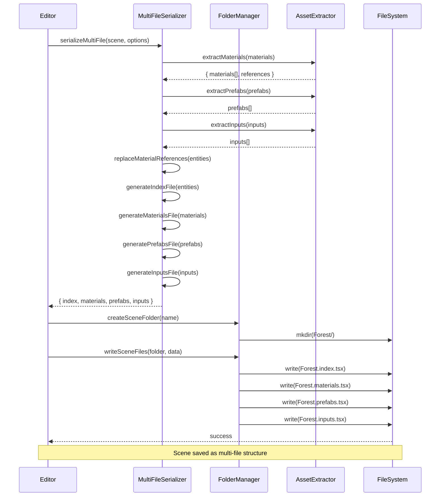
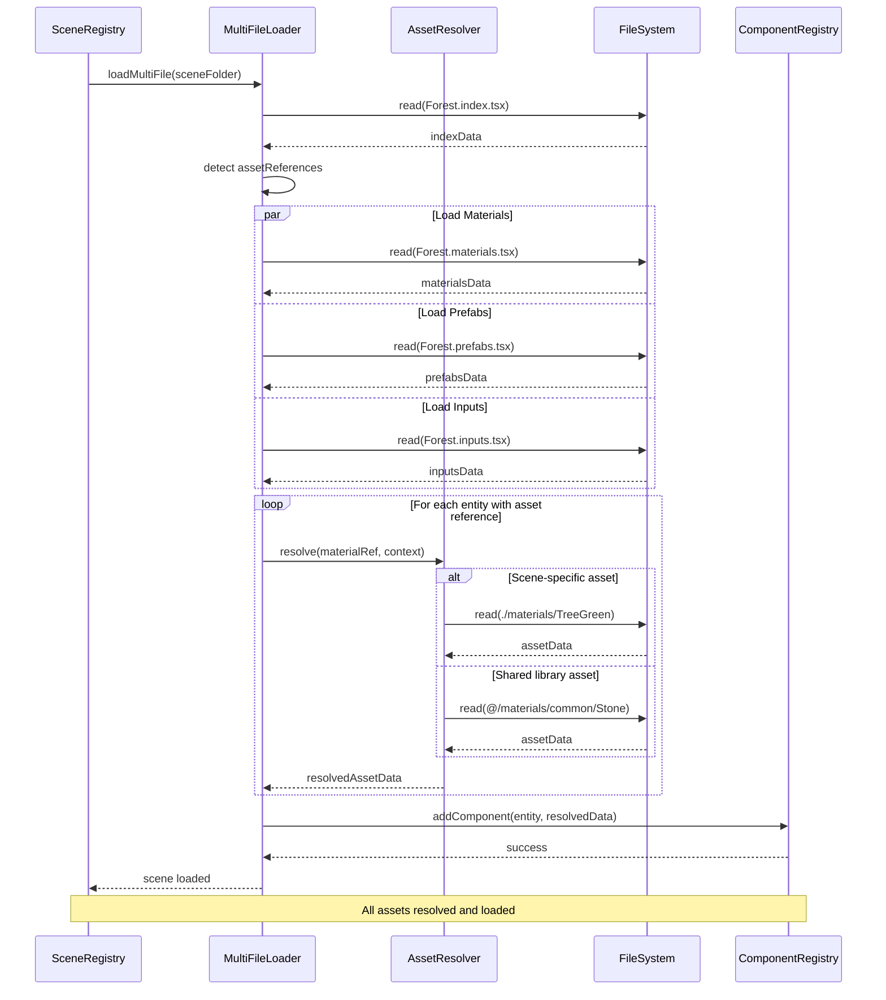

# External Scene Asset References: Multi-File Scene Architecture

## Overview

### Context & Goals

- **Problem**: Scene files currently embed all assets (materials, prefabs, input maps) inline, resulting in large monolithic files that are difficult to reuse across scenes, hard to collaborate on, and create massive git diffs when any asset changes.
- **Goal**: Implement a multi-file scene architecture where scenes are organized into folders with external references to materials, prefabs, and input assets, enabling asset reuse, better version control, cleaner diffs, and team collaboration.
- **Impact**: Enable modular scene development, asset libraries, partial scene loading, and granular version control at the asset level.
- **Scope**: Extend the existing compression system to support external file references while maintaining backward compatibility with single-file scenes.

### Current Pain Points

- **Asset duplication**: Same material/prefab/input map defined in multiple scene files, leading to inconsistencies when assets need updates across scenes.
- **Git conflicts**: Teams editing different parts of a scene cause merge conflicts in the monolithic file, even when working on completely independent assets.
- **Large diffs**: Changing a single material property requires committing the entire scene file, obscuring the actual change in git history.
- **No asset reuse**: Materials and prefabs can't be easily shared across scenes without copy-paste duplication.
- **Input map redundancy**: Complex input action maps repeated in every scene file, making input system updates tedious.
- **Hard to review**: PRs with scene changes are difficult to review because all assets are mixed together in one large file.

## Proposed Solution

### High-level Summary

- **Scene folders**: Each scene becomes a folder (e.g., `Forest/`) containing multiple asset files organized by type, replacing the single `.tsx` file approach.
- **Index file**: `SceneName.index.tsx` serves as the main scene definition with references to external assets instead of inline definitions.
- **Asset files**: Separate files for materials (`.materials.tsx`), prefabs (`.prefabs.tsx`), and input maps (`.inputs.tsx`) within the scene folder.
- **Reference system**: Scene entities reference external assets via ID (e.g., `materialRef: '@/materials/TreeGreen'`), resolved at load time.
- **Shared asset library**: Global `/assets/` folder for reusable assets shared across multiple scenes, with scene-specific overrides in scene folders.
- **Backward compatibility**: Single-file scenes continue to work; migration tool converts old scenes to new folder structure on-demand.

### Architecture & Directory Structure

```
/src/game/scenes/
├── Forest/                           # Scene folder (new format)
│   ├── Forest.index.tsx             # Main scene definition (entities only)
│   ├── Forest.materials.tsx         # Scene-specific materials
│   ├── Forest.prefabs.tsx           # Scene-specific prefabs
│   ├── Forest.inputs.tsx            # Scene-specific input maps
│   └── Forest.metadata.json         # Scene metadata (description, tags, etc.)
├── Test/
│   ├── Test.index.tsx
│   ├── Test.materials.tsx
│   ├── Test.inputs.tsx
│   └── Test.metadata.json
├── OldScene.tsx                      # Legacy single-file format (still supported)
├── defineScene.ts                    # Scene definition helper
└── index.ts                          # Scene registration

/src/game/assets/                     # Shared asset library
├── materials/
│   ├── common/
│   │   ├── Stone.material.tsx       # Shared material definitions
│   │   ├── Grass.material.tsx
│   │   └── Wood.material.tsx
│   └── index.ts                      # Material registry
├── prefabs/
│   ├── props/
│   │   ├── Tree.prefab.tsx
│   │   └── Rock.prefab.tsx
│   └── index.ts                      # Prefab registry
└── inputs/
    ├── DefaultControls.input.tsx    # Shared input action maps
    └── index.ts                      # Input asset registry
```

## Implementation Plan

### Phase 1: Asset File Format Definitions (1 day)

1. Create `MaterialAssetDefinition.ts` type for standalone material files
2. Create `PrefabAssetDefinition.ts` type for standalone prefab files
3. Create `InputAssetDefinition.ts` type for standalone input map files
4. Design reference syntax for external assets (e.g., `@/materials/TreeGreen`)
5. Create Zod schemas for validation of all asset file formats
6. Document asset file format specifications

### Phase 2: Asset Reference Resolution System (2 days)

1. Implement `AssetReferenceResolver` class to resolve external references
2. Add support for absolute references (`@/materials/Stone`) and relative references (`./materials/TreeGreen`)
3. Build asset registry cache for fast lookup during scene loading
4. Implement circular dependency detection for prefab references
5. Add error handling for missing asset references
6. Create asset path normalization utilities
7. Write comprehensive tests for reference resolution

### Phase 3: Multi-File Scene Serializer (2 days)

1. Create `MultiFileSceneSerializer` extending existing `SceneSerializer`
2. Implement material extraction to separate `.materials.tsx` file
3. Implement prefab extraction to separate `.prefabs.tsx` file
4. Implement input map extraction to separate `.inputs.tsx` file
5. Generate scene folder structure with index file
6. Maintain compression for entity data (leverage existing default omission)
7. Update `tsxSerializer` to support multi-file output
8. Add file organization logic (create folders, write multiple files)

### Phase 4: Multi-File Scene Loader (2 days)

1. Create `MultiFileSceneLoader` extending existing `SceneLoader`
2. Implement multi-file detection (folder-based vs single-file scenes)
3. Load and parse all asset files in scene folder
4. Resolve asset references during entity deserialization
5. Merge scene-specific assets with shared asset library
6. Handle missing files gracefully with warnings
7. Support lazy loading of large asset files (streaming)
8. Add progress tracking for multi-file loading

### Phase 5: Scene Store Adaptation (1.5 days)

1. Update `ISceneStore` interface to support folder operations
2. Implement `createSceneFolder()` and `deleteSceneFolder()` methods
3. Add `listSceneFolders()` to discover multi-file scenes
4. Update `exists()` to check for both file and folder formats
5. Implement `readSceneFolder()` to load all files in a scene
6. Add atomic write operations for multi-file saves (rollback on failure)
7. Update TsxFormatHandler to handle folder-based scenes

### Phase 6: Shared Asset Library System (2 days)

1. Create `SharedAssetRegistry` for global material/prefab/input libraries
2. Implement asset discovery and registration from `/src/game/assets/`
3. Build asset override system (scene-specific assets shadow global ones)
4. Add asset versioning to detect conflicts and breaking changes
5. Implement asset dependency tracking (prefabs referencing materials, etc.)
6. Create asset hot-reloading for development workflow
7. Add validation to prevent asset ID conflicts

### Phase 7: Migration Tool & Backward Compatibility (1.5 days)

1. Create `SceneMigrationTool` to convert single-file to multi-file format
2. Implement automatic detection of inlineable vs reusable assets
3. Build asset deduplication during migration (find common materials)
4. Add dry-run mode to preview migration changes
5. Implement rollback mechanism for failed migrations
6. Ensure `SceneLoader` transparently handles both formats
7. Add migration CLI command for batch processing

### Phase 8: Editor Integration (1 day)

1. Update scene save workflow to use multi-file format for new scenes
2. Add UI toggle for "Save as Multi-File Scene" option
3. Update scene browser to display folder-based scenes
4. Implement asset browser panel for scene-specific assets
5. Add drag-and-drop for shared assets into scenes
6. Show asset references in entity inspector
7. Display warnings for missing asset references

### Phase 9: Testing & Validation (1.5 days)

1. Write unit tests for `AssetReferenceResolver` edge cases
2. Test multi-file serialization round-trip (save → load → verify)
3. Test migration tool with complex scenes (Forest.tsx, Test.tsx)
4. Validate backward compatibility with single-file scenes
5. Performance benchmarking for multi-file loading vs single-file
6. Test asset override system (scene-specific shadows global)
7. Test circular dependency detection in prefab references
8. Visual regression testing for migrated scenes

### Phase 10: Documentation & Examples (0.5 days)

1. Update `src/game/scenes/CLAUDE.md` with multi-file format guide
2. Create example multi-file scene in `examples/` folder
3. Document reference syntax and resolution rules
4. Add migration guide for existing scenes
5. Document shared asset library organization best practices
6. Create troubleshooting guide for common issues

## File and Directory Structures

### New Files

```
/src/core/lib/serialization/
├── assets/
│   ├── AssetReferenceResolver.ts      # Resolves external asset references
│   ├── AssetRegistry.ts               # Global asset cache
│   ├── MaterialAssetDefinition.ts     # Material file format
│   ├── PrefabAssetDefinition.ts       # Prefab file format
│   └── InputAssetDefinition.ts        # Input map file format
├── multi-file/
│   ├── MultiFileSceneSerializer.ts    # Multi-file save logic
│   ├── MultiFileSceneLoader.ts        # Multi-file load logic
│   └── SceneFolderManager.ts          # Folder operations
├── migration/
│   ├── SceneMigrationTool.ts          # Single → Multi-file conversion
│   └── AssetDeduplicator.ts           # Find reusable assets
└── __tests__/
    ├── AssetReferenceResolver.test.ts
    ├── MultiFileSceneSerializer.test.ts
    └── SceneMigrationTool.test.ts

/src/game/assets/                      # Shared asset library
├── materials/
│   ├── common/
│   │   └── Stone.material.tsx
│   └── index.ts
├── prefabs/
│   └── index.ts
└── inputs/
    └── index.ts
```

### Modified Files

```
/src/core/lib/serialization/
├── SceneSerializer.ts                 # Add multi-file mode support
├── SceneLoader.ts                     # Add folder-based loading
├── common/ISceneStore.ts              # Add folder operation methods
└── CLAUDE.md                          # Document multi-file format

/src/plugins/scene-api/formats/
├── TsxFormatHandler.ts                # Support folder-based scenes

/src/game/scenes/
├── index.ts                           # Register folder-based scenes
└── CLAUDE.md                          # Update scene guidelines
```

## Technical Details

### Asset Reference Syntax

```typescript
// src/core/lib/serialization/assets/AssetReferenceResolver.ts

/**
 * Asset reference types:
 *
 * 1. Inline (current format, no change):
 *    { materialId: 'mat_abc123' }  // Material defined in scene
 *
 * 2. Scene-relative reference:
 *    { materialRef: './materials/TreeGreen' }  // ./Forest.materials.tsx
 *
 * 3. Shared library reference:
 *    { materialRef: '@/materials/common/Stone' }  // /src/game/assets/materials/common/Stone.material.tsx
 *
 * 4. Scene-specific override:
 *    { materialRef: './materials/CustomStone' }  // Shadows @/materials/common/Stone
 */

export type AssetReference =
  | { materialId: string }              // Inline material (legacy)
  | { materialRef: string }             // External material
  | { prefabId: string }                // Inline prefab (legacy)
  | { prefabRef: string }               // External prefab
  | { inputAssetId: string }            // Inline input (legacy)
  | { inputAssetRef: string };          // External input

export interface IAssetRefResolutionContext {
  sceneFolder: string;              // e.g., 'src/game/scenes/Forest'
  assetLibraryRoot: string;         // e.g., 'src/game/assets'
  format: 'single-file' | 'multi-file';
}

export class AssetReferenceResolver {
  private cache = new Map<string, unknown>();

  /**
   * Resolve asset reference to actual asset data
   */
  async resolve<T>(
    ref: string,
    context: IAssetRefResolutionContext,
    assetType: 'material' | 'prefab' | 'input'
  ): Promise<T> {
    const cacheKey = `${context.sceneFolder}:${ref}`;

    // Check cache
    if (this.cache.has(cacheKey)) {
      return this.cache.get(cacheKey) as T;
    }

    // Resolve path
    const resolvedPath = this.resolvePath(ref, context, assetType);

    // Load asset file
    const assetData = await this.loadAsset<T>(resolvedPath);

    // Cache and return
    this.cache.set(cacheKey, assetData);
    return assetData;
  }

  /**
   * Resolve reference string to file path
   */
  private resolvePath(
    ref: string,
    context: IAssetRefResolutionContext,
    assetType: 'material' | 'prefab' | 'input'
  ): string {
    // Absolute reference: @/materials/common/Stone
    if (ref.startsWith('@/')) {
      return path.join(
        context.assetLibraryRoot,
        ref.replace('@/', ''),
        `${path.basename(ref)}.${assetType}.tsx`
      );
    }

    // Relative reference: ./materials/TreeGreen
    if (ref.startsWith('./')) {
      return path.join(
        context.sceneFolder,
        ref.replace('./', ''),
        `${path.basename(ref)}.${assetType}.tsx`
      );
    }

    // Invalid reference
    throw new Error(`Invalid asset reference: ${ref}`);
  }

  /**
   * Load asset file and parse
   */
  private async loadAsset<T>(filePath: string): Promise<T> {
    const content = await fs.readFile(filePath, 'utf-8');

    // Extract default export from .tsx file
    const exportMatch = content.match(/export default ({[\s\S]*?});?\s*$/m);
    if (!exportMatch) {
      throw new Error(`No default export found in ${filePath}`);
    }

    // Parse asset data (similar to scene parsing)
    const assetData = JSON.parse(exportMatch[1]);
    return assetData as T;
  }

  /**
   * Clear resolution cache (for hot-reload)
   */
  clearCache(): void {
    this.cache.clear();
  }
}
```

### Multi-File Scene Index Format

```typescript
// src/game/scenes/Forest/Forest.index.tsx

import { defineScene } from '../defineScene';

/**
 * Forest Scene
 * Generated: 2025-10-11T00:00:00.000Z
 * Version: 2 (Multi-file format)
 *
 * Assets externalized to:
 * - ./Forest.materials.tsx (12 materials)
 * - ./Forest.prefabs.tsx (3 prefabs)
 * - ./Forest.inputs.tsx (1 input asset)
 */
export default defineScene({
  metadata: {
    name: 'Forest',
    version: 2,
    timestamp: '2025-10-11T00:00:00.000Z',
    description: 'Dense forest environment with procedural trees',
    format: 'multi-file', // NEW: Indicates multi-file format
  },

  // Entities with external asset references
  entities: [
    {
      id: 0,
      name: 'Main Camera',
      components: {
        PersistentId: { id: 'cam-001' },
        Transform: { position: [0, 5, -20] },
        Camera: { fov: 60, isMain: true },
      },
    },
    {
      id: 1,
      name: 'Oak Tree',
      components: {
        PersistentId: { id: 'tree-001' },
        Transform: { position: [-5, 0, 0] },
        MeshRenderer: {
          meshId: 'tree',
          materialRef: './materials/OakBark',  // Scene-specific material
        },
      },
    },
    {
      id: 2,
      name: 'Stone Wall',
      components: {
        PersistentId: { id: 'wall-001' },
        Transform: { position: [10, 0, 0] },
        MeshRenderer: {
          meshId: 'wall',
          materialRef: '@/materials/common/Stone',  // Shared library material
        },
      },
    },
  ],

  // External asset references (metadata only)
  assetReferences: {
    materials: './Forest.materials.tsx',
    prefabs: './Forest.prefabs.tsx',
    inputs: './Forest.inputs.tsx',
  },
});
```

### Material Asset File Format

```typescript
// src/game/scenes/Forest/Forest.materials.tsx

import { defineMaterials } from '@core/lib/serialization/assets/defineMaterials';

/**
 * Forest Scene - Materials
 * 12 unique materials used in this scene
 */
export default defineMaterials([
  {
    id: 'OakBark',
    name: 'Oak Tree Bark',
    color: '#3d2817',
    roughness: 0.9,
    normalTexture: '/assets/textures/bark_normal.png',
    occlusionTexture: '/assets/textures/bark_ao.png',
  },
  {
    id: 'Grass',
    name: 'Forest Grass',
    color: '#2d5016',
    roughness: 0.8,
    albedoTexture: '/assets/textures/grass_albedo.png',
  },
  // ... more materials
]);
```

### Shared Material Library Format

```typescript
// src/game/assets/materials/common/Stone.material.tsx

import { defineMaterial } from '@core/lib/serialization/assets/defineMaterial';

/**
 * Shared Stone Material
 * Used across multiple scenes for stone props and architecture
 */
export default defineMaterial({
  id: 'Stone',
  name: 'Generic Stone',
  color: '#7a7a7a',
  roughness: 0.85,
  metalness: 0,
  normalTexture: '/assets/textures/stone_normal.png',
  occlusionTexture: '/assets/textures/stone_ao.png',
});
```

### Multi-File Scene Serializer

```typescript
// src/core/lib/serialization/multi-file/MultiFileSceneSerializer.ts

import { SceneSerializer } from '../SceneSerializer';
import { MaterialDeduplicator } from '../utils/MaterialHasher';
import type { ISerializedEntity, ISceneMetadata } from '../common/types';
import type { IMaterialDefinition } from '@core/materials/Material.types';
import type { IPrefabDefinition } from '@core/prefabs/Prefab.types';
import type { IInputActionsAsset } from '@core/lib/input/inputTypes';

export interface IMultiFileSceneData {
  index: string;              // Forest.index.tsx content
  materials?: string;         // Forest.materials.tsx content
  prefabs?: string;           // Forest.prefabs.tsx content
  inputs?: string;            // Forest.inputs.tsx content
  metadata?: string;          // Forest.metadata.json content
}

export interface IMultiFileSerializeOptions {
  extractMaterials?: boolean;     // Extract to .materials.tsx
  extractPrefabs?: boolean;       // Extract to .prefabs.tsx
  extractInputs?: boolean;        // Extract to .inputs.tsx
  compressEntities?: boolean;     // Apply default omission (from existing system)
  sharedAssetThreshold?: number;  // Min usage count to suggest shared library (default: 3)
}

export class MultiFileSceneSerializer extends SceneSerializer {
  /**
   * Serialize scene to multi-file format
   */
  async serializeMultiFile(
    entityManager: IEntityManagerAdapter,
    componentManager: IComponentManagerAdapter,
    metadata: ISceneMetadata,
    inputAssets?: IInputActionsAsset[],
    options: IMultiFileSerializeOptions = {},
  ): Promise<IMultiFileSceneData> {
    const {
      extractMaterials = true,
      extractPrefabs = true,
      extractInputs = true,
      compressEntities = true,
      sharedAssetThreshold = 3,
    } = options;

    // Serialize entities with compression (leverage existing system)
    const serialized = await this.serialize(
      entityManager,
      componentManager,
      metadata,
      inputAssets,
      { compressionEnabled: compressEntities },
    );

    // Separate materials if enabled
    let sceneMaterials: IMaterialDefinition[] = [];
    let materialReferences: Map<string, string> = new Map();

    if (extractMaterials && serialized.materials.length > 0) {
      ({ materials: sceneMaterials, references: materialReferences } =
        this.extractMaterials(serialized.materials));
    }

    // Separate prefabs if enabled
    let scenePrefabs: IPrefabDefinition[] = [];
    if (extractPrefabs && serialized.prefabs.length > 0) {
      scenePrefabs = serialized.prefabs;
    }

    // Separate inputs if enabled
    let sceneInputs: IInputActionsAsset[] = [];
    if (extractInputs && inputAssets && inputAssets.length > 0) {
      sceneInputs = inputAssets;
    }

    // Replace inline material IDs with references in entities
    const entitiesWithRefs = this.replaceMaterialReferences(
      serialized.entities,
      materialReferences,
    );

    // Generate file contents
    const result: IMultiFileSceneData = {
      index: this.generateIndexFile(entitiesWithRefs, metadata, {
        hasMaterials: sceneMaterials.length > 0,
        hasPrefabs: scenePrefabs.length > 0,
        hasInputs: sceneInputs.length > 0,
      }),
    };

    if (sceneMaterials.length > 0) {
      result.materials = this.generateMaterialsFile(sceneMaterials);
    }

    if (scenePrefabs.length > 0) {
      result.prefabs = this.generatePrefabsFile(scenePrefabs);
    }

    if (sceneInputs.length > 0) {
      result.inputs = this.generateInputsFile(sceneInputs);
    }

    result.metadata = this.generateMetadataFile(metadata, {
      materialCount: sceneMaterials.length,
      prefabCount: scenePrefabs.length,
      inputCount: sceneInputs.length,
    });

    return result;
  }

  /**
   * Extract materials and generate references
   */
  private extractMaterials(materials: IMaterialDefinition[]): {
    materials: IMaterialDefinition[];
    references: Map<string, string>;
  } {
    const references = new Map<string, string>();

    materials.forEach((mat) => {
      // Convert material ID to reference path
      const refPath = `./materials/${mat.id}`;
      references.set(mat.id, refPath);
    });

    return { materials, references };
  }

  /**
   * Replace material IDs with references in entities
   */
  private replaceMaterialReferences(
    entities: ISerializedEntity[],
    references: Map<string, string>,
  ): ISerializedEntity[] {
    return entities.map((entity) => {
      if (!entity.components.MeshRenderer) return entity;

      const meshRenderer = entity.components.MeshRenderer as Record<string, unknown>;
      if (meshRenderer.materialId && references.has(meshRenderer.materialId as string)) {
        return {
          ...entity,
          components: {
            ...entity.components,
            MeshRenderer: {
              ...meshRenderer,
              materialRef: references.get(meshRenderer.materialId as string),
              materialId: undefined, // Remove inline ID
            },
          },
        };
      }

      return entity;
    });
  }

  /**
   * Generate index file content
   */
  private generateIndexFile(
    entities: ISerializedEntity[],
    metadata: ISceneMetadata,
    refs: { hasMaterials: boolean; hasPrefabs: boolean; hasInputs: boolean },
  ): string {
    const assetReferences = {
      ...(refs.hasMaterials && { materials: `./${metadata.name}.materials.tsx` }),
      ...(refs.hasPrefabs && { prefabs: `./${metadata.name}.prefabs.tsx` }),
      ...(refs.hasInputs && { inputs: `./${metadata.name}.inputs.tsx` }),
    };

    return `import { defineScene } from '../defineScene';

/**
 * ${metadata.name} Scene
 * Generated: ${metadata.timestamp}
 * Version: ${metadata.version} (Multi-file format)
 */
export default defineScene({
  metadata: ${JSON.stringify({ ...metadata, format: 'multi-file' }, null, 2)},
  entities: ${JSON.stringify(entities, null, 2)},
  assetReferences: ${JSON.stringify(assetReferences, null, 2)},
});
`;
  }

  /**
   * Generate materials file content
   */
  private generateMaterialsFile(materials: IMaterialDefinition[]): string {
    return `import { defineMaterials } from '@core/lib/serialization/assets/defineMaterials';

/**
 * Scene Materials
 * ${materials.length} unique materials
 */
export default defineMaterials(${JSON.stringify(materials, null, 2)});
`;
  }

  /**
   * Generate prefabs file content
   */
  private generatePrefabsFile(prefabs: IPrefabDefinition[]): string {
    return `import { definePrefabs } from '@core/lib/serialization/assets/definePrefabs';

/**
 * Scene Prefabs
 * ${prefabs.length} prefab definitions
 */
export default definePrefabs(${JSON.stringify(prefabs, null, 2)});
`;
  }

  /**
   * Generate inputs file content
   */
  private generateInputsFile(inputs: IInputActionsAsset[]): string {
    return `import { defineInputAssets } from '@core/lib/serialization/assets/defineInputAssets';
import { ActionType, ControlType, DeviceType, CompositeType } from '@core';

/**
 * Scene Input Assets
 * ${inputs.length} input action map(s)
 */
export default defineInputAssets(${JSON.stringify(inputs, null, 2)});
`;
  }

  /**
   * Generate metadata JSON file
   */
  private generateMetadataFile(
    metadata: ISceneMetadata,
    stats: { materialCount: number; prefabCount: number; inputCount: number },
  ): string {
    return JSON.stringify(
      {
        ...metadata,
        format: 'multi-file',
        stats,
        generatedAt: new Date().toISOString(),
      },
      null,
      2,
    );
  }
}
```

### Multi-File Scene Loader

```typescript
// src/core/lib/serialization/multi-file/MultiFileSceneLoader.ts

import { SceneLoader } from '../SceneLoader';
import { AssetReferenceResolver } from '../assets/AssetReferenceResolver';
import type { IAssetRefResolutionContext } from '../assets/AssetReferenceResolver';

export class MultiFileSceneLoader extends SceneLoader {
  private assetResolver = new AssetReferenceResolver();

  /**
   * Load multi-file scene from folder
   */
  async loadMultiFile(
    sceneFolder: string,
    entityManager: IEntityManagerAdapter,
    componentManager: IComponentManagerAdapter,
    storeRefresher?: IStoreRefresher,
  ): Promise<void> {
    // Read index file
    const indexPath = path.join(sceneFolder, `${path.basename(sceneFolder)}.index.tsx`);
    const indexData = await this.parseSceneFile(indexPath);

    // Setup resolution context
    const context: IAssetRefResolutionContext = {
      sceneFolder,
      assetLibraryRoot: 'src/game/assets',
      format: 'multi-file',
    };

    // Pre-load all asset files if referenced
    if (indexData.assetReferences) {
      await this.preloadAssets(indexData.assetReferences, sceneFolder);
    }

    // Load entities and resolve references
    const entitiesWithResolvedRefs = await this.resolveEntityReferences(
      indexData.entities,
      context,
    );

    // Use existing SceneLoader logic for deserialization
    await this.load(
      {
        ...indexData,
        entities: entitiesWithResolvedRefs,
      },
      entityManager,
      componentManager,
      storeRefresher,
    );
  }

  /**
   * Pre-load asset files referenced in scene
   */
  private async preloadAssets(
    assetRefs: Record<string, string>,
    sceneFolder: string,
  ): Promise<void> {
    const loadPromises: Promise<void>[] = [];

    if (assetRefs.materials) {
      loadPromises.push(
        this.loadAssetFile(path.join(sceneFolder, assetRefs.materials), 'materials'),
      );
    }

    if (assetRefs.prefabs) {
      loadPromises.push(
        this.loadAssetFile(path.join(sceneFolder, assetRefs.prefabs), 'prefabs'),
      );
    }

    if (assetRefs.inputs) {
      loadPromises.push(
        this.loadAssetFile(path.join(sceneFolder, assetRefs.inputs), 'inputs'),
      );
    }

    await Promise.all(loadPromises);
  }

  /**
   * Resolve asset references in entities
   */
  private async resolveEntityReferences(
    entities: unknown[],
    context: IAssetRefResolutionContext,
  ): Promise<unknown[]> {
    return Promise.all(
      entities.map(async (entity: any) => {
        if (!entity.components.MeshRenderer) return entity;

        const meshRenderer = entity.components.MeshRenderer;

        // Resolve material reference
        if (meshRenderer.materialRef) {
          const materialData = await this.assetResolver.resolve(
            meshRenderer.materialRef,
            context,
            'material',
          );

          return {
            ...entity,
            components: {
              ...entity.components,
              MeshRenderer: {
                ...meshRenderer,
                material: materialData,  // Inline material for deserialization
                materialRef: undefined,  // Remove reference
              },
            },
          };
        }

        return entity;
      }),
    );
  }

  /**
   * Load and cache asset file
   */
  private async loadAssetFile(filePath: string, type: string): Promise<void> {
    // Implementation loads file and caches in AssetReferenceResolver
    // ... (similar to existing scene file loading)
  }
}
```

## Usage Examples

### Creating a New Multi-File Scene

```typescript
// In editor save workflow
import { MultiFileSceneSerializer } from '@core/lib/serialization/multi-file/MultiFileSceneSerializer';
import { SceneFolderManager } from '@core/lib/serialization/multi-file/SceneFolderManager';

const saveMultiFileScene = async (name: string) => {
  const serializer = new MultiFileSceneSerializer();
  const folderManager = new SceneFolderManager();

  // Serialize to multi-file format
  const sceneData = await serializer.serializeMultiFile(
    entityManager,
    componentRegistry,
    { name, version: 2, timestamp: new Date().toISOString() },
    inputAssets,
    {
      extractMaterials: true,
      extractPrefabs: true,
      extractInputs: true,
      compressEntities: true,
    },
  );

  // Create scene folder
  const sceneFolder = `src/game/scenes/${name}`;
  await folderManager.createSceneFolder(sceneFolder);

  // Write all files
  await folderManager.writeSceneFiles(sceneFolder, name, sceneData);

  console.log(`Scene saved to ${sceneFolder}/`);
};
```

### Loading a Multi-File Scene

```typescript
// In scene registration
import { MultiFileSceneLoader } from '@core/lib/serialization/multi-file/MultiFileSceneLoader';

export function registerAllScenes(): void {
  // Multi-file scene
  sceneRegistry.defineScene(
    'forest',
    async () => {
      const loader = new MultiFileSceneLoader();
      await loader.loadMultiFile(
        'src/game/scenes/Forest',
        EntityManager.getInstance(),
        ComponentRegistry.getInstance(),
      );
    },
    { name: 'Forest', description: 'Dense forest environment' },
  );

  // Legacy single-file scene (still works!)
  sceneRegistry.defineScene(
    'old-scene',
    async () => {
      const loader = new SceneLoader();
      await loader.load(OldScene.data, ...);
    },
    { name: 'Old Scene' },
  );
}
```

### Referencing Shared Materials

```typescript
// In Forest.index.tsx
{
  name: 'Stone Wall',
  components: {
    MeshRenderer: {
      meshId: 'wall',
      materialRef: '@/materials/common/Stone',  // From shared library
    },
  },
}

// In Castle.index.tsx (different scene)
{
  name: 'Castle Floor',
  components: {
    MeshRenderer: {
      meshId: 'floor',
      materialRef: '@/materials/common/Stone',  // Same shared material!
    },
  },
}
```

### Migrating Existing Scene

```bash
# CLI tool
yarn migrate-scene Forest.tsx --format=multi-file --auto-detect-shared

# Output:
# ✓ Analyzed Forest.tsx
# ✓ Extracted 12 materials → Forest.materials.tsx
# ✓ Extracted 3 prefabs → Forest.prefabs.tsx
# ✓ Extracted 1 input asset → Forest.inputs.tsx
# ✓ Found 2 materials used >3 times (candidates for shared library):
#   - Stone (used 15 times) → @/materials/common/Stone
#   - Grass (used 22 times) → @/materials/common/Grass
# ✓ Created Forest/ folder
# ✓ Migration complete!
```

## Testing Strategy

### Unit Tests

1. **AssetReferenceResolver**
   - Resolve absolute references (`@/materials/Stone`)
   - Resolve relative references (`./materials/TreeGreen`)
   - Handle missing asset files with clear errors
   - Cache resolution results correctly
   - Clear cache on hot-reload

2. **MultiFileSceneSerializer**
   - Extract materials to separate file
   - Extract prefabs to separate file
   - Extract input assets to separate file
   - Replace material IDs with references
   - Generate valid index file
   - Maintain entity compression

3. **MultiFileSceneLoader**
   - Detect multi-file vs single-file format
   - Load all asset files in folder
   - Resolve asset references correctly
   - Merge scene-specific with shared assets
   - Handle missing asset files gracefully

4. **SceneMigrationTool**
   - Convert single-file to multi-file format
   - Detect reusable assets across scenes
   - Preserve entity data exactly
   - Rollback on errors

### Integration Tests

1. **Round-trip serialization**
   - Save multi-file → Load → Verify identical ECS state
   - Test with complex scene (Forest.tsx)
   - Verify visual output matches original

2. **Asset reference resolution**
   - Scene-specific material shadows shared library
   - Prefab references materials correctly
   - Circular dependency detection works

3. **Backward compatibility**
   - Single-file scenes load without changes
   - Multi-file and single-file scenes coexist
   - Mixed references work (inline + external)

4. **Migration tool**
   - Migrate Test.tsx → Test/ folder
   - Migrate Forest.tsx → Forest/ folder
   - Auto-detect shared assets correctly

## Edge Cases

| Edge Case | Remediation |
|-----------|-------------|
| Missing asset file referenced in index | Log warning, use default asset, continue loading with degraded assets |
| Circular prefab dependencies | Detect cycles during load, throw error with dependency chain visualization |
| Asset ID conflicts (scene vs shared) | Scene-specific asset shadows shared asset with same ID (scene takes precedence) |
| Mixed inline and external references | Support both in same scene, resolve references first, then inline assets |
| Asset file corruption | Validate with Zod schema, fallback to defaults, log detailed error |
| Scene folder structure mismatch | Detect format automatically, support both old and new structures |
| Large asset files (>10MB) | Stream asset files during load, show progress indicator |
| Git merge conflicts in multi-file scene | Conflicts isolated to specific asset files, easier to resolve than monolithic file |
| Shared asset updated breaks scene | Asset versioning system detects breaking changes, warn on load |
| Empty asset files (no materials/prefabs) | Skip file generation for empty assets, only create index file |

## Sequence Diagram





## Risks & Mitigations

| Risk | Mitigation |
|------|------------|
| File I/O overhead from multiple files | Cache asset files in memory, lazy-load only when referenced, benchmark and optimize |
| Asset reference resolution complexity | Comprehensive test coverage, clear error messages, validation on save |
| Breaking changes to existing scenes | Maintain backward compatibility forever, provide automated migration tool |
| Git merge conflicts in folder structure | Each asset in separate file reduces conflict surface, provide merge guide |
| Performance degradation on load | Parallel asset loading, streaming for large files, show progress indicators |
| Circular dependencies in prefabs | Detect at serialization time, prevent invalid references, visualize dependency graph |
| Asset ID conflicts across scenes | Namespacing with scene prefix, global registry validation, warn on conflicts |
| Migration tool data loss | Dry-run mode, validation before/after, rollback mechanism, comprehensive tests |
| Increased complexity for simple scenes | Single-file format remains default and fully supported, multi-file is opt-in |
| Team coordination on shared assets | Asset versioning, change logs, pull request reviews required for shared assets |

## Timeline

**Total: 15 days**

- Phase 1: Asset File Format Definitions - 1 day
- Phase 2: Asset Reference Resolution System - 2 days
- Phase 3: Multi-File Scene Serializer - 2 days
- Phase 4: Multi-File Scene Loader - 2 days
- Phase 5: Scene Store Adaptation - 1.5 days
- Phase 6: Shared Asset Library System - 2 days
- Phase 7: Migration Tool & Backward Compatibility - 1.5 days
- Phase 8: Editor Integration - 1 day
- Phase 9: Testing & Validation - 1.5 days
- Phase 10: Documentation & Examples - 0.5 days

**Buffer: 1 day for unexpected issues**

## Acceptance Criteria

1. ✅ **Multi-file serialization**: Scene saves to folder with index, materials, prefabs, inputs files
2. ✅ **Multi-file loading**: Scene loads from folder and resolves all asset references correctly
3. ✅ **Asset reference resolution**: Both `@/` (shared) and `./` (scene-specific) references work
4. ✅ **Backward compatibility**: Single-file scenes (.tsx) load without modification
5. ✅ **Round-trip integrity**: Save multi-file → Load → Verify identical ECS state and rendering
6. ✅ **Shared asset library**: Materials/prefabs in `/src/game/assets/` are reusable across scenes
7. ✅ **Asset overrides**: Scene-specific assets shadow shared library assets correctly
8. ✅ **Migration tool**: Converts existing single-file scenes to multi-file format accurately
9. ✅ **Performance**: Multi-file loading <150ms for 1000-entity scene (within 50% of single-file)
10. ✅ **Git-friendly**: Changing single material doesn't modify index file (isolated diffs)
11. ✅ **Editor integration**: UI supports creating, browsing, and editing multi-file scenes
12. ✅ **Error handling**: Missing asset references show clear warnings, scene loads with defaults
13. ✅ **Tests pass**: 100% coverage for AssetResolver, MultiFileSerializer, MultiFileLoader
14. ✅ **Documentation**: Complete guide for multi-file format, migration, and best practices

## Conclusion

The External Scene Asset References system transforms scene organization from monolithic files to modular, reusable asset libraries. By separating materials, prefabs, and input maps into dedicated files, we enable:

- **Collaboration**: Teams can work on different parts of a scene simultaneously without conflicts
- **Reusability**: Shared asset library eliminates duplication across scenes
- **Maintainability**: Changes to assets are isolated to specific files with clear git diffs
- **Scalability**: Large scenes become manageable by splitting into focused asset files

This implementation builds on the existing compression system (PRD 4-41), maintaining all compression benefits while adding modular file organization. Backward compatibility ensures existing single-file scenes continue working, and the migration tool provides a smooth transition path.

The multi-file format is opt-in and editor-driven, requiring zero code changes to game runtime. Scenes remain pure data definitions with external references resolved transparently at load time.

## Assumptions & Dependencies

### Technical Assumptions

- Asset files are located on local filesystem (not remote URLs)
- File I/O is fast enough for multiple file reads during scene load (<150ms total)
- Asset IDs are unique within their scope (scene-specific or shared library)
- Circular dependencies in prefabs are rare and can be prohibited
- Git is used for version control (optimizations for git diffs)

### Dependencies

- **Existing Systems**: SceneSerializer, SceneLoader, MaterialSerializer, PrefabSerializer (from PRD 4-41)
- **Compression System**: Default omission and material deduplication (from PRD 4-41)
- **File System**: Node.js `fs/promises` for async file operations
- **Path Resolution**: Node.js `path` module for cross-platform path handling
- **Libraries**: `zod` for asset file validation
- **TypeScript**: v5.0+ for type safety across asset references
- **Testing**: Vitest for unit and integration tests

### External Constraints

- Must maintain 100% backward compatibility with single-file scenes
- Must not degrade load performance by >50% compared to single-file format
- Must preserve exact visual output (zero tolerance for rendering differences)
- Must work with git version control (optimize for minimal diffs)
- Must support hot-reloading in development for asset files
- Editor UI should guide users toward best practices (suggest shared vs scene-specific assets)
