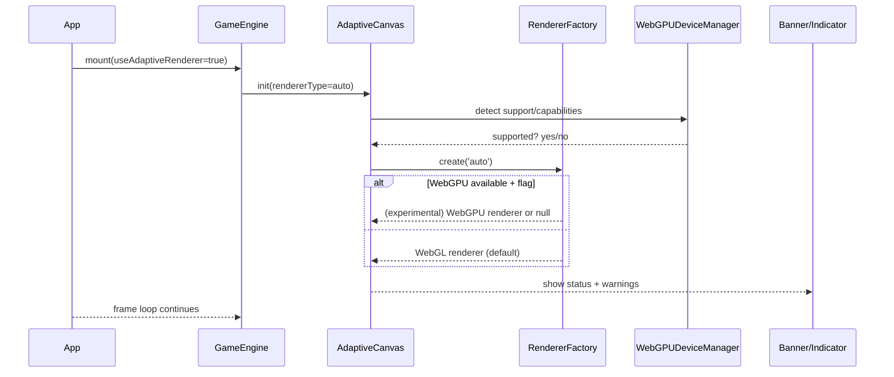

# WebGPU Integration PRD

## Overview

### Context & Goals

- Establish a safe, production‑ready path to leverage WebGPU capabilities while maintaining WebGL as a robust fallback.
- Prepare rendering architecture to adopt Three.js `WebGPURenderer` when it becomes viable, with minimal churn to the rest of the engine.
- Introduce an optional WebGPU compute track (culling/particles/cloth) that augments the current WebGL renderer.
- Instrument detection, UI messaging, and performance metrics for clear user/device behavior.

### Current Pain Points

- Detection utilities exist (`@core/utils/webgpu`) but the actual WebGPU renderer path is not wired; `RendererFactory.createWebGPURenderer` is a stub.
- R3F currently binds tightly to `WebGLRenderer`; direct `WebGPURenderer` integration is not supported in production flows.
- No standardized compute pipeline or WGSL asset pipeline; `.wgsl` imports are not configured in Vite.
- Inconsistent user feedback regarding availability (banners/indicators exist but need end‑to‑end validation and default placement).

## Proposed Solution

### High‑level Summary

- Keep WebGL as default; add an experimental WebGPU path gated behind feature flags and capability checks.
- Implement a "Compute‑Augmented WebGL" track that uses WebGPU for compute passes (e.g., culling/particles) with CPU fallbacks.
- Finalize detection, device‑lost handling, and UX banners; expose engine‑level toggles and presets (`webgpuPreset`).
- When Three.js `WebGPURenderer` stabilizes and R3F support lands, enable an alternative renderer path via `RendererFactory` without invasive changes elsewhere.

### Architecture & Directory Structure

```
/src/core/
  ├── components/
  │   └── AdaptiveCanvas.tsx            (augment: detection UX + injections)
  ├── hooks/
  │   └── useWebGPUSupport.ts           (augment: capabilities + device lost)
  ├── lib/
  │   └── rendering/
  │       ├── RendererFactory.ts        (implement WebGPU stub + feature flags)
  │       └── webgpu/
  │           ├── WebGPUComputeService.ts        (new: compute pipeline wrapper)
  │           ├── WebGPUDeviceManager.ts         (new: device/context + lost handling)
  │           ├── wgsl/
  │           │   ├── frustumCulling.wgsl        (new: example compute)
  │           │   └── particlesUpdate.wgsl       (new: example compute)
  │           └── types.ts                       (new: shared interfaces)
  └── utils/
      └── webgpu.ts                     (keep: detection/capabilities; minor augments)

/src/editor/
  └── components/
      └── WebGPUCompatibilityBanner.tsx (keep: ensure default placement + examples)

/examples/
  └── webgpu-example.tsx                (augment: compute demo and toggles)

/docs/PRDs/
  └── 4-43-webgpu-integration-prd.md    (this document)
```

## Implementation Plan

- Phase 1: Detection, UX, and Capability Normalization (0.5 day)

  1. Consolidate `detectWebGPU`, `getWebGPUCapabilities`, `checkWebGPUBrowserSupport` and add device‑lost handler (`navigator.gpu` events) via `WebGPUDeviceManager`.
  2. Ensure `WebGPUCompatibilityBanner` and a compact indicator are included in the default editor layout with clear messaging.
  3. Add `RendererFactory.isWebGPUSupported` usage to status bar and startup logs; unify messages.

- Phase 2: Compute‑Augmented WebGL Track (1.5 days)

  1. Introduce `WebGPUComputeService` with feature‑gated initialization; export methods for generic compute dispatch.
  2. Add two sample pipelines with CPU fallbacks: frustum culling and particle update.
  3. Provide hooks/adapter systems to map compute results into Three.js buffers (positions/visibility).
  4. Wire examples in `examples/webgpu-example.tsx`; document toggles.

- Phase 3: Vite/TypeScript Tooling for WGSL (0.25 day)

  1. Support importing `.wgsl` as raw strings (`?raw`) or add a minimal plugin; add `assetsInclude: ['**/*.wgsl']` and a `*.wgsl` module declaration.
  2. Update docs with WGSL authoring guidance and lint/tidy rules.

- Phase 4: RendererFactory WebGPU Path (experimental) (0.75 day)

  1. Implement `createWebGPURenderer` with guarded dynamic import `three/webgpu` (no breaking changes if import fails).
  2. Return a typed union from `RendererFactory` (`WebGLRenderer | unknown`) with adapter methods so consumers stay stable.
  3. Feature‑flag exposure (`engineConfig.renderer.type === 'webgpu'` + `experimentalWebGPU: true`).

- Phase 5: Metrics, QA, and Hardening (0.5 day)
  1. Frame metrics for compute dispatch time, device lost/recovery events, and fallback activations.
  2. Cross‑browser smoke tests: Chrome, Edge, Safari; Firefox behind flag.
  3. Document known limitations and a rollback switch.

## File and Directory Structures

```
/src/core/lib/rendering/webgpu/
├── WebGPUComputeService.ts
├── WebGPUDeviceManager.ts
├── wgsl/
│   ├── frustumCulling.wgsl
│   └── particlesUpdate.wgsl
└── types.ts

/src/core/lib/rendering/RendererFactory.ts
  (implement experimental createWebGPURenderer + feature flag)

/types/
└── wgsl.d.ts                   (declare '*.wgsl')

/examples/webgpu-example.tsx    (augmented demo)
```

## Technical Details

```ts
// src/core/lib/rendering/webgpu/types.ts
export interface IWebGPUDeviceContext {
  device: GPUDevice;
  queue: GPUQueue;
  adapter: GPUAdapter;
}

export interface IWebGPUComputePipeline<TParams = unknown> {
  readonly label: string;
  create(device: GPUDevice): Promise<void>;
  dispatch(device: GPUDevice, params: TParams): Promise<void>;
  dispose(): void;
}
```

```ts
// src/core/lib/rendering/webgpu/WebGPUDeviceManager.ts
export class WebGPUDeviceManager {
  private context: IWebGPUDeviceContext | null = null;

  async initialize(): Promise<IWebGPUDeviceContext | null> {
    // requestAdapter → requestDevice, configure loss handler
    return this.context;
  }

  onDeviceLost(listener: (info: GPUDeviceLostInfo) => void): () => void {
    return () => {};
  }

  getContext(): IWebGPUDeviceContext | null {
    return this.context;
  }
}
```

```ts
// src/core/lib/rendering/webgpu/WebGPUComputeService.ts
export interface IWebGPUComputeService {
  isAvailable(): boolean;
  registerPipeline(pipeline: IWebGPUComputePipeline): void;
  dispatch(label: string, params?: unknown): Promise<void>;
}

export const createWebGPUComputeService = (): IWebGPUComputeService => {
  // lazy init device; maintain registry by label
  return {
    isAvailable: () => false,
    registerPipeline: () => {},
    dispatch: async () => {},
  };
};
```

```ts
// src/core/lib/rendering/RendererFactory.ts (excerpt sketch)
// TODO: use feature flag + guarded dynamic import to avoid breaking builds
private static async createWebGPURenderer() {
  if (!('gpu' in navigator)) return null;
  try {
    // const { WebGPURenderer } = await import('three/webgpu');
    // const renderer = new WebGPURenderer({ canvas: options.canvas });
    // await renderer.init();
    // return { renderer, type: 'webgpu', capabilities: {/* TBD */} };
    return null; // keep experimental off by default
  } catch {
    return null;
  }
}
```

## Usage Examples

```ts
// Compute‑augmented scene (pseudo)
import { createWebGPUComputeService } from '@core/lib/rendering/webgpu/WebGPUComputeService';

const compute = createWebGPUComputeService();
if (compute.isAvailable()) {
  compute.registerPipeline(new FrustumCullingPipeline());
}

// Each frame or at cadence
await compute.dispatch('frustumCulling', { viewProjMatrix, aabbs });
```

```tsx
// App integration with UX
<>
  <WebGPUCompatibilityBanner position="top-right" autoDismiss={5000} />
  <GameEngine useAdaptiveRenderer={true} engineConfig={webgpuPreset}>
    {/* scene */}
  </GameEngine>
</>
```

## Testing Strategy

- Unit Tests

  - Device detection and capability parsing; device‑lost handler behavior.
  - Compute pipelines: parameter validation and dispatch cadence.
  - Fallback logic: CPU path produces identical outputs for small inputs.

- Integration Tests
  - Example scene runs with compute on supported browsers and falls back cleanly when disabled.
  - Banner/indicator UX shows correct status; renderer type correctly logged.
  - Performance metrics captured for dispatch time and frame stability.

## Edge Cases

| Edge Case                       | Remediation                                                                    |
| ------------------------------- | ------------------------------------------------------------------------------ |
| Firefox requires flag           | Detect and inform via banner; force WebGL path and CPU compute fallback.       |
| Device lost mid‑session         | `WebGPUDeviceManager` emits event; attempt re‑init, otherwise fallback to CPU. |
| Safari/iOS GPU limits           | Cap workgroup sizes; small batch processing; expose knobs in config.           |
| Missing/blocked `navigator.gpu` | Skip WebGPU init; log once; use WebGL + CPU compute.                           |
| WGSL import failures in build   | Add `*.wgsl` declarations and `assetsInclude`; fall back to embedded strings.  |

## Sequence Diagram



## Risks & Mitigations

| Risk                            | Mitigation                                                                   |
| ------------------------------- | ---------------------------------------------------------------------------- |
| R3F lacks stable WebGPU support | Keep WebGPU path experimental; ship compute‑only augmentation first.         |
| Vendor/browser churn            | Gate with feature flags; maintain fallbacks; test matrix per release.        |
| Type churn in `three/webgpu`    | Use guarded dynamic imports and adapter types; isolate in `RendererFactory`. |
| WGSL asset pipeline complexity  | Prefer `?raw` import; add minimal declarations; avoid heavy plugins early.   |

## Timeline

- Total: ~3.5 days
  - Phase 1: 0.5d
  - Phase 2: 1.5d
  - Phase 3: 0.25d
  - Phase 4: 0.75d
  - Phase 5: 0.5d

## Acceptance Criteria

- `RendererFactory.createWebGPURenderer` implemented behind feature flag; harmless when unsupported.
- `WebGPUComputeService` usable with at least one demo pipeline and a CPU fallback.
- `WebGPUCompatibilityBanner` and indicator show accurate status by default.
- Vite/TS can import `.wgsl` (string) and build succeeds on all targets.
- Documentation updated (guide + examples); logs clearly show selected renderer and capability summary.

## Conclusion

This plan safely advances WebGPU readiness without blocking current R3F/WebGL workflows. We gain immediate value via compute‑augmented features and clear UX, while isolating the future `WebGPURenderer` path behind stable abstractions to minimize migration risk.

## Assumptions & Dependencies

- Three.js ≥ 0.175.0; R3F current version; Yarn/Vite build; Zod available for config validation.
- Browsers: Chrome/Edge 113+, Safari 18+, Firefox 127+ (behind flag).
- No reliance on external WGSL compilers; raw WGSL import is sufficient for initial pipelines.
