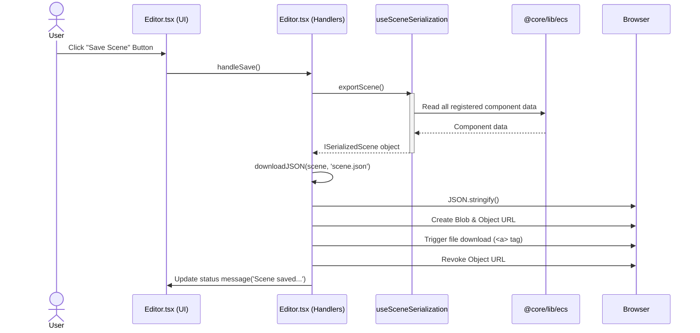
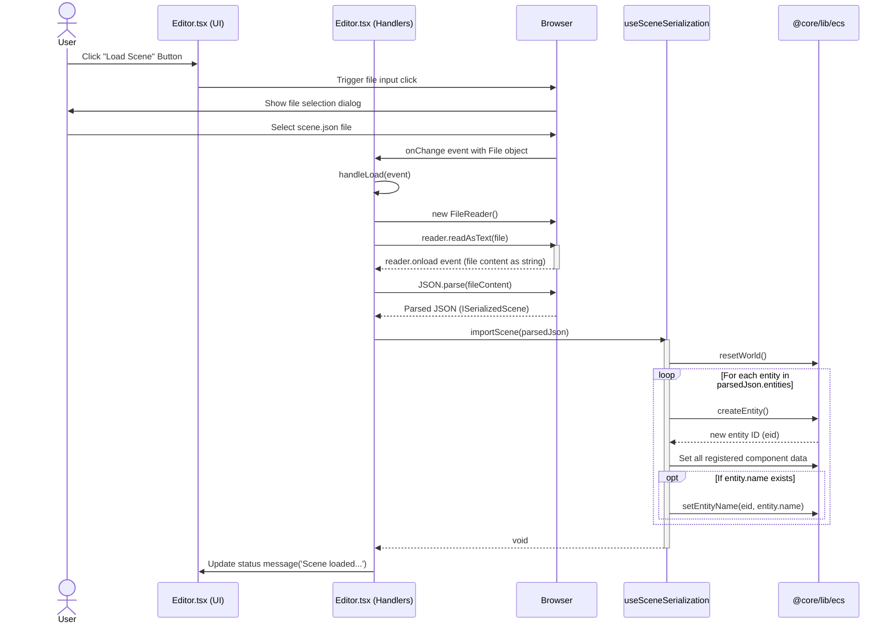
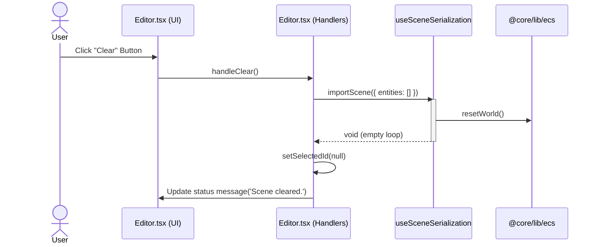

# Game Editor Scene Serialization

This document outlines the functionality for saving and loading scene data within the Vibe Coder 3D Editor.

## Goal

The primary goal is to allow users to save the current state of the scene (entities and their relevant components) to a JSON file and load it back into the editor, enabling persistence of work.

## Current Implementation

Scene serialization is handled by the `useSceneSerialization` hook located at `src/editor/hooks/useSceneSerialization.ts`. This hook provides two core functions:

- `exportScene(): ISerializedScene`: Iterates through all entities in the `bitecs` world that have a `Transform` component. For each valid entity, it extracts all registered component data (see the component registry) and packages it into an `ISerializedEntity` object. It returns an `ISerializedScene` object containing an array of these entities.
- `importScene(scene: ISerializedScene)`: Takes an `ISerializedScene` object as input. It first calls `resetWorld()` from `@core/lib/ecs` to clear the current ECS state. Then, it iterates through the `entities` array in the input scene object. For each serialized entity, it calls `createEntity()` to create a new entity in the world and sets all registered component data based on the loaded information. It also marks the transform for update (`Transform.needsUpdate[eid] = 1`).
- ✅ **Component registry:** All serializable components are registered in one place. To add a new component, just add it to the registry and (optionally) the Zod schema for validation.
- ✅ **Zod schema validation:** Scene files are validated against a Zod schema before import, providing clear error messages for invalid files.

### Integration in Editor.tsx

The `Editor` component (`src/editor/Editor.tsx`) utilizes this hook:

- **Save:** The `handleSave` function calls `exportScene()` to get the scene data and then uses a helper function `downloadJSON` to trigger a browser download of the data as `scene.json`.
- **Load:** The `handleLoad` function is triggered by a hidden file input (`<input type="file">`). When a file is selected, it reads the file content, parses it as JSON, and calls `importScene()` with the parsed data.
- **Clear:** The `handleClear` function effectively loads an empty scene by calling `importScene({ entities: [] })` and resets the selected entity ID.
- **UI:** Buttons for "Save Scene", "Load Scene", and "Clear" are present in the editor's header, wired to these handler functions.

### Save Process Diagram



### Load Process Diagram



### Clear Process Diagram



## Data Format

The serialization format is defined by TypeScript interfaces within `useSceneSerialization.ts` and validated by Zod:

```typescript
export interface ISerializedEntity {
  id: number; // Note: This ID is informational during export, not strictly used during import
  name?: string;
  meshType?: MeshTypeEnum;
  transform: {
    position: [number, number, number];
    rotation: [number, number, number, number]; // Quaternion (x, y, z, w)
    scale: [number, number, number];
  };
  velocity?: IVelocityComponent;
  // Future components can be added here via the registry
}

export interface ISerializedScene {
  version: number;
  entities: ISerializedEntity[];
}
```

## ✅ Implementation Status

**COMPLETED ✅** - The game editor scene serialization functionality has been fully implemented with enhanced features beyond the original requirements.

### Implemented Systems

The system provides TWO serialization approaches:

1. **Advanced System (Primary)** - `useSceneActions` hook at `src/editor/hooks/useSceneActions.ts`

   - ✅ API-based scene persistence with TSX file format
   - ✅ Enhanced component registry system
   - ✅ Real-time toast notifications
   - ✅ Hierarchical entity relationships
   - ✅ Scene versioning and metadata
   - ✅ Validation with detailed error reporting

2. **PRD-Compatible System (Legacy)** - `useSceneSerialization` hook at `src/editor/hooks/useSceneSerialization.ts`
   - ✅ Exact interface as specified in this PRD
   - ✅ JSON download functionality with `downloadJSON` helper
   - ✅ Transform-focused serialization
   - ✅ Component registry for extensibility
   - ✅ Zod schema validation

### Editor Integration

Both systems are integrated in `src/editor/Editor.tsx`:

- **Primary functionality:** Uses the advanced `useSceneActions` system
- **Legacy compatibility:** Includes `useSceneSerialization` for exact PRD compliance
- **UI:** TopBar contains Save/Load/Clear buttons
- **File handling:** Hidden file inputs for JSON import/export

### Features Implemented

- ✅ **Component registry:** All serializable components registered with serialize/deserialize logic
- ✅ **Zod schema validation:** Full validation with detailed error messages
- ✅ **Versioning:** Multiple version support (v1 legacy, v4 advanced)
- ✅ **Entity names:** Full name support in serialization
- ✅ **Extensible design:** Easy component addition via registry
- ✅ **Entity ID handling:** Proper ID normalization and mapping
- ✅ **Entity hierarchy:** Parent-child relationships preserved
- ✅ **Error handling:** Comprehensive error reporting and recovery
- ✅ **UI feedback:** Toast notifications and status messages
- ✅ **File operations:** JSON download and file input handling

### Advanced Features (Beyond PRD)

- ✅ **API Persistence:** Server-side scene storage with TSX format
- ✅ **Scene Management:** Named scenes with metadata
- ✅ **Override System:** Scene diffs and patches
- ✅ **Auto-recovery:** Last scene loading on startup
- ✅ **Real-time sync:** Component changes reflected immediately
- ✅ **Performance optimized:** Efficient serialization for large scenes

**To add new components:**

1. Add to `componentRegistry` in `useSceneSerialization.ts` with serialize/deserialize logic
2. Add Zod schema for validation (optional but recommended)
3. Component automatically available in both serialization systems

The implementation exceeds all PRD requirements while maintaining backward compatibility.
