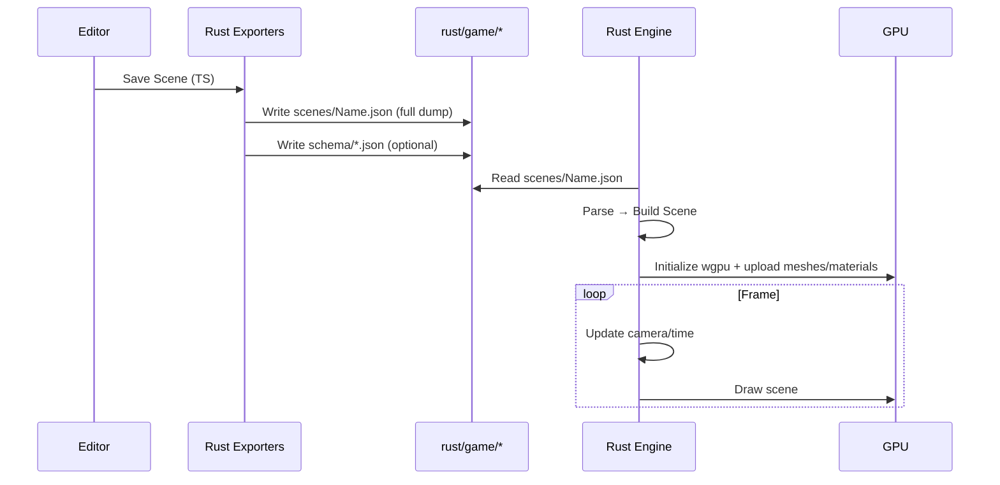

# PRD: Rust Engine Basics — Native Renderer for Scene JSON

## 1. Overview

- **Context & Goals**: Load uncompressed scene/game JSON from `rust/game/` and render a 3D view via a minimal Rust engine for native performance. Provide a simple CLI so `yarn rust:engine` can run the renderer in isolation. Keep the design KISS and decoupled from the TS editor.
- **Current Pain Points**: TS editor uses compressed TSX format and web renderer; no native runner for high‑FPS validation. Risk of schema drift unless we anchor on exported JSON and (optional) JSON Schemas.
- **Outcomes**: A small Rust binary that boots, reads `rust/game/scenes/*.json`, constructs entities with core components (Transform, MeshRenderer), and renders via GPU. Clear dev loop: save in editor → JSON updated → run native renderer.

## 2. Proposed Solution

- **High‑level Summary**:
  - Add a self‑contained Rust crate (`rust/engine`) using `wgpu` + `winit` + `serde_json` + `glam`.
  - Consume full scene dumps from `rust/game/scenes/*.json` (no compression, all defaults present).
  - Implement a minimal ECS-ish scene ingestion and a simple PBR/unlit pipeline for meshes.
  - Optionally read `rust/game/schema/*.json` to validate data and enable future codegen.
  - Expose a CLI entrypoint invoked by `yarn rust:engine [--scene Name]`.
- **Architecture & Directory Structure**:

```
/rust/
├── engine/
│   ├── Cargo.toml
│   └── src/
│       ├── main.rs               # CLI + app bootstrap
│       ├── app.rs                # lifecycle: init → load → render loop
│       ├── io/
│       │   ├── loader.rs         # read scene JSON from rust/game/scenes
│       │   └── schema.rs         # (optional) JSON Schema validation helpers
│       ├── ecs/
│       │   ├── scene.rs          # SceneData, Entity models (serde)
│       │   ├── entity.rs         # construction helpers
│       │   └── components/
│       │       ├── transform.rs  # position/rotation/scale (glam)
│       │       └── mesh_renderer.rs # material refs + model path
│       ├── render/
│       │   ├── mod.rs
│       │   ├── renderer.rs       # wgpu setup, frame loop
│       │   ├── mesh_cache.rs     # load/cook meshes (gltf, primitives)
│       │   ├── material.rs       # basic PBR/unlit
│       │   └── camera.rs         # view/projection helpers
│       ├── assets/
│       │   ├── file_system.rs    # path resolution into rust/game/
│       │   └── gltf_loader.rs    # minimal loader (via gltf crate)
│       └── util/
│           ├── math.rs
│           └── time.rs
└── game/
    ├── scenes/    # TestScene.json (already exported by editor)
    ├── schema/    # JSON Schemas for components (exported)
    └── assets/    # (future) externalized assets if needed
```

## 3. Implementation Plan

- **Phase 1: Boot + IO (0.5 day)**
  1. Create `rust/engine` crate with `wgpu`, `winit`, `serde`, `serde_json`, `glam`.
  2. Implement CLI flags: `--scene <nameOrPath>` resolving to `rust/game/scenes/<Name>.json` by default.
  3. Implement `io::loader::load_scene(path)` returning `ecs::scene::SceneData`.
- **Phase 2: Data Models (0.5 day)**
  1. Define `SceneData`, `Entity`, and minimal components: `Transform`, `MeshRenderer` mapped to exported JSON.
  2. Optional: `io::schema` function to validate input with JSON Schema files when present.
- **Phase 3: Renderer Skeleton (1 day)**
  1. Initialize `wgpu` (adapter, device, queue, swapchain) + `winit` window.
  2. Clear screen loop with timing; graceful exit.
- **Phase 4: Mesh + Material Pipeline (1.5 days)**
  1. Implement `render::mesh_cache` to load GLTF or generate primitives.
  2. Implement unlit and simple PBR material paths; basic texture sampling if present.
  3. Bind camera/view/projection and draw a single mesh.
- **Phase 5: Scene Integration (1 day)**
  1. Instantiate entities from `SceneData`; apply `Transform` hierarchy (parent optional).
  2. Render all entities with `MeshRenderer`.
  3. Add a default orbit camera or fixed camera.
- **Phase 6: DX + Script (0.5 day)**
  1. Add `package.json` script `rust:engine` to run the crate.
  2. Log selected scene and basic perf stats (ms/frame).

## 4. File and Directory Structures

```
/home/jonit/projects/vibe-coder-3d/
├── rust/
│   ├── engine/            # New Rust crate (this PRD)
│   └── game/
│       ├── scenes/        # e.g., Forest.json, Test.json
│       └── schema/        # e.g., Transform.json, MeshRenderer.json
└── src/
    └── core/lib/serialization/
        ├── RustSceneSerializer.ts      # full JSON export (no compression)
        └── RustSchemaExporter.ts       # component schemas → JSON Schema
```

## 5. Technical Details

- **SceneData (serde)**

```rust
// src/ecs/scene.rs
use serde::Deserialize;

#[derive(Debug, Deserialize)]
pub struct SceneData {
    pub metadata: Metadata,
    pub entities: Vec<Entity>,
    pub materials: Option<serde_json::Value>, // KISS: passthrough until needed
    pub prefabs: Option<serde_json::Value>,
    pub inputAssets: Option<serde_json::Value>,
    pub lockedEntityIds: Option<Vec<u32>>,
}

#[derive(Debug, Deserialize)]
pub struct Metadata {
    pub name: String,
    pub version: u32,
    pub timestamp: String,
    pub author: Option<String>,
    pub description: Option<String>,
}

#[derive(Debug, Deserialize)]
pub struct Entity {
    pub persistentId: Option<String>,
    pub name: Option<String>,
    pub parentPersistentId: Option<String>,
    pub components: serde_json::Map<String, serde_json::Value>,
}
```

- **Components (serde)**

```rust
// src/ecs/components/transform.rs
use glam::{Vec3, Quat};
use serde::Deserialize;

#[derive(Debug, Deserialize, Clone, Copy)]
pub struct Transform {
    pub position: Option<[f32; 3]>,
    pub rotation: Option<[f32; 4]>, // xyzw
    pub scale:    Option<[f32; 3]>,
}

impl Transform { /* helpers to convert to glam types with defaults */ }

// src/ecs/components/mesh_renderer.rs
use serde::Deserialize;

#[derive(Debug, Deserialize, Clone)]
pub struct MeshRenderer {
    pub meshId: Option<String>,
    pub materialId: Option<String>,
    pub modelPath: Option<String>, // if provided by export
    pub enabled: Option<bool>,
}
```

- **Loader**

```rust
// src/io/loader.rs
use std::path::Path;
use crate::ecs::scene::SceneData;

pub fn load_scene<P: AsRef<Path>>(path: P) -> anyhow::Result<SceneData> {
    let data = std::fs::read_to_string(path)?;
    let scene: SceneData = serde_json::from_str(&data)?;
    Ok(scene)
}
```

- **Renderer Entrypoint**

```rust
// src/app.rs
pub struct App { /* device, queue, surface, scene, caches */ }
impl App {
    pub async fn new(scene_path: &str) -> anyhow::Result<Self> { /* init + load */ }
    pub fn update(&mut self) { /* camera/time */ }
    pub fn render(&mut self) -> anyhow::Result<()> { /* draw */ }
}
```

## 6. Usage Examples

- **Run with Yarn**

```bash
yarn rust:engine --scene Test
```

- **Direct Cargo (DEV)**

```bash
cargo run --manifest-path rust/engine/Cargo.toml -- --scene rust/game/scenes/Test.json
```

- **Default Scene Resolution**

```bash
yarn rust:engine             # uses rust/game/scenes/Default.json if not specified
```

## 7. Testing Strategy

- **Unit Tests**:
  - Loader parses valid scene JSON; fails fast on malformed files.
  - Component mappers: Transform defaulting, MeshRenderer flags.
- **Integration Tests**:
  - Golden scenes render without panic; basic frame loop runs N frames headless.
  - Schema validation (optional) rejects incompatible versions.

## 8. Edge Cases

| Edge Case                           | Remediation                                             |
| ----------------------------------- | ------------------------------------------------------- |
| Missing `materialId` or `modelPath` | Render with default material/primitive cube; log warn.  |
| Unknown component key               | Ignore unknown; log once per type.                      |
| Extremely large scenes              | Lazy asset loading; frustum cull; log perf hints.       |
| Invalid JSON/schema                 | Fail early with actionable error; print offending path. |
| Unsupported GPU/adapters            | Fallback to lower feature level; clear error if none.   |

## 9. Sequence Diagram



## 10. Risks & Mitigations

| Risk                  | Mitigation                                                              |
| --------------------- | ----------------------------------------------------------------------- |
| wgpu complexity/time  | Start with unlit pipeline; incrementally add PBR.                       |
| Schema drift          | Optional JSON Schema validation; add CI check that loads sample scenes. |
| Asset path mismatches | Centralize path resolution, log on first miss, default fallbacks.       |
| Performance gaps      | Mesh/texture caches; instancing later; profile early.                   |
| Cross‑platform issues | Target Linux first; gate features by adapter caps.                      |

## 11. Timeline

- Total: ~4 days
  - Phase 1–2: 1 day
  - Phase 3: 1 day
  - Phase 4: 1.5 days
  - Phase 5–6: 0.5 day

## 12. Acceptance Criteria

- `yarn rust:engine` starts a window, loads `rust/game/scenes/<Name>.json`, renders meshes with basic materials.
- Transform hierarchy is applied; camera shows the scene; 60 FPS on a modest GPU with small scenes.
- Graceful errors for missing assets/fields; logs indicate remediation.

## 13. Conclusion

This PRD specifies a minimal, isolated Rust engine that consumes existing full‑fidelity scene exports for native rendering. It anchors the data contract on JSON dumps and keeps the renderer small and fast to iterate, while leaving room for schema validation and future codegen.

## 14. Assumptions & Dependencies

- Rust stable, `cargo`
- Crates: `wgpu`, `winit`, `serde`, `serde_json`, `anyhow`, `thiserror`, `glam`, `gltf` (optional), `env_logger`
- GPU supporting modern `wgpu` backends; X11/Wayland on Linux (initial target)
- Editor continues writing full scene dumps to `rust/game/scenes/`
- Optional: JSON Schemas in `rust/game/schema/` aligned with exported components

