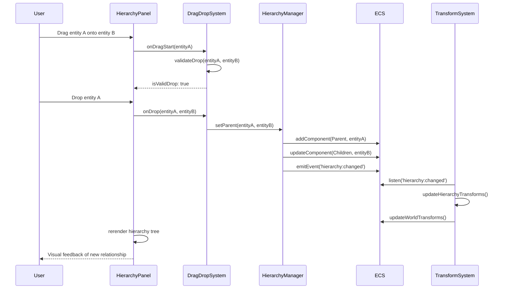

# Unity-Like Hierarchy System Implementation Plan

## Overview

### Context & Goals

- Implement Unity-style parent-child entity relationships in the hierarchy panel for intuitive scene organization
- Enable drag-and-drop functionality to create parent-child relationships between entities in the hierarchy
- Support automatic relationship behaviors (cameras following objects, UI elements attached to game objects, etc.)
- Provide visual hierarchy representation similar to Unity's scene hierarchy with nested indentation

### Current Pain Points

- Entities exist as flat lists without organizational structure or relationships
- No way to group related entities together or create logical hierarchies
- Transform operations don't propagate to related entities (no parent-child transform inheritance)
- Camera and other entities can't be easily linked to follow or relate to other game objects
- Scene organization becomes difficult with complex projects containing many entities

## Proposed Solution

### High-level Summary

- Extend the ECS system with Parent and Children components to track hierarchical relationships
- Implement drag-and-drop functionality in the hierarchy panel to establish parent-child relationships
- Add transform inheritance system where child transforms are relative to their parent
- Create automatic behavior systems that can respond to hierarchy changes (camera following, UI positioning)
- Maintain backward compatibility with existing flat entity structure

### Architecture & Directory Structure

```
src/
├── core/
│   ├── lib/
│   │   ├── ecs.ts                          # Add Parent/Children components
│   │   └── hierarchy-manager.ts            # New hierarchy management system
│   ├── systems/
│   │   ├── HierarchySystem.ts              # Transform inheritance system
│   │   └── TransformSystem.ts              # Updated to handle hierarchical transforms
│   ├── hooks/
│   │   ├── useHierarchy.ts                 # Hierarchy manipulation hooks
│   │   └── useParentChildRelation.ts       # Parent-child relationship hooks
│   └── components/
│       └── hierarchy/
│           ├── HierarchicalEntity.tsx      # Entity wrapper with hierarchy support
│           └── AutoFollowBehavior.tsx      # Auto-follow behavior component
├── editor/
│   ├── components/
│   │   └── panels/
│   │       └── HierarchyPanel/
│   │           ├── HierarchyPanel.tsx      # Updated with drag-drop
│   │           ├── HierarchyItem.tsx       # Updated with nesting support
│   │           ├── HierarchyDragDrop.tsx   # New drag-drop logic
│   │           └── HierarchyTree.tsx       # Tree rendering component
│   ├── hooks/
│   │   ├── useHierarchyDragDrop.ts         # Drag-drop state management
│   │   └── useHierarchyTree.ts             # Tree data structure management
│   └── lib/
│       └── hierarchy-serialization.ts      # Hierarchy serialization support
└── game/
    └── systems/
        ├── CameraFollowSystem.ts           # Camera following behavior
        └── UIAttachmentSystem.ts           # UI attachment to world objects
```

## Implementation Plan

### Phase 1: Core Hierarchy Infrastructure (1.5 days)

1. Add Parent and Children ECS components to track relationships
2. Create HierarchyManager class for relationship manipulation
3. Implement hierarchy query functions (getChildren, getParent, getRoot, etc.)
4. Add hierarchy event system for relationship changes
5. Update ECS serialization to support hierarchy data

### Phase 2: Transform Inheritance System (1 day)

1. Implement HierarchySystem for transform inheritance calculations
2. Update TransformSystem to handle world vs local transforms
3. Add transform propagation when parent transforms change
4. Implement efficient batch updates for transform hierarchies
5. Add debug visualization for transform inheritance

### Phase 3: Hierarchy Panel Drag-Drop (2 days)

1. Implement drag-and-drop functionality in hierarchy panel
2. Create visual feedback for valid drop targets and nesting levels
3. Add hierarchy tree rendering with proper indentation
4. Implement context menu actions for hierarchy operations
5. Add undo/redo support for hierarchy changes

### Phase 4: Behavior Systems (1.5 days)

1. Create camera follow system that responds to hierarchy relationships
2. Implement UI attachment system for world-space UI
3. Add automatic behavior triggers based on parent-child relationships
4. Create configurable relationship behaviors in inspector
5. Add visual indicators for active relationships

### Phase 5: Testing & Polish (1 day)

1. Create comprehensive test suite for hierarchy operations
2. Performance optimization for large hierarchies
3. Error handling and edge case management
4. Documentation and usage examples
5. Integration testing with existing systems

## File and Directory Structures

### Core ECS Components

```typescript
// src/core/lib/ecs.ts - New components
export const Parent = defineComponent({
  entityId: Types.ui32, // Parent entity ID
  isValid: Types.ui8, // Validation flag
});

export const Children = defineComponent({
  entities: [Types.ui32, 16], // Array of child entity IDs (max 16)
  count: Types.ui8, // Number of children
});

// Hierarchy metadata
export const HierarchyData = defineComponent({
  depth: Types.ui8, // Depth in hierarchy tree
  siblingIndex: Types.ui8, // Index among siblings
  hasChildren: Types.ui8, // Flag for parent entities
  isExpanded: Types.ui8, // UI state for hierarchy panel
});
```

### Hierarchy Manager

```typescript
// src/core/lib/hierarchy-manager.ts
export class HierarchyManager {
  setParent(childId: number, parentId: number | null): void;
  getParent(entityId: number): number | null;
  getChildren(entityId: number): number[];
  getDescendants(entityId: number): number[];
  getRoot(entityId: number): number;
  getSiblings(entityId: number): number[];
  isAncestor(ancestorId: number, descendantId: number): boolean;
  moveToSibling(entityId: number, newIndex: number): void;
}
```

### Drag-Drop System

```typescript
// src/editor/hooks/useHierarchyDragDrop.ts
export interface IHierarchyDragDropState {
  isDragging: boolean;
  draggedEntity: number | null;
  dropTarget: number | null;
  dropPosition: 'before' | 'after' | 'child';
  isValidDrop: boolean;
}

export function useHierarchyDragDrop(): {
  dragState: IHierarchyDragDropState;
  handleDragStart: (entityId: number) => void;
  handleDragOver: (entityId: number, position: DropPosition) => void;
  handleDrop: () => void;
  handleDragEnd: () => void;
};
```

## Technical Details

### ECS Component Schema

```typescript
// Parent-Child relationship components
interface IParentComponent {
  entityId: number; // Parent entity ID (0 = no parent)
  isValid: boolean; // Relationship validity flag
}

interface IChildrenComponent {
  entities: number[]; // Array of child entity IDs
  count: number; // Active children count
}

// Transform inheritance data
interface ILocalTransform {
  position: [number, number, number]; // Local position relative to parent
  rotation: [number, number, number]; // Local rotation relative to parent
  scale: [number, number, number]; // Local scale relative to parent
}

interface IWorldTransform {
  position: [number, number, number]; // World position (computed)
  rotation: [number, number, number]; // World rotation (computed)
  scale: [number, number, number]; // World scale (computed)
}
```

### Hierarchy System Algorithm

```typescript
// Efficient hierarchy transform update system
export function updateHierarchyTransforms(): void {
  // 1. Find all root entities (no parent)
  const rootEntities = hierarchyQuery.filter((entity) => !Parent.entityId[entity]);

  // 2. Recursively update children in breadth-first order
  const queue: Array<{ entity: number; depth: number }> = rootEntities.map((entity) => ({
    entity,
    depth: 0,
  }));

  while (queue.length > 0) {
    const { entity, depth } = queue.shift()!;

    // Update world transform from local + parent world
    updateWorldTransform(entity);

    // Add children to queue
    const children = getChildren(entity);
    children.forEach((child) => queue.push({ entity: child, depth: depth + 1 }));
  }
}
```

### Drag-Drop Validation

```typescript
// Prevent circular dependencies and invalid operations
function isValidDrop(draggedEntity: number, targetEntity: number): boolean {
  // Can't drop on self
  if (draggedEntity === targetEntity) return false;

  // Can't drop on descendant (would create cycle)
  if (isDescendant(targetEntity, draggedEntity)) return false;

  // Can't exceed maximum depth
  const targetDepth = getDepth(targetEntity);
  if (targetDepth >= MAX_HIERARCHY_DEPTH) return false;

  return true;
}
```

## Usage Examples

### Creating Parent-Child Relationships

```typescript
// Programmatic relationship creation
const camera = createEntity({ name: 'Main Camera', meshType: MeshTypeEnum.Camera });
const player = createEntity({ name: 'Player', meshType: MeshTypeEnum.Cube });

// Make camera follow player
hierarchyManager.setParent(camera, player);

// Camera will now inherit player's transform automatically
```

### Drag-Drop Hierarchy Building

```tsx
// In hierarchy panel - drag camera onto player cube
<HierarchyItem
  entity={camera}
  onDragStart={() => startDrag(camera)}
  onDragOver={(position) => validateDrop(camera, player, position)}
  onDrop={() => hierarchyManager.setParent(camera, player)}
/>
```

### Automatic Behavior Triggers

```typescript
// Camera follow behavior activated by hierarchy
export function CameraFollowSystem(): void {
  const camerasWithParents = cameraQuery.filter((camera) => hasComponent(world, Parent, camera));

  camerasWithParents.forEach((camera) => {
    const parent = Parent.entityId[camera];
    if (parent) {
      // Camera automatically follows parent's position with offset
      const offset = CameraFollowOffset.value[camera];
      setCameraLookAt(camera, parent, offset);
    }
  });
}
```

## Testing Strategy

### Unit Tests

- HierarchyManager relationship manipulation functions
- Transform inheritance calculations for nested hierarchies
- Circular dependency detection and prevention
- Serialization/deserialization of hierarchy data
- Drag-drop validation logic

### Integration Tests

- Hierarchy panel drag-drop interactions with live ECS data
- Transform propagation through multi-level hierarchies
- Camera follow behavior with dynamic parent changes
- Scene save/load with complex hierarchy structures
- Performance testing with large hierarchies (1000+ entities)

## Edge Cases

| Edge Case                                     | Remediation                                                             |
| --------------------------------------------- | ----------------------------------------------------------------------- |
| Circular dependency creation                  | Validate relationships before setting parent; reject invalid operations |
| Deep hierarchy performance                    | Implement depth limits and efficient batch processing                   |
| Orphaned entities after parent deletion       | Automatically promote children to root level or reparent to grandparent |
| Transform inheritance with non-uniform scales | Use proper matrix multiplication instead of simple addition             |
| Concurrent hierarchy modifications            | Implement operation queuing and batch processing                        |
| Undo/redo with complex hierarchy changes      | Store hierarchy snapshots and implement atomic operations               |

## Sequence Diagram



## Risks & Mitigations

| Risk                                              | Mitigation                                                 |
| ------------------------------------------------- | ---------------------------------------------------------- |
| Performance degradation with large hierarchies    | Implement efficient querying, caching, and batch updates   |
| Complex debugging of transform inheritance issues | Add comprehensive debug visualization and logging          |
| Breaking existing scenes without hierarchy        | Maintain backward compatibility and provide migration path |
| User confusion with new drag-drop behavior        | Implement clear visual feedback and user guidance          |
| Memory overhead from hierarchy components         | Optimize component data structures and use sparse storage  |

## Timeline

- **Phase 1 (Core Infrastructure):** 1.5 days
- **Phase 2 (Transform Inheritance):** 1 day
- **Phase 3 (Hierarchy Panel UI):** 2 days
- **Phase 4 (Behavior Systems):** 1.5 days
- **Phase 5 (Testing & Polish):** 1 day

**Total Estimated Time:** 7 days

## Acceptance Criteria

- Users can drag entities in hierarchy panel to create parent-child relationships
- Child entities automatically inherit parent transforms (position, rotation, scale)
- Visual hierarchy tree shows proper nesting with indentation
- Camera entities can be made to follow other entities by parenting
- Scene serialization preserves hierarchy relationships
- No performance regression with up to 500 entities in complex hierarchies
- All existing functionality continues to work without modification
- Comprehensive test coverage for hierarchy operations
- Clear visual feedback during drag-drop operations
- Undo/redo support for hierarchy changes

## Conclusion

This hierarchy system will bring Unity-like organizational capabilities to Vibe Coder 3D, enabling intuitive scene building through drag-and-drop relationships. The system maintains performance through efficient ECS patterns while providing the user experience developers expect from modern game engines. The phased implementation ensures incremental delivery of value while maintaining system stability.

## Assumptions & Dependencies

- React DnD or similar drag-drop library for smooth interactions
- Existing ECS system supports dynamic component addition/removal
- Transform system can be modified without breaking existing functionality
- Scene serialization system can be extended for hierarchy data
- No breaking changes to existing entity creation workflows
- Performance requirements allow for real-time transform inheritance calculations
