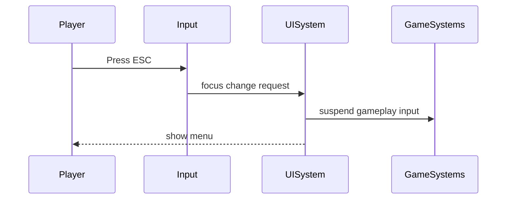

# In-Game UI System PRD

## Overview

### Context & Goals

- Provide an in-game UI layer (HUD, menus, prompts) decoupled from the editor UI.
- Integrate UI state with ECS to drive UI from gameplay data.
- Support responsive rendering, input focus management, and accessibility.
- Enable performant overlays with predictable update cadence.

### Current Pain Points

- No dedicated runtime UI layer separate from the editor.
- Ad-hoc overlays risk input focus conflicts with gameplay.
- No standardized UI component schema or lifecycle.
- Limited testability and no acceptance criteria for UI/UX behaviors.

## Proposed Solution

### High‑level Summary

- Introduce a `UISystem` that orchestrates in-game UI rendering and focus.
- Define a `UIComponent` with Zod-validated schema bound to ECS entities.
- Provide a lightweight UI widget library (health bars, prompts, crosshair).
- Establish input focus routing between UI and gameplay actions.
- Render via a dedicated React subtree layered above the 3D canvas.

### Architecture & Directory Structure

```
/src/core/
  ├── systems/
  │   └── UISystem.ts
  ├── components/
  │   └── ui/
  │       ├── InGameUIRoot.tsx
  │       ├── widgets/
  │       │   ├── HealthBar.tsx
  │       │   ├── Crosshair.tsx
  │       │   └── Prompt.tsx
  │       └── schema/
  │           └── UIComponent.schema.ts
  └── lib/
      └── ui/
          ├── focusRouter.ts
          └── uiState.ts
```

## Implementation Plan

1. Phase 1: Foundations (0.5 day)

   1. Define Zod schemas and component contracts
   2. Create `InGameUIRoot` layering above canvas
   3. Add `focusRouter` and input guard hooks

2. Phase 2: Widgets (1 day)

   1. Implement `HealthBar`, `Crosshair`, `Prompt`
   2. Bind to ECS via selectors
   3. Add perf toggles and visibility rules

3. Phase 3: Integration (0.5 day)
   1. Mount `InGameUIRoot` inside engine shell
   2. Route input focus between UI and gameplay
   3. Add snapshot tests

## File and Directory Structures

```
/docs/implementation/
  └── 4-9-in-game-ui-system-prd.md
```

## Technical Details

```ts
// contracts
export interface IUIComponent {
  id: string;
  type: 'HealthBar' | 'Crosshair' | 'Prompt' | string;
  visible: boolean;
  anchor?: 'top-left' | 'top-right' | 'bottom-left' | 'bottom-right' | 'center';
  props?: Record<string, unknown>;
}

export interface IUISystemApi {
  setFocus(target: 'ui' | 'game'): void;
  isUIFocused(): boolean;
}
```

### Editor & Component Integration

```ts
// 1) Add a new KnownComponentType
// src/core/lib/ecs/IComponent.ts
export const KnownComponentTypes = {
  // ...existing,
  UI: 'UI',
} as const;

// 2) Define schema & data type
// src/core/components/ui/schema/UIComponent.schema.ts
import { z } from 'zod';
export const UIComponentSchema = z.object({
  visible: z.boolean().default(true),
  widget: z.enum(['HealthBar', 'Crosshair', 'Prompt']).default('Prompt'),
  anchor: z
    .enum(['top-left', 'top-right', 'bottom-left', 'bottom-right', 'center'])
    .default('center'),
  props: z.record(z.unknown()).optional(),
});
export type UIData = z.infer<typeof UIComponentSchema>;

// 3) Inspector adapter
// src/editor/components/inspector/adapters/UIAdapter.tsx
export const UIAdapter: React.FC<{
  uiComponent: IComponent<UIData> | null;
  updateComponent: (type: string, data: unknown) => boolean;
  removeComponent: (type: string) => boolean;
  entityId: number;
}> = ({ uiComponent, updateComponent, removeComponent, entityId }) => {
  // form bindings for visible/widget/anchor/props
  return null;
};

// 4) Add to AddComponentMenu with defaults
// src/editor/components/menus/AddComponentMenu.tsx
COMPONENT_DEFINITIONS.push({
  id: KnownComponentTypes.UI,
  name: 'UI',
  description: 'In‑game UI widgets (HUD, prompts)',
  icon: /* choose icon */,
  category: 'UI',
});
// in handleAddComponent(...), add defaultData for UI
case KnownComponentTypes.UI:
  defaultData = { visible: true, widget: 'Prompt', anchor: 'center', props: { text: 'Press E' } };
  break;

// 5) Render in ComponentList
// src/editor/components/inspector/sections/ComponentList.tsx
// detect presence via componentManager.getComponent(entityId, KnownComponentTypes.UI)
// then render <UIAdapter .../>

// 6) Focus routing with input
// src/core/lib/ui/focusRouter.ts
export function shouldConsumeInput(): boolean { return uiState.focus === 'ui'; }
// integrate in useInput()/ScriptSystem mock input to respect UI focus

// 7) Runtime registration & mount
// src/core/systems/UISystem.ts
registerSystem({ id: 'core.ui', order: 80, update: (dt) => uiSystem.update(dt) });
// src/core/components/ui/InGameUIRoot.tsx rendered in GameEngine shell above Canvas
```

## Usage Examples

```ts
// Register a prompt UI for an entity
uiSystem.create({
  id: 'interactPrompt',
  type: 'Prompt',
  visible: true,
  props: { text: 'Press E' },
});

// Toggle focus when menus open
uiSystem.setFocus('ui');
```

## Testing Strategy

- Unit: focus router, visibility rules, schema validation.
- Integration: UI overlay mounts with engine; input routing blocks gameplay when focused.

## Edge Cases

| Edge Case             | Remediation                              |
| --------------------- | ---------------------------------------- |
| Resolution changes    | Recompute anchors and scaling on resize  |
| Rapid focus toggling  | Debounce focus changes; idempotent state |
| Controller navigation | Map D-pad/axes to UI focus traversal     |

## Sequence Diagram



## Risks & Mitigations

| Risk                 | Mitigation                              |
| -------------------- | --------------------------------------- |
| Focus conflicts      | Centralized router with priority rules  |
| Performance overhead | Memoized widgets; conditional rendering |

## Timeline

- Total: ~2 days (Foundations 0.5, Widgets 1, Integration 0.5)

## Acceptance Criteria

- UI overlay mounts independently of editor UI.
- Focus routing blocks gameplay input when UI focused.
- Widgets render from ECS state and pass schema validation.

## Conclusion

This system provides a clean, testable in‑game UI layer with deterministic focus and ECS binding.

## Assumptions & Dependencies

- React + existing engine shell; Zod available for schemas; input system exposes action states.
