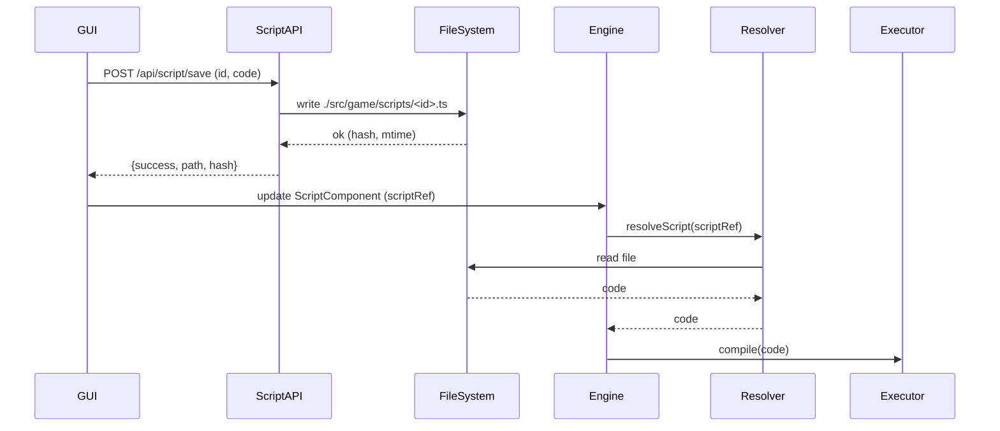

# External Script System PRD

🧠 Planning documents standards rule loaded!

## Overview

- **Context & Goals**: Enable seamless authoring of gameplay scripts either in-GUI (Script component) or as external files under `src/game/scripts`, with live sync both ways. Persist script references in scene `.tsx`, similar to scene serialization patterns. Provide dev-quality ergonomics comparable to mainstream game engines.
- **Current Pain Points**: Scripts exist only inline in components; no durable external source of truth; no API to save/load/update scripts from the editor; scene `.tsx` lacks explicit references to external scripts for tooling and reviews.

## Proposed Solution

- **High‑level Summary**:
  - Introduce external script assets at `src/game/scripts/*.ts` with a typed descriptor interface and optional lifecycle methods.
  - Add bi‑directional sync: editing in GUI updates external file; editing external file hot‑reloads GUI via Vite middleware.
  - Extend scene TSX generation to embed a script reference manifest per entity and import/registration hints.
  - Provide a Vite dev‑server API (like `scene-api`) for script CRUD: save, load, list, rename, validate, and diff.
  - Reuse `ScriptComponent`/`ScriptSystem`/`ScriptExecutor` and add a resolver that loads code by `scriptId`.
- **Architecture & Directory Structure**:
  ```
  /src/
  ├── plugins/
  │   └── vite-plugin-script-api.ts        # New: middleware for script CRUD + validation
  ├── core/
  │   ├── lib/
  │   │   ├── serialization/
  │   │   │   └── tsxSerializer.ts         # Update: include script references in scene TSX
  │   │   ├── scripting/
  │   │   │   ├── ScriptExecutor.ts        # Read: unchanged; integrate with resolver
  │   │   │   ├── SafeScriptExecutor.ts    # Read: unchanged
  │   │   │   └── ScriptResolver.ts        # New: resolves code from external files or component inline
  │   ├── systems/ScriptSystem.ts          # Update: prefer external code when scriptRef present
  │   └── lib/ecs/components/definitions/
  │       └── ScriptComponent.ts           # Update: add `scriptId`, `source`, `path`, hash
  └── game/
      └── scripts/
          ├── README.md
          └── <kebab-or-dot-id>.ts        # Generated external scripts
  ```

## Implementation Plan

- Phase 1: Foundations (0.5 day)
  1. Add `IScriptRef` type and extend `ScriptData` with `scriptId`, `source: 'external'|'inline'`, `path?: string`, `codeHash`.
  2. Implement `ScriptResolver` to fetch code by `scriptId` from memory or file system via dev API.
  3. Update `ScriptSystem` to call resolver before compilation; fall back to inline `code`.
- Phase 2: Vite Script API (0.5 day)
  1. Create `vite-plugin-script-api.ts` exposing `/api/script/save`, `/load`, `/list`, `/rename`, `/delete`, `/validate`, `/diff`.
  2. Validation: zod schema, size limits, name sanitization, JSON-serializable metadata.
  3. File ops: write to `./src/game/scripts`, compute hashes, return metadata.
- Phase 3: Scene TSX Integration (0.5 day)
  1. Extend `tsxSerializer.generateTsxScene` to embed `scripts` manifest and entity `components.Script.scriptId` when present.
  2. Add optional import hints or comments for known `scriptId`s.
  3. Update `vite-plugin-scene-api.ts` save‑tsx path to pass through script refs untouched.
- Phase 4: Editor Sync (0.5–1 day)
  1. GUI Script editor: when saving, if `source==='external'` call `/api/script/save` and update component fields (id/path/hash/timestamp).
  2. Add “Convert to external/inline” actions; support rename and deletion with confirmations.
  3. Hot reload: plugin sends ETag/hash; client compares and requests recompile; debounce to avoid thrash.
- Phase 5: Quality & Docs (0.25 day)
  1. Unit tests for resolver and API validation.
  2. Integration tests for CRUD and scene round‑trip.
  3. Update docs and examples (`src/game/scripts/PlayerController.ts`).

## File and Directory Structures

```markdown
/src/core/lib/scripting/ScriptResolver.ts
/src/plugins/vite-plugin-script-api.ts
/src/game/scripts/<script-id>.ts
```

## Technical Details

- `IScriptRef` (zod) minimal skeleton:

```ts
export interface IScriptRef {
  scriptId: string; // e.g., "game.player-controller"
  source: 'external' | 'inline';
  path?: string; // ./src/game/scripts/game.player-controller.ts
  codeHash?: string; // sha1/sha256 for change detection
  lastModified?: number;
}
```

- `ScriptComponent` additions:

```ts
// Extend schema with scriptRef (optional)
scriptRef?: IScriptRef;
// If scriptRef.source==='external', ignore inline code on compile; use resolver
```

- `ScriptResolver` responsibilities:

```ts
export interface IScriptResolution {
  code: string; // script source
  origin: 'external' | 'inline';
  path?: string;
  hash?: string;
}
export function resolveScript(entityId: number, data: ScriptData): Promise<IScriptResolution>;
```

- Vite middleware endpoints (request/response) examples:

```http
POST /api/script/save { id, path?, code, description?, author? }
GET  /api/script/load?id=<id> | ?path=<path>
GET  /api/script/list
POST /api/script/rename { id, newId }
POST /api/script/delete { id }
POST /api/script/validate { code }
GET  /api/script/diff?id=<id>&hash=<hash>
```

- TSX scene embedding:

```ts
// In scene TSX generation
components: {
  Script: {
    scriptRef: { scriptId: 'game.player-controller', source: 'external', path: './src/game/scripts/game.player-controller.ts' },
    parameters: { speed: 5 },
    executeInUpdate: true,
  }
}
```

## Usage Examples

- Convert inline to external (GUI action triggers API):

```ts
await fetch('/api/script/save', {
  method: 'POST',
  body: JSON.stringify({ id: 'game.player-controller', code }),
});
// Update component: scriptRef, clear inline code or keep as fallback
```

- External authoring:

```ts
// src/game/scripts/game.player-controller.ts
export const onUpdate = (entity, { deltaTime }) => {
  entity.transform.translate(0, 0, deltaTime * 2);
};
```

- Runtime resolution in system:

```ts
const { code } = await resolveScript(eid, data);
executor.compileScript(code, `entity_${eid}`);
```

## Testing Strategy

- **Unit Tests**:
  - ScriptResolver resolves external over inline when `scriptRef` present.
  - Validation rejects oversized files and invalid ids.
  - Hash change triggers recompile.
- **Integration Tests**:
  - Save -> list -> load -> modify -> diff -> reload in editor.
  - Scene TSX round‑trip preserves `scriptRef` and loads successfully.

## Edge Cases

| Edge Case                     | Remediation                                                            |
| ----------------------------- | ---------------------------------------------------------------------- |
| Conflicting edits GUI vs file | Last‑writer‑wins with ETag/hash prompt; manual merge via diff endpoint |
| Missing external file         | Fallback to inline code; mark error in UI                              |
| Invalid `scriptId` or name    | Sanitize, enforce pattern `a-z0-9.-_`, map to filename                 |
| Huge script file              | Reject > 256KB with helpful error                                      |
| Rename collision              | Suffix `-2` and return notice                                          |
| Windows path separators       | Normalize to posix in metadata                                         |

## Sequence Diagram



## Risks & Mitigations

| Risk                                 | Mitigation                                                                                             |
| ------------------------------------ | ------------------------------------------------------------------------------------------------------ |
| Security of executing user code      | Maintain SAFE static executor; no eval; pattern‑based; sandboxed API                                   |
| Editor/FS desync                     | Use hashes and timestamps; debounced hot reload; explicit conflicts UI                                 |
| Build compatibility                  | Scripts live in `src/game/scripts` and are not imported at runtime builds unless explicitly referenced |
| Naming drift between id and filename | Single source of truth is `id`; filename derived and sanitized                                         |

## Timeline

- Total ~2.25–2.75 days
  - Phase 1: 0.5d
  - Phase 2: 0.5d
  - Phase 3: 0.5d
  - Phase 4: 0.75–1.25d
  - Phase 5: 0.25d

## Acceptance Criteria

- `ScriptComponent` supports `scriptRef` with external source; inline remains functional.
- Vite API provides script CRUD, validation, and listing.
- Editing in GUI round‑trips to external files; external edits hot‑reload.
- Scene `.tsx` includes script references; loading works via resolver.
- Tests for resolver and API pass.

## Conclusion

This design brings engine‑grade scripting ergonomics: devs can author scripts in the GUI or directly in files; scenes persist stable references; and the runtime resolves, validates, and executes scripts safely with robust tooling.

## Assumptions & Dependencies

- Vite dev server available for middleware; production build excludes dev API.
- Continue using Zod for validation and strong typing.
- Reuse existing `ScriptExecutor` and `ScriptSystem` with minimal changes.
- Path aliases exist per current `tsconfig`.

### Detailed API Contracts

- Save Script

```http
POST /api/script/save
Content-Type: application/json
{
  id: string,              // required, e.g. "game.player-controller"
  code: string,            // required
  description?: string,
  author?: string,
  knownHash?: string       // optional ETag for conflict detection
}
---
200 OK
{
  success: true,
  id: string,
  path: string,            // ./src/game/scripts/<id>.ts
  hash: string,            // sha256 of content
  modified: string         // ISO timestamp
}
---
409 Conflict
{
  error: 'hash_mismatch',
  serverHash: string,
  diff?: string            // unified diff (optional)
}
```

- Load Script

```http
GET /api/script/load?id=<id>
---
200 OK
{ success: true, id, path, code, hash, modified }
404 Not Found
{ error: 'not_found' }
```

- List Scripts

```http
GET /api/script/list
---
200 OK
{ success: true, scripts: Array<{ id, filename, path, hash, modified, size }> }
```

- Rename Script

```http
POST /api/script/rename
{ id: string, newId: string }
---
200 OK { success: true, id: newId, oldId: id, path, hash, modified }
409 Conflict { error: 'exists' }
404 Not Found { error: 'not_found' }
```

- Delete Script

```http
POST /api/script/delete
{ id: string }
---
200 OK { success: true }
404 Not Found { error: 'not_found' }
```

- Validate Script

```http
POST /api/script/validate
{ code: string }
---
200 OK { success: true, issues: Array<{ level: 'error'|'warn', message: string, line?: number }> }
```

- Diff Script

```http
GET /api/script/diff?id=<id>&hash=<clientHash>
---
200 OK { success: true, same: boolean, serverHash: string, diff?: string }
```

### Zod Schemas (server-side)

```ts
import { z } from 'zod';

export const ScriptIdSchema = z
  .string()
  .min(3)
  .max(128)
  .regex(/^[a-z0-9._-]+$/i);

export const SaveScriptRequestSchema = z.object({
  id: ScriptIdSchema,
  code: z.string().min(0).max(262_144),
  description: z.string().max(2000).optional(),
  author: z.string().max(256).optional(),
  knownHash: z.string().optional(),
});

export const ScriptInfoSchema = z.object({
  id: ScriptIdSchema,
  filename: z.string(),
  path: z.string(),
  hash: z.string(),
  modified: z.string(),
  size: z.number(),
});

export const SaveScriptResponseSchema = z.object({
  success: z.literal(true),
  id: ScriptIdSchema,
  path: z.string(),
  hash: z.string(),
  modified: z.string(),
});
```

### Serialization & Deserialization Changes

- Scene TSX generation (`tsxSerializer.ts`):
  - Preserve `components.Script.scriptRef` if present.
  - Do not inline external code into TSX; keep `scriptRef` only.
  - Materials and other components remain unchanged.

```ts
// Pseudocode inside generateTsxScene mapping for entity components
const safeComponents = JSON.parse(JSON.stringify(components));
// if (safeComponents.Script?.scriptRef) ensure fields { scriptId, source: 'external', path }
```

- Scene TSX loading (`vite-plugin-scene-api.ts:handleLoadTsx`):
  - The existing normalization that quotes keys and parses arrays already supports nested objects; ensure `scriptRef` survives.
  - No extra parsing is required, but add validation: if `scriptRef.source==='external'` and file missing, add warning in response.

### Sync & Conflict Resolution

- Client maintains `{ id, hash }` for the open script; server enforces optimistic concurrency using `knownHash`.
- On 409, show diff and allow:
  - Overwrite server (force save): resend with `force: true` or accept remote and merge locally.
  - Pull server version: update GUI content, recompile, and mark as synced.
- Hashing: `sha256(code)` hex; server returns as `hash` and optional `ETag` header `W/"sha256-<hash>"`.
- Debounce writes (e.g., 300–500ms) and coalesce responses to avoid thrashing recompiles.

### Dev vs Prod Behavior

- Dev: Vite middleware serves CRUD; engine resolves code from FS via the middleware, not dynamic import.
- Prod: Editing disabled; two options (future work):
  - Generate a `script-bundle.json` at build time with `{ id -> code, hash }` and have resolver read from bundle.
  - Or require scenes to carry inline code for shipping; not recommended. Prefer bundle.

### Compatibility with Early Script Implementation

- Existing assets:
  - `ScriptComponent` with `code`, flags, parameters — remains backwards-compatible.
  - `ScriptExecutor` static pattern parsing — continues to run code from either inline or external.
  - `registerScript` extension points — optional compile-time registration path for project scripts.
- External file authoring contract:
  - Recommend defining lifecycle as either:
    - `function onStart(...) { ... }` / `function onUpdate(...) { ... }`, or
    - `const onUpdate = (...) => { ... }`.
  - Exports are optional; executor reads raw code text. Keep top-level code minimal.
- Optional registry generation:
  - Provide a future script to generate `src/game/scripts/registry.ts` that calls `registerScript({...})` for known ids, enabling hybrid projects that use both executor and extension points.

### Naming & ID Mapping

- `id` is canonical (e.g., `game.player-controller`).
- Filename derived: `<id>.ts` with invalid chars replaced by `-`.
- Directory is fixed: `./src/game/scripts` (no traversal); reject paths containing `..` or leading `/`.

### Security & FS Constraints

- Only allow read/write/delete inside `./src/game/scripts`.
- Reject symlinks and ensure `fs.realpath` stays within the scripts dir.
- Size limit: 256KB per file (configurable).
- Sanitize IDs and filenames per schema.
