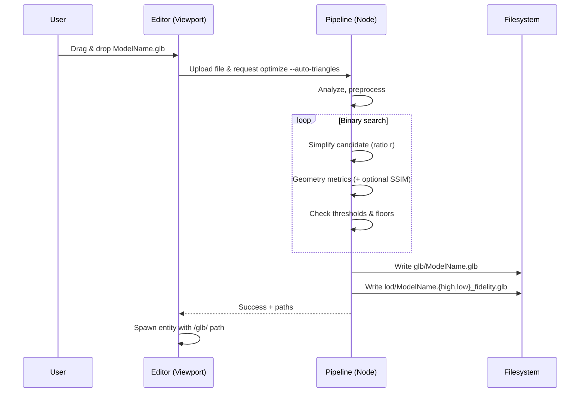

# Auto‑Selection of Minimal Viable Triangles for GLB (with Drag‑and‑Drop UX)

## Overview

- **Context & Goals**

  - Automatically choose the lowest triangle count that preserves perceptual quality for base `glb/` models (LOD0), reducing GPU/CPU cost and download size.
  - Integrate seamlessly with existing LOD pipeline and editor flow, including drag‑and‑drop ingestion.
  - Keep outputs compatible with both the web (Three.js) and Rust engine (meshopt).
  - Maintain deterministic, configurable results suitable for CI and cacheability.

- **Current Pain Points**
  - Fixed simplification ratios lead to suboptimal results across diverse assets.
  - Manual tuning is time‑consuming and inconsistent.
  - No objective quality gate to ensure decimation doesn’t introduce visible artifacts.

## Proposed Solution

- **High‑level Summary**

  - Add an “Auto Triangle Budget” stage that runs a binary search over simplification ratios to find the minimal viable triangle count that meets user‑defined quality thresholds.
  - Use fast geometry‑based metrics by default (RMSE/normal deviation/bounds preservation), and optional perceptual rendering checks (multi‑view SSIM) for high‑fidelity projects.
  - Persist results in `glb/` (LOD0) and generate `lod/` variants around the selected baseline.
  - Expose config via `.model-optimization.config.json` and CLI flags; provide per‑model overrides.

- **Architecture & Directory Structure**
  - Keep the `glb/` folder: it is the base optimized “original” quality used by `LODManager` when `quality === 'original'` and by scenes that point to `/glb/Model.glb`. `lod/` continues to store named variants.

```
/scripts/
├── optimize-models.js                 # Primary pipeline (public/assets/models)
├── lib/
│   ├── autoTriangleBudget.js          # New: binary search + metrics
│   ├── qualityMetrics.js              # New: geometry & optional perceptual metrics
│   └── modelAnalyzer.js               # Existing

/public/assets/models/ModelName/
├── ModelName.glb                      # SOURCE (committed)
├── glb/                               # BASE OPTIMIZED (LOD0)
│   └── ModelName.glb                  # Auto-selected minimal viable triangles
└── lod/                               # LOD VARIANTS
    ├── ModelName.high_fidelity.glb
    └── ModelName.low_fidelity.glb

/docs/PRDs/assets/
└── auto-triangle-budget-prd.md        # This document
```

## Implementation Plan

- Phase 1: Metrics & Algorithm (0.5 day)

  1. Implement geometry metrics: triangle count, vertex count, bounds delta, position RMSE (relative), normal deviation (deg), UV stretch ratio.
  2. Implement `findMinimalViableRatio()` with binary search over `ratio ∈ [0.05, 1.0]` using `@gltf-transform/functions.simplify` (MeshoptSimplifier).
  3. Add optional perceptual check (multi‑view SSIM) behind a config flag.

- Phase 2: Pipeline Integration (0.75 day)

  1. Integrate auto‑selection into `scripts/optimize-models.js` before writing `glb/` output.
  2. Generate `lod/` variants relative to the selected baseline (e.g., ± factors) with existing pathing.
  3. Expose config in `.model-optimization.config.json` and CLI flags; update manifest caching to include metrics profile hash.

- Phase 3: Editor Drag‑and‑Drop UX (0.5 day)

  1. Add a viewport dropzone that accepts `.glb/.gltf/.fbx/.obj` and streams the file to the local pipeline (non‑interactive).
  2. Show progress (upload → analyze → auto‑select → write outputs → register asset) and then spawn an entity using the resolved `glb/` path.

- Phase 4: QA & Guardrails (0.25 day)
  1. Add unit tests for metrics and search logic.
  2. Add integration tests that validate pathing and LOD switching in a sample scene.
  3. Document tuning guidelines and defaults.

## File and Directory Structures

```text
scripts/lib/autoTriangleBudget.js
scripts/lib/qualityMetrics.js
scripts/optimize-models.js            # extended
.model-optimization.config.json       # extended
src/editor/components/panels/ViewportPanel/ModelDropZone.tsx
src/editor/hooks/useModelIngestion.ts
```

## Technical Details

### Config (new/extended)

```json
{
  "pipelineVersion": 5,
  "autoTriangles": {
    "enabled": true,
    "minRatio": 0.05,
    "maxRatio": 1.0,
    "targetClassificationBudgets": {
      "hero": { "minTriangles": 20000 },
      "prop": { "minTriangles": 5000 },
      "background": { "minTriangles": 1500 }
    },
    "geometryThresholds": {
      "positionRmseRel": 0.01,
      "maxNormalDeviationDeg": 8,
      "maxBoundsDeltaRel": 0.002,
      "maxUvStretchRel": 0.05
    },
    "perceptual": {
      "enabled": false,
      "views": 6,
      "ssimThreshold": 0.985,
      "resolution": 512
    }
  },
  "lod": {
    "enabled": true,
    "variants": {
      "high_fidelity": { "ratio": 0.6, "error": 0.01 },
      "low_fidelity": { "ratio": 0.25, "error": 0.1 }
    }
  }
}
```

### Core API (Node, camelCase)

```ts
// scripts/lib/autoTriangleBudget.ts
import { Document } from '@gltf-transform/core';

export interface GeometryThresholds {
  positionRmseRel: number;
  maxNormalDeviationDeg: number;
  maxBoundsDeltaRel: number;
  maxUvStretchRel: number;
}

export interface PerceptualConfig {
  enabled: boolean;
  views: number;
  ssimThreshold: number;
  resolution: number;
}

export interface AutoTriangleOptions {
  minRatio: number;
  maxRatio: number;
  classificationMinTriangles: number; // from analyzer classification
  thresholds: GeometryThresholds;
  perceptual?: PerceptualConfig;
  maxIterations?: number; // e.g., 6–8 for binary search
}

export interface AutoTriangleResult {
  ratio: number;
  triangles: number;
  metrics: Record<string, number>;
  checks: { geometryOk: boolean; perceptualOk: boolean };
}

export async function findMinimalViableRatio(
  original: Document,
  options: AutoTriangleOptions,
): Promise<AutoTriangleResult>;
```

```ts
// scripts/lib/qualityMetrics.ts
import { Document } from '@gltf-transform/core';

export interface GeometryMetrics {
  triangles: number;
  vertexCount: number;
  positionRmseRel: number;
  maxNormalDeviationDeg: number;
  boundsDeltaRel: number;
  uvStretchRel: number;
}

export async function computeGeometryMetrics(
  original: Document,
  candidate: Document,
): Promise<GeometryMetrics>;
export async function computePerceptualScore(
  original: Document,
  candidate: Document,
  views: number,
  resolution: number,
): Promise<number>; // SSIM ∈ [0,1]
```

### Algorithm Sketch

1. Analyze model to classify as `hero | prop | background`, get triangle heuristics (existing `modelAnalyzer`).
2. Binary search over `ratio ∈ [minRatio, maxRatio]`:
   - Generate candidate with `simplify({ ratio, error })` on welded, unquantized mesh.
   - Compute geometry metrics vs original; check thresholds.
   - If perceptual enabled: render multi‑view snapshots (headless‑gl + Three.js) and compute SSIM; check `>= ssimThreshold`.
   - Respect floor: `triangles >= classificationMinTriangles`.
   - If checks pass: keep lowering ratio; else increase ratio.
3. Output selected ratio and metrics, write `glb/Model.glb` using that ratio. Generate `lod/` around it.

### Pipeline Integration

- In `scripts/optimize-models.js`:
  - Load original doc → preprocess (prune/dedup/weld/center/join).
  - If `autoTriangles.enabled`, call `findMinimalViableRatio()` to get `ratio` and triangles.
  - Apply simplification with selected `ratio` to produce base `glb/`.
  - Mesh compression (meshopt/Draco) per existing config.
  - Generate `lod/` using configured fixed ratios relative to baseline, or scale around the found ratio.

### Editor Drag‑and‑Drop

- Add `ModelDropZone` overlay in `ViewportPanel` that accepts files, streams to a local pipeline endpoint (or invokes a CLI helper in dev) with `--auto-triangles` flag.
- Show progress toasts: Analyze → Auto‑select → Optimize → Generate LODs → Register asset → Spawn entity.
- On success, add a `MeshRenderer` with `modelPath` pointing to `/assets/models/ModelName/glb/ModelName.glb`. LOD switching remains via `LODManager`/hooks.

## Usage Examples

```bash
# Optimize one model with auto triangles
node scripts/optimize-models.js --model=GreenTree --auto-triangles

# Force re-run and enable perceptual gating
AUTO_TRIANGLES_PERCEPTUAL=true node scripts/optimize-models.js --model=FarmHouse --force
```

```ts
// Integrating in optimize-models.js (pseudo)
const { ratio, triangles } = await findMinimalViableRatio(lodSourceDoc, opts);
await baseDoc.transform(simplify({ simplifier: MeshoptSimplifier, ratio }));
await io.write(join(glbDir, file));
```

## Testing Strategy

- **Unit Tests**

  - Geometry metrics compute correct counts and deltas on fixtures.
  - Binary search converges and respects floors/thresholds.
  - Perceptual SSIM wrapper returns stable scores for known pairs (if enabled).

- **Integration Tests**
  - Pipeline produces `glb/` and `lod/` with consistent pathing and LOD mapping.
  - Editor drop spawns entity using `glb/` path; LOD switching works via hooks.
  - Cache invalidation when config/thresholds change.

## Edge Cases

| Edge Case                           | Remediation                                                                                  |
| ----------------------------------- | -------------------------------------------------------------------------------------------- |
| Non‑manifold or degenerate geometry | Preprocess with `weld/prune/dedup/join`, fallback to higher ratio if metrics fail repeatedly |
| Zero or tiny meshes                 | Skip simplification; enforce minimum triangles and bounds tolerance                          |
| Animated meshes                     | Run `resample()`; compute metrics on representative frames or disable perceptual check       |
| Draco‑compressed inputs             | Decompress first; always write meshopt‑compatible outputs                                    |
| Ultra‑high poly inputs              | Cap iterations; start with coarse ratio probes (0.15/0.3/0.6) before binary search           |

## Sequence Diagram



## Risks & Mitigations

| Risk                                           | Mitigation                                                                         |
| ---------------------------------------------- | ---------------------------------------------------------------------------------- |
| Longer optimization time for large assets      | Limit iterations; cache per‑model metrics; optional perceptual step off by default |
| Platform/driver variance in perceptual renders | Use geometry thresholds as primary; perceptual gating optional                     |
| Non‑determinism from floating point            | Lock versions; quantize consistently; seed camera views for SSIM                   |
| Editor can’t run Node locally                  | Provide CLI workflow; expose a local dev endpoint only when available              |

## Timeline

- Total: ~2.0 days
  - Phase 1: 0.5 day
  - Phase 2: 0.75 day
  - Phase 3: 0.5 day
  - Phase 4: 0.25 day

## Acceptance Criteria

- Auto‑selected ratio produces a `glb/` output meeting configured thresholds and min triangle floors.
- LOD variants are generated and paths resolve with `LODManager.getLODPath()`.
- Drag‑and‑drop ingests a model and creates all outputs in the correct structure without manual steps.
- Re‑running with unchanged source and config is cached (no work).
- Perceptual mode can be enabled to tighten quality where needed.

## Conclusion

This adds a deterministic, configurable auto‑selection that minimizes triangles without compromising visual quality, integrated into the existing pipeline and editor UX. It preserves the `glb/` base for LOD0 and keeps compatibility across the web and Rust engines.

## Assumptions & Dependencies

- `@gltf-transform/core` and `@gltf-transform/functions` (simplify/weld/prune/join).
- `meshoptimizer` (MeshoptSimplifier) for simplification.
- Optional `headless-gl`, `three`, and SSIM lib for perceptual checks.
- Existing analyzer (`scripts/lib/modelAnalyzer.js`) for classification and baselines.
