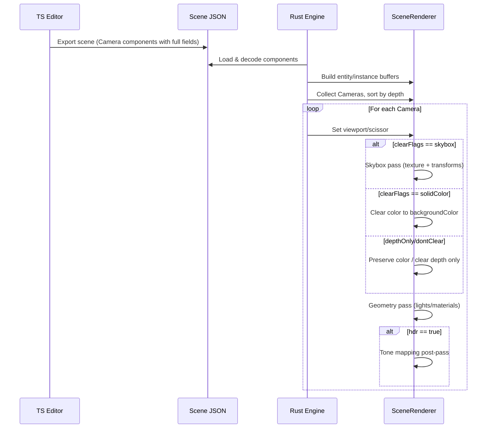

# Rust Engine Camera Feature Parity PRD

## 1. Overview

- **Context & Goals**

  - Achieve feature parity for the `Camera` component between the TypeScript/Three.js editor runtime and the Rust/WGPU engine runtime.
  - Implement missing fields identified in `rust/engine/INTEGRATION_AUDIT.md` so scenes authored in the editor behave consistently when rendered in Rust.
  - Add multi‑camera, viewport, skybox/background, follow/smoothing, and HDR/tone‑mapping capabilities on the Rust side.
  - Establish a forward‑compatible architecture for post‑processing that can grow to support presets.

- **Current Pain Points**
  - Rust engine only supports basic camera fields (`fov`, `near`, `far`, `projectionType`, `orthographicSize`, `isMain`, `backgroundColor`), with `clearFlags` and `skyboxTexture` parsed but unused.
  - No support for camera render order (`depth`), viewports (`viewportRect`), follow/smoothing, HDR/tone mapping, nor skybox transforms/intensity/blur.
  - Single‑camera pipeline; cannot render multiple cameras or split‑screen.

## 2. Proposed Solution

- **High‑level Summary**

  - Extend Rust `CameraComponent` decoding and engine camera to include all missing fields from the editor schemas.
  - Introduce per‑camera render control: clear flags, skybox background, and viewport/scissor.
  - Support multi‑camera rendering ordered by `depth` with normalized `viewportRect` handling.
  - Add a lightweight camera‑follow system (follow target + smoothing) on the engine side.
  - Implement a simple post‑process pass for HDR/tone mapping (none, linear, reinhard, cineon, aces) with `toneMappingExposure`.
  - Provide scaffolding for `enablePostProcessing` and `postProcessingPreset` for future effects.

- **Architecture & Directory Structure**

```
/rust/engine/
├── crates/
│   └── ecs-bridge/
│       └── src/
│           └── decoders.rs            # Add all missing Camera fields to decoder structs
└── src/
    ├── ecs/
    │   └── components/
    │       └── camera.rs              # Mirror fields, defaults; serde mapping
    ├── render/
    │   ├── camera.rs                  # Apply fields; background, viewport helpers
    │   ├── scene_renderer.rs          # Multi-camera loop, clear flags, viewport/scissor
    │   ├── skybox.rs                  # NEW: Skybox pass (texture, transform, intensity, blur)
    │   └── postprocess/
    │       └── tone_mapping.rs        # NEW: Fullscreen pass (tone mapping + exposure)
    └── app.rs                         # Collect cameras from scene, sort by depth, render per camera
```

## 3. Implementation Plan

- Phase 1: Data Model Parity (0.5 day)

  1. Update `crates/ecs-bridge/src/decoders.rs::CameraComponent` to include:
     - `depth`, `clearFlags`, `skyboxTexture`, `backgroundColor`
     - `controlMode`, `enableSmoothing`, `followTarget`, `followOffset`, `smoothingSpeed`, `rotationSmoothing`
     - `viewportRect { x, y, width, height }`
     - `hdr`, `toneMapping`, `toneMappingExposure`
     - `enablePostProcessing`, `postProcessingPreset`
     - `skyboxScale`, `skyboxRotation`, `skyboxRepeat`, `skyboxOffset`, `skyboxIntensity`, `skyboxBlur`
  2. Mirror the same in `src/ecs/components/camera.rs` with sensible defaults.
  3. Ensure backwards compatibility (all new fields optional with defaults).

- Phase 2: Clear Flags & Background (0.5 day)

  1. Add helpers to `render/camera.rs` to compute `wgpu::Operations` based on `clearFlags` and `backgroundColor`:
     - `solidColor`: clear color to backgroundColor.
     - `skybox`: defer color clear; skybox pass draws background; depth cleared.
     - `depthOnly`: `LoadOp::Load` for color, clear depth only.
     - `dontClear`: `LoadOp::Load` for both (preserve).
  2. Wire into `scene_renderer.rs` render pass creation.

- Phase 3: Skybox Pass (1.0 day)

  1. Create `render/skybox.rs` with a fullscreen quad or cube mesh pipeline sampling `skyboxTexture`.
  2. Support transforms: `repeat` (wrap mode, UV scale), `offset`, `rotation` (Z‑axis), `intensity` (color multiplier), `scale` (for cube), `blur` (mip bias or small gaussian kernel option).
  3. Invoke skybox pass when `clearFlags==='skybox'` before scene geometry.

- Phase 4: Viewports & Multi‑Camera (1.0 day)

  1. Collect all `Camera` components from scene in `app.rs`.
  2. Sort cameras by `depth` ascending; render in order.
  3. For each camera, compute pixel viewport from normalized `viewportRect` and call `render_pass.set_viewport`/`set_scissor_rect`.
  4. Allow multiple cameras per frame; reuse instance buffers/materials.

- Phase 5: Camera Follow & Smoothing (0.5 day)

  1. Implement a simple `CameraFollower` in `render/camera.rs` or `ecs` that:
     - Reads `followTarget` transform (position), applies `followOffset`.
     - Lerp from current camera position with `smoothingSpeed` per‑frame.
  2. Apply only when `enableSmoothing` and valid `followTarget`.
  3. For rotation smoothing, initially support look‑at target in locked mode; otherwise respect transform rotation.

- Phase 6: HDR & Tone Mapping (1.5 days)

  1. Add `render/postprocess/tone_mapping.rs` fullscreen pipeline reading color buffer and writing to the swapchain view.
  2. Implement operators: `none` (copy), `linear`, `reinhard`, `cineon`, `aces` with `toneMappingExposure`.
  3. Integrate conditionally per camera when `hdr===true`.

- Phase 7: Post‑processing Presets Scaffold (0.5 day)

  1. Implement `enablePostProcessing` and `postProcessingPreset` dispatch, mapping presets to tone mapping + placeholders for future effects.
  2. Leave TODO hooks for bloom/FXAA/etc. without implementing effects now.

- Phase 8: QA & Docs (0.5 day)
  1. Unit tests for decoding and defaulting.
  2. Golden/render tests for clear flags, viewport scissor, and tone mapping math (shader constants).
  3. Update `INTEGRATION_AUDIT.md` coverage numbers.

## 4. File and Directory Structures

```
/rust/engine/
├── crates/ecs-bridge/src/decoders.rs           # + all new camera fields
└── src/
    ├── ecs/components/camera.rs                # + all new camera fields
    ├── render/
    │   ├── camera.rs                           # + apply_component, background ops, follow
    │   ├── scene_renderer.rs                   # + multi-camera, clear flags, viewport/scissor
    │   ├── skybox.rs                           # NEW skybox pass (texture + transforms)
    │   └── postprocess/tone_mapping.rs         # NEW tone mapping pass
    └── app.rs                                  # + gather/sort cameras, per-camera render
```

## 5. Technical Details

- `crates/ecs-bridge/src/decoders.rs` (partial)

```rust
#[derive(Debug, Deserialize, Serialize, Clone)]
pub struct CameraComponent {
    #[serde(default = "default_fov")] pub fov: f32,
    #[serde(default = "default_near")] pub near: f32,
    #[serde(default = "default_far")] pub far: f32,
    #[serde(default)] pub isMain: bool,
    #[serde(default = "default_projection_type")] pub projectionType: String, // "perspective" | "orthographic"
    #[serde(default = "default_orthographic_size")] pub orthographicSize: f32,
    #[serde(default)] pub depth: i32,

    #[serde(default)] pub clearFlags: Option<String>,
    #[serde(default)] pub backgroundColor: Option<CameraColor>,
    #[serde(default)] pub skyboxTexture: Option<String>,

    // Control & follow
    #[serde(default)] pub controlMode: Option<String>, // "locked" | "free"
    #[serde(default)] pub enableSmoothing: bool,
    #[serde(default)] pub followTarget: Option<u32>,
    #[serde(default)] pub followOffset: Option<[f32;3]>,
    #[serde(default)] pub smoothingSpeed: Option<f32>,
    #[serde(default)] pub rotationSmoothing: Option<f32>,

    // Viewport (normalized 0..1)
    #[serde(default)] pub viewportRect: Option<[f32;4]>, // x,y,width,height

    // HDR / Tone Mapping
    #[serde(default)] pub hdr: bool,
    #[serde(default)] pub toneMapping: Option<String>, // none | linear | reinhard | cineon | aces
    #[serde(default)] pub toneMappingExposure: Option<f32>,

    // Post-processing
    #[serde(default)] pub enablePostProcessing: bool,
    #[serde(default)] pub postProcessingPreset: Option<String>,

    // Skybox transforms
    #[serde(default)] pub skyboxScale: Option<[f32;3]>,
    #[serde(default)] pub skyboxRotation: Option<[f32;3]>,
    #[serde(default)] pub skyboxRepeat: Option<[f32;2]>,
    #[serde(default)] pub skyboxOffset: Option<[f32;2]>,
    #[serde(default)] pub skyboxIntensity: Option<f32>,
    #[serde(default)] pub skyboxBlur: Option<f32>,
}
```

- `src/ecs/components/camera.rs` (partial)

```rust
#[derive(Debug, Deserialize, Clone, Default)]
pub struct CameraComponent {
    pub fov: f32,
    pub near: f32,
    pub far: f32,
    pub isMain: bool,
    pub projectionType: String,
    pub orthographicSize: f32,
    pub depth: i32,

    pub clearFlags: Option<String>,
    pub backgroundColor: Option<Color>,
    pub skyboxTexture: Option<String>,

    pub controlMode: Option<String>,
    pub enableSmoothing: bool,
    pub followTarget: Option<u32>,
    pub followOffset: Option<[f32;3]>,
    pub smoothingSpeed: Option<f32>,
    pub rotationSmoothing: Option<f32>,

    pub viewportRect: Option<[f32;4]>, // x,y,width,height

    pub hdr: bool,
    pub toneMapping: Option<String>,
    pub toneMappingExposure: Option<f32>,

    pub enablePostProcessing: bool,
    pub postProcessingPreset: Option<String>,

    pub skyboxScale: Option<[f32;3]>,
    pub skyboxRotation: Option<[f32;3]>,
    pub skyboxRepeat: Option<[f32;2]>,
    pub skyboxOffset: Option<[f32;2]>,
    pub skyboxIntensity: Option<f32>,
    pub skyboxBlur: Option<f32>,
}
```

- `src/render/camera.rs` (partial)

```rust
impl Camera {
    pub fn apply_component(&mut self, comp: &crate::ecs::components::camera::CameraComponent) {
        self.fov = comp.fov.to_radians();
        self.near = comp.near;
        self.far = comp.far;
        self.projection_type = match comp.projectionType.as_str() {
            "orthographic" => ProjectionType::Orthographic,
            _ => ProjectionType::Perspective,
        };
        self.orthographic_size = comp.orthographicSize;
        if let Some(bg) = &comp.backgroundColor {
            self.background_color = wgpu::Color { r: bg.r as f64, g: bg.g as f64, b: bg.b as f64, a: bg.a as f64 };
        }
        // viewport & tone mapping handled by renderer stage
    }
}

pub enum ClearBehavior { SolidColor, Skybox, DepthOnly, DontClear }

pub fn clear_behavior(comp: &crate::ecs::components::camera::CameraComponent) -> ClearBehavior {
    match comp.clearFlags.as_deref() {
        Some("solidColor") => ClearBehavior::SolidColor,
        Some("depthOnly") => ClearBehavior::DepthOnly,
        Some("dontClear") => ClearBehavior::DontClear,
        _ => ClearBehavior::Skybox,
    }
}
```

- `src/render/skybox.rs` (skeleton)

```rust
pub struct SkyboxRenderer { /* pipeline, bind groups */ }
impl SkyboxRenderer {
    pub fn new(device: &wgpu::Device, config: &wgpu::SurfaceConfiguration) -> Self { /* ... */ }
    pub fn render(
        &self,
        encoder: &mut wgpu::CommandEncoder,
        view: &wgpu::TextureView,
        texture: &vibe_assets::GpuTexture,
        transform: SkyboxTransform,
    ) { /* draw fullscreen quad or unit cube */ }
}

pub struct SkyboxTransform {
    pub repeat: [f32;2],
    pub offset: [f32;2],
    pub rotation_z_deg: f32,
    pub intensity: f32,
    pub blur: f32,
}
```

- `src/render/postprocess/tone_mapping.rs` (skeleton)

```rust
pub enum ToneOperator { None, Linear, Reinhard, Cineon, Aces }

pub struct ToneMappingPass { /* pipeline */ }
impl ToneMappingPass {
    pub fn new(device: &wgpu::Device, config: &wgpu::SurfaceConfiguration) -> Self { /* ... */ }
    pub fn render(
        &self,
        encoder: &mut wgpu::CommandEncoder,
        src_view: &wgpu::TextureView,
        dst_view: &wgpu::TextureView,
        op: ToneOperator,
        exposure: f32,
    ) { /* ... */ }
}
```

- `src/render/scene_renderer.rs` (key changes)

```rust
pub struct SceneRenderer { /* ... */ /* + skybox, tone mapping */ }

impl SceneRenderer {
    pub fn render_for_camera(
        &self,
        encoder: &mut wgpu::CommandEncoder,
        surface_view: &wgpu::TextureView,
        camera: &Camera,
        camera_comp: &crate::ecs::components::camera::CameraComponent,
        device: &wgpu::Device,
        queue: &wgpu::Queue,
    ) {
        // 1) set viewport/scissor if viewportRect present
        // 2) apply clear behavior (skybox vs color vs load)
        // 3) optional skybox pass
        // 4) geometry pass
        // 5) optional tone mapping pass
    }
}
```

- `src/app.rs` (key changes)

```rust
// Gather cameras from scene, sort by depth, and render each
let mut cameras: Vec<(&Entity, CameraComponent)> = /* collect */;
cameras.sort_by_key(|(_, c)| c.depth);
for (entity, cam_comp) in cameras.iter() {
    let mut view_camera = base_camera.clone();
    view_camera.apply_component(cam_comp);
    // apply follow smoothing (if any)
    self.scene_renderer.render_for_camera(
        &mut encoder,
        &view,
        &view_camera,
        cam_comp,
        &self.renderer.device,
        &self.renderer.queue,
    );
}
```

## 6. Usage Examples

- Initialize a camera with skybox + ACES

```json
{
  "type": "Camera",
  "data": {
    "isMain": true,
    "fov": 60,
    "near": 0.1,
    "far": 1000,
    "projectionType": "perspective",
    "clearFlags": "skybox",
    "skyboxTexture": "/assets/skyboxes/milky.hdr",
    "skyboxIntensity": 1.2,
    "hdr": true,
    "toneMapping": "aces",
    "toneMappingExposure": 1.0
  }
}
```

- Split‑screen with two cameras

```json
[
  {
    "type": "Camera",
    "data": {
      "isMain": true,
      "depth": 0,
      "viewportRect": { "x": 0, "y": 0, "width": 0.5, "height": 1 }
    }
  },
  {
    "type": "Camera",
    "data": { "depth": 1, "viewportRect": { "x": 0.5, "y": 0, "width": 0.5, "height": 1 } }
  }
]
```

- Follow target with smoothing

```json
{
  "type": "Camera",
  "data": {
    "isMain": true,
    "enableSmoothing": true,
    "followTarget": 42,
    "followOffset": { "x": 0, "y": 5, "z": -10 },
    "smoothingSpeed": 2.0
  }
}
```

## 7. Testing Strategy

- **Unit Tests**

  - Decoder: all new fields default/deserialize correctly; invalid values clamped or rejected where applicable.
  - Viewport math: normalized to pixels; scissor bounds.
  - Tone mapping shader: small LUT‑based numeric checks for each operator.

- **Integration Tests**
  - Clear flags: verify render outputs for `solidColor`, `skybox`, `depthOnly`, `dontClear`.
  - Multi‑camera: depth order compositing and viewport packing.
  - Follow: camera position approaches expected target path under smoothing.
  - Skybox: repeat/offset/rotation/intensity parameters visually/analytically validated.

## 8. Edge Cases

| Edge Case                                        | Remediation                                                       |
| ------------------------------------------------ | ----------------------------------------------------------------- |
| `viewportRect` outside [0,1]                     | Clamp to [0,1] and log warning.                                   |
| Missing `skyboxTexture` with `skybox` clear flag | Fallback to neutral gray color clear.                             |
| `followTarget` not found                         | Disable follow for that frame; continue; log once.                |
| Zero `smoothingSpeed`                            | Treat as 0 (no movement) or clamp to small epsilon (0.01).        |
| Tone operator unknown                            | Fallback to `none`; log warning.                                  |
| `hdr` true but postprocess disabled              | Apply tone mapping pass only when `hdr` true; otherwise copy.     |
| Overlapping viewports                            | Honor `depth` order; later cameras overwrite intersecting pixels. |

## 9. Sequence Diagram



## 10. Risks & Mitigations

| Risk                                                 | Mitigation                                                                         |
| ---------------------------------------------------- | ---------------------------------------------------------------------------------- |
| Increased pipeline complexity (skybox + postprocess) | Keep passes modular; ship minimal tone mapping first.                              |
| Performance overhead from multi-pass                 | Batch work, reuse bind groups, minimize texture/state changes.                     |
| Visual mismatch vs Three.js                          | Add visual tests and numeric shader checks; choose standard tone mapping formulas. |
| Skybox blur quality                                  | Start with mip bias/cheap blur; plan proper separable Gaussian later.              |
| Multi-camera depth semantics                         | Document and match editor semantics; add tests.                                    |

## 11. Timeline

- Phase 1: 0.5 day
- Phase 2: 0.5 day
- Phase 3: 1.0 day
- Phase 4: 1.0 day
- Phase 5: 0.5 day
- Phase 6: 1.5 days
- Phase 7: 0.5 day
- Phase 8: 0.5 day
- **Total**: ~6.0 days

## 12. Acceptance Criteria

- Camera decoder and component structs include all fields listed in this PRD with defaults.
- `clearFlags` affects render behavior; `skyboxTexture` renders with transforms; `backgroundColor` clears for solid color.
- Multiple cameras render in a single frame; `viewportRect` respected; `depth` determines order.
- Follow target + smoothing adjusts camera position each frame when enabled.
- HDR with selectable tone mapping operators and exposure works; verified by tests.
- No regressions to existing rendering; all tests pass.

## 13. Conclusion

Implementing complete camera feature parity unlocks consistent scene behavior between the editor and the Rust engine, enabling skyboxes, split‑screen, simple cinematic camera moves, and HDR/tone mapping. The modular design provides a foundation for future post‑processing effects and shadow/HDR pipelines.

## 14. Assumptions & Dependencies

- Scenes are exported with the camera schema documented in the editor (`src/core/lib/ecs/components/definitions/CameraComponent.ts`).
- Tone mapping operators follow widely used formulas (ACES Filmic, Reinhard, Cineon); exact matching to Three.js curves is a stretch goal.
- Skybox textures provided as standard 2D equirectangular images; cubemaps may be added later.
- Texture system in `vibe_assets` is available; additional loaders may be required for HDR formats.
- WGPU limits and surface formats allow the passes described (no MSAA assumed initially).

