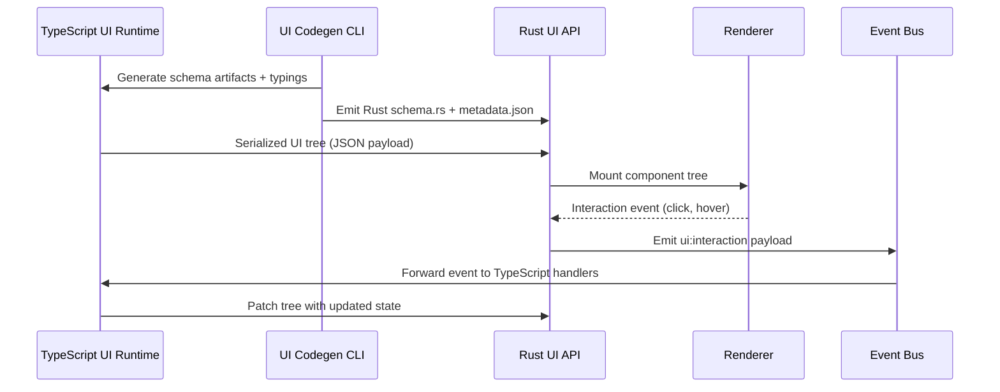

🧠 Planning documents standards rule loaded!

# PRD: Cross-Stack UI API (TypeScript ↔ Rust)

## 1. Overview

- **Context & Goals**

  - Deliver a unified UI API that allows TypeScript-defined interfaces to render identically inside the Rust engine renderer.
  - Provide a portable schema and tooling so UI primitives and layouts remain in lockstep across both stacks.
  - Minimize duplicated business logic by driving UI composition through a shared declarative contract.
  - Unlock feature-complete parity for the final remaining Rust API milestone tracked in `ROADMAP.md`.

- **Current Pain Points**
  - UI definitions are hand-wired separately in TypeScript and Rust, causing drift and inconsistent behavior.
  - No authoritative schema exists for props, events, or layouts, forcing ad-hoc JSON payloads.
  - Feature rollout requires manual coordination and cross-team meetings, slowing delivery velocity.
  - Testing is fragile because there is no automated way to snapshot UI parity across runtimes.

## 2. Proposed Solution

- **High-level Summary**

  - Establish a TypeScript-first UI schema DSL that emits versioned artifacts consumed by both stacks.
  - Introduce a new Rust `vibe-ui-api` crate that deserializes the schema, registers primitives, and drives rendering.
  - Provide a serialization adapter and transport layer supporting JSON (baseline) with pluggable binary codecs.
  - Standardize an event bridge so UI interactions travel through a typed channel shared by TypeScript and Rust.
  - Ship CLI tooling to generate bindings, validate schemas, and snapshot component trees for regression tests.

- **Architecture & Directory Structure**

```text
docs/PRDs/cross-stack/ui-api-cross-stack-prd.md
scripts/ui-api/
├── package.json
└── generate.ts                      # CLI to emit schema artifacts + typings
src/core/ui-api/
├── index.ts                         # Public entrypoint exporting schema + registry helpers
├── schema/
│   ├── components.ts                # ComponentDefinition DSL + props metadata
│   ├── layout.ts                    # Layout primitives (Stack, Grid, Overlay)
│   └── events.ts                    # Event/channel contracts
├── serializer/
│   ├── jsonAdapter.ts               # JSON codec for component trees
│   └── versioning.ts                # Semver metadata + compatibility checks
└── runtime/
    ├── registry.ts                  # UIRegistry implementation + lifecycle hooks
    └── bridge.ts                    # Sends serialized trees to Rust layer
rust/engine/crates/ui_api/
├── Cargo.toml
└── src/
    ├── lib.rs                       # Crate exports + feature flags
    ├── schema.rs                    # Deserialized structs/enums mirroring TS schema
    ├── registry.rs                  # Component registry + mount pipeline
    ├── serializer.rs                # Decoder + validation (JSON baseline)
    └── events.rs                    # EventChannel bridge to scripting/event bus
rust/engine/src/ui/
├── mod.rs                           # Integrates crate into renderer
└── renderer_bridge.rs               # Maps schema nodes to render commands
```

## 3. Implementation Plan

### Phase 1: Schema & DSL Foundations (1.0 day)

1. Audit existing UI components (`src/core/components/ui`) and Rust HUD systems to extract shared primitives.
2. Define `ComponentDefinition`, layout primitives, and event payload contracts in TypeScript DSL.
3. Author schema validation tests (Zod or JSON Schema) to ensure props/events are strongly typed.
4. Establish semantic versioning policy (`major.minor.patch`) and embed metadata in schema artifacts.

### Phase 2: Code Generation Pipeline (1.0 day)

1. Implement `scripts/ui-api/generate.ts` to emit:
   - JSON schema artifact consumed by Rust.
   - TypeScript ambient types for consumer projects.
   - Rust source (`schema.rs`) via `serde`-friendly structs/enums (written to `generated/`).
2. Add `npm` script (`yarn ui-api:generate`) and `cargo build` hook (`build.rs`) to enforce regeneration.
3. Wire CI check to fail if generated artifacts are stale.

### Phase 3: Runtime Bridges (1.5 days)

1. Implement TypeScript runtime registry that:
   - Registers primitives, default props, and capability flags.
   - Serializes component trees with diff-friendly snapshots.
   - Streams updates via structured messages (initial mount + incremental patches).
2. Build Rust `vibe-ui-api` crate providing:
   - Mirrored schema structs with serde derives.
   - Registry storing primitive constructors pointing into renderer.
   - Validation pipeline ensuring version compatibility and prop integrity.
3. Integrate with Rust renderer (`rust/engine/src/ui/renderer_bridge.rs`) to mount nodes to existing HUD pipeline.

### Phase 4: Event & State Synchronization (1.0 day)

1. Define cross-stack event envelope and map to existing Rust `events` crate.
2. Implement bidirectional channel:
   - TypeScript: `EventChannel.emit/subscribe`.
   - Rust: async stream bridging to scripting/event bus (ensuring snake_case naming).
3. Support controlled mutable state updates (props diffing, focus/hover states) with deterministic ordering.

### Phase 5: Tooling, Docs, and QA (1.0 day)

1. Add CLI commands for validating component trees and inspecting schema versions.
2. Produce onboarding docs (`docs/guides/ui-api/README.md`) with developer workflows.
3. Implement parity test suite:
   - Snapshot diff of serialized trees.
   - Integration tests in Rust verifying render output for sample layouts.
4. Conduct lighthouse performance benchmark to assert serialization latency (<5ms P95).

Total estimated effort: **5.5 days** (buffer included for cross-team review).

## 4. File and Directory Structures

```text
src/core/ui-api/
├── index.ts
├── schema/
│   ├── components.ts
│   ├── layout.ts
│   └── events.ts
├── serializer/
│   ├── jsonAdapter.ts
│   └── versioning.ts
└── runtime/
    ├── bridge.ts
    └── registry.ts

scripts/ui-api/
├── package.json
└── generate.ts

rust/engine/crates/ui_api/
├── Cargo.toml
└── src/
    ├── lib.rs
    ├── schema.rs
    ├── registry.rs
    ├── serializer.rs
    └── events.rs
```

## 5. Technical Details

```ts
// src/core/ui-api/schema/components.ts
import { z } from 'zod';

export type ComponentKind = 'Button' | 'Text' | 'Image' | 'Stack' | 'Grid' | 'Overlay';

export interface ComponentDefinition<TProps extends object = object> {
  kind: ComponentKind;
  props: TProps;
  children?: ComponentDefinition[];
  events?: UIEventDescriptor[];
}

export interface UIEventDescriptor {
  name: string;
  payloadSchema: z.ZodTypeAny;
}
```

```ts
// src/core/ui-api/runtime/registry.ts
import { ComponentDefinition } from '../schema/components';
import { serializeTree } from '../serializer/jsonAdapter';

export interface RenderTargetAdapter {
  mount(tree: SerializedTree): void;
  patch(update: SerializedPatch): void;
}

export class UIRegistry {
  constructor(private readonly target: RenderTargetAdapter) {}

  registerTree(root: ComponentDefinition) {
    const payload = serializeTree(root);
    this.target.mount(payload);
  }

  updateTree(root: ComponentDefinition) {
    const patch = serializeTree(root);
    this.target.patch(patch);
  }
}
```

```rust
// rust/engine/crates/ui_api/src/schema.rs
use serde::{Deserialize, Serialize};

#[derive(Debug, Clone, Serialize, Deserialize)]
pub struct UiComponent {
    pub kind: UiComponentKind,
    pub props: serde_json::Value,
    pub children: Vec<UiComponent>,
    pub events: Vec<UiEventDescriptor>,
}

#[derive(Debug, Clone, Serialize, Deserialize)]
pub enum UiComponentKind {
    Button,
    Text,
    Image,
    Stack,
    Grid,
    Overlay,
}

#[derive(Debug, Clone, Serialize, Deserialize)]
pub struct UiEventDescriptor {
    pub name: String,
    pub payload_schema: serde_json::Value,
}
```

```rust
// rust/engine/crates/ui_api/src/registry.rs
use crate::{schema::UiComponent, serializer::deserialize_tree};

pub struct UiRegistry {
    renderer: Box<dyn UiRenderer>,
}

impl UiRegistry {
    pub fn new(renderer: Box<dyn UiRenderer>) -> Self {
        Self { renderer }
    }

    pub fn mount_tree(&mut self, payload: &[u8]) -> Result<(), UiError> {
        let tree = deserialize_tree(payload)?;
        self.renderer.mount(tree);
        Ok(())
    }

    pub fn patch_tree(&mut self, payload: &[u8]) -> Result<(), UiError> {
        let tree = deserialize_tree(payload)?;
        self.renderer.patch(tree);
        Ok(())
    }
}

pub trait UiRenderer: Send {
    fn mount(&mut self, tree: UiComponent);
    fn patch(&mut self, tree: UiComponent);
}
```

## 6. Usage Examples

```ts
// TypeScript: register a HUD layout and stream to Rust renderer
import { UIRegistry } from '@/core/ui-api/runtime/registry';
import { createHudLayout } from './layouts/hud';

const registry = new UIRegistry(rustBridge);
const hudTree = createHudLayout();

registry.registerTree(hudTree);

events.on('rust:ui-event', (payload) => {
  registry.updateTree(handleRustFeedback(payload));
});
```

```rust
// Rust: mount incoming UI payload inside game loop
use vibe_ui_api::UiRegistry;

fn on_ui_payload(bytes: &[u8], registry: &mut UiRegistry) {
    if let Err(err) = registry.mount_tree(bytes) {
        tracing::error!("failed to mount UI: {err}");
    }
}
```

```rust
// Rust: bridge user interaction back to TypeScript runtime
use vibe_events::SceneEventBus;

pub fn forward_click_event(event_bus: &SceneEventBus, component_id: &str) {
    let payload = serde_json::json!({
        "componentId": component_id,
        "state": "clicked"
    });

    event_bus.emit("ui:interaction", payload);
}
```

## 7. Testing Strategy

- **Unit Tests**

  - Validate TypeScript schema generation and prop validation for each primitive.
  - Ensure serializer handles deeply nested component trees and optional props.
  - Rust deserializer rejects incompatible versions and malformed payloads.
  - Event bridge enforces payload schemas for known interactions.

- **Integration Tests**
  - Golden snapshot comparison of serialized trees between TypeScript runs.
  - End-to-end test harness launching Rust renderer in headless mode ingesting sample UI payloads.
  - Round-trip interaction test: Rust emits event → TypeScript handler updates tree → Rust applies patch.
  - Performance regression test verifying serialization/deserialization stays within latency budget.

## 8. Edge Cases

| Edge Case                                                     | Remediation                                                                                                          |
| ------------------------------------------------------------- | -------------------------------------------------------------------------------------------------------------------- |
| Payload version mismatch between TypeScript and Rust runtimes | Block mounting and emit actionable error with required/actual versions; provide CLI command to regenerate artifacts. |
| Components with optional children or props absent             | Supply defaults in schema definition and enforce fallback logic during deserialization.                              |
| Streaming updates arriving out of order                       | Include monotonic sequence IDs; Rust registry drops stale patches.                                                   |
| Large texture assets referenced in UI tree                    | Add async asset prefetch hook and fallback placeholder until asset resolves.                                         |
| Event payload exceeding size limits                           | Enforce payload size caps and compress large blobs via binary codec when needed.                                     |

## 9. Sequence Diagram



## 10. Risks & Mitigations

| Risk                                            | Mitigation                                                                                          |
| ----------------------------------------------- | --------------------------------------------------------------------------------------------------- |
| Schema evolves faster than Rust release cadence | Enforce semver policies, CI compatibility checks, and maintain compatibility matrix in docs.        |
| Serialization cost impacts frame time           | Prototype binary codec option and profile early; cache computed diffs to minimize payload size.     |
| Tooling drift between CLI and runtime           | Add contract tests ensuring CLI output matches Rust expectations; embed artifact hash in payload.   |
| Event bridge introduces race conditions         | Use single-threaded dispatcher on Rust side with ordered sequence IDs and deterministic processing. |
| Cross-team alignment delays rollout             | Schedule weekly sync, publish design doc, and gate release on joint sign-off checklist.             |

## 11. Timeline

- Phase 1: 1.0 day
- Phase 2: 1.0 day
- Phase 3: 1.5 days
- Phase 4: 1.0 day
- Phase 5: 1.0 day
- **Total:** 5.5 days (including 0.5-day buffer for review and iteration)

## 12. Acceptance Criteria

- Shared UI schema artifacts are generated and version-controlled with semver metadata.
- TypeScript runtime can register, serialize, and update UI trees via the new API.
- Rust renderer mounts serialized trees and renders Button/Text/Image primitives identically to TS implementation.
- Bidirectional event flow works for at least three interactions (click, hover, form submit).
- CI suite validates parity via snapshots and integration tests; performance target (<5ms P95) is met.
- Documentation and onboarding guide published under `docs/guides/ui-api`.

## 13. Conclusion

This PRD delivers the final cross-stack UI parity layer by anchoring both TypeScript and Rust runtimes to a common, typed API. With shared schemas, automated tooling, and deterministic event bridges, teams can ship UI features faster while maintaining consistency. Upon execution, the roadmap’s last Rust API milestone is unlocked, ensuring feature parity across platforms.

## 14. Assumptions & Dependencies

- Adoption of `serde_json` for initial payloads with optional future binary codec (e.g., MessagePack).
- TypeScript environment continues using Yarn-based workflows with `ts-node` available for CLI execution.
- Rust engine build pipeline can run code generation during `cargo build` via `build.rs`.
- Event bus refactors (`vibe-events`) remain available to route UI interactions.
- Design systems team provides component prop specifications and assets ahead of Phase 3.
