## Custom Shape System PRD

🧠 Planning documents standards rule loaded!

## 1. Overview

- **Context & Goals**: Enable loading and rendering of arbitrary Three.js shapes defined by external modules placed in `src/game/shapes`, without core code edits per shape. Provide a discoverable UI flow to browse, preview, and add these shapes to the scene. Ensure shapes can define parameters, defaults, previews, and categories.
- **Current Pain Points**: Shapes are hard-coded across `ShapeType`, creation hooks, menu configs, and `GeometryRenderer` switch; adding a new shape requires edits to many files. No first-class registry or dynamic discovery. No shape browser for 3D previews.

## 2. Proposed Solution

- **High‑level Summary**:

  - Introduce a runtime Shape Registry with auto‑discovery using `import.meta.glob` for `src/game/shapes/**/*.ts{x}`.
  - Add a new ECS component `CustomShape` to store `shapeId` and validated `params` per entity (Zod‑backed).
  - Extend rendering with a pluggable geometry resolver (registry‑driven) in place of hardcoded switches for custom shapes.
  - Integrate a Shape Browser modal (patterned after `AssetLoaderModal`) for discovery, preview, and creation; hook it into the Add menu and top menu.
  - Preserve existing built‑in shapes; dynamic shapes live alongside them.

- **Architecture & Directory Structure**:

```
src/
├── core/
│   ├── lib/
│   │   └── rendering/
│   │       └── shapes/
│   │           ├── IShapeDescriptor.ts        # Types for registry (named exports only)
│   │           ├── shapeRegistry.ts           # Register/resolve/list shapes; HMR-safe
│   │           └── discovery.ts               # import.meta.glob loader for /game/shapes
│   └── lib/ecs/components/definitions/
│       └── CustomShapeComponent.ts            # Zod schema + BitECS fields (shapeId, params)
├── editor/
│   ├── components/
│   │   ├── menus/
│   │   │   └── EnhancedAddObjectMenu.tsx      # Injects dynamic Custom Shapes submenu
│   │   ├── panels/ViewportPanel/components/
│   │   │   ├── GeometryRenderer.tsx           # Uses shape registry for CustomShape
│   │   │   └── previews/ShapePreviewCanvas.tsx# 3D preview of dynamic shapes
│   │   └── shared/ShapeBrowserModal.tsx       # Modal to browse & preview shapes
│   └── hooks/
│       ├── useEntityCreation.ts               # Create entity with CustomShape + MeshRenderer
│       └── useDynamicShapes.ts                # Hooks to list/search shapes
├── game/
│   └── shapes/
│       ├── Readme.md                          # Authoring guide for game teams
│       ├── ExampleTorusKnot.tsx               # Example dynamic shape (descriptor)
│       └── ... user-provided shapes ...
└── docs/PRDs/custom-shape-system-prd.md       # This document
```

## 3. Implementation Plan

### Phase 1: Shape Registry & Contracts (0.5 day)

1. Define `IShapeParamSchema` and `ICustomShapeDescriptor<TParams>` with Zod.
2. Implement `shapeRegistry.ts` with: `register()`, `resolve(id)`, `list()`, HMR‑safe re‑registration.
3. Implement `discovery.ts` using `import.meta.glob('/src/game/shapes/**/*.{ts,tsx}', { eager: true })` to auto‑register shapes at startup (via game extensions bootstrap).

### Phase 2: ECS Data Model (0.5 day)

1. Create `CustomShapeComponent` with fields: `shapeId: string`, `params: Record<string, unknown>`. Zod‑validated; store serialized params.
2. Add helper accessors and adapters for inspector use later.

### Phase 3: Rendering Integration (0.5 day)

1. Extend `combineRenderingContributions` to map `meshId === 'customShape'` to meshType `'CustomShape'`.
2. Update `GeometryRenderer` to detect `'CustomShape'`, read `CustomShape` component for the entity, resolve the descriptor via registry, and render descriptor geometry.

### Phase 4: UI – Add Menu + Browser (1 day)

1. Add a "Custom Shapes" category to `EnhancedAddObjectMenu` using registry `list()`; include a leading item "Browse Custom Shapes…".
2. Implement `ShapeBrowserModal` patterned after `AssetLoaderModal`:
   - Left list: discovered shapes (grouped by category/tags), search, filter.
   - Right panel: live 3D preview via `ShapePreviewCanvas` that mounts the descriptor geometry with default params.
   - “Create” button → spawns entity with `CustomShape` + `MeshRenderer` (meshId: `customShape`).
3. Add top menu/toolbar entry: Add → Custom Shapes → Browse…

### Phase 5: Authoring Experience & Docs (0.5 day)

1. Provide `src/game/shapes/Readme.md` with a minimal template, examples, and param validation guidance.
2. Add an example dynamic shape (e.g., Parametric SuperShape) as a reference.

### Phase 6: Tests & Validation (0.5 day)

1. Unit tests for registry discovery, validation, and resolution.
2. Integration test: adding a custom shape renders expected geometry and stores params.
3. UI tests: modal lists shapes and previews render without errors.

## 4. File and Directory Structures

```
/src/core/lib/rendering/shapes/
├── IShapeDescriptor.ts
├── shapeRegistry.ts
└── discovery.ts

/src/core/lib/ecs/components/definitions/
└── CustomShapeComponent.ts

/src/editor/components/shared/
└── ShapeBrowserModal.tsx

/src/editor/components/panels/ViewportPanel/components/previews/
└── ShapePreviewCanvas.tsx

/src/game/shapes/
├── Readme.md
├── ExampleTorusKnot.tsx
└── <YourShape>.tsx
```

## 5. Technical Details

### Shape Descriptor Types

```ts
// src/core/lib/rendering/shapes/IShapeDescriptor.ts
import { z } from 'zod';
import type { ReactNode } from 'react';

export interface IShapeMetadata {
  id: string; // unique, kebabCase, e.g. "super-shape"
  name: string; // human-readable
  category?: string; // e.g. "Procedural", "Environment"
  tags?: string[];
  version?: string;
  icon?: string; // react-icons name or internal id
  previewImage?: string; // optional static image (fallback)
}

export interface ICustomShapeDescriptor<TParams extends z.ZodTypeAny> {
  meta: IShapeMetadata;
  paramsSchema: TParams; // Zod schema for params
  getDefaultParams(): z.infer<TParams>;
  // Returns a React element that renders THREE geometry using params
  renderGeometry(params: z.infer<TParams>): ReactNode;
}
```

### Shape Registry

```ts
// src/core/lib/rendering/shapes/shapeRegistry.ts
export interface IShapeRegistry {
  register<T>(descriptor: ICustomShapeDescriptor<T>): void;
  resolve(id: string): ICustomShapeDescriptor<any> | undefined;
  list(): ICustomShapeDescriptor<any>[];
}

export const shapeRegistry: IShapeRegistry =
  /* in-memory registry with HMR-safe reinit */ {} as any;
```

### Discovery

```ts
// src/core/lib/rendering/shapes/discovery.ts
// Auto-load all descriptors from /src/game/shapes
const modules = import.meta.glob('/src/game/shapes/**/*.{ts,tsx}', { eager: true });
// For each module, import named export `shape` (descriptor) and register
```

### ECS Component

```ts
// src/core/lib/ecs/components/definitions/CustomShapeComponent.ts
// Zod schema: { shapeId: string; params: Record<string, unknown> }
// BitECS fields: store shapeId and a pointer/index for params if needed; serialize as plain object
```

### Rendering Integration

```tsx
// GeometryRenderer.tsx (conceptual)
if (meshType === 'CustomShape') {
  const cs = entityComponents.find((c) => c.type === 'CustomShape')?.data as
    | { shapeId: string; params: any }
    | undefined;
  const descriptor = cs && shapeRegistry.resolve(cs.shapeId);
  return descriptor ? <>{descriptor.renderGeometry(cs.params)}</> : null;
}
```

### Entity Creation Flow

```ts
// useEntityCreation.ts (conceptual API)
export function createCustomShape(shapeId: string, params?: any) {
  const entity = createEntity(/* name from descriptor.meta.name */);
  addComponent(entity.id, 'CustomShape', {
    shapeId,
    params: params ?? descriptor.getDefaultParams(),
  });
  addMeshRenderer(entity.id, 'customShape');
  return entity;
}
```

### Shape Authoring Example (Game Team)

```tsx
// src/game/shapes/ExampleTorusKnot.tsx
import * as THREE from 'three';
import React, { useMemo } from 'react';
import { z } from 'zod';
import type { ICustomShapeDescriptor } from '@/core/lib/rendering/shapes/IShapeDescriptor';

const paramsSchema = z.object({
  radius: z.number().default(0.4),
  tube: z.number().default(0.1),
  p: z.number().default(2),
  q: z.number().default(3),
});

export const shape: ICustomShapeDescriptor<typeof paramsSchema> = {
  meta: {
    id: 'example-torus-knot',
    name: 'Example Torus Knot',
    category: 'Procedural',
    tags: ['knot', 'math'],
  },
  paramsSchema,
  getDefaultParams: () => paramsSchema.parse({}),
  renderGeometry: (params) => {
    const geometry = useMemo(
      () => new THREE.TorusKnotGeometry(params.radius, params.tube, 64, 8, params.p, params.q),
      [params],
    );
    return <primitive object={geometry} />;
  },
};
```

## 6. Usage Examples

- **Programmatic**:

```ts
import { createCustomShape } from '@/editor/hooks/useEntityCreation';
createCustomShape('example-torus-knot', { radius: 0.6, tube: 0.12 });
```

- **Add Menu**:

  - Add → Custom Shapes → Example Torus Knot → creates entity with defaults.

- **Browser Modal**:
  - Add → Custom Shapes → Browse… → select shape → live preview → Create.

## 7. Testing Strategy

- **Unit Tests**:
  - Registry registers and resolves descriptors; duplicate id detection.
  - Discovery loads modules and handles missing `shape` export gracefully.
  - Params validation via Zod with defaulting.
- **Integration Tests**:
  - Adding a dynamic shape creates entity with `CustomShape` and `MeshRenderer`.
  - `GeometryRenderer` resolves descriptor and renders without warnings.
  - Modal lists discovered shapes and preview mounts/unmounts cleanly.

## 8. Edge Cases

| Edge Case                               | Remediation                                                      |
| --------------------------------------- | ---------------------------------------------------------------- |
| Duplicate `shapeId` across files        | Log error; last write wins or block registration (configurable). |
| Invalid/missing descriptor export       | Skip module with warning; continue discovery.                    |
| Params schema changes between builds    | Migrate via `paramsSchema.safeParse` and defaults.               |
| HMR reloading shape modules             | Clear and re-register descriptor; refresh lists and previews.    |
| Large/expensive geometry in preview     | Throttle preview rendering and memoize geometry.                 |
| No WebGL context available (CI/UI test) | Fallback to previewImage or disabled preview mode.               |

## 9. Sequence Diagram

```mermaid
sequenceDiagram
  participant User
  participant AddMenu
  participant ShapeBrowser
  participant Registry
  participant ECS
  participant Renderer

  User->>AddMenu: Open Add → Custom Shapes
  AddMenu->>ShapeBrowser: Open modal (list via Registry.list())
  ShapeBrowser->>Registry: list()
  Registry-->>ShapeBrowser: descriptors
  User->>ShapeBrowser: Select shape + Create
  ShapeBrowser->>ECS: create entity + add CustomShape + MeshRenderer('customShape')
  Renderer->>Registry: resolve(shapeId)
  Registry-->>Renderer: descriptor
  Renderer->>Renderer: descriptor.renderGeometry(params)
```



## 10. Risks & Mitigations

| Risk                                       | Mitigation                                                                          |
| ------------------------------------------ | ----------------------------------------------------------------------------------- |
| Runtime perf regressions from heavy shapes | Memoize geometry; allow LOD; provide preview throttling.                            |
| API churn for shape authors                | Lock `ICustomShapeDescriptor` and document clearly; semantic versioning.            |
| Overly coupled to editor                   | Keep registry and component runtime-agnostic; UI uses hooks.                        |
| Collisions with built-in `meshId` mapping  | Reserve `'customShape'` for dynamic shapes; use `CustomShape` component for params. |

## 11. Timeline

- Phase 1–3: 1.5 days
- Phase 4: 1 day
- Phase 5: 0.5 day
- Phase 6: 0.5 day
- **Total**: ~3.5 days

## 12. Acceptance Criteria

- Shapes in `src/game/shapes` are auto-discovered and listed in a modal.
- Adding a custom shape creates an entity with `CustomShape` + `MeshRenderer('customShape')`.
- `GeometryRenderer` renders dynamic shapes via registry without code edits per shape.
- UI offers: Add menu items for discovered shapes and a "Browse…" option with live preview.
- Zod validates params and defaults are applied when missing.
- No regressions in built‑in shapes; tests pass.

## 13. Conclusion

This design decouples shape authoring from core editor code, enabling fast iteration and unlimited extensibility. Game teams can drop new shape modules under `src/game/shapes` to gain immediate UI integration, browsing, and rendering.

## 14. Assumptions & Dependencies

- Vite `import.meta.glob` available for module discovery.
- React, React Three Fiber, Three.js present; Yarn‑based build.
- TypeScript path aliases in `tsconfig.json` (`@/core`, `@/editor`, etc.).
- Zod for runtime validation; named exports only; no barrel `index.ts` files.
