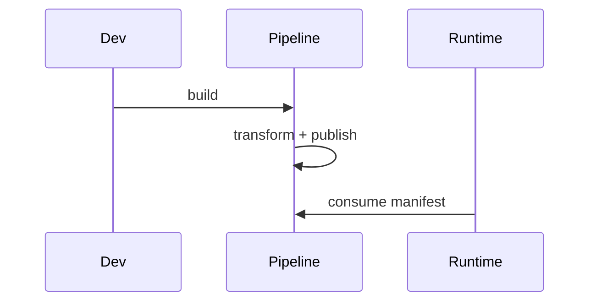

# Asset Pipeline PRD

## Overview

### Context & Goals

- Automate import, optimization, and caching of models, textures, audio.
- Produce deterministic URLs and manifests for runtime loading.
- Reduce load times with compression and format transforms.

### Current Pain Points

- Manual asset handling; inconsistent formats and sizes.
- No manifest or versioning; cache invalidation is ad-hoc.
- Missing background processing and telemetry.

## Proposed Solution

### High‑level Summary

- Build a node-based pipeline with stages (ingest -> transform -> pack -> publish).
- Support GLTF/Draco, KTX2 textures, audio transcoding, LOD generation.
- Emit `asset:loaded`/`asset:failed` events; maintain asset manifest.
- CLI script + programmatic API for build and watch.

### Architecture & Directory Structure

```
/scripts/
  └── asset-pipeline/
      ├── pipeline.ts
      ├── stages/
      │   ├── gltf.ts
      │   ├── textures.ts
      │   └── audio.ts
      └── manifest.ts
/src/core/lib/assets/
  ├── loader.ts
  └── manifestTypes.ts
```

## Implementation Plan

1. Phase 1: Pipeline Core (1 day)

   1. Stage abstraction + manifest writer
   2. GLTF compression; texture KTX2; audio copy-through

2. Phase 2: Advanced Stages (1 day)

   1. Draco + meshopt; autogenerated LODs
   2. Audio transcoding; sprite sheets (optional)

3. Phase 3: Runtime Integration (0.5 day)
   1. Loader API, cache policy, events
   2. Build/watch commands, docs

## File and Directory Structures

```
/docs/implementation/
  └── 4-12-asset-pipeline-prd.md
```

## Technical Details

```ts
export interface IAssetManifestEntry {
  id: string;
  type: 'gltf' | 'texture' | 'audio' | string;
  src: string; // hashed URL
  meta?: Record<string, unknown>;
}

export interface IAssetLoader {
  load(id: string): Promise<unknown>;
  preload(ids: string[]): Promise<void>;
}
```

### Editor & Component Integration

```ts
// 1) Store asset ids in component data (not raw paths)
// e.g., MeshRendererComponent.data.material.textureId = 'tex/brick_01.ktx2'
// e.g., SoundComponent.data.audioId = 'audio/ui/click.ogg'

// 2) Use ProjectAssetService + manifest-aware AssetSelector
// src/editor/components/shared/AssetSelector.tsx
// fetch entries from manifest via ProjectAssetService; filter by type; return selected asset id

// 3) Resolve at runtime using loader
// src/core/lib/assets/loader.ts
export async function loadAssetById(id: string) {
  /* look up in manifest, fetch src */
}

// 4) Eventing
// emit('asset:loaded', { assetId: id, asset }) on success; emit failures for diagnostics

// 5) Backward compatibility
// add migration mapping raw paths -> nearest manifest ids during scene load
```

## Usage Examples

```ts
// Preload a set of assets
await assets.preload(['player.glb', 'fx/smoke.ktx2']);
```

## Testing Strategy

- Unit: manifest generation, hashing, stage composition.
- Integration: runtime loader resolves published paths; cache hits.

## Edge Cases

| Edge Case           | Remediation                           |
| ------------------- | ------------------------------------- |
| Duplicate ids       | Fail with diagnostic; suggest rename  |
| Platform codec gaps | Provide fallbacks; capability probing |

## Sequence Diagram



## Risks & Mitigations

| Risk               | Mitigation                       |
| ------------------ | -------------------------------- |
| Large binary sizes | Compress; LODs; streaming        |
| Build complexity   | Isolate stages; good diagnostics |

## Timeline

- Total: ~2.5 days (Core 1, Advanced 1, Integration 0.5)

## Acceptance Criteria

- Deterministic hashed outputs and manifest.
- Loader resolves and caches assets with events.
- Measurable load-time improvements.

## Conclusion

Establishes a repeatable, observable asset workflow to improve reliability and performance.

## Assumptions & Dependencies

- Node-based tooling; GLTF/Draco and KTX2 tools available; event bus present.
