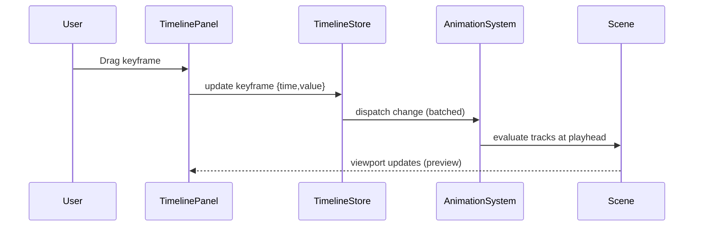

# Animation System & Timeline Editor PRD

## Overview

### Context & Goals

- Establish a first‑class animation system that supports skeletal, transform, morph, material and event tracks for entities.
- Provide a professional timeline editor inside the game editor for authoring, previewing, scrubbing, layering, and blending animations.
- Enable reliable scene serialization of animations and deterministic playback in runtime (ECS‑driven with minimal re‑renders).
- Integrate with asset pipeline and scripting for triggers, ensuring extensibility and testability.

### Current Pain Points

- No dedicated animation component or timeline authoring tool; ad‑hoc use of `useAnimations` limits control and orchestration.
- No unified data model for clips, tracks, keyframes, easing, or cross‑entity sequences.
- Scene serialization lacks animation timelines, making authored motion non‑portable and non‑versionable.
- No editor UX for precise keyframe editing, snapping, curves, or cross‑fade configuration.

## Proposed Solution

### High‑level Summary

- Introduce `AnimationSystem` (runtime) with Zod‑validated component schemas and deterministic update loop integrating Three.js `AnimationMixer` and custom tracks.
- Add `AnimationComponent` to entities with clip references, playback state, blend config, and track registry.
- Build an `Animation Timeline Panel` in the editor: scroll/zoom, playhead, snapping, multi‑track, easing curves, clip blending, and event markers.
- Persist timelines in scene JSON via existing serialization layer; provide migration and versioning for animation schema.
- Provide scripting hooks and events for entering/exiting clips, markers, and beat/grid cues.

### Architecture & Directory Structure

```
/src/core/
  ├── systems/
  │   └── AnimationSystem.ts          # ECS system driving playback each frame
  ├── components/
  │   └── animation/
  │       ├── AnimationComponent.ts   # schema + runtime data (Zod)
  │       ├── tracks/
  │       │   ├── TransformTrack.ts   # position/rotation/scale tracks
  │       │   ├── MorphTargetTrack.ts # morph weights
  │       │   ├── MaterialTrack.ts    # color/opacity/emissive/props
  │       │   ├── EventTrack.ts       # script/audio/marker events
  │       │   └── TrackTypes.ts       # shared interfaces & helpers
  │       └── curves/
  │           ├── Easing.ts           # bezier, step, linear, custom
  │           └── Interpolators.ts    # slerp/lerp/catmull/hold
  └── lib/animation/
      ├── TimelineEvaluator.ts        # keyframe evaluation & caching
      ├── Mixing.ts                   # cross‑fade, additive, layers
      └── Serialization.ts            # versioned encode/decode

/src/editor/components/panels/TimelinePanel/
  ├── TimelinePanel.tsx               # main panel (R3F editor shell integration)
  ├── TrackRow.tsx                    # virtualized track rows
  ├── Keyframe.tsx                    # keyframe glyph + selection/drag
  ├── ClipLane.tsx                    # clip containers, drag/trim
  ├── Playhead.tsx                    # scrubber & time readout
  ├── Ruler.tsx                       # time grid, snapping
  ├── CurveEditor.tsx                 # inline curve editor (mini)
  ├── hooks/
  │   ├── useTimelineStore.ts         # zustand store for editor state
  │   ├── useTimeGrid.ts              # zoom/pan, grid spacing, snapping
  │   ├── useSelection.ts             # selection, marquee, multi‑select
  │   └── useKeyboardShortcuts.ts     # QWER, S, D, copy/paste, delete
  └── utils/
      ├── timeMath.ts                 # time<->px mapping, clamp
      └── clipboard.ts                # copy/paste schema
```

## Implementation Plan

1. Phase 1: Foundations (0.5 day)

   1. Define Zod schemas: keyframe, track, clip, component, and serialization versioning.
   2. Set up `AnimationSystem` scaffold and ECS registration; integrate with engine loop.
   3. Establish event topics: `animation:play`, `animation:pause`, `animation:marker`.

2. Phase 2: Runtime Core (1 day)

   1. Implement `TimelineEvaluator` with per‑track interpolation and caching.
   2. Implement transform/morph/material tracks and mixers (cross‑fade, additive).
   3. Integrate with Three.js `AnimationMixer` for GLTF clips; unify control surface.

3. Phase 3: Editor Timeline MVP (1 day)

   1. Implement `TimelinePanel` with ruler, playhead, zoom/pan, and snapping.
   2. Virtualized track list, keyframe rendering, selection + drag/move/trim.
   3. Basic curve editor (linear/step/bezier handles) with live preview in viewport.

4. Phase 4: Persistence & Commands (0.5 day)

   1. Hook into scene serialization; store timelines and links to entities.
   2. Integrate with Command System for undo/redo of timeline edits.
   3. Add copy/paste across entities, clipboard schema, and migration utilities.

5. Phase 5: Polish & Integrations (1 day)

   1. Event tracks (script/audio markers), loop regions, time remapping.
   2. Cross‑clip blending UI, layer muting/solo, ghosting.
   3. Performance pass: memoization, minimal renders, batched updates.

Total: ~4.0 days (Foundations 0.5, Core 1, Editor 1, Persistence 0.5, Polish 1)

## File and Directory Structures

```
/docs/PRDs/
  └── 4-15-animation-system-timeline-editor-prd.md
```

## Technical Details

```ts
// Schema & types (Zod + interfaces). Named exports only. Prefix interfaces with I.
import { z } from 'zod';

export const KeyframeSchema = z.object({
  time: z.number().nonnegative(),
  value: z.union([
    z.number(),
    z.tuple([z.number(), z.number(), z.number()]), // vec3
    z.tuple([z.number(), z.number(), z.number(), z.number()]), // quat
    z.record(z.string(), z.number()), // morph map
  ]),
  easing: z
    .union([z.literal('linear'), z.literal('step'), z.literal('bezier'), z.literal('custom')])
    .default('linear'),
  easingArgs: z.array(z.number()).optional(), // bezier control points or custom id
});
export type IKeyframe = z.infer<typeof KeyframeSchema>;

export const TrackSchema = z.object({
  id: z.string(),
  type: z.enum([
    'transform.position',
    'transform.rotation',
    'transform.scale',
    'morph',
    'material',
    'event',
  ]),
  targetPath: z.string(), // e.g. 'root/Spine' or material path
  keyframes: z.array(KeyframeSchema),
});
export type ITrack = z.infer<typeof TrackSchema>;

export const ClipSchema = z.object({
  id: z.string(),
  name: z.string(),
  duration: z.number().positive(),
  loop: z.boolean().default(true),
  timeScale: z.number().positive().default(1),
  tracks: z.array(TrackSchema),
});
export type IClip = z.infer<typeof ClipSchema>;

export const AnimationComponentSchema = z.object({
  activeClipId: z.string().optional(),
  blendIn: z.number().nonnegative().default(0.2),
  blendOut: z.number().nonnegative().default(0.2),
  layer: z.number().int().nonnegative().default(0),
  weight: z.number().min(0).max(1).default(1),
  playing: z.boolean().default(false),
  time: z.number().nonnegative().default(0),
  clips: z.array(ClipSchema).default([]),
  version: z.literal(1).default(1),
});
export type IAnimationComponent = z.infer<typeof AnimationComponentSchema>;

// Runtime System surface
export interface IAnimationApi {
  play(entityId: number, clipId: string, opts?: { fade?: number; loop?: boolean }): void;
  pause(entityId: number): void;
  stop(entityId: number, opts?: { fade?: number }): void;
  setTime(entityId: number, time: number): void;
  getState(entityId: number): { time: number; playing: boolean } | null;
}
```

### Editor & Component Integration

```ts
// KnownComponentTypes addition
export const KnownComponentTypes = {
  // ...existing,
  ANIMATION: 'ANIMATION',
} as const;

// Inspector adapter (simplified)
export const AnimationAdapter: React.FC<{ entityId: number }> = ({ entityId }) => {
  // read/write component via component manager
  // render list of clips, active clip, loop, blend durations
  return null;
};

// Timeline store (Zustand). Use selectors to prevent re-renders.
export const useTimelineStore = create<{
  zoom: number;
  pan: number;
  selection: { keys: string[]; tracks: string[] };
  setZoom: (z: number) => void;
  setPan: (p: number) => void;
  setSelection: (s: { keys: string[]; tracks: string[] }) => void;
}>((set) => ({
  zoom: 1,
  pan: 0,
  selection: { keys: [], tracks: [] },
  setZoom: (zoom) => set({ zoom }),
  setPan: (pan) => set({ pan }),
  setSelection: (selection) => set({ selection }),
}));
```

### Third‑Party Libraries (evaluated)

- Primary
  - three / @react-three/fiber: renderer and scene graph.
  - @react-three/drei `useAnimations`: bridge to Three.js `AnimationMixer` for GLTF.
  - zod: schema validation for animation data.
  - zustand (+ immer): small, selective store for editor state with minimal re‑renders.
- Optional
  - @use-gesture/react: precise drag/zoom/pan for timeline interactions.
  - @tanstack/react-virtual: virtualize track rows for large scenes.
  - bezier-easing: bezier curve utility for easing handles.
  - three-stdlib: FBXLoader, if FBX animation import is required.

Rationale: keep dependencies minimal, aligned with existing stack; optional libs are small and composable.

## Usage Examples

```ts
// Runtime: play a clip with cross-fade
animationApi.play(entityId, 'Walk', { fade: 0.25, loop: true });

// Editor: create a keyframe on position.x at current time
timeline.addKeyframe({
  entityId,
  track: { type: 'transform.position', targetPath: 'root', component: 'x' },
  time: timeline.getPlayhead(),
  value: currentPosition.x,
  easing: 'bezier',
  easingArgs: [0.25, 0.1, 0.25, 1.0],
});

// Serialization: include animation component in scene JSON
scene.entities[i].components.ANIMATION = componentManager.get(entityId, 'ANIMATION');
```

## Testing Strategy

- Unit Tests
  - Keyframe interpolation correctness (linear, step, bezier, quaternion slerp).
  - Mixing semantics (cross‑fade durations, layer weights, additive blending).
  - Evaluator caching behavior and boundary conditions (t=0, t=duration, overshoot).
  - Schema validation and migration (versioned decode/encode).
- Integration Tests
  - Editor timeline interactions: add/move/delete keyframes; undo/redo; copy/paste across entities.
  - Scene serialization round‑trip preserves timelines and playback settings.
  - GLTF clip import mapped into our clip model; playback parity with Three.js mixer.

## Edge Cases

| Edge Case                              | Remediation                                               |
| -------------------------------------- | --------------------------------------------------------- |
| Zero keyframes on a track              | Treat as no‑op; hide track or prompt to add keyframe      |
| Single keyframe                        | Hold/step or clamp depending on loop; document behavior   |
| Negative or NaN times                  | Validate via Zod; sanitize on import; disallow edits      |
| Quaternion flipping                    | Use shortest‑arc slerp; normalize inputs                  |
| Cross‑fade between incompatible tracks | Down‑mix or ignore with warning; telemetry event          |
| Missing GLTF actions                   | Fallback to local tracks; surface diagnostics in editor   |
| Large scenes (1000+ tracks)            | Virtualize rows; batch updates; memoized selectors        |
| Precision drift at long durations      | Use double precision time internally; clamp on UI display |

## Sequence Diagram



## Risks & Mitigations

| Risk                                 | Mitigation                                                  |
| ------------------------------------ | ----------------------------------------------------------- |
| Re‑render storms from timeline edits | Zustand selectors, memoized rows, batched event emitter     |
| Mixer & custom tracks divergence     | Unify control surface; adapter layer; test parity with GLTF |
| Complex curves UX                    | Start with linear/step/bezier; advanced editor behind flag  |
| Serialization bloat                  | Deduplicate tracks; compress keyframes; versioned schema    |

## Timeline

- Total: ~4.0 days
  - Foundations: 0.5
  - Runtime Core: 1.0
  - Editor MVP: 1.0
  - Persistence & Commands: 0.5
  - Polish & Integrations: 1.0

## Acceptance Criteria

- Editor timeline panel allows creating, moving, deleting keyframes with snapping and zoom/pan.
- Runtime plays authored clips deterministically with blending; GLTF actions are controllable through the same API.
- Scene serialization round‑trips timelines; migrations handled for version=1.
- Undo/redo works for all timeline edits; no noticeable stutter during scrubbing on mid‑range hardware.

## Conclusion

This plan delivers a robust, extensible animation foundation and a production‑ready timeline editor with minimal dependencies, tight ECS integration, and reliable persistence—unlocking cinematic sequencing and precise gameplay animation control.

## Assumptions & Dependencies

- Existing ECS, event bus, and scene serialization are available to integrate.
- three / r3f / drei are present; optional: three‑stdlib `FBXLoader` if FBX imports are needed.
- Zod, Zustand (+ Immer) adopted across the project; Tailwind for UI styling.
- Command System PRD is implemented (undo/redo); Asset Pipeline PRD provides animation asset availability.
