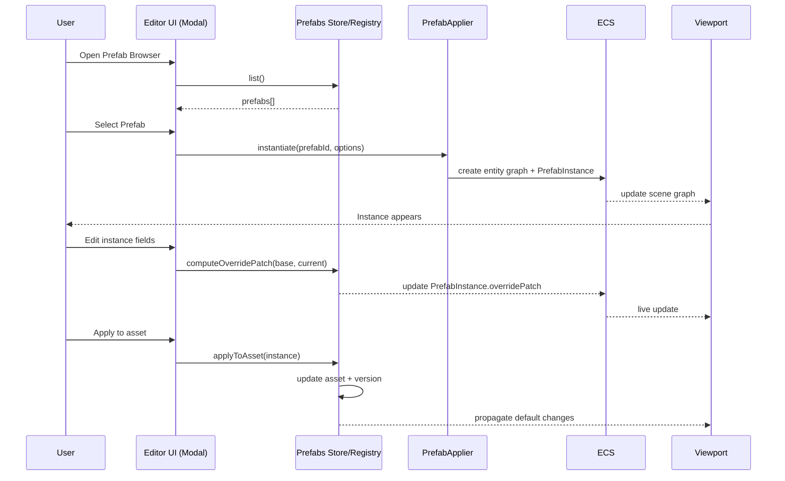

# Prefab System PRD

## Overview

### Context & Goals

- Establish a Unity-like Prefab workflow to author reusable entity graphs with components, scripts, and default values.
- Make prefabs first-class assets with IDs, versioning, and schema validation; enable instantiation, overrides, apply/revert, and safe updates.
- Provide editor UX via modals inspired by the Material System (browser/create/inspector), supporting search, preview, and batch operations.
- Support performant streaming serialization with stable links to prefab assets while remaining backward compatible with flattened scenes.

### Current Pain Points

- No first-class prefab asset; users duplicate entities or rely on ad-hoc compositions, leading to drift and rework.
- Lacks instance-vs-asset link, making global fixes difficult; no apply/revert flow for overrides.
- Nested/common patterns (e.g., light rigs, interactable bundles) are hard to maintain across scenes.
- No consistent migration or validation path; duplication increases save size and GC pressure.

## Proposed Solution

### High‑level Summary

- Introduce a Zod-validated Prefab Asset with stable `prefabId`, name, metadata, and an entity-graph payload.
- Add a `PrefabRegistry` for load/save/list/versioning and a `PrefabApplier` to instantiate graphs into the ECS with deterministic ID mapping.
- Add a `PrefabInstance` ECS component on root instances that stores `prefabId`, `version`, and a minimal override patch (diff) against the asset.
- Support nested prefabs and optional prefab variants (variant = base prefab + patch), with cycle detection and version mismatch handling.
- Editor UX: Prefab Browser Modal, Prefab Create Modal, Prefab Inspector; mirror the Material System modal patterns for consistency.

### Architecture & Directory Structure

```
/src/core/prefabs/
  ├── Prefab.types.ts            # Zod schema + TS types (IPrefabDefinition, IPrefabVariant)
  ├── PrefabRegistry.ts          # Load/save/list/get; versioning; cache; validation
  ├── PrefabApplier.ts           # Instantiate prefab graphs; ID mapping; nesting; cycle checks
  ├── PrefabOverrides.ts         # Compute/apply diffs; merge rules; patch validation
  └── PrefabUtils.ts             # Helpers: stable hashing, id remap, validation, traversal

/src/core/lib/ecs/components/definitions/
  └── PrefabInstance.ts          # IPrefabInstance data (prefabId, version, overridePatch)

/src/editor/components/prefabs/
  ├── PrefabBrowserModal.tsx     # Unity-like browser; search/preview/assign/duplicate/delete
  ├── PrefabCreateModal.tsx      # Create from selection/template; supports variant from base
  ├── PrefabInspector.tsx        # View/edit metadata; manage variants; edit default values
  └── hooks/usePrefabs.ts        # Store + commands for CRUD, instantiate, apply/revert

/src/editor/store/
  └── prefabsStore.ts            # Zustand store for list, selection, filters, modal state

/public/assets/prefabs/
  └── *.prefab.json              # Prefab asset files (and optional *.variant.json)
```

## Implementation Plan

### Phase 1: Core Prefab Model & Registry (0.75 day)

1. Define `IPrefabDefinition` Zod schema (id, name, version, root graph, metadata, dependencies).
2. Implement `PrefabRegistry` with in-memory cache and asset IO (list/get/upsert/remove).
3. Add validation and helpful errors; compute stable hashes for quick change detection.

### Phase 2: Instantiation & Overrides (1.0 day)

1. Implement `PrefabApplier.instantiate(prefabId, options)` → returns root entity id(s).
2. Add `PrefabInstance` ECS component: `{ prefabId, version, overridePatch, instanceUuid }`.
3. Implement diff/patch in `PrefabOverrides` for component/prop-level overrides; forbid structural diffs by default.
4. Support nested prefabs by resolving subgraphs; detect and block cycles; guard max depth.
5. Provide `applyToAsset` (apply overrides → update asset) and `revertInstance` (drop overrides).

### Phase 3: Editor UX & Modals (0.75 day)

1. Build `PrefabBrowserModal` and `PrefabCreateModal` reusing `Modal` patterns from the Material System.
2. Implement `PrefabInspector` to show metadata, version, dependency graph, and default fields.
3. Add commands: create from current selection, instantiate to scene, replace selection with prefab, duplicate as variant.

### Phase 4: Serialization & Migration (0.5 day)

1. Extend streaming serialization to persist `PrefabInstance` data and override patches.
2. Loading prefers reconstructing from prefab assets; fallback to flattened entities if assets missing.
3. Provide migration utility to convert duplicated entity groups into prefab assets and link instances.

### Phase 5: Variants & Nesting Polish (0.75 day)

1. Add optional `IPrefabVariant` schema (baseId + patch) and variant resolution chain.
2. Inspector support to create/manage variants and preview diff.
3. Optimize nested resolution and ID mapping; add performance instrumentation.

### Phase 6: Testing & Quality (0.5 day)

1. Unit tests for schema, registry, applier, overrides, cycle detection.
2. Integration tests: instantiate/revert/apply/serialize/deserialize; nested and variant paths.
3. Editor E2E flows for browser/create/assign and from-selection creation.

## File and Directory Structures

```
/docs/PRDs/
  └── 4-18-prefab-system-prd.md

/src/core/prefabs/
  ├── Prefab.types.ts
  ├── PrefabRegistry.ts
  ├── PrefabApplier.ts
  ├── PrefabOverrides.ts
  └── PrefabUtils.ts

/src/core/lib/ecs/components/definitions/
  └── PrefabInstance.ts

/src/editor/components/prefabs/
  ├── PrefabBrowserModal.tsx
  ├── PrefabCreateModal.tsx
  ├── PrefabInspector.tsx
  └── hooks/usePrefabs.ts

/src/editor/store/
  └── prefabsStore.ts

/public/assets/prefabs/
  ├── default.prefab.json
  └── examples/
      ├── light-rig.prefab.json
      └── pickup.prefab.json
```

## Technical Details

```ts
// src/core/prefabs/Prefab.types.ts
import { z } from 'zod';

export const PrefabVersionSchema = z.number().int().min(1).default(1);

export const PrefabEntitySchema = z.object({
  name: z.string(),
  components: z.record(z.string(), z.unknown()),
  children: z.array(z.lazy(() => PrefabEntitySchema)).default([]),
});

export const PrefabDefinitionSchema = z.object({
  id: z.string(),
  name: z.string(),
  version: PrefabVersionSchema,
  root: PrefabEntitySchema, // Root of the entity graph
  metadata: z.record(z.string(), z.unknown()).default({}),
  dependencies: z.array(z.string()).default([]), // referenced assets/materials/scripts
});

export type IPrefabDefinition = z.infer<typeof PrefabDefinitionSchema>;

export const PrefabVariantSchema = z.object({
  id: z.string(),
  baseId: z.string(),
  name: z.string(),
  version: PrefabVersionSchema,
  patch: z.unknown().optional(), // override patch applied over base prefab
});

export type IPrefabVariant = z.infer<typeof PrefabVariantSchema>;

export interface IPrefabAssetMeta {
  id: string;
  name: string;
  path: string; // /assets/prefabs/whatever.prefab.json
}
```

```ts
// src/core/lib/ecs/components/definitions/PrefabInstance.ts
export interface IPrefabInstance {
  prefabId: string;
  version: number; // Prefab asset version
  instanceUuid: string; // Unique per instance for tracking
  overridePatch?: unknown; // Minimal diff against asset (no structural changes)
}
```

```ts
// src/core/prefabs/PrefabRegistry.ts
import type { IPrefabDefinition, IPrefabVariant } from './Prefab.types';

export class PrefabRegistry {
  private static instance: PrefabRegistry | null = null;
  static getInstance(): PrefabRegistry {
    if (!this.instance) this.instance = new PrefabRegistry();
    return this.instance;
  }

  private idToDef = new Map<string, IPrefabDefinition>();
  private idToVariant = new Map<string, IPrefabVariant>();

  list(): IPrefabDefinition[] {
    return [...this.idToDef.values()];
  }
  get(id: string): IPrefabDefinition | undefined {
    return this.idToDef.get(id);
  }
  upsert(def: IPrefabDefinition): void {
    this.idToDef.set(def.id, def);
  }
  remove(id: string): void {
    this.idToDef.delete(id);
  }

  listVariants(): IPrefabVariant[] {
    return [...this.idToVariant.values()];
  }
  getVariant(id: string): IPrefabVariant | undefined {
    return this.idToVariant.get(id);
  }
  upsertVariant(v: IPrefabVariant): void {
    this.idToVariant.set(v.id, v);
  }
  removeVariant(id: string): void {
    this.idToVariant.delete(id);
  }
}
```

```ts
// src/core/prefabs/PrefabApplier.ts
import type { IPrefabDefinition } from './Prefab.types';

export interface IInstantiateOptions {
  parentEntityId?: number | null;
  applyOverrides?: unknown; // optional override patch at creation
}

export function instantiatePrefab(prefab: IPrefabDefinition, options: IInstantiateOptions): number {
  // 1) Remap prefab graph to ECS entities
  // 2) Add PrefabInstance to root entity with link + optional override patch
  // 3) Return root entity id
  return 0;
}
```

```ts
// src/core/prefabs/PrefabOverrides.ts
export interface IPrefabOverrideRules {
  allowStructuralChanges: boolean; // default false
}

export function computeOverridePatch(base: unknown, current: unknown): unknown {
  // Compute minimal diff between base and current (component-level)
  return {};
}

export function applyOverridePatch<T>(base: T, patch?: unknown, rules?: IPrefabOverrideRules): T {
  // Apply patch with guardrails
  return base;
}
```

```tsx
// src/editor/components/prefabs/PrefabBrowserModal.tsx
import React from 'react';
import { Modal } from '@/editor/components/shared/Modal';

export interface IPrefabBrowserModalProps {
  isOpen: boolean;
  onClose: () => void;
  onSelect: (prefabId: string) => void;
}

export const PrefabBrowserModal: React.FC<IPrefabBrowserModalProps> = ({
  isOpen,
  onClose,
  onSelect,
}) => {
  // List + search + preview of prefabs; click → onSelect(id)
  return <Modal isOpen={isOpen} onClose={onClose} title="Select Prefab" maxWidth="w-[720px]" />;
};
```

```tsx
// src/editor/components/prefabs/PrefabCreateModal.tsx
import React from 'react';
import { Modal } from '@/editor/components/shared/Modal';

export interface IPrefabCreateModalProps {
  isOpen: boolean;
  onClose: () => void;
  onCreateFromSelection: (name: string) => void;
  onCreateVariant?: (baseId: string, name: string) => void;
}

export const PrefabCreateModal: React.FC<IPrefabCreateModalProps> = ({ isOpen, onClose }) => {
  return <Modal isOpen={isOpen} onClose={onClose} title="Create Prefab" />;
};
```

```tsx
// src/editor/components/prefabs/PrefabInspector.tsx
import React from 'react';

export interface IPrefabInspectorProps {
  prefabId: string;
}

export const PrefabInspector: React.FC<IPrefabInspectorProps> = ({ prefabId }) => {
  // Edit metadata, manage variants, preview default values
  return <div className="p-3 space-y-3">{/* fields */}</div>;
};
```

## Usage Examples

```ts
// 1) Create prefab from current selection (editor command)
prefabs.createFromSelection({ name: 'Pickup', includeChildren: true });

// 2) Instantiate into scene at selection
prefabs.instantiate('Pickup', { parentEntityId: selectedEntity });

// 3) Apply instance overrides back to asset
prefabs.applyToAsset(instanceRootEntityId);

// 4) Revert instance overrides
prefabs.revertInstance(instanceRootEntityId);

// 5) Create a variant from base prefab
prefabs.createVariant({ baseId: 'Pickup', name: 'Pickup_Golden' });
```

```tsx
// Inspector: assign prefab to replace selection (mirror Material modals UX)
<ComponentField
  label="Prefab"
  type="button"
  value={currentPrefabId}
  onClick={() => openPrefabBrowser({ onSelect: (id) => replaceSelectionWithPrefab(id) })}
  rightActions={[{ label: 'Create', onClick: () => openPrefabCreate() }]}
/>
```

## Testing Strategy

- Unit: Zod validation; registry CRUD; applier id mapping; override diff/apply; cycle detection.
- Integration: Instantiate nested prefabs; apply/revert flows; variant resolution; serialization round-trip.
- Editor: Modal open/close; search/select; create from selection; replace selection with prefab; batch instantiate.
- Performance: Instantiate 100s of instances; ensure stable FPS and minimal GC churn.

## Edge Cases

| Edge Case                            | Remediation                                                     |
| ------------------------------------ | --------------------------------------------------------------- |
| Missing `prefabId`/asset not found   | Fallback to flattened entities; warn in inspector; relink flow. |
| Version mismatch (asset vs instance) | Soft warn; support migration or auto-upgrade with patch merge.  |
| Cyclic nesting                       | Detect in registry; block instantiate; surface error clearly.   |
| Structural overrides on instances    | Disallow by default; offer "Unpack" to detach from prefab.      |
| Large nested graphs                  | Chunked instantiation; breadth-first apply; progress UI.        |
| Deleting base prefab in use          | Prevent delete; require replacing or unpacking instances.       |
| Asset path moved/renamed             | Track by `prefabId`; update registry index on scan.             |
| Scene import without prefab assets   | Load as flattened with tag; support relink later.               |

## Sequence Diagram



## Risks & Mitigations

| Risk                                       | Mitigation                                                        |
| ------------------------------------------ | ----------------------------------------------------------------- |
| Data loss on apply/revert                  | Confirmations + backups; diff preview; undo/redo integration.     |
| Performance when instantiating many graphs | Chunked creation; memoized converters; minimal allocations.       |
| Complex override diffs                     | Restrict to component-level props; clear merge rules; validation. |
| Editor UX inconsistency                    | Reuse Material System `Modal` patterns and store structure.       |
| Nested prefab cycles                       | Cycle detection; max-depth guard; descriptive errors.             |
| Serialization compatibility                | Backward-compatible fallback to flattened entities with tags.     |

## Timeline

- Total: ~3.25 days
  - Core Model & Registry: 0.75 day
  - Instantiation & Overrides: 1.0 day
  - Editor UX & Modals: 0.75 day
  - Serialization & Migration: 0.5 day
  - Variants & Polish: 0.25 day

## Acceptance Criteria

- Can create, browse, duplicate, delete prefab assets in `/public/assets/prefabs`.
- Instantiate prefabs via Prefab Browser modal; instances carry `PrefabInstance` with link and overrides.
- Apply/revert flows functional; editing asset updates all instances; revert clears instance overrides.
- Nested prefabs supported with cycle detection; optional variants supported via base+patch.
- Scenes persist and reload instances with links; missing assets gracefully fallback.
- Editor UX mirrors Material System modals for layout/controls; keyboard and focus management via shared `Modal`.
- No performance regression with 200+ instances; no console errors; stable FPS.

## Conclusion

This Prefab System introduces a robust, Unity-inspired workflow for reusable entity graphs, enabling rapid scene composition, safe global updates, and scalable maintenance. It leverages existing modal patterns for a familiar editor UX and integrates cleanly with streaming serialization and ECS.

## Assumptions & Dependencies

- Zod available for schema validation; TypeScript path aliases per `tsconfig`.
- Reuse shared `Modal` component; Tailwind for styling; Zustand for stores.
- Streaming serializer v5 is the save/load backbone and supports incremental evolution.
- ECS supports dynamic creation/removal; hierarchy system provides parent-child transforms.
- Material and asset systems provide referenced resources used by prefabs (meshes, materials, scripts).
