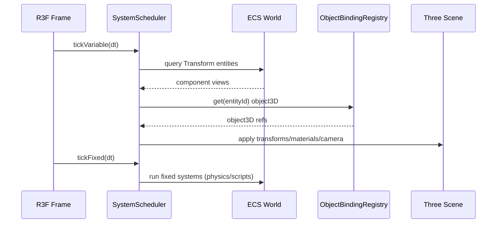

# ECS ↔ Viewport Architecture Refactor PRD (Performance & Reliability)

## Overview

- **Context & Goals**

  - Unify ECS-driven state and Three.js viewport rendering to reduce redundant sync paths and improve determinism.
  - Establish a single authoritative data flow for transforms, materials, and cameras across editor and play modes.
  - Introduce predictable system scheduling with clear fixed/variable step semantics and performance instrumentation.
  - Prepare the runtime for multi-world isolation and worker offloading without breaking editor workflows.

- **Current Pain Points**
  - Duplicate transform/material sync paths (hooks vs systems) causing extra renders and inconsistent state.
  - Weak boundary between editor-only behaviors and runtime systems, increasing coupling and regressions.
  - Ad-hoc queries/events lead to avoidable scans, jitter, and unclear update lifecycles.
  - Single-world assumption and main-thread-only script execution limit scalability and responsiveness.

## Proposed Solution

- **High‑level Summary**

  - Introduce an Object Binding Registry to centralize entity↔Three.js object mapping used by all systems.
  - Move authoritative transform/material/camera synchronization into ECS systems; React hooks become view hints only.
  - Add a System Scheduler with fixed/variable scheduling, priorities, and budgeted execution per frame.
  - Separate editor vs runtime concerns via a Renderer Bridge layer; normalize camera switching and inputs.
  - Prepare for multi-world: World Manager APIs, typed event bus, and worker-ready boundaries (scripts, heavy queries).

- **Architecture & Directory Structure**
  ```
  src/
  ├── core/
  │   ├── ecs/
  │   │   ├── world/
  │   │   │   ├── WorldManager.ts
  │   │   │   └── WorldContext.ts
  │   │   ├── scheduling/
  │   │   │   ├── SystemScheduler.ts
  │   │   │   └── SystemTypes.ts
  │   │   ├── bindings/
  │   │   │   ├── ObjectBindingRegistry.ts
  │   │   │   └── ObjectBindingTypes.ts
  │   │   ├── systems/
  │   │   │   ├── TransformSyncSystem.ts
  │   │   │   ├── MaterialSyncSystem.ts
  │   │   │   └── CameraSyncSystem.ts
  │   │   └── events/
  │   │       ├── EventBus.ts
  │   │       └── EventTypes.ts
  │   ├── runtime/
  │   │   ├── RendererBridge.ts
  │   │   └── PerformanceMetrics.ts
  │   └── workers/
  │       └── ScriptWorkerBridge.ts
  └── editor/
      └── viewport/
          ├── ViewportAdapter.tsx
          └── ViewportBindings.ts
  ```

## Implementation Plan

- Phase 1: Baseline & Instrumentation (0.5 day)

  1. Add lightweight frame metrics and system timers (existing profiler integration).
  2. Capture current frame time breakdown and entity counts on representative scenes.

- Phase 2: Object Binding Registry (1 day)

  1. Implement `ObjectBindingRegistry` with register/update/unregister/get mapping by entity.
  2. Replace ad-hoc maps in transform/material/camera systems with the registry.
  3. Provide stable typings and lifecycle rules (mount/unmount, replace on model swap).

- Phase 3: Transform Synchronization Unification (1 day)

  1. Move authoritative transform application to `TransformSyncSystem` (ECS → Three.js).
  2. Reduce `useEntityTransform` to only assist editor gizmo UX; remove direct writes during normal playback.
  3. Ensure parent-child propagation is batched and allocation-free where feasible.

- Phase 4: Material Synchronization Consolidation (1 day)

  1. Centralize material application in `MaterialSyncSystem` using the registry.
  2. Normalize multi-material handling and override layering; throttle updates safely.
  3. Remove duplicate hook-based material writes in viewport components.

- Phase 5: Camera Synchronization & Play/Edit Modes (0.5 day)

  1. Consolidate editor and play camera updates under `CameraSyncSystem` with clear precedence rules.
  2. Drive play-mode camera replacement via `RendererBridge`; unify selection-feedback paths for editor.

- Phase 6: System Scheduler (1 day)

  1. Introduce `SystemScheduler` with fixed-step (physics/scripts) and variable-step (render-affecting) queues.
  2. Enable priorities, budgets, and opt-in throttling; expose metrics.

- Phase 7: Event Bus & Query Hygiene (0.5 day)

  1. Add typed `EventBus` for component/entity lifecycle and system signals.
  2. Audit query hotspots; introduce cached/batched queries behind scheduler ticks.

- Phase 8: Multi‑World Readiness (0.5 day)

  1. Add `WorldManager` for creating/isolation of worlds; deprecate hard singletons in critical paths.
  2. Thread world references through scheduler and systems for testability.

- Phase 9: Worker Preparation (Scripts) (1 day)

  1. Define `ScriptWorkerBridge` API boundary; keep main thread integration minimal.
  2. Defer actual worker migration; ensure data packets are serializable and small.

- Phase 10: Cleanup & Migration (0.5 day)
  1. Remove deprecated hook-based sync code paths; update viewport adapters to registry usage.
  2. Update docs and examples; record performance deltas.

## File and Directory Structures

```
/src/core/ecs/world/
├── WorldManager.ts
└── WorldContext.ts

/src/core/ecs/scheduling/
├── SystemScheduler.ts
└── SystemTypes.ts

/src/core/ecs/bindings/
├── ObjectBindingRegistry.ts
└── ObjectBindingTypes.ts

/src/core/ecs/systems/
├── TransformSyncSystem.ts
├── MaterialSyncSystem.ts
└── CameraSyncSystem.ts

/src/core/ecs/events/
├── EventBus.ts
└── EventTypes.ts

/src/core/runtime/
├── RendererBridge.ts
└── PerformanceMetrics.ts

/src/core/workers/
└── ScriptWorkerBridge.ts

/src/editor/viewport/
├── ViewportAdapter.tsx
└── ViewportBindings.ts
```

## Technical Details

```ts
// ObjectBindingTypes.ts
export interface IEntityBindingRef {
  entityId: number;
  object3D: object; // Three.Object3D (kept generic in PRD)
}

export interface IObjectBindingRegistry {
  register(ref: IEntityBindingRef): void;
  update(ref: IEntityBindingRef): void;
  unregister(entityId: number): void;
  get(entityId: number): object | null;
}
```

```ts
// ObjectBindingRegistry.ts
export class ObjectBindingRegistry implements IObjectBindingRegistry {
  register(ref: IEntityBindingRef): void {}
  update(ref: IEntityBindingRef): void {}
  unregister(entityId: number): void {}
  get(entityId: number): object | null {
    return null;
  }
}
```

```ts
// SystemTypes.ts
export type SystemPhase = 'init' | 'fixed' | 'variable' | 'late';
export interface ISystem {
  id: string;
  phase: SystemPhase;
  order?: number;
  update(dt: number): void;
}
```

```ts
// SystemScheduler.ts
export class SystemScheduler {
  add(system: ISystem): void {}
  remove(systemId: string): void {}
  tickFixed(dt: number): void {}
  tickVariable(dt: number): void {}
}
```

```ts
// TransformSyncSystem.ts
export class TransformSyncSystem implements ISystem {
  id = 'transform-sync';
  phase: SystemPhase = 'variable';
  update(dt: number): void {
    // Read ECS transform components, compute world transforms,
    // apply to bound objects via ObjectBindingRegistry
  }
}
```

```ts
// MaterialSyncSystem.ts
export class MaterialSyncSystem implements ISystem {
  id = 'material-sync';
  phase: SystemPhase = 'late';
  update(dt: number): void {
    // Read MeshRenderer-like data, apply to Three materials
  }
}
```

```ts
// CameraSyncSystem.ts
export class CameraSyncSystem implements ISystem {
  id = 'camera-sync';
  phase: SystemPhase = 'variable';
  update(dt: number): void {
    // Apply camera component changes to active camera(s)
  }
}
```

```ts
// WorldManager.ts
export class WorldManager {
  createWorld(): unknown {
    return {};
  }
  destroyWorld(world: unknown): void {}
}
```

```ts
// EventBus.ts
export type EventName =
  | 'component:added'
  | 'component:removed'
  | 'component:updated'
  | 'entity:created'
  | 'entity:deleted';
export interface IEvent<T = unknown> {
  name: EventName;
  payload: T;
}
export interface IEventBus {
  on<T>(name: EventName, cb: (e: IEvent<T>) => void): () => void;
  emit<T>(e: IEvent<T>): void;
}
export class EventBus implements IEventBus {
  on<T>(name: EventName, cb: (e: IEvent<T>) => void): () => void {
    return () => {};
  }
  emit<T>(e: IEvent<T>): void {}
}
```

```ts
// RendererBridge.ts
export interface IRendererBridge {
  bindEntity(entityId: number, object3D: object): void;
  unbindEntity(entityId: number): void;
  setActiveCamera(object3D: object): void;
}
```

```ts
// ViewportAdapter.tsx (sketch)
export function ViewportAdapter() {
  // On object mount: bridge.bindEntity(entityId, object3D)
  // On unmount: bridge.unbindEntity(entityId)
  return null;
}
```

## Usage Examples

```ts
// Register a system
scheduler.add(new TransformSyncSystem());
scheduler.add(new MaterialSyncSystem());
scheduler.add(new CameraSyncSystem());
```

```ts
// Bind a viewport object to an entity (editor component)
bridge.bindEntity(entityId, object3D);
```

```ts
// Typed event emission after component update
bus.emit({ name: 'component:updated', payload: { entityId, component: 'Transform' } });
```

## Testing Strategy

- **Unit Tests**

  - ObjectBindingRegistry: register/update/unregister/get; lifecycle under rapid remount.
  - TransformSyncSystem: world-space composition (parent/child), allocation limits.
  - MaterialSyncSystem: overrides layering, multi-material, throttling.
  - CameraSyncSystem: selection vs play mode precedence; projection updates.
  - SystemScheduler: phase ordering, fixed-step accumulation, budgets/throttles.
  - EventBus: subscription lifetimes, payload typing.

- **Integration Tests**
  - Editor viewport renders N entities with stable FPS and correct transforms after batch changes.
  - Switching to play mode swaps camera deterministically and restores on exit.
  - Bulk component updates reflect in a single frame with bounded work.

## Edge Cases

| Edge Case                               | Remediation                                                        |
| --------------------------------------- | ------------------------------------------------------------------ |
| Rapid mount/unmount of objects          | Idempotent bindings; debounce unregister on frame boundary         |
| Deep hierarchies with reparenting       | Cache invalidation on parent change; topological ordering          |
| Multi-material meshes with missing defs | Fallback to default material; log once per material id             |
| Large scenes (1k+ entities)             | Query caching, batched iteration, throttled material updates       |
| Play/edit camera contention             | Single authority per mode; explicit precedence in CameraSyncSystem |
| Missing components                      | Guarded reads; no-ops with metrics counters                        |

## Sequence Diagram



## Risks & Mitigations

| Risk                               | Mitigation                                                      |
| ---------------------------------- | --------------------------------------------------------------- |
| Refactor churn affecting editor UX | Stage via adapters; keep hook APIs stable until final phase     |
| Performance regressions            | Baseline metrics; phase-by-phase perf gates and rollback plan   |
| Incomplete multi-world support     | Keep WorldManager optional; maintain singleton path in parallel |
| Worker boundary complexity         | Define bridge interfaces first; postpone worker migration       |

## Timeline

- Total: ~6 days
  - Phase 1: 0.5d, Phase 2: 1d, Phase 3: 1d, Phase 4: 1d, Phase 5: 0.5d,
  - Phase 6: 1d, Phase 7: 0.5d, Phase 8: 0.5d, Phase 9: 1d, Phase 10: 0.5d (overlaps; optimize as needed)

## Acceptance Criteria

- Single authoritative sync path for transforms, materials, and cameras through ECS systems.
- Viewport objects registered via a centralized binding registry; no duplicate ad-hoc maps.
- SystemScheduler enforces fixed/variable phase ordering; metrics exposed for each system.
- Editor and play mode camera behavior is deterministic and documented.
- Unit/integration tests cover outlined scenarios; perf deltas recorded showing improvement or parity.

## Conclusion

This refactor consolidates ECS-driven synchronization, introduces deterministic scheduling, and decouples editor/runtime boundaries. It reduces redundant updates, clarifies ownership, and prepares the engine for scaling (multi-world, worker offload) without sacrificing iteration speed.

## Assumptions & Dependencies

- Continued use of current ECS and renderer stacks; plan remains library-agnostic in interfaces.
- Access to profiling hooks and test scenes for consistent baselining.
- No immediate worker deployment; boundaries introduced to enable future migration.
