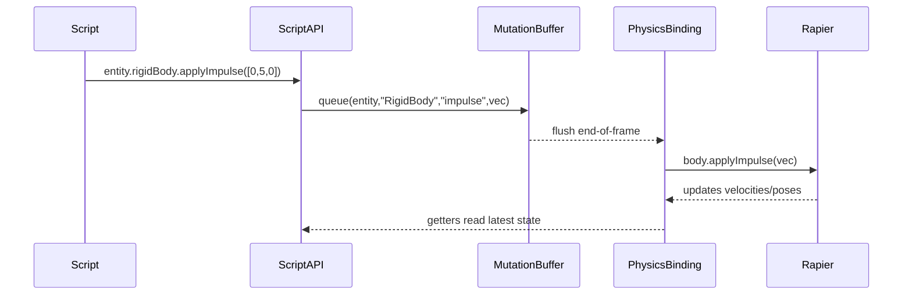

🧠 Planning documents standards rule loaded!

# PRD: Script API Physics Components Completion (RigidBody, MeshCollider, CharacterController)

## 1. Overview

- **Context & Goals**: Enable scripts to fully control physics by exposing first-class accessors and events for `RigidBody`, `MeshCollider`, and a new `CharacterController` via the Script API. Align runtime, editor, and ECS so scripts can read/update physics deterministically using mutation buffers.
- **Why**: Current Script API typings and accessors don’t consistently expose physics capabilities (forces/velocity, collider edits, collision callbacks). A PRD ensures a cohesive plan and testable acceptance criteria.
- **Outcomes**: Scripts can set body type, mass, gravity scale, materials; apply impulses/forces; read/write velocities; toggle colliders/trigger; subscribe to collision/trigger events; and use a simple `CharacterController` for movement.

## 2. Current Pain Points

- Script API d.ts lacks physics accessor fields parity (e.g., `rigidBody`, `meshCollider` not declared in generated typings; no forces/velocity methods).
- Collision/trigger event subscription is not standardized for scripts.
- No Script API surface for a character controller pattern (walk, jump, slope handling).
- ECS-to-R3F Rapier contributions exist but aren’t consistently reachable from scripts.

## 3. Proposed Solution

- Expose typed accessors on `entity.rigidBody` and `entity.meshCollider` with helper methods and field-level `set` operations using mutation buffer.
- Extend `IRigidBodyAccessor` with: `applyForce`, `applyImpulse`, `setLinearVelocity`, `getLinearVelocity`, `setAngularVelocity`, `getAngularVelocity` (mapped to Rapier at render binding points), plus existing mass, gravityScale, materials.
- Standardize collision/trigger events in Script API: `onCollisionEnter/Exit`, `onTriggerEnter/Exit` registration utilities per entity.
- Introduce `CharacterController` Script API helper (non-physics body) or component adapter that performs capsule sweep tests via Rapier queries and manages ground state, jump, slope, step offset.

### Architecture & Directory Structure

```
src/core/lib/scripting/
  apis/
    PhysicsEventsAPI.ts        # script-facing collision/trigger events
    CharacterControllerAPI.ts  # kinematic controller helper API
  adapters/
    physics-binding.ts         # bridges ECS data <-> Rapier runtime ops (forces/velocities)
  ScriptAPI.ts                 # extend interfaces
  ScriptContextFactory.ts      # attach new accessors/APIs to context

src/core/lib/ecs/components/accessors/
  types.ts                     # extend IRigidBodyAccessor/IMeshColliderAccessor types
  ComponentAccessors.ts        # add new rigidBody methods; meshCollider stays

docs/PRDs/4-26-script-api-physics-components-prd.md
```

## 4. Implementation Plan

### Phase 1: API Surface (0.5 day)

1. Update `IRigidBodyAccessor` and `IMeshColliderAccessor` types with new methods.
2. Extend `ComponentAccessors.ts` to queue new mutations and provide getters for velocities (using binding cache).
3. Update generated `src/game/scripts/script-api.d.ts` to include `entity.rigidBody` and `entity.meshCollider` and new methods.

### Phase 2: Runtime Bindings (0.5–1 day)

1. Add `physics-binding.ts` that maps queued mutations to Rapier (`applyImpulse`, `applyForce`, velocities) using `@react-three/rapier` handles.
2. Ensure binding is called post-physics-step or at frame commit point so determinism is preserved.
3. Validate `ComponentRegistry.combinePhysicsContributions` still matches expectations.

### Phase 3: Collision/Trigger Events (0.5 day)

1. Implement `PhysicsEventsAPI.ts` exposing `onCollisionEnter/Exit`, `onTriggerEnter/Exit` with unsubscribe handles.
2. Wire to existing event world (`useCollisionEvents`/Rapier events) and filter per-entity.

### Phase 4: Character Controller (1–1.5 days)

1. Implement `CharacterControllerAPI.ts` with:
   - `move(input: [x,z], speed)` applying horizontal displacement with ground check.
   - `jump(strength)` only when grounded.
   - Ground detection via downward ray/sweep; slope limit and step offset.
2. Optionally define a minimal ECS `CharacterController` component schema for editor-configurable params.

### Phase 5: Docs & Examples (0.5 day)

1. Update `docs/guides/script-api-quick-reference.md` with new physics APIs.
2. Add `game/scripts/examples/physics-controller.ts` showcasing usage.

## 5. Technical Details

### IRigidBodyAccessor additions (types)

```ts
export interface IRigidBodyAccessor extends IComponentAccessor<IRigidBodyData> {
  enable(value: boolean): void;
  setBodyType(type: 'dynamic' | 'kinematic' | 'static'): void;
  setMass(mass: number): void;
  setGravityScale(scale: number): void;
  setPhysicsMaterial(friction: number, restitution: number, density?: number): void;
  applyForce(force: [number, number, number], point?: [number, number, number]): void;
  applyImpulse(impulse: [number, number, number], point?: [number, number, number]): void;
  setLinearVelocity(vel: [number, number, number]): void;
  getLinearVelocity(): [number, number, number];
  setAngularVelocity(vel: [number, number, number]): void;
  getAngularVelocity(): [number, number, number];
}
```

### Script API events

```ts
interface IPhysicsEventsAPI {
  onCollisionEnter(cb: (otherEntityId: number) => void): () => void;
  onCollisionExit(cb: (otherEntityId: number) => void): () => void;
  onTriggerEnter(cb: (otherEntityId: number) => void): () => void;
  onTriggerExit(cb: (otherEntityId: number) => void): () => void;
}

// attach under context: context.entity.physicsEvents
```

### Character Controller API

```ts
interface ICharacterControllerAPI {
  isGrounded(): boolean;
  move(inputXZ: [number, number], speed: number, delta: number): void;
  jump(strength: number): void;
  setSlopeLimit(maxDegrees: number): void;
  setStepOffset(value: number): void;
}
```

## 6. Usage Examples

```ts
// Impulse on fire
if (input.isActionActive('Gameplay', 'Fire')) {
  entity.rigidBody?.applyImpulse([0, 5, 0]);
}

// Continuous velocity control
const [mx, my] = input.getActionValue('Gameplay', 'Move') as [number, number];
entity.rigidBody?.setLinearVelocity([mx * 5, 0, my * 5]);

// Collider toggle
entity.meshCollider?.setTrigger(true);

// Collision callback
const off = entity.physicsEvents?.onCollisionEnter((other) => {
  console.log('Hit:', other);
});

// Character controller
controller.move([mx, my], 6, time.deltaTime);
if (input.isActionActive('Gameplay', 'Jump') && controller.isGrounded()) {
  controller.jump(6.5);
}
```

## 7. Testing Strategy

### Unit Tests

- IRigidBodyAccessor method queuing: `applyImpulse`, `applyForce`, velocity setters enqueue correct buffer ops.
- MeshCollider setters: `setType`, `setCenter`, size setters queue correct payloads and clamps.
- PhysicsEventsAPI registration/unsubscription: handlers invoked exactly once per event and properly cleaned up.
- CharacterController math: slope limit, grounded detection, step offset behavior isolated with mocked ray/sweep.

### Integration Tests (Headless/Rapier-bound)

- Scene boot with `Physics` enabled: entity with `RigidBody` receives queued impulse and changes vertical position over frames.
- Velocity readback: after `setLinearVelocity`, `getLinearVelocity` returns expected within tolerance.
- Trigger vs collider: trigger does not impart forces; collision enter/exit callbacks fire with correct entity IDs.
- Character controller: moving on flat ground advances position; jump increments vertical velocity; cannot jump when airborne; slope > limit prevents ascend.

### Editor/Runtime E2E (Cypress/Playwright optional)

- Toggle `RigidBody.enabled` in inspector reflects in simulation (sleep/wake) while playing.
- Change `meshCollider.isTrigger` at runtime toggles events vs collisions.
- Simple demo scene script uses APIs to pass acceptance scenarios.

### Performance/Determinism Checks

- Mutation buffer flush occurs once per frame; repeated calls coalesce.
- Physics bindings execute after ECS updates before render submit.

## 8. Edge Cases

| Edge Case                                 | Remediation                                           |
| ----------------------------------------- | ----------------------------------------------------- |
| Applying impulse on kinematic/static body | No-op with warning; document behavior                 |
| Collider set to mesh without mesh         | Fallback to box or disable and warn                   |
| Large time step spikes                    | Clamp delta or subdivide controller steps             |
| Rapid subscribe/unsubscribe to events     | Use stable unsubscribe handles; guard double disposal |

## 9. Sequence Diagram



## 10. Risks & Mitigations

| Risk                                        | Mitigation                                                        |
| ------------------------------------------- | ----------------------------------------------------------------- |
| API drift between d.ts and runtime          | Single source of truth generates d.ts; CI check compares surfaces |
| Ordering issues with physics step           | Bind at a consistent post-update hook; add tests                  |
| Performance regressions from frequent calls | Batch via mutation buffer; memoize handles                        |
| Complex character controller edge cases     | Start simple, provide config, iterate with tests                  |

## 11. Timeline

- Total: ~3–4 days
  - Phase 1: 0.5 day
  - Phase 2: 0.5–1 day
  - Phase 3: 0.5 day
  - Phase 4: 1–1.5 days
  - Phase 5: 0.5 day

## 12. Acceptance Criteria

- `entity.rigidBody` and `entity.meshCollider` available in Script API typings and at runtime.
- Force/impulse/velocity methods function in demo scene with visible effects.
- Collision and trigger callbacks work; unsubscribes are safe.
- Character controller moves, jumps, obeys slope limit and step offset.
- All unit/integration tests described above pass in CI.

## 13. Conclusion

This completes the Script API physics feature set, enabling robust gameplay scripting with predictable ECS-mutation-buffer semantics and validated via automated tests and demo scenes.

## 14. Assumptions & Dependencies

- Physics via `@react-three/rapier` and `@dimforge/rapier3d-compat`.
- Existing ECS ComponentRegistry and mutation buffer remain the source of truth.
- Editor play mode provides `Physics` wrapper and event bus.
