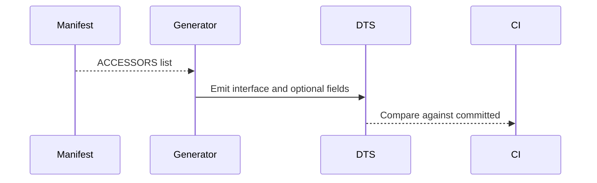

🧠 Planning documents standards rule loaded!

# PRD: Script API Component Coverage & Typings Alignment

## 1. Overview

- **Context & Goals**: Ensure every core ECS component that should be scriptable exposes a consistent, typed accessor on `entity.*` and appears in generated `script-api.d.ts`.
- **Why**: Gaps between runtime accessors and generated typings cause DX issues and runtime surprises.
- **Outcome**: A single source of truth for Script API surfaces, generated typings up to date, with CI guardrails.

## 2. Current Pain Points

- Generated typings only expose `meshRenderer?`, missing `camera?`, `rigidBody?`, `meshCollider?` despite runtime getters.
- Inconsistent comments (e.g., radians vs degrees) with actual behavior.
- Some components (sound, light, terrain) lack clarity on scriptability.

## 3. Proposed Solution

- Expand the Script API generator to include all attached accessors from `ScriptContextFactory` and specialized accessors from `ComponentAccessors`.
- Document units (radians) and edge semantics in d.ts.
- Create a manifest-driven generation to avoid drift.

### Architecture & Directory Structure

```
src/core/lib/scripting/
  generators/
    script-api-dts-generator.ts   # pulls from a manifest + accessors to emit d.ts
  manifests/
    script-accessors.manifest.ts  # lists accessor names and interfaces to include
```

## 4. Implementation Plan

### Phase 1: Audit & Manifest (0.5 day)

1. Enumerate accessors exposed by `ScriptContextFactory`.
2. Build `script-accessors.manifest.ts` mapping accessor name -> interface symbol.

### Phase 2: Generator Update (0.5 day)

1. Update generator to emit entries from manifest and include extended docs.
2. Add CI step to diff generated file vs committed result.

### Phase 3: Component Decisions (0.5 day)

1. Decide for `Sound`, `Light`, `Terrain` whether to expose accessors.
2. If yes, implement minimal specialized accessors and add to manifest.

### Phase 4: Docs & Examples (0.25 day)

1. Update quick reference with new accessors and examples.

## 5. Technical Details

```ts
// manifests/script-accessors.manifest.ts
export const ACCESSORS = [
  { name: 'meshRenderer', interface: 'IMeshRendererAccessor' },
  { name: 'camera', interface: 'ICameraAccessor' },
  { name: 'rigidBody', interface: 'IRigidBodyAccessor' },
  { name: 'meshCollider', interface: 'IMeshColliderAccessor' },
  // Optional: light, sound, terrain
];
```

## 6. Usage Examples

```ts
// Camera accessor usage
entity.camera?.setFov(75);
entity.camera?.setAsMain(true);

// MeshCollider update
entity.meshCollider?.setType('box');
entity.meshCollider?.setCenter(0, 0.5, 0);
```

## 7. Testing Strategy

- Unit: generator produces entries for all manifest items with correct docstrings.
- Integration: TypeScript project can import script files and get correct IntelliSense for all accessors.
- CI: step fails if committed `script-api.d.ts` differs from generated output.

## 8. Edge Cases

| Edge Case                                      | Remediation                                             |
| ---------------------------------------------- | ------------------------------------------------------- |
| Accessor exists at runtime but not in manifest | CI diff fails; add to manifest                          |
| Interface renamed/moved                        | Manifest import type-check; generator build fails early |

## 9. Sequence Diagram



## 10. Risks & Mitigations

| Risk                       | Mitigation                                               |
| -------------------------- | -------------------------------------------------------- |
| Generator drift            | Single manifest, CI diff                                 |
| Overexposing unstable APIs | Mark experimental and exclude from manifest until stable |

## 11. Timeline

- Total: ~1.75 days
  - Phase 1: 0.5 day
  - Phase 2: 0.5 day
  - Phase 3: 0.5 day
  - Phase 4: 0.25 day

## 12. Acceptance Criteria

- `script-api.d.ts` includes `camera?`, `rigidBody?`, `meshCollider?` (and chosen others).
- CI fails on generator mismatch.
- Docs updated with examples.

## 13. Conclusion

This PRD closes the gap between runtime accessors and developer-facing typings, preventing drift and improving DX.

## 14. Assumptions & Dependencies

- Type generation runs during build or a dedicated script.
- Existing accessor interfaces remain stable or are manifest-managed.
