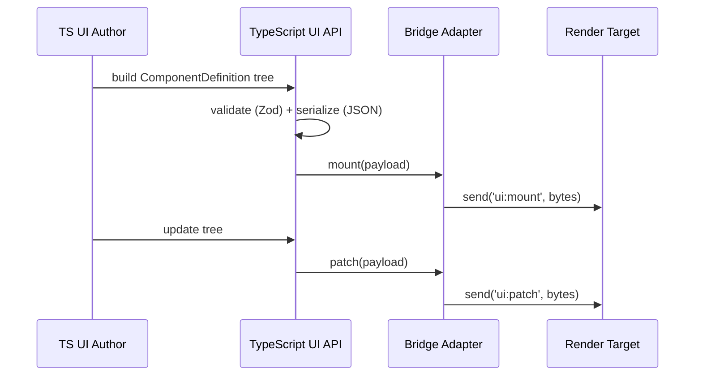

🧠 Planning documents standards rule loaded!

# PRD: UI API (TypeScript Runtime)

## 1. Overview

- **Context & Goals**

  - Define a stable, typed UI API for authoring component trees in TypeScript that can be rendered consistently across runtimes.
  - Provide a schema-first approach with validation (prefer Zod) and versioning to ensure safe evolution.
  - Establish a registry + serialization pathway suitable for live updates and diff-friendly patches.
  - Integrate cleanly with project conventions: Yarn, path aliases, hooks-first React, named exports only.

- **Current Pain Points**
  - UI trees are ad-hoc; no single, authoritative contract exists for props, layout, and events.
  - Lack of versioned artifacts leads to drift between producers/consumers and fragile integrations.
  - Testing parity across environments is manual; no snapshot or schema validation pipeline.
  - Event payloads are loosely typed, increasing runtime errors and inconsistent UX.

## 2. Proposed Solution

- **High‑level Summary**

  - Introduce a TypeScript UI API module containing: schema DSL, layout primitives, event contracts, and serialization adapters.
  - Provide a `UIRegistry` that accepts declarative component trees and emits serialized payloads (JSON baseline).
  - Include a transport-agnostic `bridge` that forwards mounts/patches to a render target (web worker, native, or Rust).
  - Add CLI commands to validate schemas and generate versioned artifacts for consumers.
  - Establish unit/integration tests and parity snapshots for confidence.

- **Architecture & Directory Structure**

```text
docs/PRDs/editor/4-28-ui-api-ts-prd.md
src/core/uiApi/
├── index.ts
├── schema/
│   ├── components.ts
│   ├── layout.ts
│   └── events.ts
├── serializer/
│   ├── jsonAdapter.ts
│   └── versioning.ts
└── runtime/
    ├── registry.ts
    └── bridge.ts
scripts/ui-api/
├── package.json
└── generate.ts
```

## 3. Implementation Plan

### Phase 1: Schema Foundations (0.5 day)

1. Define `ComponentDefinition`, `ComponentKind`, layout primitives, and `UIEventDescriptor`.
2. Add Zod schemas for props/events to enable strict validation and inference.
3. Establish semantic versioning metadata for schema artifacts.

### Phase 2: Serialization & Versioning (0.5 day)

1. Implement `jsonAdapter` for tree serialization and patch payloads.
2. Create `versioning` utilities with compatibility checks.
3. Add snapshot tests for deterministic serialization.

### Phase 3: Runtime Registry & Bridge (0.75 day)

1. Implement `UIRegistry` to mount and patch serialized trees.
2. Provide a transport-agnostic `bridge` interface with pluggable targets.
3. Ensure diff-friendly updates and stable ordering guarantees.

### Phase 4: CLI & Artifacts (0.5 day)

1. Implement `scripts/ui-api/generate.ts` to validate and emit artifacts (JSON schema + d.ts).
2. Add Yarn scripts (`yarn ui-api:validate`, `yarn ui-api:generate`).
3. Wire CI to fail if artifacts are stale.

### Phase 5: Testing & Docs (0.5 day)

1. Unit tests for schemas, serializer, and registry behavior.
2. Integration harness to validate example layouts end-to-end.
3. Author developer guide under `docs/guides/ui-api/`.

Total: ~2.75 days

## 4. File and Directory Structures

```text
src/core/uiApi/
├── index.ts
├── schema/
│   ├── components.ts
│   ├── layout.ts
│   └── events.ts
├── serializer/
│   ├── jsonAdapter.ts
│   └── versioning.ts
└── runtime/
    ├── registry.ts
    └── bridge.ts
```

## 5. Technical Details

```ts
// src/core/uiApi/schema/components.ts
import { z } from 'zod';

export type ComponentKind = 'Button' | 'Text' | 'Image' | 'Stack' | 'Grid' | 'Overlay';

export interface UIEventDescriptor {
  name: string;
  payloadSchema: z.ZodTypeAny;
}

export interface ComponentDefinition<TProps extends object = object> {
  kind: ComponentKind;
  props: TProps;
  children?: ComponentDefinition[];
  events?: UIEventDescriptor[];
}
```

```ts
// src/core/uiApi/runtime/registry.ts
import { ComponentDefinition } from '../schema/components';

export interface SerializedTree {
  version: string;
  root: unknown;
}

export interface RenderTargetAdapter {
  mount(payload: SerializedTree): void;
  patch(payload: SerializedTree): void;
}

export class UIRegistry {
  constructor(private readonly adapter: RenderTargetAdapter) {}

  registerTree(root: ComponentDefinition): void {
    const payload = this.serialize(root);
    this.adapter.mount(payload);
  }

  updateTree(root: ComponentDefinition): void {
    const payload = this.serialize(root);
    this.adapter.patch(payload);
  }

  private serialize(root: ComponentDefinition): SerializedTree {
    // Implementation via jsonAdapter; placeholder to show contract
    return { version: '1.0.0', root };
  }
}
```

```ts
// src/core/uiApi/runtime/bridge.ts
import type { SerializedTree } from './registry';

export interface Transport {
  send(topic: string, data: Uint8Array | string): void;
}

export const createBridge = (transport: Transport) => ({
  mount(payload: SerializedTree): void {
    transport.send('ui:mount', new TextEncoder().encode(JSON.stringify(payload)));
  },
  patch(payload: SerializedTree): void {
    transport.send('ui:patch', new TextEncoder().encode(JSON.stringify(payload)));
  },
});
```

## 6. Usage Examples

```ts
// Register and mount a UI tree
import { UIRegistry } from '@/core/uiApi/runtime/registry';
import { createBridge } from '@/core/uiApi/runtime/bridge';

const transport = {
  send: (topic: string, data: Uint8Array | string) => {
    /* ... */
  },
};
const adapter = createBridge(transport);
const registry = new UIRegistry(adapter);

registry.registerTree({
  kind: 'Stack',
  props: { direction: 'vertical', gap: 8 },
  children: [
    { kind: 'Text', props: { value: 'Hello' } },
    { kind: 'Button', props: { label: 'Click' } },
  ],
});
```

```bash
# CLI validation
yarn ui-api:validate
yarn ui-api:generate
```

## 7. Testing Strategy

- **Unit Tests**
  - Schema validation for each primitive and event payload.
  - Serializer determinism and stable ordering for children/props.
  - `UIRegistry` mounts and patches with correct envelopes.
- **Integration Tests**
  - End-to-end example layout serialization and snapshot comparison.
  - Transport bridge sends expected topics and payload formats.
  - Version compatibility checks reject incompatible payloads.

## 8. Edge Cases

| Edge Case                                  | Remediation                                            |
| ------------------------------------------ | ------------------------------------------------------ |
| Missing optional props                     | Provide defaults at schema level via Zod refinements.  |
| Deeply nested trees causing large payloads | Introduce patch/diff mode and lazy child expansion.    |
| Out-of-order updates                       | Include sequence numbers; adapter drops stale patches. |
| Incompatible schema versions               | Block with actionable error; require regenerate step.  |

## 9. Sequence Diagram



## 10. Risks & Mitigations

| Risk                              | Mitigation                                                     |
| --------------------------------- | -------------------------------------------------------------- |
| Schema churn breaks consumers     | Semver discipline, CI compatibility checks, artifact pinning.  |
| Payload size affects performance  | Diff-based patches, compression, and selective updates.        |
| Transport coupling leaks into API | Keep bridge adapter minimal and transport-agnostic.            |
| Validation overhead at runtime    | Pre-validate at build time; cache parse results when possible. |

## 11. Timeline

- Phase 1: 0.5 day
- Phase 2: 0.5 day
- Phase 3: 0.75 day
- Phase 4: 0.5 day
- Phase 5: 0.5 day
- **Total:** ~2.75 days

## 12. Acceptance Criteria

- Typed schemas (with Zod) exist for primitives, layout, and events.
- `UIRegistry` can mount/patch trees and emit serialized payloads.
- CLI validates schemas and generates versioned artifacts.
- Tests cover schema validation, serializer determinism, and adapter wiring.
- Docs in `docs/guides/ui-api` outline developer workflow and recipes.

## 13. Conclusion

This plan establishes a robust, typed UI API for TypeScript that prioritizes correctness, performance, and evolvability. With versioned artifacts and strong validation, UI composition becomes predictable, testable, and ready for cross-runtime consumption.

## 14. Assumptions & Dependencies

- Yarn workflows; path aliases per `tsconfig.json`.
- Zod available for schema validation.
- Transport is provided by the host environment (web worker, native bridge, etc.).
- Cross-stack coordination is documented separately (see cross-stack PRD).
