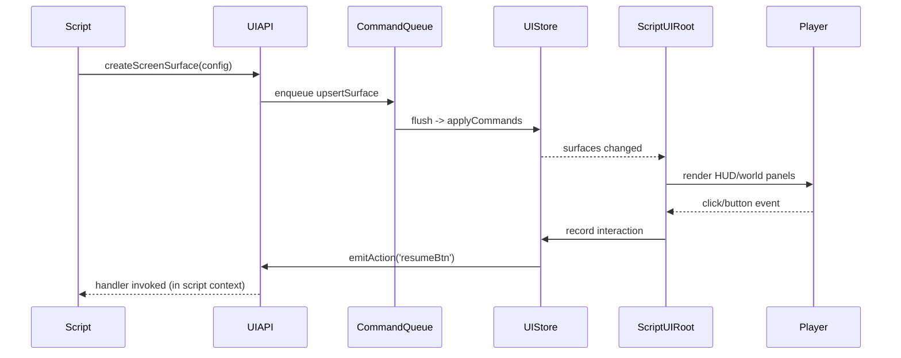

🧠 Planning documents standards rule loaded!

# PRD: UI Script API for R3F/Three.js Surfaces

## 1. Overview

### Context & Goals

- Allow gameplay scripts under `src/game/scripts` to declaratively spawn HUDs, prompts, and world-space UI using `@react-three/fiber` + `three-mesh-ui`, backed by strong typings in `src/game/scripts/script-api.d.ts`.
- Provide a deterministic data contract so both the TypeScript runtime and the future Rust runtime render the same UI tree from script-authored JSON payloads.
- Centralize UI focus routing so scripted UI can temporarily consume input without breaking the existing `InputAPI`.
- Expose lifecycle-safe helpers (auto-cleanup on `onDestroy`, per-entity ownership) so UI authored in scripts cannot leak React nodes or mutate DOM directly.

### Current Pain Points

- Scripts cannot affect UI; gameplay teams must hand-edit React components for every HUD change, slowing iteration.
- No authoritative schema for UI elements, so there is no way to serialize UI intent or diff updates between the editor (R3F) and Rust play mode.
- Pointer focus is unmanaged—UI overlays and gameplay controls fight over the mouse, and scripts have no signal about who owns input.
- `script-api.d.ts` lists every other API; the missing UI surface causes parity gaps and breaks IDE guidance (the IMPLEMENTED-FEATURES-LIST still lists UI as the only missing API).

## 2. Proposed Solution

### High‑level Summary

- Introduce a `ScriptUIRuntime` (command queue + Zustand store) that scripts talk to via a new `ui` global; runtime diffs and versioned schemas produce stable payloads.
- Build two renderers: a DOM overlay layer (Tailwind/React) for HUDs and a world-space `three-mesh-ui` layer for in-scene widgets; both subscribe to the same store.
- Add a `UIFocusRouter` tying scripted UI to `InputManager` so pointer lock, clicks, and hotkeys pause/resume gameplay input deterministically.
- Extend `ScriptContextFactory`, `ScriptAPI.ts`, and the generator that emits `src/game/scripts/script-api.d.ts` so `ui.*` signatures (createSurface, updateWidget, onEvent, destroy) are first-class.
- Provide editor tooling: viewport overlay toggle, inspector preview of surfaces, and dev HUD to visualize UI command traffic for debugging.

### Architecture & Directory Structure

```text
docs/PRDs/editor/4-29-ui-script-api-prd.md
src/core/ui/scriptUI/
├── schema/
│   ├── surfaceSchemas.ts
│   └── widgetSchemas.ts
├── runtime/
│   ├── ScriptUIRuntime.ts
│   ├── commandQueue.ts
│   └── focusRouter.ts
├── store.ts
├── renderer/
│   ├── ScriptUIRoot.tsx
│   ├── ScreenLayer.tsx
│   └── WorldSurface.tsx
└── __tests__/
src/core/lib/scripting/apis/UIAPI.ts
src/core/lib/scripting/ScriptAPI.ts            # add interfaces
src/core/lib/scripting/ScriptContextFactory.ts # register ui accessor
src/game/scripts/script-api.d.ts               # generated typings
src/editor/components/panels/ViewportPanel/components/ScriptUIOverlay.tsx
scripts/generate-script-api.ts (or vite-plugin) # ensure ui definitions are emitted
```

## 3. Implementation Plan

### Phase 1: Contract & Schema (0.75 day)

1. Audit `src/core/stores/uiStore.ts`, `docs/PRDs/editor/4-9-in-game-ui-system-prd.md`, and `script-api.d.ts` to inventory required widgets & states.
2. Define `UISurfaceDefinition`, `UIWidgetDefinition`, `UIAction`, and `UIAnimation` schemas with Zod, including version + feature flags for transport across runtimes.
3. Document JSON serialization contract (IDs, layout props, texture refs) and add unit tests that snapshot sample payloads.

### Phase 2: Runtime Data & Command Queue (1.0 day)

1. Implement `ScriptUICommandQueue` that scripts push to; queue drains once per frame after `ScriptSystem` flushes component mutations.
2. Create `ScriptUIStore` (Zustand) keyed by `entityId` and `surfaceId`, storing computed layout state, visibility, bindings, and pending events.
3. Add `UIFocusRouter` + `ScriptUIInputBridge` to integrate with `InputManager` and expose `ui.captureInput(bool)` semantics back to scripts.
4. Wire cleanup hooks so surfaces auto-destroy when entities leave play mode or `onDestroy` fires.

### Phase 3: Renderer Integration (1.25 days)

1. Build `ScriptUIRoot` that subscribes to the store and renders two branches:
   - `ScreenLayer` (DOM overlay using Tailwind + `<Html>` from `@react-three/drei` for screen-space) with anchors, safe areas, and DPI scaling.
   - `WorldSurface` (world-space panels using `three-mesh-ui`, billboard/attach-to-entity logic, raycast hit targets).
2. Mount `ScriptUIRoot` inside `GameEngine` (Canvas branch) and expose a DOM portal for overlay surfaces so the editor can toggle it.
3. Implement pointer + gamepad event bridging (Raycaster hits -> `ScriptUIRuntime.emitEvent`) and respect focus state before passing events to gameplay.
4. Provide debug overlays (wireframe mode, bounding boxes, event log) behind `import.meta.env.DEV`.

### Phase 4: Script API & Tooling (0.75 day)

1. Implement `createUIAPI(entityId, runtime)` exposing `createScreenSurface`, `createWorldSurface`, `updateWidget`, `setVisibility`, `bindAction`, `destroySurface`, `captureInput`, etc.
2. Update `ScriptContextFactory` to attach the API under `context.ui`, ensuring each script gets per-entity handles and auto-cleanup.
3. Extend `src/core/lib/scripting/ScriptAPI.ts` interfaces plus the generator so `src/game/scripts/script-api.d.ts` reflects the new API (with doc comments and examples).
4. Add inspector + viewport wiring: show scripted surfaces in the Scene tree, expose toggles for QA, and log warnings when scripts spam commands.

### Phase 5: Testing, Docs & Examples (0.5 day)

1. Add Vitest suites for schema validation, store diffing, world/DOM renderer props, and `createUIAPI` contract.
2. Create Cypress/Playwright smoke test (spawn HUD script, click button, assert event fired).
3. Write developer guide (`docs/guides/ui-script-api.md`) and update `IMPLEMENTED-FEATURES-LIST.md` + script samples (`src/game/scripts/examples`).

**Total:** ~4.25 days.

## 4. File and Directory Structures

```text
src/core/ui/scriptUI/
├── schema/
│   ├── surfaceSchemas.ts          # Zod definitions for screen/world props
│   └── widgetSchemas.ts           # Text, bar, button, icon, custom mesh
├── runtime/
│   ├── ScriptUIRuntime.ts         # owns command queue, ties to store
│   ├── commandQueue.ts            # push/apply batched UI commands
│   └── focusRouter.ts             # integrates with InputManager
├── store.ts                       # Zustand store + selectors
├── renderer/
│   ├── ScriptUIRoot.tsx           # top-level component, adds portals
│   ├── ScreenLayer.tsx            # DOM HUD renderer (Tailwind/Html)
│   ├── WorldSurface.tsx           # three-mesh-ui based panel renderer
│   └── widgets/                   # concrete widget components
│       ├── TextWidget.tsx
│       ├── ProgressWidget.tsx
│       ├── ButtonWidget.tsx
│       └── ImageWidget.tsx
└── __tests__/                     # schema/runtime/render tests

src/core/lib/scripting/apis/UIAPI.ts  # new API exposed to scripts
src/core/lib/scripting/ScriptAPI.ts   # interfaces + doc comments
src/core/lib/scripting/ScriptContextFactory.ts # attach ui property
src/game/scripts/script-api.d.ts      # generated IDE typings
src/editor/components/panels/ViewportPanel/components/
└── ScriptUIOverlay.tsx               # editor toggle & debugging
```

## 5. Technical Details

```ts
// src/core/ui/scriptUI/schema/surfaceSchemas.ts
import { z } from 'zod';

export const UIWidgetKind = z.enum(['text', 'icon', 'progress', 'button', 'stack', 'custom']);

export const UIWidgetSchema = z.object({
  id: z.string(),
  kind: UIWidgetKind,
  props: z.record(z.unknown()).default({}),
  bindings: z
    .array(
      z.object({
        source: z.enum(['component', 'parameter', 'event']),
        path: z.string(),
        transform: z.function().optional(),
      }),
    )
    .default([]),
});

export const UISurfaceSchema = z.object({
  version: z.literal(1),
  id: z.string(),
  ownerEntityId: z.number(),
  layer: z.enum(['screen', 'world']),
  anchor: z
    .enum(['top-left', 'top-right', 'bottom-left', 'bottom-right', 'center'])
    .default('center'),
  size: z.tuple([z.number(), z.number()]).optional(),
  world: z
    .object({
      followEntityId: z.number().optional(),
      offset: z.tuple([z.number(), z.number(), z.number()]).default([0, 0, 0]),
      billboard: z.boolean().default(true),
    })
    .optional(),
  widgets: z.array(UIWidgetSchema),
  visible: z.boolean().default(true),
});

export type UISurfaceDefinition = z.infer<typeof UISurfaceSchema>;
```

```ts
// src/core/ui/scriptUI/runtime/ScriptUIRuntime.ts
import { ScriptUIStore } from '../store';
import { UISurfaceDefinition } from '../schema/surfaceSchemas';

export class ScriptUIRuntime {
  constructor(
    private readonly store: ScriptUIStore,
    private readonly queue: ScriptUICommandQueue,
  ) {}

  enqueue(command: UICommand) {
    this.queue.enqueue(command);
  }

  flush() {
    const commands = this.queue.drain();
    if (!commands.length) return;
    this.store.setState((state) => applyCommands(state, commands));
  }

  destroyByOwner(entityId: number) {
    this.enqueue({ type: 'destroyOwner', entityId });
  }
}
```

```ts
// src/core/lib/scripting/apis/UIAPI.ts
import { UISurfaceDefinition } from '@/core/ui/scriptUI/schema/surfaceSchemas';
import { ScriptUIRuntime } from '@/core/ui/scriptUI/runtime/ScriptUIRuntime';

export interface IUIAPI {
  createScreenSurface(def: Omit<UISurfaceDefinition, 'layer' | 'ownerEntityId'>): UISurfaceHandle;
  createWorldSurface(
    def: Omit<UISurfaceDefinition, 'layer' | 'ownerEntityId'> & {
      world: Required<UISurfaceDefinition['world']>;
    },
  ): UISurfaceHandle;
  updateSurface(id: string, patch: Partial<UISurfaceDefinition>): void;
  updateWidget(surfaceId: string, widgetId: string, props: Record<string, unknown>): void;
  bindAction(
    surfaceId: string,
    widgetId: string,
    event: 'click' | 'hover',
    handler: () => void,
  ): () => void;
  setVisible(surfaceId: string, visible: boolean): void;
  destroySurface(id: string): void;
  captureInput(claim: boolean): void;
}

export const createUIAPI = (entityId: number, runtime: ScriptUIRuntime): IUIAPI => ({
  createScreenSurface(def) {
    const full: UISurfaceDefinition = {
      ...def,
      ownerEntityId: entityId,
      layer: 'screen',
      version: 1,
    };
    runtime.enqueue({ type: 'upsertSurface', surface: full });
    return { id: full.id, destroy: () => runtime.enqueue({ type: 'destroySurface', id: full.id }) };
  },
  // ...additional helpers for world surfaces, updateWidget, etc.
  captureInput(claim) {
    runtime.enqueue({ type: 'focus', entityId, claim });
  },
});
```

## 6. Usage Examples

```ts
// HUD tracked to script entity
function onStart() {
  const hud = ui.createScreenSurface({
    id: 'player-hud',
    anchor: 'top-left',
    widgets: [
      { id: 'scoreLabel', kind: 'text', props: { text: 'Score: 0', fontSize: 20 } },
      { id: 'hpBar', kind: 'progress', props: { value: 1 } },
    ],
  });

  ui.bindAction('player-hud', 'resumeBtn', 'click', () => events.emit('ui:resume'));
  parameters['hudId'] = hud.id;
}

function onUpdate() {
  const score = entity.getComponent<{ value: number }>('Score')?.value ?? 0;
  ui.updateWidget('player-hud', 'scoreLabel', { text: `Score: ${score}` });
}
```

```ts
// World-space prompt attached to this entity
let promptId: string;

function onStart() {
  promptId = `prompt-${entity.id}`;
  ui.createWorldSurface({
    id: promptId,
    anchor: 'center',
    world: { followEntityId: entity.id, offset: [0, 2, 0], billboard: true },
    widgets: [{ id: 'message', kind: 'text', props: { text: 'Press E to interact' } }],
  });
}

function onDestroy() {
  ui.destroySurface(promptId);
}
```

```ts
// Temporarily capture pointer input for a menu
function openMenu() {
  ui.captureInput(true);
  ui.createScreenSurface({
    id: 'pause-menu',
    anchor: 'center',
    widgets: [
      { id: 'title', kind: 'text', props: { text: 'Paused', fontSize: 32 } },
      { id: 'resumeBtn', kind: 'button', props: { label: 'Resume' } },
    ],
  });
  ui.bindAction('pause-menu', 'resumeBtn', 'click', () => {
    ui.captureInput(false);
    ui.destroySurface('pause-menu');
  });
}
```

## 7. Testing Strategy

- **Unit Tests**
  - Schema validation: invalid anchor sizes, missing widget IDs, duplicate IDs throw predictably.
  - `ScriptUICommandQueue` merges commands deterministically and flushes once per frame.
  - `UIFocusRouter` cooperates with `InputManager` (locks/unlocks pointer, toggles `input.enableActionMap('UI')`).
  - `createUIAPI` handles auto-cleanup when entity destroyed (mock runtime asserts `destroyByOwner` fired).
- **Integration Tests**
  - Vitest + R3F testing library: mount `ScriptUIRoot`, dispatch two surfaces, ensure DOM nodes appear and world surfaces follow entity transforms.
  - Playwright smoke: run sample scene with script, click scripted button, verify message on `events` bus.
  - Regression: toggle Play mode off/on; confirm UI surfaces rehydrate from queued commands without duplicates.

## 8. Edge Cases

| Edge Case                                          | Remediation                                                                                                                           |
| -------------------------------------------------- | ------------------------------------------------------------------------------------------------------------------------------------- |
| Multiple scripts use the same `surfaceId`          | Enforce `ownerEntityId + surfaceId` composite key; log warning and suffix ID automatically to prevent overwrites.                     |
| Pointer locked to gameplay while UI overlay opens  | `ui.captureInput(true)` sets InputManager to UI map, releases pointer lock, and pauses camera controls until scripts release it.      |
| Scripts flood updates every frame (perf hit)       | Command queue batches `updateWidget` diffs and throttles DOM writes via `requestAnimationFrame`; dev mode warns if >N commands/frame. |
| Entity destroyed without cleaning up world surface | `ScriptUIRuntime.destroyByOwner` called from `ScriptSystem` when entity leaves; store subscription drops orphaned surfaces.           |
| `three-mesh-ui` missing in production builds       | Add dependency + smoke test; fallback component renders simple plane with baked texture to avoid runtime crash.                       |

## 9. Sequence Diagram



## 10. Risks & Mitigations

| Risk                                                    | Mitigation                                                                                                          |
| ------------------------------------------------------- | ------------------------------------------------------------------------------------------------------------------- |
| R3F performance regressions from rich UI trees          | Limit default widget set, pool `three-mesh-ui` meshes, and expose `ui.debug.stats()` plus profiler toggles.         |
| Input focus conflicts with gameplay controls            | `UIFocusRouter` owns a single source of truth and integrates with `InputManager` action maps + pointer lock events. |
| Contract drift between runtime UI and `script-api.d.ts` | Generate typings directly from Zod schemas, add CI diff similar to existing script API generator.                   |
| Rust runtime parity delayed                             | Versioned schema + JSON snapshot allow Rust team to consume contract later; include TODO checklist in docs.         |
| Scripts misuse UI API (e.g., DOM injection)             | API exposes declarative surfaces only; no raw HTML; runtime sanitizes strings and clamps sizes/positions.           |

## 11. Timeline

- **Total:** ~4.25 days.
  - Phase 1 (Schema & contract): 0.75 day
  - Phase 2 (Runtime & focus router): 1.0 day
  - Phase 3 (Renderer integration): 1.25 days
  - Phase 4 (Script API & tooling): 0.75 day
  - Phase 5 (Testing & docs): 0.5 day

## 12. Acceptance Criteria

- `ui` global appears in `src/game/scripts/script-api.d.ts` with IDE docs and samples.
- Scripts can spawn both overlay and world-space UI, update widgets, receive click events, and release focus.
- Surfaces clean up automatically when scripts disable/destroy; no stale React nodes remain after respawn.
- Dev HUD shows scripted surfaces; QA toggle exists in the viewport panel.
- Tests cover schemas, runtime diffs, renderer snapshots, and a Playwright smoke run.

## 13. Conclusion

This plan delivers the final missing Script API surface, giving gameplay engineers a fast, declarative way to author UI from scripts while keeping R3F/Three implementations centralized and testable. The schema-driven approach keeps the contract aligned across TypeScript and future Rust runtimes, and the focus router plus command queue ensure input safety and performance. Once implemented, UI iteration moves at the same pace as scripting, and the editor gains visibility into scripted overlays.

## 14. Assumptions & Dependencies

- `three-mesh-ui` (or equivalent) will be added as a dependency and is compatible with the current Three.js version (r175).
- `@react-three/drei` is already present and provides `<Html>` plus raycast helpers for pointer handling.
- The in-game UI system described in `docs/PRDs/editor/4-9-in-game-ui-system-prd.md` will supply base styling and fonts reused by the scripted layer.
- InputManager exposes enable/disable hooks for action maps (`Gameplay`, `UI`) so focus routing can swap control schemes.
- Scripts continue to run inside `DirectScriptExecutor`; command queue flush happens after `ComponentWriteSystem` each frame.
- Rust runtime parity will happen later; this plan defines the JSON schema so the Rust team can implement the same contract when ready.
