🧠 Planning documents standards rule loaded!

# PRD: Empty Entity Add Menu Support

## 1. Overview

### Context & Goals

- Enable users to create an **empty entity** directly from the editor **Add menu**, matching the “Create Empty” affordance in the GameObject menu.
- Provide a **blank starting point** (no rendering/physics/behavior components) that users can configure via the Inspector and Add Component flows.
- Keep the implementation **simple and type-safe**, reusing existing entity creation hooks and selection logic.
- Ensure consistency between **menu bar**, **Add dropdown**, and any future scripting/AI tooling that creates entities.

### Current Pain Points

- The **Add menu only exposes pre-configured shapes and objects** (cube, terrain, lights, etc.), all of which come with built-in components.
- Users cannot quickly spawn a **minimal, non-rendering entity** from the Add menu; they must instead use the GameObject → “Create Empty” path.
- There is no clear, unified concept of an “Empty Entity” in the Add menu UX, leading to confusion and extra clicks.
- AI/agent flows that guide users through “create an empty entity then add components” have to target different menus and affordances.

## 2. Proposed Solution

### High‑level Summary

- Introduce an **“Empty Entity” item in the Add menu**, under a new “Core” (or “Core Entities”) category.
- Reuse the existing **`createEntity`** helper from `useEntityCreation` via the `handleAddObject` pipeline so no new creation path is introduced.
- Define “empty entity” as **Transform-only by default** (no MeshRenderer, physics, lights, scripts, etc.), keeping the ECS invariant that every placed entity has a Transform.
- Ensure the new Add menu item and the existing GameObject → “Create Empty” item both map to the **same underlying type identifier** (`'Entity'`), giving a single, consistent behavior.

### Architecture & Directory Structure

```text
docs/PRDs/editor/4-30-empty-entity-add-menu-prd.md   # This document

src/editor/
├── config/
│   └── gameObjectMenuData.tsx                       # Add a "Core" category with "Empty Entity"
├── components/
│   ├── layout/
│   │   └── menuConfig.ts                            # Verify/align GameObject → Create Empty wiring
│   └── menus/
│       └── EnhancedAddObjectMenu.tsx                # Ensure Add menu can trigger empty entity creation
├── hooks/
│   ├── useEntityCreation.ts                         # Source of createEntity baseline behavior
│   └── useEditorHandlers.ts                         # Central handleAddObject routing
└── guides/
    └── typed-scene-entities.md                      # (Optional) Update docs to mention empty entities
```

## 3. Implementation Plan

### Phase 1: Behavior Definition & Audit (0.25 day)

1. **Confirm minimal entity contract**:
   - Validate that `createEntity` in `useEntityCreation` creates entities with **only Transform** by default.
   - Audit any code paths that assume all entities have a Transform (viewport, serialization, selection).
2. **Define “Empty Entity” product behavior**:
   - Document that an empty entity has **Transform only** and is **not visible** until a rendering component is added.
   - Confirm UX expectations with respect to selection (it should still appear in Hierarchy and be selected after creation).

### Phase 2: Add Menu Integration (0.5 day)

1. **Add a “Core” category** to `GAME_OBJECT_CATEGORIES` in `gameObjectMenuData.tsx`:
   - Include an `IGameObjectMenuItem` with `type: 'Entity'` and label `Empty Entity` (or `Create Empty Entity`).
2. **Wire Add menu selection to empty entity creation**:
   - Ensure `EnhancedAddObjectMenu` passes the selected item’s `type` to `onAdd`.
   - Confirm that `handleAddObject` in `useEditorHandlers` falls through to the **default branch** and calls `createEntity(type as string)` when `type === 'Entity'`.
3. **Selection behavior**:
   - Ensure newly created empty entities are **auto-selected** (already handled by `handleAddObject` and entity synchronization).

### Phase 3: UX & Documentation (0.5 day)

1. **Labeling & iconography**:
   - Choose an appropriate icon for “Empty Entity” that communicates a blank object (e.g., outline cube or generic node icon).
   - Ensure the item is placed at the **top of the Core category** for quick access.
2. **Docs update**:
   - Update `docs/guides/typed-scene-entities.md` (or a related guide) to describe:
     - What an empty entity is.
     - Recommended first components (Transform tweaks, MeshRenderer, Script, etc.).
     - How it interacts with typed scene definitions.
3. **AI/agent affordances** (optional, but recommended):
   - Add short guidance notes for the agent tools describing how to instruct users to “Add → Core → Empty Entity” for clean setups.

### Phase 4: Testing & Validation (0.25 day)

1. Add/extend unit tests for:
   - `buildGameObjectCategories` including the “Core”/“Empty Entity” item.
   - `handleAddObject` default branch with `type = 'Entity'`.
2. Add a basic integration test (React testing library) for `EnhancedAddObjectMenu`:
   - Selecting “Empty Entity” should result in an entity being created and selected with **only Transform + default editor metadata**.

## 4. File and Directory Structures

```text
/home/joao/projects/vibe-coder-3d/
├── docs/
│   └── PRDs/
│       └── editor/
│           └── 4-30-empty-entity-add-menu-prd.md
└── src/
    └── editor/
        ├── config/
        │   └── gameObjectMenuData.tsx          # Add "Core" category with Empty Entity item
        ├── components/
        │   ├── layout/
        │   │   └── menuConfig.ts               # Keep GameObject → Create Empty in sync
        │   └── menus/
        │       └── EnhancedAddObjectMenu.tsx   # Displays Empty Entity in Add menu
        └── hooks/
            ├── useEntityCreation.ts            # createEntity(name, parentId?) helper
            └── useEditorHandlers.ts            # handleAddObject routing for type 'Entity'
```

## 5. Technical Details

### 5.1 Core Behavior: `createEntity`

```ts
// src/editor/hooks/useEntityCreation.ts (existing)
export const useEntityCreation = () => {
  const createEntity = useCallback(
    (name: string, parentId?: number) => {
      const entity = entityManager.createEntity(name, parentId);

      const defaultTransform: ITransformData = {
        position: [0, 0, 0],
        rotation: [0, 0, 0],
        scale: [1, 1, 1],
      };

      // Minimal invariant: all editor-created entities get a Transform
      addComponent(entity.id, KnownComponentTypes.TRANSFORM, defaultTransform);
      setSelectedIds([entity.id]);

      return entity;
    },
    [entityManager, setSelectedIds],
  );

  // ...other helpers
};
```

### 5.2 Editor Menu Integration

```ts
// src/editor/config/gameObjectMenuData.tsx (conceptual)
export const GAME_OBJECT_CATEGORIES: IGameObjectCategory[] = [
  {
    label: 'Core',
    icon: <TbBox size={18} />,
    items: [
      {
        type: 'Entity',              // Routed through handleAddObject default branch
        label: 'Empty Entity',
        icon: <TbCube size={18} />,  // Or another neutral/empty icon
      },
    ],
  },
  // ...existing categories: Basic Shapes, Geometric Shapes, etc.
];
```

```ts
// src/editor/hooks/useEditorHandlers.ts (excerpt – existing default path)
const handleAddObject = useCallback(
  async (type: ShapeType | string, modelPath?: string) => {
    try {
      let entity;

      // ...special cases (custom shapes, geometry assets, lights, etc.)

      switch (type) {
        // ...known ShapeType cases
        default:
          // For type === 'Entity', this will create an empty entity (Transform-only)
          entity = createEntity(type as string);
          break;
      }

      setSelectedId(entity.id);
      setStatusMessage(`Created ${type} (Entity ${entity.id})`);
      setShowAddMenu(false);
    } catch (error) {
      // ...existing error handling
    }
  },
  [
    /* dependencies omitted for brevity */
  ],
);
```

### 5.3 UI/API Integration

- **Top Bar GameObject Menu**:
  - `menuConfig.ts` already exposes a **“Create Empty”** item that calls `onAddObject('Entity')`.
  - This PRD ensures the Add menu uses the same **type identifier** and behavior.
- **Add Menu Button**:
  - `EnhancedAddObjectMenu` surfaces the new “Empty Entity” item via `GAME_OBJECT_CATEGORIES`.
  - Selecting it calls `onAdd('Entity')`, which is routed by `handleAddObject` to `createEntity`.
- **Inspector & Add Component Menu**:
  - Once created, the Entity is selected in Hierarchy and Inspector.
  - Users can open the **Add Component** menu to attach MeshRenderer, scripts, colliders, etc., building up the entity from a **blank starting point**.

## 6. Usage Examples

### 6.1 From the Add Menu

```ts
// User flow (conceptual)
// 1. Click the "+" Add button in the top bar.
// 2. In the dropdown, navigate to: Core → Empty Entity.
// 3. Editor -> handleAddObject('Entity') -> createEntity('Entity').
// Result: A new entity called "Entity 0" (or next number) appears in the Hierarchy,
// is selected, and has only a Transform component.
```

### 6.2 Building Up an Empty Entity

```ts
// After creating the empty entity:
// - Open the Add Component menu:
//   - Add MeshRenderer (to make it visible)
//   - Add Script (for behavior)
//   - Add RigidBody and MeshCollider (for physics)
// This mirrors traditional engine flows (e.g., Unity's Empty GameObject).
```

### 6.3 Keyboard or Agent-Assisted Flow

```ts
// AI/agent or keyboard-driven instructions:
// "Press the Add button, choose Core → Empty Entity, then open the Add Component menu
// on the new entity to attach MeshRenderer and Script components."
```

## 7. Testing Strategy

- **Unit Tests**
  - `gameObjectMenuData.tsx`: Asserts that `GAME_OBJECT_CATEGORIES` (or `buildGameObjectCategories`) includes a **Core** category with an item whose `type === 'Entity'`.
  - `useEditorHandlers.ts`: Tests that `handleAddObject('Entity')` calls `createEntity('Entity')` and sets selection and status message.
- **Integration Tests**
  - `EnhancedAddObjectMenu.tsx` (React testing library):
    - Render with categories including “Empty Entity”.
    - Simulate selecting that item and assert that the provided `onAdd` is invoked with `'Entity'`.
  - End-to-end (optional, Playwright/Cypress):
    - Simulate user opening Add menu, selecting “Empty Entity”, then opening Inspector to confirm only Transform is present.

## 8. Edge Cases

| Edge Case                                                 | Remediation                                                                                        |
| --------------------------------------------------------- | -------------------------------------------------------------------------------------------------- |
| User creates an empty entity and sees nothing in viewport | Ensure the entity is selected in Hierarchy; rely on Inspector + Add Component as primary feedback. |
| Users expect a visible placeholder mesh                   | Keep entity visually empty by default; recommend adding MeshRenderer via docs and in-app tips.     |
| Confusion between “Create Empty” and “Empty Entity”       | Use consistent naming and ensure both menus map to the same behavior (`type: 'Entity'`).           |
| Scenes with many empty entities clutter hierarchy         | Encourage naming entities meaningfully; future enhancements can add filters or color-coding.       |

## 9. Sequence Diagram

```mermaid
sequenceDiagram
  participant User
  participant AddMenu as Add Menu
  participant Handlers as useEditorHandlers
  participant EntityCreation as useEntityCreation
  participant ECS as EntityManager/ECS
  participant UI as Hierarchy/Inspector

  User->>AddMenu: Click "+" and choose Core → Empty Entity
  AddMenu->>Handlers: onAdd('Entity')
  Handlers->>EntityCreation: createEntity('Entity')
  EntityCreation->>ECS: createEntity(name, parentId?)
  ECS-->>EntityCreation: entityId
  EntityCreation->>ECS: add Transform component
  EntityCreation-->>Handlers: entity
  Handlers->>UI: setSelectedId(entity.id), update status message
  UI-->>User: Empty Entity appears in Hierarchy and Inspector
```



## 10. Risks & Mitigations

| Risk                                                         | Mitigation                                                                                   |
| ------------------------------------------------------------ | -------------------------------------------------------------------------------------------- |
| Users misinterpret “empty” as having literally no components | Clarify in docs and tooltips that the entity has a Transform only for editor/ECS invariants. |
| Additional menu clutter in Add menu                          | Place the “Core” category at the top and keep it minimal (only Empty Entity initially).      |
| Future need for multiple “empty” templates                   | Reuse the same pipeline to add other Core templates (e.g., “Empty Physics Entity”) later.    |
| Discrepancy between GameObject menu and Add menu             | Keep both wired to the same `type: 'Entity'` and behavior; add tests to catch regressions.   |

## 11. Timeline

- **Total:** ~1.5 days
  - Phase 1 (Behavior definition & audit): 0.25 day
  - Phase 2 (Add menu integration): 0.5 day
  - Phase 3 (UX & documentation): 0.5 day
  - Phase 4 (Testing & validation): 0.25 day

## 12. Acceptance Criteria

- Add menu shows a **Core → Empty Entity** item that, when selected, creates a new entity.
- The created entity:
  - Appears in the Hierarchy with a default name (`Entity N`).
  - Is automatically selected.
  - Has only a **Transform** component plus any required editor metadata (no MeshRenderer, physics, script, etc.).
- GameObject menu **“Create Empty”** continues to work and uses the same underlying behavior as the Add menu item.
- Tests for menu configuration and `handleAddObject('Entity')` routing are in place and passing.
- Documentation mentions the Empty Entity pattern and how to build on it.

## 13. Conclusion

Adding an “Empty Entity” option to the Add menu gives users a fast, consistent way to start from a blank ECS object and layer in components as needed. By reusing existing creation hooks and routing logic, this feature stays small in scope while materially improving UX and agent-driven workflows. The shared `type: 'Entity'` contract keeps the GameObject menu and Add menu behavior aligned and easy to maintain.

## 14. Assumptions & Dependencies

- The editor continues to treat **Transform as a minimal invariant** for editor-created entities (for gizmos, positioning, and serialization).
- Entity creation and synchronization flows (`useEntityCreation`, `useEntitySynchronization`, selection logic) remain stable and reusable.
- No changes are required to the underlying ECS engine beyond ensuring `createEntity` remains cheap and side-effect free beyond Transform.
- Existing keyboard shortcuts and AI tools that call `handleAddObject('Entity')` will automatically benefit from the new Add menu affordance.
