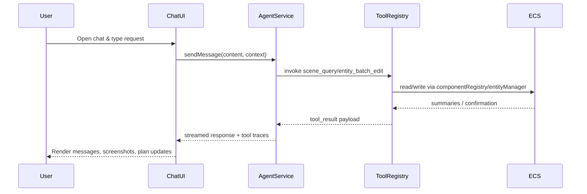

# AI-First Chat & Scene Flexibility PRD

**Status**: Draft
**Priority**: Critical
**Estimated Effort**: 4–5 days
**Dependencies**: Anthropic AgentService, OpenRouter optional screenshot analysis, existing ECS tooling
**Target Version**: 0.4.x

## 1. Overview

### Context & Goals
- Empower the chat assistant to be the single control surface for scene editing, verification, and scripting tasks.
- Guarantee predictable initialization and streaming so the AI can issue commands without UI race conditions.
- Provide rich scene introspection so the model always knows what exists before applying edits.
- Unlock batch editing capabilities for complex multi-entity adjustments and material workflows.

### Current Pain Points
- Chat initialization is duplicated per hook usage, causing race conditions and unhelpful "not initialized" errors.
- Scene query tool returns placeholder strings, so the agent cannot inspect IDs, transforms, or materials.
- Scene manipulation lacks batch operations, forcing the agent to spam individual entity_edit calls.
- LLM outputs referencing planning state or screenshots are not surfaced consistently inside chat.

## 2. Proposed Solution

### High-level Summary
- Centralize agent readiness in the chat store and expose selectors so UI can disable controls deterministically.
- Introduce reusable scene introspection utilities that return structured JSON for entities, components, and bounds.
- Upgrade `scene_query`/`scene_manipulation` outputs and add a new `entity_batch_edit` tool for bulk transforms/material updates.
- Extend chat UI to display planning + screenshot activity consistently and document workflows via a living PRD.

### Architecture & Directory Structure
```
src/
├── editor/
│   ├── chat/
│   │   ├── hooks/
│   │   │   └── useChatStreaming.ts          # consume store selector, no nested useChatAgent
│   │   └── state/
│   │       └── selectors.ts                 # add useChatInitialized
│   ├── services/
│   │   └── agent/
│   │       ├── tools/
│   │       │   ├── EntityBatchEditTool.ts   # NEW – batch transforms/materials
│   │       │   ├── SceneQueryTool.ts        # enhanced structured responses
│   │       │   ├── SceneManipulationTool.ts # list_entities wired into introspection helper
│   │       │   └── utils/
│   │       │       └── entityIntrospection.ts # NEW – reusable entity summaries
│   │       └── AgentService.ts              # streaming + tool registry unchanged API
│   └── store/
│       └── chatStore.ts                     # add initialization state + setters
└── docs/
    └── PRDs/
        └── editor/
            └── ai-first-chat-flexibility-prd.md  # THIS DOCUMENT
```

## 3. Implementation Plan

### Phase 1: Chat Runtime Stability (1.5 days)
1. Add `isAgentInitialized` and setter to `chatStore`; expose selector helpers.
2. Refactor `useChatAgent` to hydrate `AgentService` once, guard initialization with store flag, and remove hook recursion.
3. Update `useChatStreaming` and UI components to rely on selectors instead of re-instantiating the service.
4. Verify screenshot and planning events still register correctly after hook changes.

### Phase 2: Scene Introspection & Tooling (2 days)
1. Build `entityIntrospection.ts` helper that surfaces summaries, per-entity details, and scene stats (counts, bounds).
2. Rewrite `scene_query` actions to emit structured markdown/JSON snippets using helper output.
3. Update `scene_manipulation`'s `list_entities` action to call the same helper for consistency.
4. Implement `entity_batch_edit` tool with actions for `set_transforms`, `offset_position`, and `set_material`.
5. Register the new tool in the registry so Anthropic can call it without schema drift.

### Phase 3: UX & Documentation (0.5 day)
1. Document workflows + new tool usage in README snippets and CLAUDE.md so the AI learns affordances.
2. Add smoke tests / manual checklists to ensure aggregated outputs are parsable and trimmed.
3. Capture follow-up tasks (UI plan viewer, screenshot backlog) in backlog.

## 4. File and Directory Structures
```
src/editor/services/agent/tools/
├── EntityBatchEditTool.ts
├── SceneManipulationTool.ts
├── SceneQueryTool.ts
└── utils/
    └── entityIntrospection.ts

src/editor/store/chatStore.ts
src/editor/chat/hooks/useChatAgent.ts
src/editor/chat/hooks/useChatStreaming.ts
```

## 5. Technical Details

### Chat Store & Hooks
```ts
// chatStore.ts
interface IChatStore {
  isAgentInitialized: boolean;
  setAgentInitialized: (ready: boolean) => void;
}
```
```ts
// useChatAgent.ts
useEffect(() => {
  agentServiceRef.current = AgentService.getInstance();
  if (agentServiceRef.current.isInitialized()) {
    setAgentInitialized(true);
    return;
  }
  agentServiceRef.current.initialize();
  setAgentInitialized(true);
}, []);
```
```ts
// useChatStreaming.ts
const initialized = useChatInitialized();
return { initialized, isTyping, currentStream, error };
```

### Scene Introspection Helper
```ts
// entityIntrospection.ts
export interface IEntitySummary {
  id: number;
  name: string;
  components: string[];
  transform?: { position: [number, number, number]; };
  material?: { meshId?: string; materialId?: string; color?: string };
}

export function getEntitySummaries(limit = 50): IEntitySummary[];
export function getEntityDetail(entityId: number): IEntityDetail | null;
export function getSceneStats(): ISceneStats;
```

### Entity Batch Edit Tool
```ts
export const entityBatchEditTool = {
  name: 'entity_batch_edit',
  description: 'Apply transforms/materials to multiple entities in one call',
  input_schema: { /* actions + payload definitions */ },
};

export async function executeEntityBatchEdit(params: IEntityBatchEditParams): Promise<string>;
```

### Scene Query Tool
```ts
case 'list_entities': {
  const summaries = getEntitySummaries(params.limit ?? 25);
  return formatEntityList(summaries);
}
```

#### 5.1 UI/API Integration
- Chat components subscribe to `useChatInitialized` and disable inputs until true, preventing "send" before AgentService is ready.
- `AgentService` retains its singleton behavior; tools registry simply receives an extra entry (`entity_batch_edit`).
- `scene_query`/`scene_manipulation` use the introspection helper so both UI toasts and LLM outputs describe the same ground truth.
- Batch edit tool updates ECS components directly via `componentRegistry` (no additional custom events required), reducing event spam.

## 6. Usage Examples
```ts
// Example: batch place trees in a ring
await agent.tools.entity_batch_edit({
  action: 'set_transforms',
  entities: ringPositions.map((pos, idx) => ({
    entity_id: treeIds[idx],
    position: pos,
    rotation: { x: 0, y: idx * 30, z: 0 },
  })),
});
```
```ts
// Query existing spheres before edits
await agent.tools.scene_query({
  query_type: 'list_entities',
  filter: { component: 'MeshRenderer', nameContains: 'Sphere' },
});
```
```ts
// Offset every statue upward by 0.5 meters
await agent.tools.entity_batch_edit({
  action: 'offset_position',
  entity_ids: statueIds,
  offset: { x: 0, y: 0.5, z: 0 },
});
```

## 7. Testing Strategy
- **Unit Tests**: store reducer for `setAgentInitialized`, entity introspection helper (mocking componentRegistry), batch edit action reducers.
- **Integration Tests**: tool registry smoke test ensures new schema registered; `scene_query` text snapshots for entity lists; manual chat regression (open sidebar, trigger send before init, expect disabled input).

## 8. Edge Cases
| Edge Case | Remediation |
|-----------|-------------|
| AgentService initialization fails due to missing API key | Surface friendly error + keep `isAgentInitialized=false`; disable send controls and show configuration toast. |
| Scene contains 500+ entities | Introspection helper truncates to limit, includes `truncated` flag, instructs AI to filter further. |
| Batch edit called on entities without Transform/MeshRenderer | Skip entity, return warning per ID, do not throw. |
| Concurrent batch edits | Use componentRegistry atomic updates; log warnings if same entity processed twice within request. |

## 9. Sequence Diagram


## 10. Risks & Mitigations
| Risk | Mitigation |
|------|------------|
| LLM output becomes too verbose due to structured JSON | Provide succinct formatter helpers and limit entity count per response. |
| Batch edits bypass undo/redo stack | Emit high-level log entries and ensure entityManager events still fire for editor history. |
| Component schemas change, breaking helper assumptions | Centralize type imports and add unit tests that fail when schema shape diverges. |

## 11. Timeline
- **Phase 1**: 1.5 days
- **Phase 2**: 2 days
- **Phase 3**: 0.5 day
- **Total**: ~4 days

## 12. Acceptance Criteria
- Chat input remains disabled until initialization completes and never logs double-initialization warnings.
- `scene_query list_entities` returns structured summaries with IDs, transforms, and materials.
- `scene_manipulation list_entities` mirrors the same data as `scene_query`.
- `entity_batch_edit` tool is callable from AgentService and successfully updates multiple entities in one request.
- Documentation describes new workflows so prompts referencing them succeed.

## 13. Conclusion
Stabilizing chat initialization and enriching tooling gives the AI a truthful view of the scene plus the levers needed to manipulate it efficiently. By pairing structured introspection with batch edits we reduce hallucinations, cut tool churn, and unlock higher-level prompts (“align the statues into a circle”) that previously required dozens of manual steps. This PRD establishes the blueprint for those improvements and keeps Vibe Coder 3D aligned with its AI-first vision.

## 14. Assumptions & Dependencies
- Anthropic API key is configured via `VITE_CLAUDE_CODE_SDK_API_KEY`; OpenRouter vision key is optional but recommended.
- ECS component registry remains accessible on the client; no server round-trips are required for introspection or batch edits.
- Editor exposes entity IDs consistently (no persistent ID mismatch) so summaries map to actual objects.
- Future undo/redo or history systems will ingest componentRegistry events triggered by these tools.
