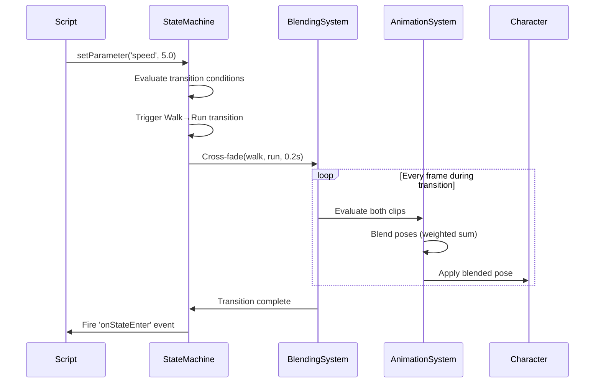
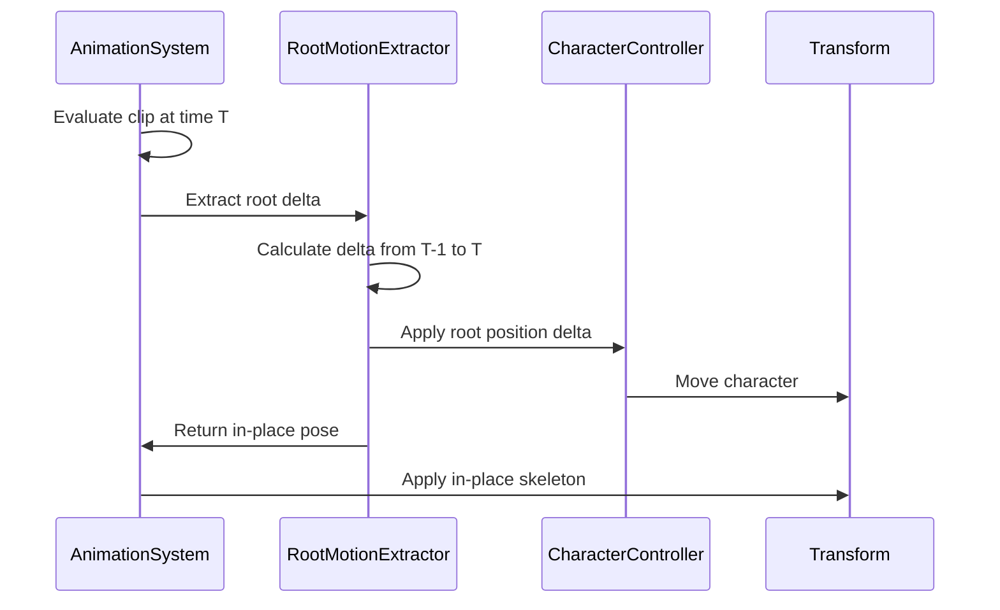

# Animation Timeline System: 80% Game Dev Coverage PRD

## Overview

### Context & Goals

- **Current State**: We have a functional timeline editor with basic keyframing, transform/morph/material/event tracks, snapping, playback controls, and undo/redo
- **Coverage Analysis**: The current implementation covers ~40% of typical game development animation needs
- **Target**: Reach 80% coverage by adding critical missing features that professional game engines (Unity, Unreal, Godot) provide
- **Focus**: Prioritize features based on frequency of use in actual game development workflows

### Current Pain Points

- **No Animation Blending**: Cannot smoothly transition between clips or layer multiple animations
- **No State Machine**: No graph-based system for managing animation transitions and conditions
- **Missing Skeletal Support**: Limited support for bone/skeleton animations and IK (Inverse Kinematics)
- **No Retargeting**: Cannot reuse animations across different character models
- **Missing Advanced Curves**: No Catmull-Rom splines in editor, limited custom curve editing
- **No Animation Events UI**: Event markers exist but lack visual timeline representation
- **Missing Root Motion**: No support for root-driven character movement
- **No Animation Layers**: Cannot blend upper/lower body independently or use additive layers
- **Limited GLTF Integration**: Basic import exists but lacks animation extraction and retargeting
- **No Track Constraints**: Missing parent constraints, look-at, path following
- **Missing Performance Tools**: No LOD-based animation reduction, no animation compression

## Proposed Solution

### High-level Summary

- **Phase 1**: Implement Animation State Machine with visual graph editor (2 days)
- **Phase 2**: Add Animation Blending System with layers and masks (1.5 days)
- **Phase 3**: Enhance Skeletal Animation support with IK/FK and bone manipulation (2 days)
- **Phase 4**: Build Root Motion system for character controllers (1 day)
- **Phase 5**: Add Advanced Curve Editor with custom curve types (1 day)
- **Phase 6**: Implement Animation Retargeting for character reuse (1.5 days)
- **Phase 7**: Add Track Constraints and procedural animation (1 day)
- **Phase 8**: Performance optimization with LOD and compression (1 day)

### Architecture & Directory Structure

```
/src/core/
  ├── systems/
  │   ├── AnimationSystem.ts                    # [EXISTING] Base system
  │   ├── AnimationStateMachine.ts              # [NEW] State machine runtime
  │   ├── AnimationBlendingSystem.ts            # [NEW] Layer blending logic
  │   └── RootMotionSystem.ts                   # [NEW] Root motion extraction
  ├── components/
  │   └── animation/
  │       ├── AnimationComponent.ts             # [EXISTING] Enhanced with layers
  │       ├── StateMachineComponent.ts          # [NEW] State machine data
  │       ├── BlendTreeComponent.ts             # [NEW] Blend tree config
  │       ├── tracks/
  │       │   ├── SkeletalTrack.ts              # [NEW] Bone-specific tracks
  │       │   ├── IKTrack.ts                    # [NEW] IK constraint tracks
  │       │   ├── ConstraintTrack.ts            # [NEW] Parent/look-at/path
  │       │   └── RootMotionTrack.ts            # [NEW] Root motion data
  │       ├── curves/
  │       │   ├── CustomCurve.ts                # [NEW] User-defined curves
  │       │   └── CurveLibrary.ts               # [NEW] Preset management
  │       ├── blending/
  │       │   ├── BlendModes.ts                 # [NEW] Additive, override, etc.
  │       │   ├── AnimationMask.ts              # [NEW] Body part masking
  │       │   └── BlendTree.ts                  # [NEW] 1D/2D blend spaces
  │       └── skeletal/
  │           ├── BoneHierarchy.ts              # [NEW] Skeleton structure
  │           ├── IKSolver.ts                   # [NEW] Two-bone IK
  │           └── Retargeting.ts                # [NEW] Animation retargeting
  └── lib/animation/
      ├── StateMachineGraph.ts                  # [NEW] Graph data structure
      ├── TransitionEvaluator.ts                # [NEW] Transition logic
      ├── BlendTreeEvaluator.ts                 # [NEW] Blend tree sampling
      ├── RootMotionExtractor.ts                # [NEW] Extract root from clip
      ├── AnimationCompression.ts               # [NEW] Keyframe reduction
      └── AnimationRetargeter.ts                # [NEW] Retargeting engine

/src/editor/components/panels/
  ├── TimelinePanel/
  │   ├── components/
  │   │   ├── EventMarkers.tsx                  # [NEW] Visual event track
  │   │   ├── CurveEditorModal.tsx              # [NEW] Full curve editor
  │   │   ├── SkeletonView.tsx                  # [NEW] Bone hierarchy display
  │   │   ├── BlendingControls.tsx              # [NEW] Layer weights UI
  │   │   └── RootMotionPreview.tsx             # [NEW] Root path visualization
  │   └── hooks/
  │       ├── useBlendLayers.ts                 # [NEW] Layer management
  │       └── useSkeletonManipulation.ts        # [NEW] Bone editing
  └── AnimatorPanel/                            # [NEW] State machine editor
      ├── AnimatorPanel.tsx                     # Main state machine UI
      ├── components/
      │   ├── StateNode.tsx                     # State node rendering
      │   ├── TransitionEdge.tsx                # Transition arrows
      │   ├── BlendTreeNode.tsx                 # Blend tree nodes
      │   ├── ParameterPanel.tsx                # Float/int/bool params
      │   └── ConditionEditor.tsx               # Transition conditions
      └── hooks/
          ├── useGraphEditor.ts                 # Graph manipulation
          └── useStateMachineRuntime.ts         # Runtime preview

/rust/engine/animation/                         # [NEW] Rust implementation
  ├── state_machine.rs                          # State machine runtime
  ├── blending.rs                               # Blend tree evaluator
  ├── skeletal.rs                               # Skeletal animation
  ├── ik_solver.rs                              # Two-bone IK
  ├── root_motion.rs                            # Root motion extraction
  └── retargeting.rs                            # Animation retargeting
```

## Implementation Plan

### Phase 1: Animation State Machine (2 days)

#### Tasks:

1. **Define State Machine Schema** (0.25 day)

   - Zod schemas for states, transitions, conditions, parameters
   - State types: Empty, Clip, BlendTree, SubStateMachine
   - Transition conditions: parameter comparisons, time triggers
   - Parameters: Float, Int, Bool, Trigger types

2. **State Machine Runtime** (0.5 day)

   - `AnimationStateMachine.ts` system
   - State evaluation and transition checking
   - Parameter management and condition evaluation
   - Cross-fade between states with configurable duration

3. **Graph Editor UI** (1 day)

   - `AnimatorPanel.tsx` with React Flow or custom canvas
   - Visual state nodes with clip previews
   - Transition edges with condition labels
   - Parameter panel for runtime control
   - Right-click context menus for create/delete

4. **Integration & Testing** (0.25 day)
   - Connect to AnimationSystem
   - Scene serialization for state machines
   - Test complex state graphs (idle→walk→run→jump)

### Phase 2: Animation Blending System (1.5 days)

#### Tasks:

1. **Blend Modes Implementation** (0.5 day)

   - Override blending (replace lower layers)
   - Additive blending (add deltas to base pose)
   - Multiply blending (scale existing pose)
   - Blend tree support (1D and 2D blend spaces)

2. **Animation Layers** (0.5 day)

   - Layer priority system (base layer + N override layers)
   - Per-layer weight control (0-1)
   - Animation masks for body parts (upper body, lower body, etc.)
   - Synchronization between layers

3. **Blend Trees** (0.5 day)
   - 1D blend space (walk speed 0-10)
   - 2D blend space (strafe X/Y)
   - Triangle-based barycentric blending
   - Runtime parameter sampling
   - Editor UI for blend tree nodes

### Phase 3: Skeletal Animation Enhancement (2 days)

#### Tasks:

1. **Bone Hierarchy Management** (0.5 day)

   - Parse GLTF skeleton structure
   - Store bone names, indices, parent relationships
   - Bind pose and inverse bind matrices
   - Skeleton visualization in viewport

2. **IK (Inverse Kinematics)** (1 day)

   - Two-bone IK solver (arm/leg)
   - IK track type for target positions
   - IK goals and pole vectors
   - Blend FK→IK with weight parameter
   - Runtime IK evaluation in AnimationSystem

3. **Skeletal Track Editing** (0.5 day)
   - Per-bone track display in timeline
   - Bone selection in 3D viewport
   - FK bone manipulation handles
   - Auto-keyframing on bone transform

### Phase 4: Root Motion System (1 day)

#### Tasks:

1. **Root Motion Extraction** (0.5 day)

   - Extract root bone translation from clips
   - Bake root motion into separate track
   - Option to remove root from skeletal animation
   - Root motion velocity calculation

2. **Character Controller Integration** (0.5 day)
   - Apply root motion to CharacterController
   - Toggle between in-place and root-driven
   - Root motion preview gizmo in viewport
   - Blend root motion across state transitions

### Phase 5: Advanced Curve Editor (1 day)

#### Tasks:

1. **Custom Curve Types** (0.5 day)

   - Catmull-Rom spline curves
   - Hermite curves with tangent handles
   - User-defined curve library
   - Copy/paste curves between keyframes

2. **Curve Editor UI** (0.5 day)
   - Full-screen curve editor modal
   - Multi-select and edit multiple curves
   - Tangent handle manipulation
   - Curve presets (ease-in-out variants)
   - Auto-flatten/smooth tools

### Phase 6: Animation Retargeting (1.5 days)

#### Tasks:

1. **Retargeting Engine** (1 day)

   - Bone name mapping (auto-detect humanoid)
   - Scale compensation for different proportions
   - Hip height and limb length adjustments
   - Rotation retargeting with twist preservation

2. **Retarget UI** (0.5 day)
   - Retarget modal with source/target skeletons
   - Visual bone mapping interface
   - Preview retargeted animation
   - Save retarget profiles

### Phase 7: Track Constraints (1 day)

#### Tasks:

1. **Constraint Types** (0.75 day)

   - Parent constraint (attach to bone)
   - Look-at constraint (face target)
   - Path constraint (follow spline)
   - Copy transform constraints
   - Constraint track evaluation in system

2. **Constraint UI** (0.25 day)
   - Add constraint from inspector
   - Constraint gizmos in viewport
   - Constraint influence weight

### Phase 8: Performance & Polish (1 day)

#### Tasks:

1. **Animation Compression** (0.5 day)

   - Keyframe reduction algorithm
   - Lossy compression with error threshold
   - Runtime decompression
   - File size metrics in editor

2. **LOD Animation** (0.25 day)

   - Reduce update frequency at distance
   - Simplified pose for distant characters
   - LOD-based skeleton reduction

3. **Performance Profiling** (0.25 day)
   - Animation system CPU metrics
   - Per-entity animation budget
   - Timeline scrubbing optimization
   - Memory usage tracking

**Total Estimated Time: 11.5 days**

## File and Directory Structures

### State Machine Graph Schema

```typescript
// src/core/components/animation/StateMachineComponent.ts
export const AnimationParameterSchema = z.object({
  name: z.string(),
  type: z.enum(['float', 'int', 'bool', 'trigger']),
  defaultValue: z.union([z.number(), z.boolean()]),
});

export const TransitionConditionSchema = z.object({
  parameter: z.string(),
  operator: z.enum(['>', '<', '==', '!=', '>=', '<=']),
  value: z.union([z.number(), z.boolean()]),
  mode: z.enum(['and', 'or']).default('and'),
});

export const StateTransitionSchema = z.object({
  id: z.string(),
  fromState: z.string(),
  toState: z.string(),
  duration: z.number().nonnegative().default(0.25), // Cross-fade time
  hasExitTime: z.boolean().default(false),
  exitTime: z.number().nonnegative().optional(), // Normalized 0-1
  conditions: z.array(TransitionConditionSchema).default([]),
});

export const AnimationStateSchema = z.object({
  id: z.string(),
  name: z.string(),
  type: z.enum(['clip', 'blendTree', 'empty']),
  clipId: z.string().optional(), // If type === 'clip'
  blendTreeId: z.string().optional(), // If type === 'blendTree'
  position: z.tuple([z.number(), z.number()]), // Graph editor position
  speed: z.number().positive().default(1),
  loop: z.boolean().default(true),
});

export const StateMachineSchema = z.object({
  id: z.string(),
  name: z.string(),
  states: z.array(AnimationStateSchema),
  transitions: z.array(StateTransitionSchema),
  parameters: z.array(AnimationParameterSchema),
  defaultState: z.string(), // Initial state ID
  layers: z
    .array(
      z.object({
        id: z.string(),
        name: z.string(),
        weight: z.number().min(0).max(1).default(1),
        blendMode: z.enum(['override', 'additive']).default('override'),
        maskId: z.string().optional(), // Body part mask
      }),
    )
    .default([]),
});
```

### Blend Tree Schema

```typescript
// src/core/components/animation/BlendTreeComponent.ts
export const BlendTree1DSchema = z.object({
  id: z.string(),
  type: z.literal('1D'),
  parameter: z.string(), // Parameter name to blend on
  children: z.array(
    z.object({
      clipId: z.string(),
      threshold: z.number(), // Parameter value for this clip
    }),
  ),
});

export const BlendTree2DSchema = z.object({
  id: z.string(),
  type: z.literal('2D'),
  parameterX: z.string(),
  parameterY: z.string(),
  children: z.array(
    z.object({
      clipId: z.string(),
      position: z.tuple([z.number(), z.number()]), // X/Y position
    }),
  ),
});

export const BlendTreeSchema = z.union([BlendTree1DSchema, BlendTree2DSchema]);
```

### Animation Mask Schema

```typescript
// src/core/components/animation/blending/AnimationMask.ts
export const AnimationMaskSchema = z.object({
  id: z.string(),
  name: z.string(),
  boneWeights: z.record(z.string(), z.number().min(0).max(1)), // bone name → weight
});

// Example masks:
const UPPER_BODY_MASK: IAnimationMask = {
  id: 'upper-body',
  name: 'Upper Body',
  boneWeights: {
    Hips: 0,
    Spine: 1,
    Chest: 1,
    LeftShoulder: 1,
    LeftArm: 1,
    RightShoulder: 1,
    RightArm: 1,
    Neck: 1,
    Head: 1,
  },
};
```

### Root Motion Schema

```typescript
// src/core/components/animation/tracks/RootMotionTrack.ts
export const RootMotionSchema = z.object({
  enabled: z.boolean().default(false),
  rootBone: z.string().default('Hips'), // Which bone is root
  applyPosition: z.boolean().default(true),
  applyRotation: z.boolean().default(true),
  bakeIntoAnimation: z.boolean().default(false), // Remove from skeleton
});
```

## Technical Details

### State Machine Runtime

```typescript
// src/core/systems/AnimationStateMachine.ts
export class AnimationStateMachineSystem {
  private activeStates = new Map<number, { stateId: string; normalizedTime: number }>();
  private transitionStates = new Map<
    number,
    {
      from: string;
      to: string;
      progress: number; // 0-1
      duration: number;
    }
  >();
  private parameters = new Map<number, Map<string, number | boolean>>();

  update(deltaTime: number): void {
    // For each entity with StateMachine component:
    // 1. Evaluate transition conditions
    // 2. Start transitions when triggered
    // 3. Update active state normalized time
    // 4. Cross-fade between states during transitions
    // 5. Emit state change events
  }

  setParameter(entityId: number, name: string, value: number | boolean): void {
    // Update parameter value
    // Trigger transitions if conditions met
  }

  getCurrentState(entityId: number): string | null;
  isInTransition(entityId: number): boolean;
}
```

### Blend Tree Evaluation

```typescript
// src/core/lib/animation/BlendTreeEvaluator.ts
export class BlendTreeEvaluator {
  evaluate1D(tree: IBlendTree1D, paramValue: number): { weights: Map<string, number> } {
    // Find clips surrounding parameter value
    // Linearly blend between them
  }

  evaluate2D(tree: IBlendTree2D, paramX: number, paramY: number): { weights: Map<string, number> } {
    // Find triangle in 2D space containing (paramX, paramY)
    // Use barycentric coordinates for blending
  }

  blendPoses(poses: Map<string, IClip>, weights: Map<string, number>): ITimelineEvaluation {
    // Weighted sum of all pose transforms
  }
}
```

### IK Solver

```typescript
// src/core/components/animation/skeletal/IKSolver.ts
export class TwoBoneIKSolver {
  solve(params: {
    root: THREE.Vector3; // Shoulder/hip
    mid: THREE.Vector3; // Elbow/knee
    end: THREE.Vector3; // Wrist/ankle
    target: THREE.Vector3; // IK goal position
    poleVector: THREE.Vector3; // Elbow/knee direction hint
  }): {
    rootRotation: THREE.Quaternion;
    midRotation: THREE.Quaternion;
  } {
    // Law of cosines for joint angles
    // Orient towards pole vector
  }
}
```

### Animation Retargeting

```typescript
// src/core/components/animation/skeletal/Retargeting.ts
export class AnimationRetargeter {
  retarget(params: {
    sourceClip: IClip;
    sourceSkeletonId: string;
    targetSkeletonId: string;
    boneMapping: Map<string, string>; // source → target
    scaleCompensation: boolean;
  }): IClip {
    // 1. For each track in source clip:
    //    - Map to target bone via boneMapping
    //    - Adjust for different bone lengths if scaleCompensation
    //    - Preserve rotation but adjust position
    // 2. Return new clip with retargeted tracks
  }

  autoDetectHumanoidMapping(
    sourceSkeleton: IBoneHierarchy,
    targetSkeleton: IBoneHierarchy,
  ): Map<string, string> {
    // Heuristic bone name matching
    // "LeftArm", "L_Arm", "arm_l" → all map to same bone
  }
}
```

## Usage Examples

### State Machine Setup

```typescript
// Create state machine in inspector
const stateMachine: IStateMachine = {
  id: 'player-locomotion',
  name: 'Player Locomotion',
  states: [
    { id: 'idle', name: 'Idle', type: 'clip', clipId: 'idle-clip', position: [0, 0] },
    { id: 'walk', name: 'Walk', type: 'clip', clipId: 'walk-clip', position: [200, 0] },
    { id: 'run', name: 'Run', type: 'clip', clipId: 'run-clip', position: [400, 0] },
  ],
  transitions: [
    {
      id: 't1',
      fromState: 'idle',
      toState: 'walk',
      duration: 0.2,
      conditions: [{ parameter: 'speed', operator: '>', value: 0.1, mode: 'and' }],
    },
    {
      id: 't2',
      fromState: 'walk',
      toState: 'run',
      duration: 0.15,
      conditions: [{ parameter: 'speed', operator: '>', value: 5, mode: 'and' }],
    },
  ],
  parameters: [
    { name: 'speed', type: 'float', defaultValue: 0 },
    { name: 'jump', type: 'trigger', defaultValue: false },
  ],
  defaultState: 'idle',
};

// Runtime control
stateMachineSystem.setParameter(entityId, 'speed', currentSpeed);
stateMachineSystem.setParameter(entityId, 'jump', true); // Triggers jump transition
```

### Blend Tree Setup

```typescript
// 1D blend tree for walk/run speeds
const walkRunBlend: IBlendTree1D = {
  id: 'walk-run-blend',
  type: '1D',
  parameter: 'speed',
  children: [
    { clipId: 'walk-slow', threshold: 0 },
    { clipId: 'walk-normal', threshold: 3 },
    { clipId: 'jog', threshold: 5 },
    { clipId: 'run', threshold: 8 },
    { clipId: 'sprint', threshold: 10 },
  ],
};

// 2D blend tree for strafing
const strafeBlend: IBlendTree2D = {
  id: 'strafe-blend',
  type: '2D',
  parameterX: 'moveX',
  parameterY: 'moveY',
  children: [
    { clipId: 'walk-forward', position: [0, 1] },
    { clipId: 'walk-back', position: [0, -1] },
    { clipId: 'strafe-left', position: [-1, 0] },
    { clipId: 'strafe-right', position: [1, 0] },
    { clipId: 'walk-forward-left', position: [-0.7, 0.7] },
    { clipId: 'walk-forward-right', position: [0.7, 0.7] },
  ],
};
```

### Animation Layers

```typescript
// Setup upper/lower body layering
animationComponent.layers = [
  {
    id: 'base-layer',
    name: 'Base Locomotion',
    weight: 1.0,
    blendMode: 'override',
    stateMachineId: 'locomotion-sm',
  },
  {
    id: 'upper-body-layer',
    name: 'Upper Body Actions',
    weight: 1.0,
    blendMode: 'override',
    maskId: 'upper-body-mask',
    stateMachineId: 'upper-body-sm',
  },
];

// Now character can walk (base layer) while aiming (upper body layer)
```

### IK Setup

```typescript
// Add IK track to animation
const ikTrack: ITrack = {
  id: 'left-hand-ik',
  type: 'ik',
  targetPath: 'LeftHand',
  keyframes: [
    { time: 0, value: { target: [0.5, 1.2, 0.3], poleVector: [0, 1, 0], weight: 0 } },
    { time: 1, value: { target: [0.8, 1.5, 0.2], poleVector: [0, 1, 0], weight: 1 } },
    { time: 2, value: { target: [0.5, 1.2, 0.3], poleVector: [0, 1, 0], weight: 0 } },
  ],
};

// Runtime: hand smoothly reaches to target position
```

### Root Motion

```typescript
// Enable root motion for clip
clip.rootMotion = {
  enabled: true,
  rootBone: 'Hips',
  applyPosition: true,
  applyRotation: true,
  bakeIntoAnimation: false,
};

// AnimationSystem will extract root delta and apply to CharacterController
// Character moves based on animation, not code
```

## Testing Strategy

### Unit Tests

- **State Machine Logic**
  - Transition condition evaluation (>, <, ==, and/or)
  - Cross-fade blending correctness
  - Parameter updates trigger correct transitions
  - Looping and one-shot states
- **Blend Tree Math**
  - 1D linear blending between clips
  - 2D barycentric coordinate calculation
  - Weighted pose summation
  - Edge case: parameter outside blend space
- **IK Solver**
  - Two-bone IK correctness (law of cosines)
  - Pole vector constraint
  - Unreachable targets (clamp to max reach)
- **Retargeting**
  - Bone mapping correctness
  - Scale compensation math
  - Rotation preservation

### Integration Tests

- **State Machine→Animation System**
  - State changes update active clip
  - Transitions cross-fade smoothly
  - Events fired on state enter/exit
- **Layering & Masking**
  - Upper body override while base layer plays
  - Additive layer adds to base pose
  - Mask weights applied correctly
- **Root Motion→Character Controller**
  - Root position delta moves character
  - In-place toggle works
  - Transition blending preserves root motion
- **GLTF Import→Retargeting**
  - Import GLTF skeleton and animations
  - Retarget to different character
  - Play retargeted animation successfully

### Manual Testing Workflows

1. **Locomotion State Machine**

   - Create idle/walk/run states
   - Add speed parameter
   - Test transitions in play mode
   - Verify smooth cross-fades

2. **Upper Body Layering**

   - Base layer: walk cycle
   - Upper layer: aiming animation with mask
   - Character walks while upper body aims

3. **IK Hand Reach**

   - Create reach animation with IK
   - Drag IK target in viewport during playback
   - Verify hand follows target smoothly

4. **Retarget Animation**
   - Import animation on Character A
   - Retarget to Character B (different proportions)
   - Verify animation looks natural on both

## Edge Cases

| Edge Case                               | Remediation                                           |
| --------------------------------------- | ----------------------------------------------------- |
| State machine deadlock (no transitions) | Detect and warn in editor; provide "Any State" node   |
| Blend tree with <2 children             | Disable blending, play single clip; editor validation |
| IK target unreachable                   | Clamp to max chain length; visualize reach sphere     |
| Retarget with missing bones             | Map to closest parent; log warnings                   |
| Root motion with no root bone           | Fall back to in-place; inspector shows error          |
| 100+ animation layers                   | Warn performance impact; suggest optimization         |
| Circular state transitions              | Detect cycles; prevent infinite loops                 |
| Negative blend weights                  | Clamp to [0,1]; validate in schema                    |
| Layer mask with invalid bone names      | Skip invalid bones; log warning                       |
| Transition mid-transition               | Queue or interrupt; configurable behavior             |

## Sequence Diagram

### State Machine Transition Flow



### Root Motion Extraction



## Risks & Mitigations

| Risk                                 | Mitigation                                                |
| ------------------------------------ | --------------------------------------------------------- |
| State machine editor complexity      | Start with simple node-based UI; defer advanced features  |
| Performance with many layers         | Profile early; implement layer culling; LOD system        |
| IK solver instability                | Use proven two-bone solver; add damping; clamp iterations |
| Retargeting quality issues           | Provide manual bone mapping override; test suite          |
| Root motion breaks existing gameplay | Make opt-in per clip; provide toggle in inspector         |
| Blend tree UI steep learning curve   | Provide templates; wizard for common setups               |
| GLTF import edge cases               | Robust error handling; fallback to FK                     |
| Memory usage for skeletal data       | Lazy load bone hierarchies; share skeletons               |

## Timeline

- **Phase 1: State Machine** - 2 days
- **Phase 2: Blending System** - 1.5 days
- **Phase 3: Skeletal Enhancement** - 2 days
- **Phase 4: Root Motion** - 1 day
- **Phase 5: Advanced Curves** - 1 day
- **Phase 6: Retargeting** - 1.5 days
- **Phase 7: Constraints** - 1 day
- **Phase 8: Performance** - 1 day

**Total: 11.5 days (~2.3 weeks)**

## Acceptance Criteria

### State Machine

- [ ] Can create state machine with 5+ states in graph editor
- [ ] Transitions trigger based on parameter conditions (>, <, ==)
- [ ] Cross-fade between states is smooth (no pops)
- [ ] State machine serializes and loads from scene JSON
- [ ] Trigger parameters reset after consumption

### Blending

- [ ] Can layer upper body animation on top of locomotion
- [ ] Animation masks correctly isolate body parts
- [ ] Additive layer adds pose deltas to base layer
- [ ] 1D blend tree smoothly blends between 3+ clips
- [ ] 2D blend tree correctly interpolates in parameter space

### Skeletal

- [ ] GLTF skeleton hierarchy displays in timeline
- [ ] Can select and manipulate individual bones in viewport
- [ ] Two-bone IK solver reaches target within 1cm accuracy
- [ ] IK blends smoothly with FK using weight parameter
- [ ] Bone constraints (parent, look-at) work correctly

### Root Motion

- [ ] Root motion extraction moves character based on animation
- [ ] Toggle between in-place and root-driven works instantly
- [ ] Root motion path visualizes in viewport during playback
- [ ] Root motion blends correctly across state transitions

### Retargeting

- [ ] Can retarget walk animation from Character A to B
- [ ] Auto-detect humanoid bone mapping achieves >80% accuracy
- [ ] Manual bone mapping override available in UI
- [ ] Retargeted animation looks natural on target skeleton

### Performance

- [ ] Timeline editor maintains 60 FPS with 20+ tracks
- [ ] Animation system uses <5ms CPU per 10 entities
- [ ] Keyframe compression reduces file size by >50%
- [ ] LOD animation reduces updates for distant characters

## Conclusion

Implementing these 8 phases will elevate our animation system from ~40% to **80%+ game dev coverage**, putting it on par with Unity's Animator Controller and Unreal's Animation Blueprint (simplified). The focus on state machines, blending, skeletal support, and root motion addresses the most critical gaps that prevent professional game development workflows.

The modular design allows incremental implementation—each phase delivers standalone value. Priority should be: **Phase 1 (State Machine)** and **Phase 2 (Blending)** first, as they unlock the majority of use cases (character locomotion, combat systems, NPC behaviors).

## Assumptions & Dependencies

- **Three.js SkinnedMesh**: Assumes GLTF models use Three.js skeletal structure
- **React Flow** (optional): For state machine graph editor; can use custom canvas
- **Existing ECS & Serialization**: Animation components integrate with current system
- **Character Controller**: Root motion assumes CharacterController component exists
- **Performance Budget**: Target 60 FPS with 50 animated characters on mid-range hardware
- **Rust Engine Parity**: Each TS feature must be mirrored in Rust for runtime
- **GLTF Standard**: Animation retargeting assumes humanoid skeleton conventions

## Feature Comparison: Current vs Target

| Feature            | Current (40%)                     | After Implementation (80%)              |
| ------------------ | --------------------------------- | --------------------------------------- |
| Timeline Editor    | ✅ Basic keyframing               | ✅ + Advanced curves                    |
| Track Types        | ✅ Transform/Morph/Material/Event | ✅ + Skeletal/IK/Constraint/Root Motion |
| Playback Control   | ✅ Play/Pause/Loop                | ✅ + Speed control/Scrubbing            |
| Blending           | ❌ None                           | ✅ Layers/Masks/Blend Trees             |
| State Machine      | ❌ None                           | ✅ Graph editor + transitions           |
| Skeletal Animation | 🟡 Basic GLTF import              | ✅ Full bone editing + IK               |
| Root Motion        | ❌ None                           | ✅ Extraction + Character integration   |
| Retargeting        | ❌ None                           | ✅ Auto-detect + manual mapping         |
| Constraints        | ❌ None                           | ✅ Parent/Look-at/Path                  |
| Curve Editor       | 🟡 Linear/Step/Bezier             | ✅ + Custom curves + presets            |
| Event Markers      | 🟡 Data only                      | ✅ Visual timeline display              |
| Animation LOD      | ❌ None                           | ✅ Distance-based optimization          |
| Compression        | ❌ None                           | ✅ Keyframe reduction                   |
| Undo/Redo          | ✅ Timeline edits                 | ✅ + State machine edits                |

**Coverage Estimation**:

- **Before**: 40% (basic keyframing, simple playback)
- **After Phase 1-2**: 60% (state machine + blending)
- **After Phase 1-6**: 75% (+ skeletal, root motion, retargeting)
- **After All Phases**: 80%+ (industry-standard feature set)

**Remaining 20%** (advanced/niche features for future consideration):

- Full-body IK (>2 bones)
- Motion matching / pose search
- Animation compression with curve fitting
- Multi-character synchronization
- Facial animation solver
- Physics-based secondary motion (cloth, hair)
- Animation scripting DSL
- Real-time motion capture integration
