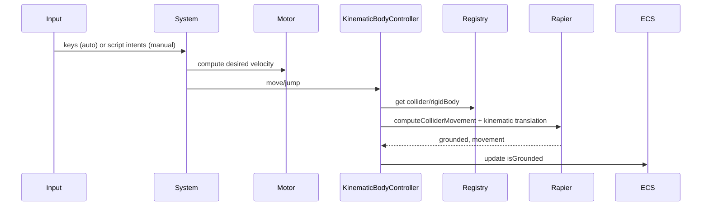

🧠 Planning documents standards rule loaded!

# PRD: Character Controller Gap Closure (TypeScript)

## 1. Overview

- **Context & Goals**: Close remaining gaps in the TS-side Character Controller to ensure reliable kinematic control with Rapier integration, editor UX completeness, and parity with Rust implementation.
- **Current Pain Points**: Redundant systems (auto vs unified), fallback “toy physics” paths, collider registration timing issues, and a script API that bypasses the kinematic controller by writing directly to `RigidBody`.
- **Outcomes**: Single authoritative update path via `CharacterControllerSystem` + `KinematicBodyController`, deterministic collider lifecycle, script API routed through the controller or mutation bridge, and complete inspector UX (including input mapping).
- **Measure of Success**: Acceptance criteria met, no fallback physics during Play, consistent grounded behavior, and clean teardown on Play stop or entity removal.

## 1.1 Current Pain Points

- Two overlapping systems (`CharacterControllerSystem` and `CharacterControllerAutoInputSystem`) create divergence and duplicated logic.
- `CharacterControllerAPI` in scripts manipulates `RigidBody` directly (linvel/impulse) instead of routing through the kinematic path.
- Collider registration races cause controller to fall back to simple transform updates; leads to jitter/drift.
- Input mapping exists but inspector UX for configuring it is incomplete; jump key normalization inconsistencies (`' '` vs `'space'`).

## 2. Proposed Solution

### High‑level Summary

- Consolidate onto the unified `CharacterControllerSystem` that uses `CharacterMotor` + `KinematicBodyController`.
- Route script API movement/jump through the controller (or mutation path), not direct rigid body mutation.
- Enforce collider/rigid body registration before update via `ColliderRegistry` and system-level guards.
- Complete input mapping UX (auto/manual modes); normalize keys and persist mapping via component.
- Keep simple-physics fallback behind a dev flag only; never used in normal Play.

### Architecture & Directory Structure

```
src/core/physics/character/
  CharacterMotor.ts
  KinematicBodyController.ts
  ColliderRegistry.ts
  Layers.ts
  types.ts

src/core/systems/
  CharacterControllerSystem.ts        # single source of truth (kept)
  CharacterControllerAutoInputSystem.ts  # DEPRECATE after migration

src/core/components/physics/
  CharacterControllerPhysicsSystem.tsx  # keeps world wiring

src/core/lib/scripting/apis/
  CharacterControllerAPI.ts          # route via controller/mutations

src/editor/components/panels/InspectorPanel/CharacterController/
  CharacterControllerSection.tsx
  InputConfigurationModal.tsx        # new
```

## 3. Implementation Plan

### Phase 1: System De-duplication (0.5 day)

1. Mark `CharacterControllerAutoInputSystem` deprecated; migrate its missing features (if any) into `CharacterControllerSystem`.
2. Ensure `CharacterControllerPhysicsSystem.tsx` calls only the unified system.
3. Remove transform-based fallback paths from runtime Play (keep dev flag for diagnostics).

### Phase 2: Script API Parity (0.5 day)

1. Update `CharacterControllerAPI` to route `move` and `jump` through the unified controller or the mutation bridge (no direct `RigidBody` manipulation).
2. Keep `isGrounded()` delegated to controller’s computed state; remove velocity-heuristic.
3. Maintain method signatures for backward compatibility.

### Phase 3: Collider Lifecycle & Registration (0.5 day)

1. Guarantee rigid body + collider registration before first controller update; add pre-flight checks and retry for one frame only.
2. Strengthen `ColliderRegistry` logging and size/health diagnostics on Play start/stop.
3. Add teardown hooks to clear caches on entity remove and Play stop.

### Phase 4: Physics Correctness & Tuning (0.5–1 day)

1. Ensure slope, autostep, snap-to-ground, and push strengths are sourced from component → motor → KCC config consistently.
2. Apply `Layers.ts` collision filters and `characterCollisionPredicate` consistently.
3. Validate wall-slide and step climber behavior on multiple test scenes.

### Phase 5: UX & Input Mapping (0.5 day)

1. Add `InputConfigurationModal.tsx` and wire to inspector section with key detection and normalization (`' '` → `'space'`).
2. Support `controlMode: 'auto' | 'manual'`; disable conflicting UI in `manual`.
3. Show read-only `isGrounded` in Play.

### Phase 6: Tests & Demos (0.5 day)

1. Unit: motor math, key normalization, adapter mapping, registry lifecycle.
2. Integration: movement, jump, slopes, steps, push interactions, Play stop cleanup.
3. Demo scene with slopes, steps, moving platform, and pushable dynamic objects.

## 4. File and Directory Structures

```
src/editor/components/panels/InspectorPanel/CharacterController/
├── CharacterControllerSection.tsx
└── InputConfigurationModal.tsx
```

## 5. Technical Details

### Unified System (sketch)

```ts
// src/core/systems/CharacterControllerSystem.ts
export function updateCharacterControllerSystem(
  inputManager: InputManager,
  isPlaying: boolean,
  deltaTime: number,
  world: World | null,
): void {
  // - early return if !isPlaying or !world
  // - for each entity with CharacterController (auto mode):
  //   - read mapping, normalize keys
  //   - compute [x,z] via input
  //   - controller.move(entityId, [x,z], deltaTime)
  //   - if jump pressed: controller.jump(entityId)
  //   - write back isGrounded to component
}
```

### Script API routing (sketch)

```ts
// src/core/lib/scripting/apis/CharacterControllerAPI.ts
export function createCharacterControllerAPI(entityId: EntityId): ICharacterControllerAPI {
  return {
    isGrounded(): boolean {
      // delegate to controller state
      return /* controller.isGrounded(entityId) */;
    },
    move(inputXZ: [number, number], speed: number): void {
      // enqueue intent or call controller with a motor-config-aware path
    },
    jump(strength: number): void {
      // enqueue intent or call controller jump (no direct impulses)
    },
  };
}
```

### Input Mapping Modal (sketch)

```tsx
// src/editor/components/panels/InspectorPanel/CharacterController/InputConfigurationModal.tsx
export const InputConfigurationModal: React.FC<{ value; onChange; onClose }> = (props) => {
  // capture keys, normalize to lowercase, convert ' ' to 'space'
  return null;
};
```

## 6. Usage Examples

```ts
// Auto mode (default) – no script required
// WASD + Space handled by system; inspector config controls mapping and speeds.
```

```ts
// Manual mode (script)
const controller = entity.controller;
controller.move([mx, mz], 6.0);
if (input.isActionActive('Gameplay', 'Jump') && controller.isGrounded()) {
  controller.jump(6.5);
}
```

## 7. Testing Strategy

- **Unit Tests**: input normalization; motor math; component → motor → KCC config mapping; registry lifecycle; adapter mapping.
- **Integration Tests**: wall slide; slope limiting; step climbing; push interactions with dynamic bodies; moving platform; Play stop cleanup.

## 8. Edge Cases

| Edge Case                         | Remediation                                                              |
| --------------------------------- | ------------------------------------------------------------------------ | --- | --------------- |
| Missing collider at Play          | Block Play or show actionable error; do not auto-fallback in production. |
| Collider registered 1 frame late  | One-frame retry guard; otherwise block and prompt.                       |
| High vertical impact speeds       | Disable snap-to-ground if                                                | vY  | > snapMaxSpeed. |
| Manual mode conflicting with auto | Disable auto input when `controlMode==='manual'`.                        |
| Input using ' ' vs 'space'        | Normalize to `'space'` consistently.                                     |

## 9. Sequence Diagram



## 10. Risks & Mitigations

| Risk                         | Mitigation                                                                    |
| ---------------------------- | ----------------------------------------------------------------------------- |
| Drift between API and system | Route all calls through unified controller; tests enforce.                    |
| Performance regressions      | Cache controllers; minimal allocations; optional sub-stepping only if needed. |
| Collider timing issues       | Deterministic registration; assert and block Play if unmet.                   |
| Backward compatibility       | Keep API signatures; deprecate legacy behaviors with warnings.                |

## 11. Timeline

- Total: ~2–3 days
  - Phase 1: 0.5 day
  - Phase 2: 0.5 day
  - Phase 3: 0.5 day
  - Phase 4: 0.5–1 day
  - Phase 5: 0.5 day
  - Phase 6: 0.5 day

## 12. Acceptance Criteria

- Single `CharacterControllerSystem` powers auto/manual modes; deprecated system removed.
- Script API routes through controller/mutations; no direct rigid-body edits.
- Collider registration is deterministic; no fallback physics in Play.
- Inspector exposes input mapping; `isGrounded` read-only in Play.
- Tests and demo scenes validate slopes, steps, push interactions, and cleanup.

## 13. Conclusion

Consolidating onto the unified controller, fixing lifecycle and routing, and completing the UX removes instability sources and aligns TS behavior with the Rust engine’s contract for predictable gameplay.

## 14. Assumptions & Dependencies

- Rapier world available via `<Physics>` context; R3F editor stack (Tailwind/Zustand) in place.
- `KnownComponentTypes.CHARACTER_CONTROLLER` present with fields mirroring Rust contract v2.0.
- Shared contract changes are versioned and validated in CI.
