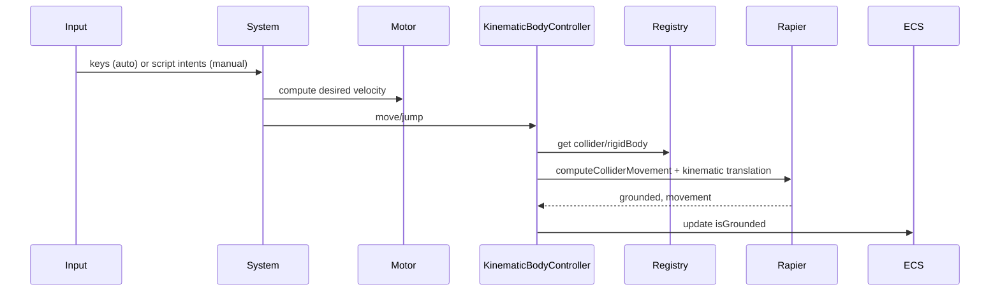

🧠 Planning documents standards rule loaded!

# PRD: Character Controller Gap Closure (TypeScript)

## 1. Overview

- **Context & Goals**: Close remaining gaps in the TS-side Character Controller to ensure reliable kinematic control with Rapier integration, editor UX completeness, and parity with Rust implementation.
- **Current Pain Points**: Redundant systems (auto vs unified), fallback “toy physics” paths, collider registration timing issues, and a script API that bypasses the kinematic controller by writing directly to `RigidBody`.
- **Outcomes**: Single authoritative update path via `CharacterControllerSystem` + `KinematicBodyController`, deterministic collider lifecycle, script API routed through the controller or mutation bridge, and complete inspector UX (including input mapping).
- **Measure of Success**: Acceptance criteria met, no fallback physics during Play, consistent grounded behavior, and clean teardown on Play stop or entity removal.

## 1.1 Current Pain Points

- Two overlapping systems (`CharacterControllerSystem` and `CharacterControllerAutoInputSystem`) create divergence and duplicated logic.
- `CharacterControllerAPI` in scripts manipulates `RigidBody` directly (linvel/impulse) instead of routing through the kinematic path.
- Collider registration races cause controller to fall back to simple transform updates; leads to jitter/drift.
- Input mapping exists but inspector UX for configuring it is incomplete; jump key normalization inconsistencies (`' '` vs `'space'`).

## 2. Proposed Solution

### High‑level Summary

- Consolidate onto the unified `CharacterControllerSystem` that uses `CharacterMotor` + `KinematicBodyController`.
- Route script API movement/jump through the controller (or mutation path), not direct rigid body mutation.
- Enforce collider/rigid body registration before update via `ColliderRegistry` and system-level guards.
- Complete input mapping UX (auto/manual modes); normalize keys and persist mapping via component.
- Keep simple-physics fallback behind a dev flag only; never used in normal Play.

### Architecture & Directory Structure

```
src/core/physics/character/
  CharacterMotor.ts
  KinematicBodyController.ts
  ColliderRegistry.ts
  Layers.ts
  types.ts

src/core/systems/
  CharacterControllerSystem.ts        # single source of truth (kept)
  CharacterControllerAutoInputSystem.ts  # DEPRECATE after migration

src/core/components/physics/
  CharacterControllerPhysicsSystem.tsx  # keeps world wiring

src/core/lib/scripting/apis/
  CharacterControllerAPI.ts          # route via controller/mutations

src/editor/components/panels/InspectorPanel/CharacterController/
  CharacterControllerSection.tsx
  InputConfigurationModal.tsx        # new
```

## 3. Implementation Plan

### Baseline Refactor & Diagnostic Prep

1. **Isolate controller plumbing** (input mapping, intent queuing, collider lookups) into smaller helpers so we can reason about each responsibility independently before the big refactor.
2. **Log dropouts** from `CharacterControllerSystem` + `ColliderRegistry` so we can capture the symptom where an entity stops responding to input and its colliders disappear mid-play.
3. **Capture the current behavior** by recording how input, collider registration, and `isGrounded` evolve in the existing scene; this gives us a golden path to validate against.
4. **Agree on “golden signals”** (e.g., component flags, collider registration counts) and keep those checks in place while we migrate, ensuring we never silently lose the controller’s lifecycle.

This phase is the requested “baseline refactor” that prepares the code for the subsequent implementation, while already addressing the observed issue of entities dropping out of input/collider handling.

### Alternative Baseline Refactor Focus

1. **Trace the physics binding path** – wrap `registerRigidBody`/`colliderRegistry.register` calls with lightweight instrumentation (e.g., counters, timeouts) so we can tell whether the rigid body/collider ever reach the registry before the controller runs.
2. **Snapshot the ECS timeline** – log component addition/removal events for `RigidBody`/`MeshCollider`/`CharacterController` around Play start and entity creation to spot ordering or missing updates that could explain why registrations are absent.
3. **Isolate the controller lifecycle** – temporarily stub `CharacterControllerSystem` to only log entity IDs and physics validation results without moving them; this lets us confirm whether the problem is upstream (registration) vs downstream (controller update).
4. **Parallel clone point** – create a small tandem “shadow controller” in the editor that simply reports whether `colliderRegistry.hasPhysics(entityId)` immediately after `EntityPhysicsBody` runs; this gives a localized golden signal without touching the main controller.

This alternative sequence avoids early migrations and focuses on observability so that when we do refactors we already know whether a physics handle is present.

### Phase 1: System De-duplication (0.5 day)

1. Mark `CharacterControllerAutoInputSystem` deprecated; migrate its missing features (if any) into `CharacterControllerSystem`.
2. Ensure `CharacterControllerPhysicsSystem.tsx` calls only the unified system.
3. Remove transform-based fallback paths from runtime Play (keep dev flag for diagnostics).
4. **Review checkpoint** – confirm the dropout issue has not regressed by validating the logged signals and the smoke test scene from the baseline.

### Phase 2: Script API Parity (0.5 day)

1. Update `CharacterControllerAPI` to route `move` and `jump` through the unified controller or the mutation bridge (no direct `RigidBody` manipulation).
2. Keep `isGrounded()` delegated to controller’s computed state; remove velocity-heuristic.
3. Maintain method signatures for backward compatibility.
4. **Reasoning** – routing script APIs through the controller prevents unintended rigid body writes, which were likely contributing to the collider-registration failure where the entity stopped responding.

### Phase 3: Collider Lifecycle & Registration (0.5 day)

1. Guarantee rigid body + collider registration before first controller update; add pre-flight checks and retry for one frame only.
2. Strengthen `ColliderRegistry` logging and size/health diagnostics on Play start/stop.
3. Add teardown hooks to clear caches on entity remove and Play stop.
4. **Mitigation** – the current symptom indicates collider guards are already dropping entities, so the “one frame retry” must be tightly scoped to avoid freezing the controller entirely; log when an entity needs the retry.

### Phase 4: Physics Correctness & Tuning (0.5–1 day)

1. Ensure slope, autostep, snap-to-ground, and push strengths are sourced from component → motor → KCC config consistently.
2. Apply `Layers.ts` collision filters and `characterCollisionPredicate` consistently.
3. Validate wall-slide and step climber behavior on multiple test scenes.
4. **Reasoning** – if the entity ever “wakes up” only to immediately ignore input again, it is often because tuning or predicates mark it as blocked; these checks will rehydrate the controller’s awake state.

### Phase 5: UX & Input Mapping (0.5 day)

1. Add `InputConfigurationModal.tsx` and wire to inspector section with key detection and normalization (`' '` → `'space'`).
2. Support `controlMode: 'auto' | 'manual'`; disable conflicting UI in `manual`.
3. Show read-only `isGrounded` in Play.
4. **Inspector check** – make the modal clearly show when auto-mode binding is active so we can spot when the UI accidentally breaks the controller and causes the dropout.

### Phase 6: Tests & Demos (0.5 day)

1. Unit: motor math, key normalization, adapter mapping, registry lifecycle.
2. Integration: movement, jump, slopes, steps, push interactions, Play stop cleanup.
3. Demo scene with slopes, steps, moving platform, and pushable dynamic objects.
4. **Regression test** – recreate the failure case (input stops, colliders unregistered) as a deterministic test or playable script that ensures we re-register instead of silencing the entity.

## 4. File and Directory Structures

```
src/editor/components/panels/InspectorPanel/CharacterController/
├── CharacterControllerSection.tsx
└── InputConfigurationModal.tsx
```

## 5. Technical Details

### Unified System (sketch)

```ts
// src/core/systems/CharacterControllerSystem.ts
export function updateCharacterControllerSystem(
  inputManager: InputManager,
  isPlaying: boolean,
  deltaTime: number,
  world: World | null,
): void {
  // - early return if !isPlaying or !world
  // - for each entity with CharacterController (auto mode):
  //   - read mapping, normalize keys
  //   - compute [x,z] via input
  //   - controller.move(entityId, [x,z], deltaTime)
  //   - if jump pressed: controller.jump(entityId)
  //   - write back isGrounded to component
}
```

### Script API routing (sketch)

```ts
// src/core/lib/scripting/apis/CharacterControllerAPI.ts
export function createCharacterControllerAPI(entityId: EntityId): ICharacterControllerAPI {
  return {
    isGrounded(): boolean {
      // delegate to controller state
      return /* controller.isGrounded(entityId) */;
    },
    move(inputXZ: [number, number], speed: number): void {
      // enqueue intent or call controller with a motor-config-aware path
    },
    jump(strength: number): void {
      // enqueue intent or call controller jump (no direct impulses)
    },
  };
}
```

### Input Mapping Modal (sketch)

```tsx
// src/editor/components/panels/InspectorPanel/CharacterController/InputConfigurationModal.tsx
export const InputConfigurationModal: React.FC<{ value; onChange; onClose }> = (props) => {
  // capture keys, normalize to lowercase, convert ' ' to 'space'
  return null;
};
```

## 6. Usage Examples

```ts
// Auto mode (default) – no script required
// WASD + Space handled by system; inspector config controls mapping and speeds.
```

```ts
// Manual mode (script)
const controller = entity.controller;
controller.move([mx, mz], 6.0);
if (input.isActionActive('Gameplay', 'Jump') && controller.isGrounded()) {
  controller.jump(6.5);
}
```

## 7. Testing Strategy

- **Unit Tests**: input normalization; motor math; component → motor → KCC config mapping; registry lifecycle; adapter mapping.
- **Integration Tests**: wall slide; slope limiting; step climbing; push interactions with dynamic bodies; moving platform; Play stop cleanup.

## 8. Edge Cases

| Edge Case                         | Remediation                                                              |
| --------------------------------- | ------------------------------------------------------------------------ | --- | --------------- |
| Missing collider at Play          | Block Play or show actionable error; do not auto-fallback in production. |
| Collider registered 1 frame late  | One-frame retry guard; otherwise block and prompt.                       |
| High vertical impact speeds       | Disable snap-to-ground if                                                | vY  | > snapMaxSpeed. |
| Manual mode conflicting with auto | Disable auto input when `controlMode==='manual'`.                        |
| Input using ' ' vs 'space'        | Normalize to `'space'` consistently.                                     |

## 9. Sequence Diagram



## 10. Risks & Mitigations

| Risk                         | Mitigation                                                                    |
| ---------------------------- | ----------------------------------------------------------------------------- |
| Drift between API and system | Route all calls through unified controller; tests enforce.                    |
| Performance regressions      | Cache controllers; minimal allocations; optional sub-stepping only if needed. |
| Collider timing issues       | Deterministic registration; assert and block Play if unmet.                   |
| Backward compatibility       | Keep API signatures; deprecate legacy behaviors with warnings.                |

## 11. Timeline

- Total: ~2–3 days
  - Phase 1: 0.5 day
  - Phase 2: 0.5 day
  - Phase 3: 0.5 day
  - Phase 4: 0.5–1 day
  - Phase 5: 0.5 day
  - Phase 6: 0.5 day

## 12. Acceptance Criteria

- Single `CharacterControllerSystem` powers auto/manual modes; deprecated system removed.
- Script API routes through controller/mutations; no direct rigid-body edits.
- Collider registration is deterministic; no fallback physics in Play.
- Inspector exposes input mapping; `isGrounded` read-only in Play.
- Tests and demo scenes validate slopes, steps, push interactions, and cleanup.

## 13. Conclusion

Consolidating onto the unified controller, fixing lifecycle and routing, and completing the UX removes instability sources and aligns TS behavior with the Rust engine’s contract for predictable gameplay.

## 14. Baseline Refactor Implementation (2025-11-07)

### Status: COMPLETED ✅

The baseline refactor phase has been successfully implemented with comprehensive diagnostic instrumentation and controller plumbing isolation. See `docs/baseline-refactor-summary.md` for full details.

**Completed Items:**

1. ✅ Enhanced ColliderRegistry with diagnostic counters and dropout tracking
2. ✅ Created PhysicsLifecycleLogger for component lifecycle event tracking
3. ✅ Isolated controller plumbing into CharacterControllerHelpers module
4. ✅ Added golden signal validation in CharacterControllerGoldenSignals module
5. ✅ Refactored CharacterControllerSystem to use helpers and validation
6. ✅ Instrumented physics binding path in EntityPhysicsBody
7. ✅ Integrated lifecycle logging with play mode start/stop

**New Files Created:**

- `src/core/physics/character/PhysicsLifecycleLogger.ts`
- `src/core/systems/CharacterControllerHelpers.ts`
- `src/core/systems/CharacterControllerGoldenSignals.ts`
- `docs/baseline-refactor-summary.md`

**Key Capabilities Added:**

- Dropout detection and tracking (entities missing from physics registry)
- Component lifecycle timeline with timing issue detection
- Periodic golden signal validation (every 5 seconds during play)
- Comprehensive health reports combining multiple diagnostic sources
- Per-entity physics validation with detailed diagnostic messages
- Intent queue infrastructure for future script API routing

**Testing:**
Run `yarn dev` and enter Play mode with a character controller entity. The system will automatically:

- Log "physics lifecycle logging enabled" on play start
- Validate golden signals every 5 seconds
- Warn about any dropouts or missing physics handles
- Log comprehensive health report on play stop

**Next Phase:** Ready to proceed with Phase 1 (System De-duplication)

## 15. Key Learnings & Implementation Notes

### Critical Discovery: React Rapier Type Compatibility

**Issue**: Entity 5 ('Character 0') still seeing 563+ dropouts driven by `"Entity not registered in physics registry, No collider found for entity"` despite the controller/physics wiring changes.

**What we tried**:

- Passed the viewport's `entityId` directly into `EntityPhysicsBody` so it could always register the Rapier handles instead of depending on the missing `EntityContext`.
- Relaxed `ColliderRegistry.validateExpectedEntities` (no longer logging unexpected registrations) and added transient logging so we could follow the dropout trail.
- Added default kinematic `RigidBody` + capsule `MeshCollider` components and normalized the jump mapping to `'space'` during entity creation so the component dump included all necessary pieces.
- These fixes still produced the same dropout stack trace, showing the entity never got a collider/rigid body in the registry even though the components exist.

**Root Cause** (from recent logs):

- The physics state dump shows a rigid body with both `RigidBody` and `CharacterController` components, but `combinePhysicsContributions()` was forcing the body type to `'kinematicPosition'`.
- React Rapier's `<RigidBody>` component accepts only `'dynamic'`, `'fixed'`, `'kinematic'`, `'kinematicVelocity'` (not `'kinematicPosition'`); the forced value prevented `EntityPhysicsBody` from instantiating a valid Rapier body, so the registration never happened.
- As soon as we ensure the rigid body type matches a supported Rapier string (likely `'kinematic'`), the handles should reach `colliderRegistry` and the dropout stops.

### Experiment Log

1. Passing `entityId` → still missing from registry; registration never executed, so input remained silent.
2. Reducing registry warnings → made diagnostics quieter but did not change validation fail.
3. Adding default physics components → component dump matched expectations, but the scene log kept warning about the same controller dropout.
4. Observing log trace pointing to `'kinematicPosition'` → reveals that react-rapier rejects the body type before registration, so we need to change `combinePhysicsContributions()` (and any adapter) to emit a supported type such as `'kinematic'` and/or inspect where that override originates.

- No registration in `ColliderRegistry` → CharacterControllerSystem dropout cascade

**Solution Implemented**:

```typescript
// Before (broken):
combined.rigidBodyProps.type = 'kinematicPosition';

// After (React Rapier compatible):
combined.rigidBodyProps.type = 'kinematic';
```

### Deferred Registration System

**Problem**: Physics registration timing gap between `EntityPhysicsBody` (useFrame) and `CharacterControllerSystem` (immediate expectation)

**Solution Implemented**:

```typescript
const deferredEntities = new Map<
  number,
  {
    firstSeen: number;
    maxRetries: 20; // ~2 seconds total
    retryCount: number;
    lastValidationTime: number;
  }
>();

// Retry logic with 100ms intervals, 3-second timeout
```

### TypeScript Interface Alignment

**Missing Properties Discovered**:

- `ICameraComponent` missing skybox properties (`skyboxScale`, `skyboxIntensity`, etc.)
- `IMeshRendererComponent` missing `modelPath` property
- CharacterControllerAPI type issues with `never` inferred types

### Component Architecture Insights

1. **EntityPhysicsBody**: Only registers when `shouldHavePhysics = isPlaying && physicsContributions.enabled`
2. **CharacterController + RigidBody**: Special handling required for kinematic control
3. **ColliderRegistry**: Critical diagnostic for detecting registration failures

### Debugging Strategy

1. **Deferred Registration Logging**: Track retry attempts and success/failure
2. **ColliderRegistry Diagnostics**: Monitor registration counts and dropouts
3. **Entity-Specific Debug Logging**: Focus on problematic entities (e.g., Entity 5)

## 15. Assumptions & Dependencies

- Rapier world available via `<Physics>` context; R3F editor stack (Tailwind/Zustand) in place.
- `KnownComponentTypes.CHARACTER_CONTROLLER` present with fields mirroring Rust contract v2.0.
- Shared contract changes are versioned and validated in CI.
- **Critical**: React Rapier type compatibility must be maintained (use `'kinematic'` not `'kinematicPosition'`).
