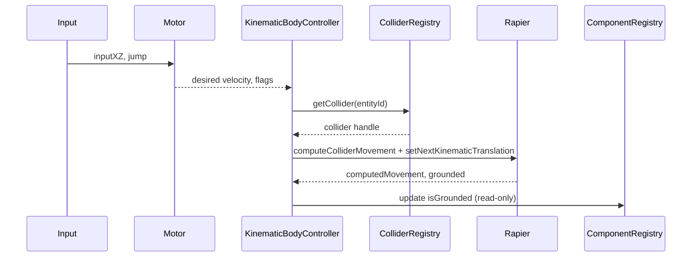

🧠 Planning documents standards rule loaded!

# PRD: Character Controller Refactor (TypeScript + Rapier)

## 1. Overview

- **Context & Goals**: Increase robustness and predictability of the Character Controller by eliminating fallback “toy physics,” unifying motion to kinematic body control, and ensuring reliable collider lookup and ground detection.
- **Current Pain Points**: Fragile coupling across React, ECS, and Rapier; controller updates `Transform` while a `RigidBody` also exists; missing `entityId → Collider` mapping; inconsistent gravity handling; caches not lifecycle-aware.
- **Outcomes**: Deterministic kinematic movement with collision-aware resolution, reliable collider registry, clean separation of concerns (input → controller → physics), and well-defined testing.
- **Measure of Success**: Stable push interactions, no “floating” on impact, ground detection that doesn’t regress, and clean teardown with zero leaks.

## 2. Current Pain Points

- **Collider access is incomplete**: `getEntityCollider` returns null; controller falls back to simple Y checks (fragile).
- **Dual source of truth**: Character movement writes to `Transform`, while a `RigidBody` exists; can desync and jitter.
- **Lifecycle fragility**: Rapier controller caches aren’t tied to component/entity lifecycle events; risk of leaks.
- **Interaction and layering**: No clear interaction groups/filtering for character vs environment vs dynamic objects.
- **Gravity/kinematics inconsistency**: Mixed gravity handling (component vs body), risking “floating” or drift.

## 3. Proposed Solution

- **High‑level Summary**
  - Add a dedicated Character Motor that drives a kinematic body (never the `Transform` directly).
  - Introduce a Collider Registry to reliably map `entityId → colliderHandle`.
  - Tie controller creation/destruction to component/entity lifecycle.
  - Configure interaction groups and filter predicate; add push strength, snap thresholds, and slope/step guards.
  - Remove simple-physics fallback in play mode (dev flag remains), and add thorough tests.

- **Architecture & Directory Structure**
```
src/core/physics/character/
  CharacterMotor.ts                   # Pure movement math, normalized params
  KinematicBodyController.ts          # Thin wrapper around Rapier KCC + body sync
  ColliderRegistry.ts                 # entityId <-> { rigidBody, colliders } mapping
  Layers.ts                           # collision groups & masks for character
  types.ts                            # interfaces (ICharacterMotorConfig, etc.)

src/core/systems/
  CharacterControllerSystem.ts        # Replaces auto-input system movement write

src/core/components/physics/
  CharacterControllerPhysicsSystem.tsx  # Keeps world wiring only, no ad-hoc lookups
```

## 4. Implementation Plan

- Phase 1: Foundations (0.5 day)
  1. Create `ColliderRegistry` and wire registration in `EntityPhysicsBody` and `EntityColliders`.
  2. Add `Layers` with default groups/masks for character, environment, dynamic.
  3. Replace all direct controller collider lookups with `ColliderRegistry`.

- Phase 2: Character Motor + Kinematic Control (1 day)
  1. Implement `CharacterMotor` (movement intent → desired velocity, snap, slope checks).
  2. Implement `KinematicBodyController` (wrap Rapier KCC, compute movement, call `setNextKinematicTranslation`).
  3. Migrate system to drive kinematic body, not `Transform`; Transform becomes a read mirror.

- Phase 3: Lifecycle & Cleanup (0.5 day)
  1. Subscribe to component/entity add/remove; instantiate/destroy Rapier KCC accordingly.
  2. Ensure caches and registries clear on unmount and Play stop.

- Phase 4: Interaction Tuning (0.5 day)
  1. Add config for push strength, max push mass, snap thresholds, max depenetration per frame.
  2. Apply filter predicate using `Layers` consistently.

- Phase 5: Testing & Telemetry (0.5–1 day)
  1. Unit tests for motor math and slope/step logic.
  2. Integration tests for push stability, wall slide, ground snap, moving platforms.
  3. Minimal telemetry logs gated by debug flag.

## 5. File and Directory Structures

```
/src/core/physics/character/
├── CharacterMotor.ts
├── KinematicBodyController.ts
├── ColliderRegistry.ts
├── Layers.ts
└── types.ts
```

## 6. Technical Details

```ts
// src/core/physics/character/types.ts
export interface ICharacterMotorConfig {
  maxSpeed: number;
  jumpStrength: number;
  gravity: number;
  slopeLimitDeg: number;
  stepOffset: number;
  skinWidth: number;
  snapMaxSpeed: number;        // do not snap if vertical speed exceeds this
  maxDepenetrationPerFrame: number;
  pushStrength: number;
  maxPushMass: number;
}
```

```ts
// src/core/physics/character/CharacterMotor.ts
export class CharacterMotor {
  constructor(private readonly config: ICharacterMotorConfig) {}
  computeDesiredVelocity(inputXZ: [number, number]): { x: number; y: number; z: number } { /* ... */ }
  applyGravity(v: { x: number; y: number; z: number }, dt: number): void { /* ... */ }
  shouldSnapToGround(verticalSpeed: number): boolean { /* ... */ }
  isSlopeTooSteep(groundNormal: { x: number; y: number; z: number }): boolean { /* ... */ }
}
```

```ts
// src/core/physics/character/ColliderRegistry.ts
export interface IEntityPhysicsRefs {
  rigidBody?: import('@dimforge/rapier3d-compat').RigidBody;
  colliders: Array<import('@dimforge/rapier3d-compat').Collider>;
}
export class ColliderRegistry {
  register(entityId: number, refs: IEntityPhysicsRefs): void { /* ... */ }
  unregister(entityId: number): void { /* ... */ }
  getCollider(entityId: number): import('@dimforge/rapier3d-compat').Collider | null { /* ... */ }
  getRigidBody(entityId: number): import('@dimforge/rapier3d-compat').RigidBody | null { /* ... */ }
}
```

```ts
// src/core/physics/character/KinematicBodyController.ts
export class KinematicBodyController {
  constructor(
    private readonly world: import('@dimforge/rapier3d-compat').World,
    private readonly motor: CharacterMotor,
  ) {}
  move(entityId: number, desiredXZ: [number, number], dt: number): void { /* computeColliderMovement + setNextKinematicTranslation */ }
  jump(entityId: number): void { /* adjust vertical velocity buffer */ }
  isGrounded(entityId: number): boolean { /* uses computedGrounded */ }
  cleanup(entityId: number): void { /* remove KCC if needed */ }
}
```

```ts
// src/core/systems/CharacterControllerSystem.ts
// Replaces direct Transform writes with kinematic body control
export function updateCharacterControllerSystem(dt: number): void { /* ... */ }
```

## 7. Usage Examples

```ts
// Input → Motor → Kinematic Controller
characterSystem.update(dt); // internally: input → desired velocity → KCC.computeColliderMovement → setNextKinematicTranslation
```

```ts
// Inspector changes (Zod schema remains; values flow into motor config)
updateComponent('CharacterController', { maxSpeed: 7, slopeLimit: 50 });
```

## 8. Testing Strategy

- **Unit Tests**
  - CharacterMotor velocity clamp, gravity, slope, step.
  - Snap-to-ground threshold behavior.
- **Integration Tests**
  - Push dynamic bodies without destabilizing character.
  - Slide along walls; cannot climb slopes > limit.
  - Step climb ≤ stepOffset.
  - Moving kinematic platforms: character stays grounded.
  - Lifecycle: no controller/collider leaks across Play toggles and entity deletes.

## 9. Edge Cases

| Edge Case | Remediation |
| --- | --- |
| Missing collider at Play | Prevent run and show actionable error; no fallback in production mode. |
| High vertical speed on landing | Disable ground snap if |vY| > snapMaxSpeed. |
| Deep penetration on spawn | Limit depenetration per frame; warn once if exceeded. |
| No rigid body but controller present | Auto-provision kinematic body (editor hint + fix action). |
| Layer conflicts | Centralize in `Layers.ts` and enforce via filter predicate. |

## 10. Sequence Diagram



## 11. Risks & Mitigations

| Risk | Mitigation |
| --- | --- |
| Desync between Transform and body | Drive body only; mirror to Transform after step. |
| Performance regressions | Cache KCC by entity; cleanup on lifecycle; optional sub-stepping only when needed. |
| Backward-compat with scripts | Keep API surface; route calls through new controller. |
| Layer/filter misconfig | Centralize groups in `Layers.ts`; add assertions in dev. |

## 12. Timeline

- Total: ~2.5–3.5 days
  - Phase 1: 0.5 day
  - Phase 2: 1 day
  - Phase 3: 0.5 day
  - Phase 4: 0.5 day
  - Phase 5: 0.5–1 day

## 13. Acceptance Criteria

- Character uses kinematic body updates (no direct Transform writes).
- Collider lookup via `ColliderRegistry` is reliable; no nulls in Play.
- Grounding, slopes, steps, pushing are deterministic and stable.
- No cache leaks across entity removal or Play toggle.
- Tests cover listed scenarios and pass consistently.

## 14. Conclusion

This refactor consolidates character movement through a robust kinematic path, removes fragile fallbacks, ensures reliable collider access, and clarifies layering and lifecycle, delivering stability without sacrificing flexibility or performance.

## 15. Assumptions & Dependencies

- `@react-three/rapier` and Rapier3D are present; world exposed via hooks.
- Zod schemas remain the source of truth for editor inputs.
- Existing input manager provides normalized keys; no changes required.
- Editor runs within `<Physics>` context; colliders/rigid bodies are registered.


