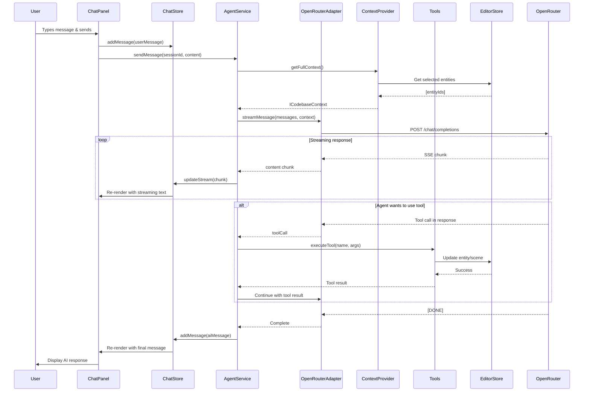

# Claude Agent SDK Integration PRD

**Status**: Planning
**Priority**: High
**Estimated Effort**: 5-7 days
**Dependencies**: None (extends existing chat components)
**Target Version**: 0.2.0

---

## 1. Overview

### Context & Goals

- **AI-First Vision**: Vibe Coder 3D positions itself as an "AI-first game engine." Currently, the chat interface has only mock implementations that return hardcoded responses after a 1.5s delay.
- **Contextual Awareness**: Integrate Claude Agent SDK to provide a production-ready AI assistant that understands the codebase, can read/write files, execute commands, and assist with scene editing, entity manipulation, and debugging.
- **OpenRouter Flexibility**: Use OpenRouter API instead of direct Anthropic API to access 400+ models from 60+ providers, enabling cost optimization, fallback strategies, and access to specialized models.
- **Developer Productivity**: Transform the chat panel from a UI mockup into a powerful coding copilot that accelerates game development workflows.

### Current Pain Points

- Chat components (`ChatPanel.tsx`, `LeftSidebarChat.tsx`, `RightSidebarChat.tsx`) use hardcoded mock responses via `setTimeout`.
- No actual AI integration exists—users see placeholder messages like "This is a mock response."
- No codebase awareness—the assistant cannot read files, understand project structure, or provide contextual help.
- No tool usage—cannot execute commands, manipulate entities, or perform file operations.

---

## 2. Proposed Solution

### High-level Summary

- **Install Claude Agent SDK**: Use `@anthropic-ai/claude-agent-sdk` to build production-ready AI agents with full codebase awareness.
- **OpenRouter Integration**: Configure the SDK to route requests through OpenRouter API instead of Anthropic's direct API for model flexibility and cost control.
- **Codebase Context Management**: Implement automatic context loading from `CLAUDE.md` files, project structure, and active scene/entity data.
- **Tool Integration**: Expose file operations, entity manipulation, scene editing, and project search as tools the agent can invoke.
- **Chat Store Refactoring**: Create a dedicated Zustand store for chat state management following existing patterns in `src/editor/store/`.

### Architecture & Directory Structure

```
src/editor/
├── components/
│   └── chat/
│       ├── ChatPanel.tsx                    # Update to use AgentService
│       ├── LeftSidebarChat.tsx              # Update to use AgentService
│       ├── RightSidebarChat.tsx             # Update to use AgentService
│       └── hooks/
│           ├── useChatAgent.ts              # Hook for agent interactions
│           └── useCodebaseContext.ts        # Hook for context assembly
├── store/
│   └── chatStore.ts                         # NEW: Zustand store for chat state
└── services/
    └── agent/                               # NEW: Agent service layer
        ├── AgentService.ts                  # Main service class
        ├── OpenRouterAdapter.ts             # OpenRouter API adapter
        ├── CodebaseContextProvider.ts       # Context assembly service
        ├── tools/                           # NEW: Agent tools
        │   ├── FileOperationsTool.ts        # Read/write files
        │   ├── EntityManipulationTool.ts    # Create/update/delete entities
        │   ├── SceneQueryTool.ts            # Query scene hierarchy/components
        │   ├── ProjectSearchTool.ts         # Search codebase
        │   └── index.ts                     # Tool registry
        ├── types.ts                         # Agent types & interfaces
        └── __tests__/
            ├── AgentService.test.ts
            ├── OpenRouterAdapter.test.ts
            └── CodebaseContextProvider.test.ts

.env (updated)
OPENROUTER_API_KEY=sk-or-v1-xxxxx
OPENROUTER_BASE_URL=https://openrouter.ai/api/v1
OPENROUTER_MODEL=anthropic/claude-sonnet-4-5
AGENT_MAX_CONTEXT_TOKENS=150000
AGENT_TEMPERATURE=0.7
AGENT_AUTO_SAVE=true
```

---

## 3. Implementation Plan

### Phase 1: SDK Installation & Configuration (0.5 day)

1. **Install dependencies**:

   ```bash
   yarn add @anthropic-ai/claude-agent-sdk
   yarn add -D @types/node  # If not already present
   ```

2. **Environment configuration**:

   - Add OpenRouter credentials to `.env.example` and `.env`
   - Document all environment variables with descriptions

3. **Verify installation**:
   - Create minimal test file to verify SDK imports
   - Test OpenRouter API connectivity with a simple request

### Phase 2: OpenRouter Adapter & Base Service (1.5 days)

1. **Create `OpenRouterAdapter.ts`**:

   - Implement custom HTTP client that translates Claude SDK calls to OpenRouter format
   - Handle authentication headers (`Authorization: Bearer ${OPENROUTER_API_KEY}`)
   - Map OpenRouter response format to Claude SDK expected format
   - Implement error handling and retry logic
   - Add request/response logging for debugging

2. **Create `AgentService.ts`**:

   - Singleton pattern following existing service conventions
   - Initialize Claude Agent SDK with OpenRouter adapter
   - Implement session management
   - Handle streaming responses
   - Provide clean shutdown/cleanup methods

3. **Create type definitions** (`types.ts`):

   ```typescript
   export interface IAgentMessage {
     id: string;
     type: 'user' | 'ai' | 'system' | 'tool';
     content: string;
     timestamp: Date;
     toolCalls?: IToolCall[];
     metadata?: Record<string, unknown>;
   }

   export interface IAgentSession {
     id: string;
     messages: IAgentMessage[];
     context: ICodebaseContext;
     createdAt: Date;
     lastActivity: Date;
   }

   export interface ICodebaseContext {
     projectRoot: string;
     currentScene: string | null;
     selectedEntities: number[];
     recentFiles: string[];
     claudeMemory: string[]; // Content from CLAUDE.md files
   }

   export interface IToolCall {
     name: string;
     arguments: Record<string, unknown>;
     result?: unknown;
   }

   export interface IAgentConfig {
     model: string;
     maxTokens: number;
     temperature: number;
     systemPrompt: string;
   }
   ```

### Phase 3: Codebase Context Provider (1 day)

1. **Create `CodebaseContextProvider.ts`**:

   - Scan and aggregate all `CLAUDE.md` files from project
   - Build project structure tree (directories, key files)
   - Extract current scene metadata (entities, components, hierarchy)
   - Track recently edited files from editor state
   - Format context into structured markdown for agent consumption

2. **Implement context assembly methods**:

   ```typescript
   class CodebaseContextProvider {
     async getFullContext(): Promise<ICodebaseContext>;
     async getSceneContext(sceneName: string): Promise<string>;
     async getEntityContext(entityIds: number[]): Promise<string>;
     async getFileContext(paths: string[]): Promise<string>;
     getMemoryFiles(): Promise<string[]>; // All CLAUDE.md content
   }
   ```

3. **Optimize context size**:
   - Prioritize context by relevance (selected entities > current scene > general docs)
   - Implement truncation strategy when approaching token limits
   - Cache frequently accessed context sections

### Phase 4: Agent Tools Implementation (1.5 days)

1. **Create `FileOperationsTool.ts`**:

   - `readFile(path: string)`: Read file contents
   - `writeFile(path: string, content: string)`: Write file
   - `listDirectory(path: string)`: List files in directory
   - `searchFiles(pattern: string)`: Search for files matching pattern
   - Security: Restrict to project root, validate paths

2. **Create `EntityManipulationTool.ts`**:

   - `createEntity(type: string, properties: object)`: Add entity to scene
   - `updateEntity(id: number, properties: object)`: Update entity
   - `deleteEntity(id: number)`: Remove entity from scene
   - `getEntityDetails(id: number)`: Get full entity data
   - Integration: Use existing `useEditorStore` and ECS APIs

3. **Create `SceneQueryTool.ts`**:

   - `getSceneHierarchy()`: Get full scene tree
   - `queryEntities(filter: object)`: Find entities by criteria
   - `getComponentData(entityId: number, componentType: string)`: Component details
   - `listScenes()`: Available scenes in project

4. **Create `ProjectSearchTool.ts`**:

   - `searchCode(query: string)`: Search codebase with ripgrep
   - `findDefinition(symbol: string)`: Locate class/function definitions
   - `getDependencies()`: List project dependencies from package.json

5. **Create tool registry** (`tools/index.ts`):
   - Central registration of all available tools
   - Tool discovery and validation
   - Permission management per tool

### Phase 5: Chat Store & UI Integration (1 day)

1. **Create `chatStore.ts`**:

   ```typescript
   interface IChatStore {
     sessions: Map<string, IAgentSession>;
     activeSessionId: string | null;
     isAgentTyping: boolean;
     currentStream: string;

     // Actions
     createSession: () => string;
     deleteSession: (sessionId: string) => void;
     setActiveSession: (sessionId: string) => void;
     addMessage: (sessionId: string, message: IAgentMessage) => void;
     updateStream: (content: string) => void;
     clearStream: () => void;
     setAgentTyping: (typing: boolean) => void;
   }

   export const useChatStore = create<IChatStore>((set, get) => ({
     // ... implementation following editorStore.ts pattern
   }));
   ```

2. **Create `useChatAgent.ts` hook**:

   ```typescript
   export const useChatAgent = () => {
     const { activeSessionId, addMessage, setAgentTyping, updateStream } = useChatStore();
     const agentService = AgentService.getInstance();

     const sendMessage = useCallback(
       async (content: string) => {
         if (!activeSessionId) return;

         // Add user message
         const userMessage: IAgentMessage = {
           id: uuid(),
           type: 'user',
           content,
           timestamp: new Date(),
         };
         addMessage(activeSessionId, userMessage);

         // Call agent
         setAgentTyping(true);
         try {
           await agentService.sendMessage(content, {
             onStream: (chunk) => updateStream(chunk),
             onComplete: (response) => {
               addMessage(activeSessionId, {
                 id: uuid(),
                 type: 'ai',
                 content: response,
                 timestamp: new Date(),
               });
             },
           });
         } finally {
           setAgentTyping(false);
         }
       },
       [activeSessionId, addMessage, setAgentTyping, updateStream],
     );

     return { sendMessage };
   };
   ```

3. **Update chat components**:
   - Replace `setTimeout` mock logic with `useChatAgent` hook
   - Display streaming responses character-by-character
   - Show tool usage indicators when agent invokes tools
   - Add "thinking" animation when agent is processing

### Phase 6: Testing & Refinement (1 day)

1. **Unit tests**:

   - Test OpenRouterAdapter with mock responses
   - Test AgentService session management
   - Test CodebaseContextProvider context assembly
   - Test each tool's functionality independently

2. **Integration tests**:

   - End-to-end agent conversation flow
   - Tool invocation and result handling
   - Context loading and relevance
   - Error recovery and retry logic

3. **Manual testing scenarios**:
   - Ask agent to describe current scene
   - Request agent to create a new entity
   - Ask agent to explain a specific code file
   - Test multi-turn conversations with context retention

---

## 4. File and Directory Structures

### Service Layer

```
src/editor/services/agent/
├── AgentService.ts              # ~250 lines - Main orchestrator
├── OpenRouterAdapter.ts         # ~150 lines - API adapter
├── CodebaseContextProvider.ts   # ~200 lines - Context assembly
├── tools/
│   ├── FileOperationsTool.ts    # ~100 lines
│   ├── EntityManipulationTool.ts # ~120 lines
│   ├── SceneQueryTool.ts        # ~100 lines
│   ├── ProjectSearchTool.ts     # ~80 lines
│   └── index.ts                 # ~50 lines - Tool registry
├── types.ts                     # ~100 lines - Type definitions
└── __tests__/
    ├── AgentService.test.ts     # ~150 lines
    ├── OpenRouterAdapter.test.ts # ~100 lines
    └── tools/
        ├── FileOperationsTool.test.ts
        └── EntityManipulationTool.test.ts
```

---

## 5. Technical Details

### OpenRouterAdapter Implementation

```typescript
import { Logger } from '@core/lib/logger';

const logger = Logger.create('OpenRouterAdapter');

export class OpenRouterAdapter {
  private baseUrl: string;
  private apiKey: string;
  private model: string;

  constructor(config: { baseUrl: string; apiKey: string; model: string }) {
    this.baseUrl = config.baseUrl;
    this.apiKey = config.apiKey;
    this.model = config.model;
  }

  async sendMessage(
    messages: Array<{ role: string; content: string }>,
    options?: {
      temperature?: number;
      maxTokens?: number;
      tools?: unknown[];
      stream?: boolean;
    },
  ): Promise<Response> {
    const headers = {
      Authorization: `Bearer ${this.apiKey}`,
      'Content-Type': 'application/json',
      'HTTP-Referer': window.location.origin, // Required by OpenRouter
      'X-Title': 'Vibe Coder 3D', // Required by OpenRouter
    };

    const body = {
      model: this.model,
      messages,
      temperature: options?.temperature ?? 0.7,
      max_tokens: options?.maxTokens ?? 4096,
      stream: options?.stream ?? false,
      ...(options?.tools && { tools: options.tools }),
    };

    logger.debug('OpenRouter request', { model: this.model, messageCount: messages.length });

    try {
      const response = await fetch(`${this.baseUrl}/chat/completions`, {
        method: 'POST',
        headers,
        body: JSON.stringify(body),
      });

      if (!response.ok) {
        const error = await response.json();
        logger.error('OpenRouter API error', { status: response.status, error });
        throw new Error(`OpenRouter API error: ${error.message || response.statusText}`);
      }

      return response;
    } catch (error) {
      logger.error('OpenRouter request failed', { error });
      throw error;
    }
  }

  async *streamMessage(
    messages: Array<{ role: string; content: string }>,
    options?: { temperature?: number; maxTokens?: number; tools?: unknown[] },
  ): AsyncGenerator<string, void, unknown> {
    const response = await this.sendMessage(messages, { ...options, stream: true });

    if (!response.body) {
      throw new Error('Response body is null');
    }

    const reader = response.body.getReader();
    const decoder = new TextDecoder();

    try {
      while (true) {
        const { done, value } = await reader.read();
        if (done) break;

        const chunk = decoder.decode(value);
        const lines = chunk.split('\n').filter((line) => line.trim().startsWith('data: '));

        for (const line of lines) {
          const data = line.replace('data: ', '');
          if (data === '[DONE]') continue;

          try {
            const parsed = JSON.parse(data);
            const content = parsed.choices?.[0]?.delta?.content;
            if (content) {
              yield content;
            }
          } catch (e) {
            logger.warn('Failed to parse streaming chunk', { data });
          }
        }
      }
    } finally {
      reader.releaseLock();
    }
  }
}
```

### AgentService Implementation Skeleton

```typescript
import { OpenRouterAdapter } from './OpenRouterAdapter';
import { CodebaseContextProvider } from './CodebaseContextProvider';
import { ToolRegistry } from './tools';
import type { IAgentSession, IAgentMessage, IAgentConfig } from './types';

export class AgentService {
  private static instance: AgentService;
  private adapter: OpenRouterAdapter;
  private contextProvider: CodebaseContextProvider;
  private toolRegistry: ToolRegistry;
  private sessions: Map<string, IAgentSession> = new Map();

  private constructor() {
    const config = this.loadConfig();
    this.adapter = new OpenRouterAdapter({
      baseUrl: config.baseUrl,
      apiKey: config.apiKey,
      model: config.model,
    });
    this.contextProvider = new CodebaseContextProvider();
    this.toolRegistry = new ToolRegistry();
  }

  static getInstance(): AgentService {
    if (!AgentService.instance) {
      AgentService.instance = new AgentService();
    }
    return AgentService.instance;
  }

  private loadConfig(): { baseUrl: string; apiKey: string; model: string } {
    return {
      baseUrl: import.meta.env.VITE_OPENROUTER_BASE_URL || 'https://openrouter.ai/api/v1',
      apiKey: import.meta.env.VITE_OPENROUTER_API_KEY || '',
      model: import.meta.env.VITE_OPENROUTER_MODEL || 'anthropic/claude-sonnet-4-5',
    };
  }

  createSession(): string {
    // Implementation
  }

  async sendMessage(
    sessionId: string,
    content: string,
    options?: {
      onStream?: (chunk: string) => void;
      onComplete?: (response: string) => void;
      onToolUse?: (tool: string, args: unknown) => void;
    },
  ): Promise<void> {
    // Implementation
  }
}
```

### CodebaseContextProvider Implementation Skeleton

```typescript
import { useEditorStore } from '@editor/store/editorStore';
import { Logger } from '@core/lib/logger';
import type { ICodebaseContext } from './types';

const logger = Logger.create('CodebaseContextProvider');

export class CodebaseContextProvider {
  private memoryCache: Map<string, string> = new Map();
  private lastScanTime: number = 0;
  private SCAN_CACHE_TTL = 60000; // 1 minute

  async getFullContext(): Promise<ICodebaseContext> {
    const { selectedIds } = useEditorStore.getState();

    return {
      projectRoot: '/home/joao/projects/vibe-coder-3d',
      currentScene: this.getCurrentSceneName(),
      selectedEntities: selectedIds,
      recentFiles: this.getRecentFiles(),
      claudeMemory: await this.getMemoryFiles(),
    };
  }

  private getCurrentSceneName(): string | null {
    // Extract from localStorage or scene state
  }

  private getRecentFiles(): string[] {
    // Track from editor activity
  }

  async getMemoryFiles(): Promise<string[]> {
    if (Date.now() - this.lastScanTime < this.SCAN_CACHE_TTL) {
      return Array.from(this.memoryCache.values());
    }

    // Scan for CLAUDE.md files
    const claudeFiles = await this.scanClaudeFiles();
    this.memoryCache = claudeFiles;
    this.lastScanTime = Date.now();

    return Array.from(claudeFiles.values());
  }

  private async scanClaudeFiles(): Promise<Map<string, string>> {
    // Use file system API or plugin to scan for CLAUDE.md files
  }

  async getEntityContext(entityIds: number[]): Promise<string> {
    // Build markdown describing selected entities
  }
}
```

---

## 6. Usage Examples

### Example 1: Basic Conversation

```typescript
// In ChatPanel.tsx
const { sendMessage } = useChatAgent();

const handleUserMessage = async (userInput: string) => {
  await sendMessage(userInput);
};

// User: "What entities are in the current scene?"
// Agent: "The current scene contains 5 entities:
//         1. MainCamera (Camera)
//         2. Player (Mesh + RigidBody + Script)
//         3. Ground (Mesh + MeshCollider)
//         4. Light_Directional (DirectionalLight)
//         5. Skybox (Skybox)
//
//         Would you like details on any specific entity?"
```

### Example 2: Entity Creation via Agent

```typescript
// User: "Create a red cube at position (0, 5, 0)"
// Agent internally calls EntityManipulationTool:
{
  tool: 'createEntity',
  arguments: {
    type: 'Cube',
    properties: {
      position: { x: 0, y: 5, z: 0 },
      meshRenderer: {
        material: { color: '#ff0000' }
      }
    }
  }
}
// Agent: "I've created a red cube at position (0, 5, 0).
//        The entity ID is 42. Would you like to add physics to it?"
```

### Example 3: Codebase Query

```typescript
// User: "How does the physics system work?"
// Agent reads:
// - src/core/lib/physics.ts
// - docs/architecture/2-10-physics-system.md
// - CLAUDE.md files mentioning physics
// Agent: "The physics system uses Rapier via @react-three/rapier.
//        Key components:
//        - RigidBodyComponent: Defines physics body type (dynamic/static/kinematic)
//        - MeshColliderComponent: Defines collision shape
//        - Physics updates run at fixed 60Hz timestep
//
//        Implementation details in src/core/lib/physics.ts:45-120"
```

---

## 7. Testing Strategy

### Unit Tests

- **OpenRouterAdapter**:

  - Mock fetch responses for successful/error cases
  - Test streaming chunk parsing
  - Validate header construction
  - Test retry logic on transient failures

- **CodebaseContextProvider**:

  - Mock file system to test CLAUDE.md scanning
  - Test context truncation when exceeding token limits
  - Verify entity context serialization

- **Tools**:
  - Test each tool with valid/invalid inputs
  - Verify permission enforcement
  - Test integration with editor stores

### Integration Tests

- **Full conversation flow**:

  - User sends message → Agent processes → Response rendered
  - Multi-turn conversation maintains context
  - Tool invocations update editor state correctly

- **Context loading**:

  - Agent receives accurate scene state
  - Selected entities are prioritized in context
  - Memory files are included in system prompt

- **Error handling**:
  - Network failures gracefully degrade
  - Invalid tool arguments are rejected
  - API rate limits trigger retry logic

---

## 8. Edge Cases

| Edge Case                                          | Remediation                                                                                      |
| -------------------------------------------------- | ------------------------------------------------------------------------------------------------ |
| OpenRouter API key missing                         | Show error message in chat: "AI assistant requires OPENROUTER_API_KEY. Please configure in .env" |
| Context exceeds token limit                        | Implement intelligent truncation: prioritize selected entities > current scene > general docs    |
| Tool invocation fails                              | Catch error, show user-friendly message, log details for debugging                               |
| Network timeout                                    | Retry up to 3 times with exponential backoff. Show "Connection issue, retrying..." message       |
| Agent returns malformed JSON tool call             | Log warning, ask agent to retry, fallback to text-only response                                  |
| Multiple chat sessions open                        | Store sessions separately, allow switching between them, persist to localStorage                 |
| Scene/entity state changes during agent processing | Refresh context before tool invocation, show "Refreshing context..." indicator                   |
| Large file operations (>1MB)                       | Implement streaming file read/write, show progress indicator                                     |
| Agent suggests destructive operations              | Add confirmation dialog: "Agent wants to delete 5 entities. Confirm?"                            |
| Rate limit exceeded                                | Show "API rate limit reached. Please wait..." and implement exponential backoff                  |

---

## 9. Sequence Diagram



---

## 10. Risks & Mitigations

| Risk                                         | Mitigation                                                                                                                  |
| -------------------------------------------- | --------------------------------------------------------------------------------------------------------------------------- |
| **OpenRouter cost management**               | Implement token counting, add budget alerts, allow model switching between expensive/cheap models based on task complexity  |
| **Agent hallucination/incorrect info**       | Add disclaimer in UI: "AI assistant may make mistakes. Verify critical information." Implement fact-checking for tool calls |
| **Security: Agent accesses sensitive files** | Whitelist allowed directories (project root only), blacklist sensitive files (.env, credentials), validate all paths        |
| **Performance: Context assembly is slow**    | Cache CLAUDE.md files, debounce context updates, lazy-load context sections, implement background preloading                |
| **Dependency on external API**               | Implement graceful degradation: show offline message, queue messages for retry, cache common responses                      |
| **Tool misuse damages project state**        | Implement undo/redo for agent actions, add confirmation dialogs for destructive ops, auto-backup before major changes       |
| **Token limit reached mid-conversation**     | Implement conversation summarization, prune old messages, prioritize recent context, show warning at 80% capacity           |
| **OpenRouter model unavailable**             | Implement fallback chain: Claude Sonnet → Claude Haiku → GPT-4 → Local model                                                |

---

## 11. Timeline

### Total Estimated Time: **5-7 days**

| Phase                                      | Duration | Details                                                      |
| ------------------------------------------ | -------- | ------------------------------------------------------------ |
| Phase 1: SDK Installation & Config         | 0.5 day  | Install dependencies, environment setup, verify connectivity |
| Phase 2: OpenRouter Adapter & Base Service | 1.5 days | Adapter implementation, AgentService core, types             |
| Phase 3: Codebase Context Provider         | 1 day    | CLAUDE.md scanning, context assembly, optimization           |
| Phase 4: Agent Tools                       | 1.5 days | File ops, entity manipulation, scene queries, project search |
| Phase 5: Chat Store & UI Integration       | 1 day    | Zustand store, hooks, update chat components                 |
| Phase 6: Testing & Refinement              | 1 day    | Unit tests, integration tests, manual testing, bug fixes     |

**Buffer**: +0.5 day for unexpected issues, performance tuning, documentation

---

## 12. Acceptance Criteria

- [ ] Claude Agent SDK installed and configured with OpenRouter adapter
- [ ] Chat panel connects to real AI agent instead of mock responses
- [ ] Agent has access to full codebase context (CLAUDE.md files, project structure)
- [ ] Agent can read/write files within project boundaries
- [ ] Agent can create/update/delete entities in the scene
- [ ] Agent can query scene hierarchy and component data
- [ ] Agent can search codebase for symbols/patterns
- [ ] Streaming responses render character-by-character in chat
- [ ] Tool usage is indicated in the UI with appropriate icons
- [ ] Error handling gracefully handles network failures and API errors
- [ ] OpenRouter API key validation with user-friendly error messages
- [ ] Chat history persists across sessions (localStorage)
- [ ] Multi-turn conversations maintain context correctly
- [ ] Selected entities are highlighted in agent context
- [ ] Agent responses include file:line references for code locations
- [ ] Confirmation dialogs for destructive operations
- [ ] Token usage is tracked and displayed to user
- [ ] All tests pass (unit + integration)
- [ ] Documentation updated (README, CLAUDE.md)

---

## 13. Conclusion

Integrating the Claude Agent SDK with OpenRouter transforms Vibe Coder 3D's chat interface from a UI mockup into a production-ready AI coding copilot. This implementation provides:

- **Full codebase awareness** through CLAUDE.md memory files and dynamic context
- **Powerful tool usage** for file operations, entity manipulation, and project queries
- **Model flexibility** via OpenRouter's 400+ model catalog
- **Production-ready architecture** following existing patterns (Zustand, hooks, services)
- **Extensibility** with a modular tool registry for future capabilities

The agent becomes a genuine assistant that understands the game engine architecture, can help debug issues, generate entities, explain code, and accelerate development workflows—fulfilling the "AI-first game engine" vision.

### Next Steps

1. Get approval on architecture and timeline
2. Add `OPENROUTER_API_KEY` to `.env` and fund OpenRouter account
3. Begin Phase 1 implementation
4. Iterate on tool capabilities based on user feedback
5. Explore advanced features: multi-agent workflows, autonomous task execution, voice interface

---

## 14. Assumptions & Dependencies

### Assumptions

- **OpenRouter Account**: User has created account at https://openrouter.ai and obtained API key
- **Sufficient Budget**: OpenRouter credit balance or payment method configured (Claude Sonnet ~$3/million tokens)
- **Browser Support**: Modern browser with ES2020+, fetch API, ReadableStream support
- **Network**: Stable internet connection for API calls (graceful degradation on failure)
- **Project Structure**: CLAUDE.md files exist and are maintained following conventions
- **Editor State**: Zustand stores are the source of truth for editor state

### Dependencies

- **Runtime Dependencies**:

  - `@anthropic-ai/claude-agent-sdk@^1.0.0` - Agent framework
  - `zustand@^5.0.0` - Already installed, used for chat store
  - `uuid@^13.0.0` - Already installed, used for message IDs

- **Dev Dependencies**:

  - `@types/node@^20.0.0` - TypeScript types for Node.js APIs
  - `vitest@^3.2.3` - Already installed, used for testing

- **External Services**:

  - **OpenRouter API** - Primary dependency for AI model access
  - **Anthropic Claude** - Accessed via OpenRouter (fallback: other OpenRouter models)

- **Internal Dependencies**:
  - `src/editor/store/editorStore.ts` - Entity selection, play mode state
  - `src/core/lib/logger.ts` - Structured logging
  - `src/core/lib/ecs/*` - Entity Component System for entity manipulation
  - Vite plugins for API endpoints (if implementing file ops via plugin)

### Third-Party Services

- **OpenRouter** (https://openrouter.ai):
  - Unified API for 400+ AI models
  - Pay-as-you-go pricing
  - No vendor lock-in
  - Usage dashboard and analytics
  - Rate limiting and budget controls

### Environment Constraints

- **Token Limits**: Claude Sonnet 4.5 supports 200k context window (we target max 150k to leave buffer)
- **Rate Limits**: OpenRouter enforces per-model rate limits (typically 60 requests/minute for Claude)
- **File Size**: Limit file operations to <10MB per file to avoid memory issues
- **Concurrent Sessions**: Support up to 5 concurrent chat sessions per user (localStorage capacity)

---

**Document Version**: 1.0
**Last Updated**: 2025-01-09
**Author**: Claude (Anthropic)
**Reviewers**: [@jonit-dev](https://github.com/jonit-dev)
