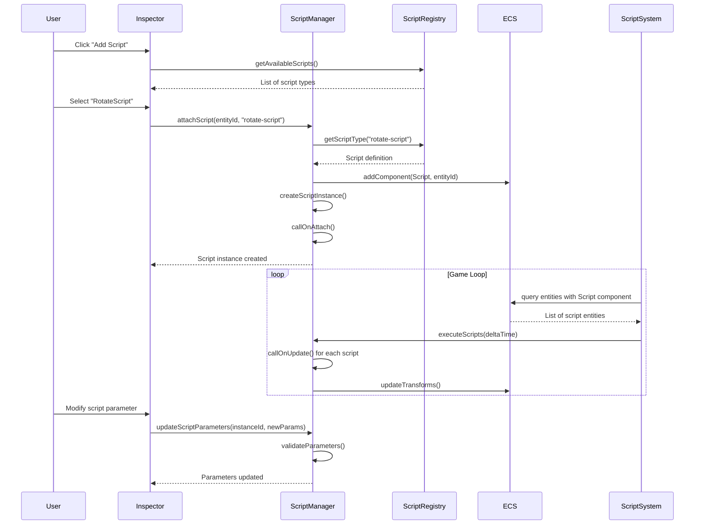

# Unity-Like Script System Implementation Plan

## Overview

### Context & Goals

- Implement Unity-style script attachment system allowing users to add custom behavior scripts to entities
- Create a visual script management interface in the inspector panel for adding, configuring, and removing scripts
- Support both TypeScript/JavaScript custom scripts and pre-built behavior components (MonoBehaviour equivalents)
- Enable real-time script compilation and hot-reloading for rapid iteration during development

### Current Pain Points

- No way to attach custom behavior logic to individual entities without modifying core code
- Behavior must be hardcoded into systems rather than being entity-specific and configurable
- No visual interface for managing entity-specific scripts and their parameters
- Difficult to create reusable behaviors that can be applied to multiple entities with different configurations
- No runtime script modification or parameter tweaking capabilities

## Proposed Solution

### High-level Summary

- Create Script ECS component to track attached scripts per entity
- Implement ScriptRegistry for managing available script types and their metadata
- Build visual script management UI in inspector panel with parameter configuration
- Support both React component-based scripts and traditional function-based behavior scripts
- Enable hot-reloading and real-time parameter updates for development workflow

### Architecture & Directory Structure

```
src/
├── core/
│   ├── lib/
│   │   ├── ecs.ts                          # Add Script component
│   │   ├── script-registry.ts              # Script type registration system
│   │   └── script-loader.ts                # Dynamic script loading and compilation
│   ├── systems/
│   │   ├── ScriptSystem.ts                 # Execute entity scripts each frame
│   │   └── ScriptHotReloadSystem.ts        # Hot-reload detection and updates
│   ├── hooks/
│   │   ├── useEntityScripts.ts             # Script management for entities
│   │   ├── useScriptRegistry.ts            # Available script types
│   │   └── useScriptParameters.ts          # Script parameter management
│   └── components/
│       └── scripts/
│           ├── ScriptContainer.tsx         # Wrapper for script execution
│           └── BuiltinScripts/
│               ├── CameraController.tsx    # Example camera script
│               ├── RotateScript.tsx        # Example rotation script
│               └── FollowTargetScript.tsx  # Example follow behavior
├── editor/
│   ├── components/
│   │   └── panels/
│   │       └── InspectorPanel/
│   │           ├── ScriptSection/
│   │           │   ├── ScriptSection.tsx   # Script management UI
│   │           │   ├── ScriptSelector.tsx  # Script type selector
│   │           │   ├── ScriptParameters.tsx # Parameter editor
│   │           │   └── ScriptItem.tsx      # Individual script display
│   │           └── InspectorPanelContent.tsx # Updated with script section
│   ├── hooks/
│   │   ├── useScriptEditor.ts              # Script editing state
│   │   └── useParameterValidation.ts       # Parameter validation
│   └── lib/
│       ├── script-serialization.ts         # Script data serialization
│       └── parameter-types.ts              # Parameter type definitions
├── game/
│   └── scripts/
│       ├── examples/
│       │   ├── PlayerController.ts         # Example game-specific script
│       │   ├── CollectibleBehavior.ts      # Example pickup behavior
│       │   └── EnemyAI.ts                  # Example AI script
│       └── templates/
│           ├── BaseScript.ts               # Base script interface
│           └── ScriptTemplates.ts          # Common script patterns
└── public/
    └── scripts/
        └── user-scripts/                   # User-created scripts directory
```

## Implementation Plan

### Phase 1: Core Script Infrastructure (2 days)

1. Add Script ECS component to track attached scripts per entity
2. Create ScriptRegistry for managing available script types
3. Implement base script interfaces and execution framework
4. Create ScriptSystem for running entity scripts each frame
5. Add script serialization support to scene system

### Phase 2: Script Management System (1.5 days)

1. Implement script loading and compilation system
2. Create parameter definition and validation framework
3. Add script hot-reloading capabilities for development
4. Implement script lifecycle management (onAttach, onDetach, onUpdate)
5. Create built-in script examples and templates

### Phase 3: Inspector Script Interface (2 days)

1. Build script management UI in inspector panel
2. Create script selector with categorized script types
3. Implement parameter editor with type-specific inputs
4. Add script reordering and enable/disable functionality
5. Create script debugging and error display

### Phase 4: Advanced Script Features (1.5 days)

1. Implement script communication system between entities
2. Add script event system for responding to game events
3. Create script performance profiling and monitoring
4. Add script versioning and migration support
5. Implement script sharing and import/export functionality

### Phase 5: Testing & Documentation (1 day)

1. Create comprehensive test suite for script system
2. Performance testing with multiple scripts per entity
3. Create script development documentation and examples
4. Add error handling and user feedback systems
5. Integration testing with existing game systems

## File and Directory Structures

### Core Script Component

```typescript
// src/core/lib/ecs.ts - New script component
export const Script = defineComponent({
  scriptIds: [Types.ui32, 8], // Array of script instance IDs (max 8 per entity)
  count: Types.ui8, // Number of attached scripts
  enabled: [Types.ui8, 8], // Enabled state for each script
  priority: [Types.ui8, 8], // Execution priority (0-255)
});

// Script instance storage
export const ScriptInstance = defineComponent({
  typeId: Types.ui32, // Reference to script type in registry
  entityId: Types.ui32, // Entity this script is attached to
  parameters: [Types.f32, 16], // Script parameter data
  state: [Types.ui8, 32], // Script internal state data
  lastUpdate: Types.f64, // Last update timestamp
});
```

### Script Registry System

```typescript
// src/core/lib/script-registry.ts
export interface IScriptType {
  id: string;
  name: string;
  description: string;
  category: string;
  parameters: IScriptParameter[];
  implementation: IScriptImplementation;
  version: string;
  dependencies?: string[];
}

export interface IScriptParameter {
  name: string;
  type: 'number' | 'string' | 'boolean' | 'vector3' | 'entity' | 'enum';
  defaultValue: any;
  min?: number;
  max?: number;
  options?: string[];
  description?: string;
}

export interface IScriptImplementation {
  onAttach?(entityId: number, params: any): void;
  onDetach?(entityId: number): void;
  onUpdate?(entityId: number, deltaTime: number, params: any): void;
  onEvent?(entityId: number, eventType: string, data: any): void;
}
```

### Script Execution System

```typescript
// src/core/systems/ScriptSystem.ts
export class ScriptSystem {
  private scriptInstances = new Map<number, IScriptRuntimeData>();

  execute(deltaTime: number): number {
    const scriptEntities = scriptQuery(world);
    let executedCount = 0;

    for (const entityId of scriptEntities) {
      const scriptCount = Script.count[entityId];

      for (let i = 0; i < scriptCount; i++) {
        if (!Script.enabled[entityId][i]) continue;

        const scriptId = Script.scriptIds[entityId][i];
        const instance = this.scriptInstances.get(scriptId);

        if (instance?.implementation.onUpdate) {
          try {
            instance.implementation.onUpdate(entityId, deltaTime, instance.parameters);
            executedCount++;
          } catch (error) {
            console.error(`Script error in entity ${entityId}:`, error);
          }
        }
      }
    }

    return executedCount;
  }
}
```

### Parameter Management

```typescript
// src/editor/lib/parameter-types.ts
export interface IParameterEditor {
  type: string;
  component: React.ComponentType<IParameterEditorProps>;
  validator: (value: any) => boolean;
  serializer: (value: any) => any;
  deserializer: (data: any) => any;
}

export const parameterEditors: Record<string, IParameterEditor> = {
  number: {
    type: 'number',
    component: NumberParameterEditor,
    validator: (value) => typeof value === 'number' && !isNaN(value),
    serializer: (value) => value,
    deserializer: (data) => parseFloat(data),
  },
  vector3: {
    type: 'vector3',
    component: Vector3ParameterEditor,
    validator: (value) => Array.isArray(value) && value.length === 3,
    serializer: (value) => value,
    deserializer: (data) => (Array.isArray(data) ? data : [0, 0, 0]),
  },
  // ... more parameter types
};
```

## Technical Details

### Script Instance Management

```typescript
// Script attachment and lifecycle management
export class ScriptManager {
  attachScript(entityId: number, scriptTypeId: string, parameters: any = {}): number {
    // Validate entity exists
    if (!hasComponent(world, Transform, entityId)) {
      throw new Error(`Entity ${entityId} does not exist`);
    }

    // Get script type from registry
    const scriptType = scriptRegistry.getType(scriptTypeId);
    if (!scriptType) {
      throw new Error(`Script type ${scriptTypeId} not found`);
    }

    // Create script instance
    const instanceId = this.createScriptInstance(scriptType, entityId, parameters);

    // Add to entity's script list
    this.addScriptToEntity(entityId, instanceId);

    // Call onAttach lifecycle
    if (scriptType.implementation.onAttach) {
      scriptType.implementation.onAttach(entityId, parameters);
    }

    return instanceId;
  }

  detachScript(entityId: number, instanceId: number): void {
    const instance = this.scriptInstances.get(instanceId);
    if (!instance) return;

    // Call onDetach lifecycle
    if (instance.scriptType.implementation.onDetach) {
      instance.scriptType.implementation.onDetach(entityId);
    }

    // Remove from entity
    this.removeScriptFromEntity(entityId, instanceId);

    // Clean up instance
    this.scriptInstances.delete(instanceId);
  }
}
```

### Hot-Reload System

```typescript
// src/core/systems/ScriptHotReloadSystem.ts
export class ScriptHotReloadSystem {
  private watchedFiles = new Set<string>();
  private fileHashes = new Map<string, string>();

  watch(scriptPath: string): void {
    this.watchedFiles.add(scriptPath);
    this.updateFileHash(scriptPath);
  }

  checkForChanges(): string[] {
    const changedFiles: string[] = [];

    for (const filePath of this.watchedFiles) {
      const currentHash = this.calculateFileHash(filePath);
      const previousHash = this.fileHashes.get(filePath);

      if (currentHash !== previousHash) {
        changedFiles.push(filePath);
        this.fileHashes.set(filePath, currentHash);
      }
    }

    return changedFiles;
  }

  reloadScript(scriptTypeId: string): void {
    // Recompile script
    const newImplementation = this.compileScript(scriptTypeId);

    // Update registry
    scriptRegistry.updateImplementation(scriptTypeId, newImplementation);

    // Restart all instances of this script type
    this.restartScriptInstances(scriptTypeId);
  }
}
```

### Parameter Validation

```typescript
// Parameter validation and type conversion
export function validateParameters(
  parameters: any,
  parameterDefinitions: IScriptParameter[],
): { isValid: boolean; errors: string[] } {
  const errors: string[] = [];

  for (const paramDef of parameterDefinitions) {
    const value = parameters[paramDef.name];

    // Check required parameters
    if (value === undefined && paramDef.defaultValue === undefined) {
      errors.push(`Required parameter '${paramDef.name}' is missing`);
      continue;
    }

    // Type validation
    if (value !== undefined) {
      const typeValidator = getTypeValidator(paramDef.type);
      if (!typeValidator(value)) {
        errors.push(`Parameter '${paramDef.name}' has invalid type`);
      }

      // Range validation for numbers
      if (paramDef.type === 'number' && typeof value === 'number') {
        if (paramDef.min !== undefined && value < paramDef.min) {
          errors.push(`Parameter '${paramDef.name}' below minimum value ${paramDef.min}`);
        }
        if (paramDef.max !== undefined && value > paramDef.max) {
          errors.push(`Parameter '${paramDef.name}' above maximum value ${paramDef.max}`);
        }
      }
    }
  }

  return { isValid: errors.length === 0, errors };
}
```

## Usage Examples

### Creating a Custom Script

```typescript
// src/game/scripts/examples/RotateScript.ts
import { IScriptImplementation, IScriptType } from '@core/lib/script-registry';
import { Transform } from '@core/lib/ecs';

export const RotateScript: IScriptType = {
  id: 'rotate-script',
  name: 'Rotate Object',
  description: 'Continuously rotates the object around specified axes',
  category: 'Animation',
  version: '1.0.0',
  parameters: [
    {
      name: 'rotationSpeed',
      type: 'vector3',
      defaultValue: [0, 45, 0],
      description: 'Rotation speed in degrees per second for each axis',
    },
    {
      name: 'useLocalSpace',
      type: 'boolean',
      defaultValue: true,
      description: 'Whether to rotate in local or world space',
    },
  ],
  implementation: {
    onUpdate(entityId: number, deltaTime: number, params: any): void {
      const speed = params.rotationSpeed || [0, 45, 0];
      const deltaRotation = speed.map((s: number) => s * deltaTime);

      // Apply rotation to transform
      Transform.rotation[entityId][0] += deltaRotation[0] * (Math.PI / 180);
      Transform.rotation[entityId][1] += deltaRotation[1] * (Math.PI / 180);
      Transform.rotation[entityId][2] += deltaRotation[2] * (Math.PI / 180);

      Transform.needsUpdate[entityId] = 1;
    },
  },
};
```

### Script Management in Inspector

```tsx
// src/editor/components/panels/InspectorPanel/ScriptSection/ScriptSection.tsx
export const ScriptSection: React.FC<{ entityId: number }> = ({ entityId }) => {
  const { scripts, addScript, removeScript, updateParameters } = useEntityScripts(entityId);
  const { availableScripts } = useScriptRegistry();

  return (
    <InspectorSection title="Scripts" icon={<FiCode />}>
      {scripts.map((script) => (
        <ScriptItem
          key={script.instanceId}
          script={script}
          onRemove={() => removeScript(script.instanceId)}
          onParameterChange={(params) => updateParameters(script.instanceId, params)}
        />
      ))}

      <ScriptSelector
        availableScripts={availableScripts}
        onSelect={(scriptTypeId) => addScript(scriptTypeId)}
      />
    </InspectorSection>
  );
};
```

### Script Communication

```typescript
// Script-to-script communication system
export class ScriptEventSystem {
  private eventListeners = new Map<string, Set<number>>();

  emit(eventType: string, data: any, targetEntityId?: number): void {
    const listeners = this.eventListeners.get(eventType) || new Set();

    for (const entityId of listeners) {
      if (targetEntityId && entityId !== targetEntityId) continue;

      // Call onEvent for all scripts on this entity
      const scriptCount = Script.count[entityId];
      for (let i = 0; i < scriptCount; i++) {
        const scriptId = Script.scriptIds[entityId][i];
        const instance = scriptManager.getInstance(scriptId);

        if (instance?.implementation.onEvent) {
          instance.implementation.onEvent(entityId, eventType, data);
        }
      }
    }
  }

  subscribe(entityId: number, eventType: string): void {
    if (!this.eventListeners.has(eventType)) {
      this.eventListeners.set(eventType, new Set());
    }
    this.eventListeners.get(eventType)!.add(entityId);
  }
}
```

## Testing Strategy

### Unit Tests

- Script registry management (register, unregister, query operations)
- Parameter validation for different parameter types
- Script lifecycle events (attach, detach, update)
- Script serialization and deserialization
- Hot-reload functionality and file watching

### Integration Tests

- Script execution within game loop with multiple entities
- Inspector UI for script management and parameter editing
- Scene save/load with script data preservation
- Script communication and event system functionality
- Performance testing with many scripts running simultaneously

## Edge Cases

| Edge Case                           | Remediation                                               |
| ----------------------------------- | --------------------------------------------------------- |
| Script compilation errors           | Catch and display errors in inspector; prevent attachment |
| Infinite loops in script execution  | Implement execution time limits and monitoring            |
| Script parameter type mismatches    | Robust validation and type conversion with fallbacks      |
| Memory leaks from script instances  | Proper cleanup in onDetach and garbage collection         |
| Hot-reload breaking running scripts | Graceful restart with state preservation where possible   |
| Script dependencies and load order  | Dependency graph resolution and ordered loading           |

## Sequence Diagram



## Risks & Mitigations

| Risk                                               | Mitigation                                                             |
| -------------------------------------------------- | ---------------------------------------------------------------------- |
| Script performance issues affecting game framerate | Implement execution time monitoring and script optimization guidelines |
| Complex script debugging and error tracking        | Create comprehensive logging system and script debugger interface      |
| Script versioning and compatibility problems       | Implement migration system and version checking                        |
| Security risks from user-provided scripts          | Sandbox script execution and validate script sources                   |
| Memory usage scaling with script complexity        | Monitor memory usage and implement script profiling tools              |

## Timeline

- **Phase 1 (Core Infrastructure):** 2 days
- **Phase 2 (Script Management):** 1.5 days
- **Phase 3 (Inspector Interface):** 2 days
- **Phase 4 (Advanced Features):** 1.5 days
- **Phase 5 (Testing & Documentation):** 1 day

**Total Estimated Time:** 8 days

## Acceptance Criteria

- Users can attach scripts to entities through the inspector interface
- Script parameters can be edited in real-time with immediate visual feedback
- Scripts execute correctly each frame without performance degradation
- Hot-reloading works for script development and testing
- Scene serialization preserves script data and parameters
- Script system supports at least 50 scripts running simultaneously
- Clear error messages for script compilation and runtime errors
- Script communication system enables entity-to-entity messaging
- Comprehensive documentation for script development
- Built-in script examples demonstrate common use cases

## Conclusion

This script system will provide Unity-like scripting capabilities to Vibe Coder 3D, enabling developers to create custom behaviors that can be attached to entities through a visual interface. The system balances ease of use with performance, providing both novice-friendly parameter editing and advanced features for experienced developers. The hot-reload capability and comprehensive error handling ensure a smooth development experience.

## Assumptions & Dependencies

- TypeScript/JavaScript compilation can be performed in-browser or via build system
- React component system can support dynamic parameter editing interfaces
- ECS system performance can handle script component updates each frame
- File watching capabilities available for hot-reload functionality
- Scene serialization system can be extended for script data
- No breaking changes to existing entity and component systems
