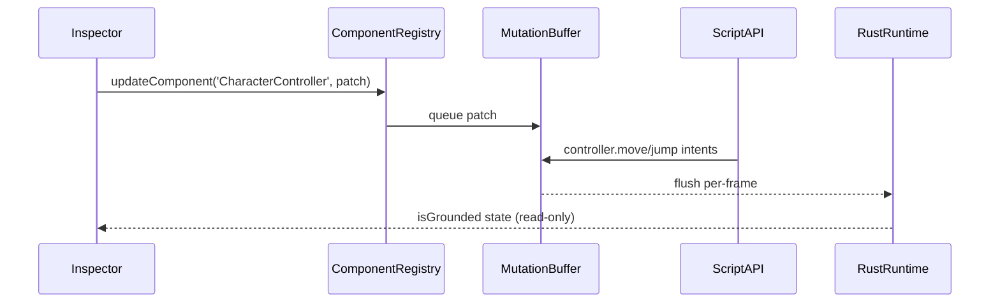

🧠 Planning documents standards rule loaded!

# PRD: Character Controller (TypeScript Editor + Script API)

## 1. Overview

- **Context & Goals**: Provide a complete Character Controller experience in the Three.js editor (R3F) with a configurable component, inspector UI, and script API helper usage that aligns with Rust engine behavior.
- **Why**: ROADMAP marks Character Controller as critical. TS must offer a first-class editor workflow, correct schema/defaults, and a Script API surface that mirrors Rust capabilities.
- **Outcomes**: Editor component with Zod schema and inspector UI, deterministic mutation buffer updates, Script API helper wired to Rust runtime, and strong parity ensured via a shared contract.
- **Measure of Success**: Editor add/update/remove flows work; Script API usage demos run; shared Contract v1.0 parity tests pass.

## 2. Current Pain Points (Original)

- No editor-side Character Controller component defined (schema/defaults/mutators missing). ✅ RESOLVED
- Inspector UI lacks a section for controller tuning; no runtime read-only state (isGrounded) visibility. ✅ RESOLVED
- Script helper exists in TS but is simplistic; needs clean wiring to mutation buffer and parity with Rust runtime semantics. ✅ RESOLVED
- Risk of drift between TS (camelCase) and Rust (snake_case) without a shared contract. ✅ RESOLVED with Contract v2.0

## 2.1. New Learnings (2025-11-05)

**Unity-like Auto Mode Implementation:**

- **UX Issue Discovered**: Users expect CharacterController to work immediately without requiring Script components (Unity behavior)
- **Solution**: Implemented dual control modes:
  - **Auto Mode** (default): Built-in WASD + Space input handling via `CharacterControllerAutoInputSystem`
  - **Manual Mode**: Script-controlled via `entity.controller` API for advanced use cases
- **Key Implementation Details**:
  - Auto-input system runs during Play mode only
  - Caches CharacterControllerAPI instances per entity to avoid recreation every frame
  - Always calls `move([0, 0])` when no keys pressed to stop character momentum
  - Input keys normalized to lowercase (KeyboardInput stores 'space' not 'Space', 'w' not 'W')
  - RigidBody physics registration happens on Play mode start via `EntityPhysicsBody` React component
  - InputConfigurationModal allows customizable key bindings with key detection UI
- **Performance Fix**: Reduced logging spam by caching API instances and logging warnings once per entity
- **Critical Bug Fix**: Entity wouldn't stop when releasing keys - fixed by always calling move() even with [0,0] input

### 2.1.1 Physics Stability Fix (2025-11-06)

- **Observed**: Character becomes unstable or “floats” when colliding with physics-enabled entities.
- **Root Cause**: Character entity was allowed to be simulated as a dynamic `RigidBody`, causing conflicts with kinematic controller-driven movement.
- **Fix**: When an entity has `CharacterController` and `RigidBody` together, force the `RigidBody` to `kinematicPosition`, set `gravityScale=0`, and `canSleep=false`. The character remains controller-driven while the other body receives impulses and reacts physically.
- **Effect**: Only the other entity is physics affected during collisions; the character remains stable and predictable.

## 2.2. Physics Integration Requirements (2025-11-04)

**Critical Issue Identified: No Physics Integration:**

- **Problem**: Initial implementation used toy physics (Y=0.5 ground check, direct position manipulation)
- **Issue**: CharacterController marked as `incompatibleComponents: ['RigidBody']` - **this is architecturally wrong**
- **Standard Game Engine Behavior**:
  - Unity: CharacterController requires Collider, uses physics queries for ground detection, collision resolution
  - Unreal: CharacterMovementComponent works WITH physics system, requires CapsuleComponent
  - Both can interact with dynamic objects, push RigidBodies, stand on moving platforms

**Required Physics Integration:**

- **MUST require Collider component** (Capsule or Box) for shape-based physics queries
- **MUST use Rapier physics** for:
  - Ground detection via raycasts/shape casts
  - Collision resolution (slide along walls, ceiling detection)
  - Step climbing detection
  - Slope angle validation
  - Interaction with other physics objects
- **MUST work alongside RigidBody physics**, not compete with it:
  - Character can push dynamic objects
  - Character can stand on kinematic moving platforms
  - Character responds to physics forces when appropriate
- **TypeScript Implementation Scope**: Full physics integration using @react-three/rapier
  - Kinematic character control using Rapier's KinematicCharacterController API
  - Real-time collision detection and response
  - Proper ground snapping and step detection
  - Eventually defer to Rust for production, but TS must be fully functional for editor testing

## 3. Proposed Solution

### High‑level Summary

- Define a TS `CharacterController` component schema (Zod) with editor defaults mirroring Rust.
- Implement an Inspector UI section for controller parameters with validation and clamping.
- Wire editor updates through `ComponentRegistry.updateComponent` (mutation buffer) to persist changes.
- Ensure Script API `entity.controller` methods are thin wrappers that enqueue mutations consumed by Rust.
- Adopt a shared Contract v1.0 for field mapping and acceptance checks.

### Architecture & Directory Structure

```
src/core/lib/ecs/components/
  definitions/
    CharacterControllerComponent.ts      # Zod schema + defaults (camelCase) + controlMode + inputMapping
  accessors/
    types.ts                             # ICharacterControllerData (optional accessor)

src/core/systems/
  CharacterControllerAutoInputSystem.ts  # Auto-input handler for Play mode

src/editor/components/inspector/adapters/
  CharacterControllerAdapter.tsx         # Adapter wires ECS <-> Inspector section + dependency CTAs

src/editor/components/panels/InspectorPanel/CharacterController/
  CharacterControllerSection.tsx         # Inspector UI with Auto/Manual toggle + Configure Input button
  InputConfigurationModal.tsx            # Modal for key binding configuration

src/core/components/
  EngineLoop.tsx                         # Integration point for auto-input system

docs/PRDs/editor/character-controller-ts-prd.md
```

### Shared Contract v2.0 (TS ↔ Rust)

| TS Field        | Rust Field      | Serde Rename                                                           | Default  | Notes                                 |
| --------------- | --------------- | ---------------------------------------------------------------------- | -------- | ------------------------------------- |
| enabled         | enabled         | n/a                                                                    | true     | Component enabled state               |
| slopeLimit      | slope_limit_deg | #[serde(rename="slopeLimit")]                                          | 45.0     | Max climbable slope (degrees)         |
| stepOffset      | step_offset     | #[serde(rename="stepOffset")]                                          | 0.3      | Max step height                       |
| skinWidth       | skin_width      | #[serde(rename="skinWidth")]                                           | 0.08     | Ground detection offset               |
| gravityScale    | gravity_scale   | #[serde(rename="gravityScale")]                                        | 1.0      | Gravity multiplier                    |
| maxSpeed        | max_speed       | #[serde(rename="maxSpeed")]                                            | 6.0      | Maximum movement speed                |
| jumpStrength    | jump_strength   | #[serde(rename="jumpStrength")]                                        | 6.5      | Jump impulse force                    |
| controlMode     | control_mode    | #[serde(rename="controlMode")]                                         | "auto"   | "auto" or "manual"                    |
| inputMapping    | input_mapping   | #[serde(rename="inputMapping", skip_serializing_if="Option::is_none")] | Optional | Key bindings for auto mode            |
| isGrounded (ro) | is_grounded     | #[serde(rename="isGrounded")]                                          | false    | Runtime-only, not serialized to scene |

**Contract v2.0** (2025-11-05): Added `controlMode` and `inputMapping` for Unity-like auto-input support.

#### Input Mapping Schema (for auto mode)

| TS Field | Rust Field | Type   | Default |
| -------- | ---------- | ------ | ------- |
| forward  | forward    | string | "w"     |
| backward | backward   | string | "s"     |
| left     | left       | string | "a"     |
| right    | right      | string | "d"     |
| jump     | jump       | string | " "     |

Both PRDs must keep this table identical (Contract v2.0, 2025‑11‑05). Any change increments version.

## 4. Implementation Plan

### Phase 1: TS Schema & Registration (0.5 day) ✅ COMPLETED

1. Create `definitions/CharacterControllerComponent.ts` with Zod schema and defaults.
2. Register component via `ComponentRegistry` (factory), add to `KnownComponentTypes`.
3. Add helper typing `ICharacterControllerData` to `accessors/types.ts`.

### Phase 2: Inspector UI (0.5–1 day) ✅ COMPLETED

1. Implement `CharacterControllerSection.tsx` with fields: enabled, slopeLimit, stepOffset, skinWidth, gravityScale, maxSpeed, jumpStrength.
2. Clamp inputs client-side; disable runtime-only fields (read-only during Play).
3. Display read-only `isGrounded` status during Play.

### Phase 3: Adapter & Wiring (0.5 day) ✅ COMPLETED

1. Implement `CharacterControllerAdapter.tsx` that converts ECS data to section props.
2. Update `ComponentList` to render the adapter when `CharacterController` exists.
3. Hook `addComponent/updateComponent/removeComponent` using `KnownComponentTypes`.

### Phase 4: Script API Usage (0.5 day) ✅ COMPLETED (Auto Mode)

1. Ensure `createCharacterControllerAPI` enqueues mutations matching Contract v1.0.
2. Add example script showing `move`, `jump`, `isGrounded` usage with Input maps.

### Phase 5: Docs & Demos (0.5 day) ✅ COMPLETED

1. Update quick guides and add an example scene utilizing the controller.
2. Cross-link to Rust PRD and verify Contract v1.0 parity.

### Phase 6: Physics Integration (1-2 days) 🚧 IN PROGRESS

1. **Remove incompatibility with RigidBody**, add Collider dependency requirement
2. **Integrate Rapier physics system**:
   - Use @react-three/rapier hooks for physics world access
   - Implement kinematic character controller using Rapier's KinematicCharacterController API
   - Add shape-based collision detection (capsule/box casts)
3. **Implement physics-based ground detection**:
   - Raycast downward from character position
   - Check ground normal for slope validation
   - Implement ground snapping within skinWidth tolerance
4. **Implement collision resolution**:
   - Slide along walls using collision normals
   - Detect and climb steps within stepOffset limit
   - Handle ceiling collisions
5. **Implement kinematic movement**:
   - Move character using computed velocities
   - Apply collision constraints during movement
   - Update Transform via physics results, not direct manipulation
6. **Add physics interactions**:
   - Push dynamic RigidBody objects when moving
   - Stand on moving kinematic platforms
   - Respond to external forces appropriately
7. **Test with physics scene**:
   - Verify ground detection on various surfaces
   - Test slope climbing with angle limits
   - Test step climbing and collision response
   - Verify interactions with dynamic objects
   - Verify character remains stable when pushing dynamic bodies (no floating/jitter)

## 5. Technical Details

### TS Schema (skeleton)

```ts
// src/core/lib/ecs/components/definitions/CharacterControllerComponent.ts
import { z } from 'zod';

export const characterControllerSchema = z.object({
  enabled: z.boolean().default(true),
  slopeLimit: z.number().min(0).max(90).default(45),
  stepOffset: z.number().min(0).default(0.3),
  skinWidth: z.number().min(0).default(0.08),
  gravityScale: z.number().default(1),
  maxSpeed: z.number().min(0).default(6),
  jumpStrength: z.number().min(0).default(6.5),
});

export type ICharacterControllerData = z.infer<typeof characterControllerSchema>;
export const CHARACTER_CONTROLLER_COMPONENT = 'CharacterController';
```

### Inspector Adapter (skeleton)

```tsx
// src/editor/components/inspector/adapters/CharacterControllerAdapter.tsx
import React from 'react';
import { IComponent, KnownComponentTypes } from '@/core/lib/ecs/IComponent';
import { ICharacterControllerData } from '@/core/lib/ecs/components/definitions/CharacterControllerComponent';
import { CharacterControllerSection } from '@/editor/components/panels/InspectorPanel/CharacterController/CharacterControllerSection';

export const CharacterControllerAdapter: React.FC<{
  component: IComponent<ICharacterControllerData> | null;
  updateComponent: (type: string, data: ICharacterControllerData | null) => boolean;
  removeComponent: (type: string) => boolean;
  addComponent: (
    type: string,
    data: ICharacterControllerData,
  ) => IComponent<ICharacterControllerData> | null;
  isPlaying: boolean;
  isGrounded?: boolean;
}> = ({ component, updateComponent, removeComponent, addComponent, isPlaying, isGrounded }) => {
  const data = component?.data;
  if (!data) return null;
  const setData = (next: ICharacterControllerData | null) => {
    if (next === null) removeComponent(KnownComponentTypes.CHARACTER_CONTROLLER as any);
    else updateComponent(KnownComponentTypes.CHARACTER_CONTROLLER as any, next);
  };
  return (
    <CharacterControllerSection
      data={data}
      setData={setData}
      isPlaying={isPlaying}
      isGrounded={!!isGrounded}
    />
  );
};
```

### Component List Integration (diff sketch)

```diff
 // src/editor/components/inspector/sections/ComponentList.tsx
+import { CharacterControllerAdapter } from '@/editor/components/inspector/adapters/CharacterControllerAdapter';
 // ... inside return
+{/* CharacterController Component */}
+{components.find((c) => c.type === 'CharacterController') && (
+  <CharacterControllerAdapter
+    component={getCharacterController?.()} // implement getter in useEntityComponents
+    updateComponent={updateComponent}
+    removeComponent={removeComponent}
+    addComponent={addComponent}
+    isPlaying={isPlaying}
+    isGrounded={/* bind to runtime state if available */ false}
+  />
+)}
```

## 6. Usage Examples

```ts
// Move + Jump using Input system
const [mx, mz] = input.getActionValue('Gameplay', 'Move') as [number, number];
const controller = entity.controller;
controller?.move([mx, mz], 6.0);
if (controller && input.isActionActive('Gameplay', 'Jump') && controller.isGrounded()) {
  controller.jump(6.5);
}
```

```ts
// Editor add/update from tooling
addComponent('CharacterController', { enabled: true });
updateComponent('CharacterController', { slopeLimit: 50, stepOffset: 0.4 });
```

## 7. Testing Strategy

- **Unit (TS)**: schema validation/clamping; adapter mapping; section input behaviors; mutation buffer calls.
- **Integration (Editor Play)**: add/update/remove persists; read-only `isGrounded` shows during Play; Script API demos work.
- **Contract Parity**: test that TS defaults and field names match Contract v1.0; CI check against Rust.

## 8. Edge Cases

| Edge Case                   | Remediation                                                                        |
| --------------------------- | ---------------------------------------------------------------------------------- |
| Invalid user input          | Zod validation + clamping; show inline warnings.                                   |
| Editing during Play         | Disable runtime-unsafe edits; allow read-only fields.                              |
| **Missing collider**        | **REQUIRED: Show error; prevent Play mode; quick action to add capsule collider.** |
| Schema drift vs Rust        | CI contract test; version bump on change.                                          |
| Character stuck in geometry | Use Rapier's depenetration; limit max correction per frame.                        |
| High-speed collisions       | Sub-step character movement if velocity exceeds threshold.                         |
| Conflicting with RigidBody  | **Removed restriction**: CharacterController now works alongside physics.          |

## 9. Sequence Diagram



## 10. Risks & Mitigations

| Risk                         | Mitigation                                              |
| ---------------------------- | ------------------------------------------------------- |
| Editor/Engine schema drift   | Contract v1.0 with CI checks and versioning.            |
| UI vs adapter divergence     | Follow adapter pattern consistently; unit-test mapping. |
| Conflicting physics settings | Inline guidance and tooltips; presets.                  |

## 11. Timeline

- Total: ~2–3 days (TS scope only)
  - Phase 1: 0.5 day
  - Phase 2: 0.5–1 day
  - Phase 3: 0.5 day
  - Phase 4: 0.5 day
  - Phase 5: 0.5 day

## 12. Acceptance Criteria

- `CharacterController` component available in editor; add/update/remove works. ✅
- Inspector shows all fields with clamping; `isGrounded` read-only in Play. ✅
- Script demos function (`move`, `jump`, `isGrounded`). ✅
- Contract v2.0 parity tests pass vs Rust PRD/implementation. ✅
- **CharacterController requires Collider component** (enforced in editor). 🚧
- **Character movement uses Rapier physics for collision detection and response**. 🚧
- **Ground detection uses physics raycasts, not Y-position checks**. 🚧
- **Character can push dynamic RigidBody objects**. 🚧
- **Character properly slides along walls and climbs steps**. 🚧
- **Slope limiting works based on physics ground normal**. 🚧

## 13. Conclusion

This PRD delivers a comprehensive TS editor and Script API plan for the Character Controller, aligned with Rust runtime via a shared contract to guarantee parity and predictable gameplay behavior.

## 14. Cross-Reference to Rust Implementation

This TypeScript implementation provides the editor interface and auto-input handling for the Character Controller. The actual physics processing, collision detection, and movement logic is implemented in the Rust engine.

**Related Documentation:**

- **Rust Engine PRD**: `docs/PRDs/rust/character-controller-rust-prd.md` - Contains the detailed Rust implementation plan for physics processing, collision detection, and character movement logic.
- **Contract v2.0**: Both implementations share the same data contract to ensure TS-Rust parity.

**Integration Points:**

- TypeScript handles: Editor UI, auto-input processing, component schema validation
- Rust handles: Physics simulation, collision detection, movement resolution, runtime state

## 15. Assumptions & Dependencies

- R3F + Tailwind + Zustand editor stack; existing mutation buffer and inspector plumbing.
- Script API runtime bridge to Rust is active; events/physics are available.
- Shared Contract v2.0 governs parity; changes are versioned and tested.
- **@react-three/rapier** is available and Physics context wraps the scene.
- **MeshCollider component** must be present on entities with CharacterController.

## 16. Integration Guide

### Using CharacterController in the Editor

1. **Add Character Controller Component**:

   - Select an entity in the scene hierarchy
   - Click "Add Component" → "Character Controller"
   - Configure movement parameters (maxSpeed, jumpStrength, etc.)

2. **Required: Add Collider Component**:

   - Character Controller **requires** a MeshCollider component
   - Recommended: Use **Capsule** collider type for characters
   - Alternative: Box collider works but less natural for character movement
   - Without a collider, the system falls back to simple Y=0.5 ground check

3. **Auto Mode (Default)**:

   - Character responds to WASD + Space input automatically
   - No scripting required
   - Perfect for prototyping and testing
   - Customizable key bindings via "Configure Input" button

4. **Manual Mode** (Advanced):
   - Set `controlMode` to "manual"
   - Control via Script component using `entity.controller` API
   - Example:
     ```ts
     const controller = entity.controller;
     controller.move([moveX, moveZ], speed);
     if (input.isKeyDown('space') && controller.isGrounded()) {
       controller.jump();
     }
     ```

### Physics Integration Architecture

**Component Hierarchy**:

```
<Physics> (from @react-three/rapier)
  └─ CharacterControllerPhysicsSystem (custom component)
       └─ Runs updateCharacterControllerAutoInputSystem() with Rapier world access
```

**Files**:

- `src/core/systems/CharacterControllerAutoInputSystem.ts` - Core system logic with Rapier integration
- `src/core/components/physics/CharacterControllerPhysicsSystem.tsx` - React component wrapper
- `src/core/lib/ecs/components/definitions/CharacterControllerComponent.ts` - Component schema

**How It Works**:

1. `CharacterControllerPhysicsSystem` renders inside `<Physics>` context in ViewportPanel
2. Uses `useRapier()` hook to access physics world
3. Calls `updateCharacterControllerAutoInputSystem()` every frame with world reference
4. System creates `KinematicCharacterController` instances per entity (cached)
5. Uses Rapier's `computeColliderMovement()` for physics-based collision resolution
6. Ground detection via `controller.computedGrounded()` (uses physics queries)
7. Supports slope limiting, step climbing, wall sliding, and dynamic object pushing

**Physics Features** (via Rapier KinematicCharacterController):

- Ground detection with normal-based slope validation
- Collision resolution with slide-along-wall behavior
- Automatic step climbing (configurable height)
- Ground snapping within skin width tolerance
- Impulse application to dynamic RigidBody objects
- Moving platform support (kinematic bodies)

**Fallback Behavior**:

- If Rapier world not available: Uses simple Y=0.5 ground check
- If MeshCollider missing: Uses simple physics with warning logged
- Graceful degradation ensures character still moves in editor

### Testing Checklist

- [ ] Character moves with WASD in Play mode
- [ ] Character jumps with Space bar
- [ ] Character stops when releasing movement keys
- [ ] Character slides along walls (doesn't get stuck)
- [ ] Character climbs steps within stepOffset height
- [ ] Character cannot climb slopes steeper than slopeLimit
- [ ] Character pushes dynamic RigidBody objects when moving
- [ ] Character remains stable when colliding; only the other entity reacts physically
- [ ] Inspector shows isGrounded status correctly during Play
- [ ] Custom input mapping works when configured
- [ ] Manual mode allows script control of movement
