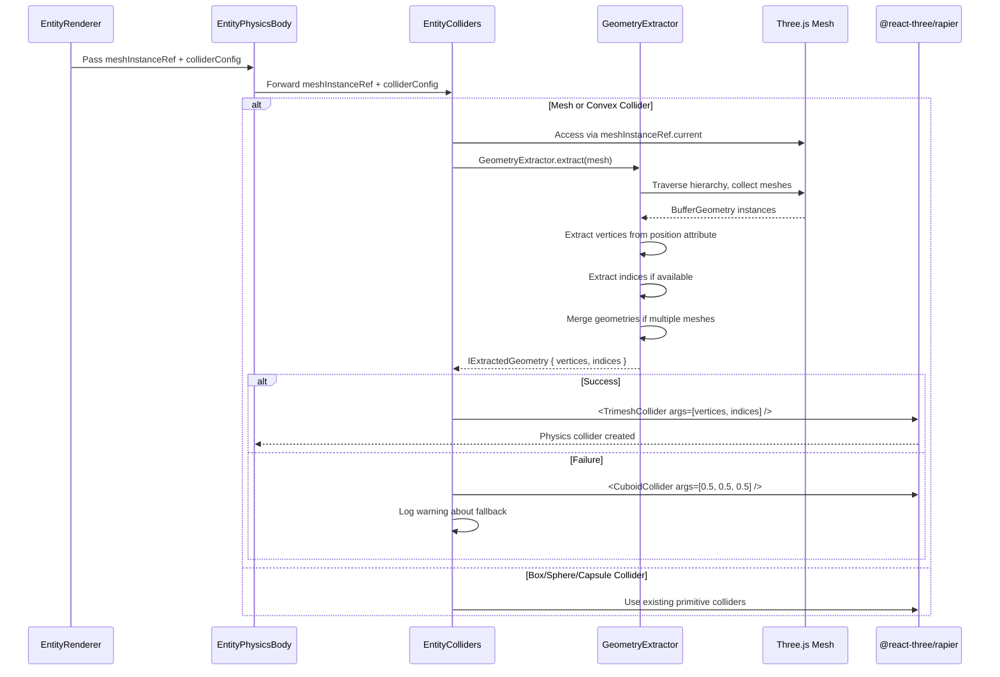

# Mesh Collider Geometry Extraction PRD

## Overview

### Context & Goals

- Enable mesh and convex colliders to automatically extract geometry from entity shapes instead of using hardcoded placeholder colliders
- Provide accurate physics collision detection that matches visual mesh geometry for walls, terrain, custom shapes, and models
- Eliminate the current mismatch where a 2×1×0.1 wall uses a 0.5×0.5×0.5 collider cube
- Improve physics accuracy and developer experience by making colliders "just work" with entity geometry

### Current Pain Points

- **CRITICAL BUG: Mesh/Convex Colliders Completely Broken**: The system has TWO collider generation methods (automatic and manual), but NEITHER works for mesh/convex types
  - **Automatic colliders** (`RigidBody.colliders="hull"/"trimesh"`) are **disabled** when `hasCustomColliders=true` (EntityPhysicsBody.tsx:151-158)
  - **Manual colliders** (EntityColliders component) only render a **hardcoded placeholder** cuboid (EntityColliders.tsx:112-114)
  - Result: User selects "mesh" or "convex" → gets tiny 0.5×0.5×0.5 cuboid regardless of actual geometry
- **Geometry Mismatch**: Visual shape doesn't match physics shape (e.g., Wall entity is 2×1×0.1 visually but has 0.5×0.5×0.5 collider)
- **No Geometry Access**: EntityColliders component receives colliderConfig but not the meshInstanceRef needed to extract geometry
- **Automatic Colliders Can't Work**: @react-three/rapier automatic colliders require mesh as direct RigidBody child, but current architecture has: `RigidBody > EntityPhysicsBody > EntityMesh` (nested too deep)
- **Poor User Experience**: Inspector UI shows "mesh colliders use the entity's mesh geometry" but this feature has never worked

### Why This Bug Exists

The codebase has two competing approaches:

**Approach 1: Automatic Colliders** (Never Implemented)

- Use `<RigidBody colliders="hull">` or `<RigidBody colliders="trimesh">`
- @react-three/rapier automatically generates colliders from mesh children
- **Blocker**: Requires mesh as direct child, but EntityMesh is nested too deep
- **Status**: Currently disabled by `hasCustomColliders` check

**Approach 2: Manual Colliders** (Started but Never Finished)

- Explicitly render `<TrimeshCollider>` or `<ConvexHullCollider>` as RigidBody children
- Requires extracting vertices/indices from mesh geometry
- **Blocker**: EntityColliders component only has placeholder implementation
- **Status**: Returns hardcoded cuboid for all mesh/convex types

The code chose Approach 2 (manual colliders) by disabling automatic colliders, but never implemented the geometry extraction logic.

## Proposed Solution

### High-level Summary

- **Complete the Manual Collider Approach**: Implement the missing geometry extraction logic that was always intended but never finished
- Pass `meshInstanceRef` from EntityRenderer → EntityPhysicsBody → EntityColliders to provide geometry access
- Implement `GeometryExtractor` utility that traverses Three.js mesh hierarchies and collects vertices/indices
- Create `TrimeshCollider` for mesh type using extracted geometry (Float32Array vertices + Uint32Array indices)
- Create `ConvexHullCollider` for convex type using extracted vertices
- Handle edge cases: groups, custom shapes, terrain, LOD models, empty geometry, non-indexed geometry
- Add proper error handling and fallback to cuboid when geometry extraction fails
- **Why Manual Over Automatic**: Manual colliders work with nested component hierarchies, complex shapes, and give full control over geometry processing

### Architecture & Directory Structure

```

The extractor exposes options such as `applyWorldTransform`, `includeChildren`, and `mergeVertices` so it can serve both localized meshes and world-space hierarchies. When `applyWorldTransform` is enabled, `mesh.updateWorldMatrix(true, false)` should run before extraction so the per-mesh `matrixWorld` is fresh, then a shared `Matrix4`/`Vector3` pair can be used to bake the transform into each vertex. The `mergeVertices` flag can use `three/examples/jsm/utils/BufferGeometryUtils.mergeVertices` to collapse duplicated positions that are common in exported GLTFs, which keeps us under the `maxVertices` safety limit and inside Rapier's 32-bit index budget.
/src/
├── core/
│   └── lib/
│       └── physics/
│           ├── geometry/
│           │   ├── GeometryExtractor.ts          # NEW: Geometry extraction utilities
│           │   ├── __tests__/
│           │   │   └── GeometryExtractor.test.ts # NEW: Unit tests for extraction
│           │   └── types.ts                      # NEW: Extracted geometry types
│           └── CLAUDE.md                         # UPDATED: Document extraction patterns
├── editor/
│   └── components/
│       └── panels/
│           └── ViewportPanel/
│               ├── EntityRenderer.tsx            # UPDATED: Pass meshInstanceRef
│               └── components/
│                   ├── EntityPhysicsBody.tsx     # UPDATED: Forward meshInstanceRef
│                   └── EntityColliders.tsx       # UPDATED: Extract and use geometry
└── docs/
    └── PRDs/
        └── editor/
            └── mesh-collider-geometry-extraction-prd.md  # THIS FILE
```

## Current State Deep Dive

### Code Flow Analysis

**1. User Selects Mesh/Convex Collider**

```typescript
// src/editor/components/panels/InspectorPanel/MeshCollider/MeshColliderSection.tsx
<ComponentField
  label="Collider Type"
  value={meshCollider.colliderType}
  onChange={(value) => updateMeshCollider({ colliderType: value as ColliderType })}
  options={[
    { value: 'mesh', label: 'Mesh Collider' },      // User selects this
    { value: 'convex', label: 'Convex Hull' },      // Or this
  ]}
/>
```

**2. useEntityColliders Hook Maps Types**

```typescript
// src/editor/components/panels/ViewportPanel/hooks/useEntityColliders.ts:14-25
const colliderType = useMemo(() => {
  const meshColliderData = meshCollider?.data as IMeshColliderData | undefined;
  if (meshColliderData && meshColliderData.enabled) {
    switch (meshColliderData.colliderType) {
      case 'convex':
        return 'hull'; // Maps to automatic collider type
      case 'mesh':
        return 'trimesh'; // Maps to automatic collider type
    }
  }
}, [meshCollider?.data, meshType]);

// Returns: hasCustomColliders = !!colliderConfig = true
```

**3. EntityPhysicsBody Disables Automatic Colliders**

```typescript
// src/editor/components/panels/ViewportPanel/components/EntityPhysicsBody.tsx:151-158
<RigidBody
  colliders={
    enhancedColliderConfig?.type === 'heightfield'
      ? false
      : hasCustomColliders || hasEffectiveCustomColliders
        ? false  // BUG: Disables automatic generation!
        : (colliderType as any)  // Would be 'hull' or 'trimesh'
  }
>
```

**4. EntityColliders Returns Placeholder**

```typescript
// src/editor/components/panels/ViewportPanel/components/EntityColliders.tsx:112-114
{(type === 'convex' || type === 'mesh') && (
  <CuboidCollider args={[0.5, 0.5, 0.5]} position={center} sensor={isTrigger} />
  // BUG: Hardcoded cuboid instead of extracting geometry!
)}
```

### What Should Happen vs What Actually Happens

| Step                              | Expected Behavior                           | Actual Behavior          | Result         |
| --------------------------------- | ------------------------------------------- | ------------------------ | -------------- |
| User selects "mesh"               | Extract geometry, create TrimeshCollider    | Returns hardcoded cuboid | ❌ Broken      |
| User selects "convex"             | Extract vertices, create ConvexHullCollider | Returns hardcoded cuboid | ❌ Broken      |
| Wall (2×1×0.1) with mesh collider | Collider matches visual (2×1×0.1)           | Gets 0.5×0.5×0.5 cuboid  | ❌ Wrong size  |
| Sphere with convex collider       | Convex hull of sphere vertices              | Gets 0.5×0.5×0.5 cuboid  | ❌ Wrong shape |

### Why Automatic Colliders Won't Work

@react-three/rapier's automatic colliders work by traversing direct children:

```typescript
// How @react-three/rapier automatic colliders work:
<RigidBody colliders="trimesh">
  <mesh geometry={geometry} /> {/* ✅ Direct child - works */}
</RigidBody>

// Current architecture:
<RigidBody colliders="trimesh">  {/* But colliders is set to false! */}
  <EntityColliders />            {/* Not a mesh */}
  <EntityMesh>                   {/* Contains mesh but nested too deep */}
    <mesh />                     {/* ❌ Not a direct child - won't work */}
  </EntityMesh>
</RigidBody>
```

Even if we enabled automatic colliders (`colliders="trimesh"`), they wouldn't find the mesh geometry because it's nested inside EntityMesh component. The only solution is manual colliders with explicit geometry extraction.

## Implementation Plan

### Phase 1: Geometry Extraction Infrastructure (0.75 day)

1. Create `src/core/lib/physics/geometry/types.ts` with TypeScript interfaces
2. Implement `GeometryExtractor.ts` with vertex/index extraction from Three.js meshes
3. Handle edge cases: Groups, BufferGeometry, non-indexed geometry, empty meshes
4. Write comprehensive unit tests covering all geometry types (Cube, Sphere, Wall, Terrain, CustomShape)
5. Document extraction patterns in `src/core/lib/physics/CLAUDE.md`

### Phase 2: Component Integration (0.5 day)

1. Update `EntityRenderer.tsx` to pass meshInstanceRef to EntityPhysicsBody
2. Update `EntityPhysicsBody.tsx` to forward meshInstanceRef to EntityColliders
3. Update `EntityColliders.tsx` interface to accept optional meshInstanceRef prop
4. Ensure prop threading doesn't break existing functionality (backwards compatible)

### Phase 3: Collider Implementation (0.75 day)

1. Implement mesh collider case using TrimeshCollider with extracted vertices/indices
2. Implement convex collider case using ConvexHullCollider with extracted vertices
3. Add proper error handling with fallback to hardcoded cuboid on extraction failure
4. Optimize geometry extraction to run only once per collider creation (memoization)
5. Add warning logs when geometry extraction fails or falls back

### Phase 4: Testing & Validation (0.5 day)

1. Create integration test with Wall entity verifying collider matches geometry
2. Test with various mesh types: Cube, Sphere, Wall, Terrain, CustomShape, GLTF models
3. Test LOD model switching to ensure colliders update correctly
4. Validate performance impact of geometry extraction (should be negligible, one-time cost)
5. Test error cases: missing geometry, empty geometry, non-renderable entities

## File and Directory Structures

### New Directory Structure

```
/src/core/lib/physics/
├── geometry/
│   ├── GeometryExtractor.ts
│   ├── types.ts
│   └── __tests__/
│       └── GeometryExtractor.test.ts
├── character/
│   ├── CharacterMotor.ts
│   ├── KinematicBodyController.ts
│   └── ColliderRegistry.ts
└── CLAUDE.md
```

## Technical Details

### Core Types (`src/core/lib/physics/geometry/types.ts`)

```typescript
import type { BufferGeometry, Group, Mesh, Object3D } from 'three';

/**
 * Extracted geometry data for physics colliders
 */
export interface IExtractedGeometry {
  /** Vertex positions as flat Float32Array [x1, y1, z1, x2, y2, z2, ...] */
  vertices: Float32Array;
  /** Triangle indices (if indexed geometry) */
  indices?: Uint32Array;
  /** Number of vertices */
  vertexCount: number;
  /** Number of triangles */
  triangleCount: number;
  /** Whether geometry is indexed */
  isIndexed: boolean;
  /** Source mesh count (for groups) */
  meshCount: number;
}

/**
 * Options for geometry extraction
 */
export interface IGeometryExtractionOptions {
  /** Apply world transforms to vertices (default: false) */
  applyWorldTransform?: boolean;
  /** Include children of groups (default: true) */
  includeChildren?: boolean;
  /** Maximum vertices to extract (safety limit, default: 100000) */
  maxVertices?: number;
  /** Merge vertices within epsilon (default: false) */
  mergeVertices?: boolean;
  /** Epsilon for vertex merging (default: 0.0001) */
  mergeEpsilon?: number;
}

/**
 * Result of geometry extraction attempt
 */
export interface IGeometryExtractionResult {
  success: boolean;
  geometry?: IExtractedGeometry;
  error?: string;
  warnings?: string[];
}
```

### Geometry Extractor (`src/core/lib/physics/geometry/GeometryExtractor.ts`)

```typescript
import { BufferGeometry, Group, Mesh, Object3D, Vector3, Matrix4 } from 'three';
import { Logger } from '@core/lib/logger';
import type {
  IExtractedGeometry,
  IGeometryExtractionOptions,
  IGeometryExtractionResult,
} from './types';

const logger = Logger.create('GeometryExtractor');

/**
 * Extracts vertices and indices from Three.js mesh for physics colliders
 */
export class GeometryExtractor {
  /**
   * Extract geometry from a mesh or group
   */
  static extract(
    object: Mesh | Group | Object3D | null,
    options: IGeometryExtractionOptions = {},
  ): IGeometryExtractionResult {
    const opts = {
      applyWorldTransform: false,
      includeChildren: true,
      maxVertices: 100000,
      mergeVertices: false,
      mergeEpsilon: 0.0001,
      ...options,
    };

    if (!object) {
      return {
        success: false,
        error: 'Null or undefined mesh object',
      };
    }

    try {
      // Collect all meshes from object hierarchy
      const meshes = this.collectMeshes(object, opts.includeChildren);

      if (meshes.length === 0) {
        return {
          success: false,
          error: 'No meshes found in object hierarchy',
        };
      }

      // Extract and merge geometry from all meshes
      const geometry = this.mergeGeometries(meshes, opts);

      if (geometry.vertexCount === 0) {
        return {
          success: false,
          error: 'Extracted geometry has no vertices',
        };
      }

      if (geometry.vertexCount > opts.maxVertices) {
        logger.warn('Extracted geometry exceeds maxVertices limit', {
          vertexCount: geometry.vertexCount,
          maxVertices: opts.maxVertices,
        });
        return {
          success: false,
          error: `Geometry too large: ${geometry.vertexCount} vertices (max: ${opts.maxVertices})`,
        };
      }

      return {
        success: true,
        geometry,
        warnings: geometry.meshCount > 1 ? [`Merged ${geometry.meshCount} meshes`] : undefined,
      };
    } catch (error) {
      logger.error('Geometry extraction failed', { error });
      return {
        success: false,
        error: error instanceof Error ? error.message : String(error),
      };
    }
  }

  /**
   * Collect all meshes from an object and its children
   */
  private static collectMeshes(object: Object3D, includeChildren: boolean): Mesh[] {
    const meshes: Mesh[] = [];

    if ('isMesh' in object && object.isMesh) {
      meshes.push(object as Mesh);
    }

    if (includeChildren) {
      object.traverse((child) => {
        if ('isMesh' in child && child.isMesh && child !== object) {
          meshes.push(child as Mesh);
        }
      });
    }

    return meshes;
  }

  /**
   * Merge geometries from multiple meshes into a single collider geometry
   */
  private static mergeGeometries(
    meshes: Mesh[],
    options: IGeometryExtractionOptions,
  ): IExtractedGeometry {
    const vertexArrays: Float32Array[] = [];
    const indexArrays: Uint32Array[] = [];
    let totalVertices = 0;
    let totalIndices = 0;
    let allIndexed = true;

    for (const mesh of meshes) {
      if (!mesh.geometry) continue;

      const geometry = mesh.geometry as BufferGeometry;
      const positionAttr = geometry.attributes.position;

      if (!positionAttr) continue;

      // Extract vertices
      const vertexCount = positionAttr.count;
      const vertices = new Float32Array(vertexCount * 3);

      for (let i = 0; i < vertexCount; i++) {
        vertices[i * 3] = positionAttr.getX(i);
        vertices[i * 3 + 1] = positionAttr.getY(i);
        vertices[i * 3 + 2] = positionAttr.getZ(i);
      }

      vertexArrays.push(vertices);

      // Extract indices if available
      if (geometry.index) {
        const indexAttr = geometry.index;
        const indices = new Uint32Array(indexAttr.count);

        for (let i = 0; i < indexAttr.count; i++) {
          indices[i] = indexAttr.getX(i) + totalVertices; // Offset by current vertex count
        }

        indexArrays.push(indices);
        totalIndices += indexAttr.count;
      } else {
        allIndexed = false;
      }

      totalVertices += vertexCount;
    }

    // Merge all vertex arrays
    const mergedVertices = new Float32Array(totalVertices * 3);
    let vertexOffset = 0;

    for (const vertices of vertexArrays) {
      mergedVertices.set(vertices, vertexOffset);
      vertexOffset += vertices.length;
    }

    // Merge all index arrays if all geometries are indexed
    let mergedIndices: Uint32Array | undefined;
    let triangleCount = 0;

    if (allIndexed && indexArrays.length > 0) {
      mergedIndices = new Uint32Array(totalIndices);
      let indexOffset = 0;

      for (const indices of indexArrays) {
        mergedIndices.set(indices, indexOffset);
        indexOffset += indices.length;
      }

      triangleCount = totalIndices / 3;
    } else {
      // Non-indexed geometry: each 3 vertices form a triangle
      triangleCount = totalVertices / 3;
    }

    return {
      vertices: mergedVertices,
      indices: mergedIndices,
      vertexCount: totalVertices,
      triangleCount: Math.floor(triangleCount),
      isIndexed: allIndexed,
      meshCount: meshes.length,
    };
  }

  /**
   * Extract geometry from a single BufferGeometry directly
   */
  static extractFromBufferGeometry(geometry: BufferGeometry): IGeometryExtractionResult {
    try {
      const positionAttr = geometry.attributes.position;

      if (!positionAttr) {
        return {
          success: false,
          error: 'BufferGeometry has no position attribute',
        };
      }

      const vertexCount = positionAttr.count;
      const vertices = new Float32Array(vertexCount * 3);

      for (let i = 0; i < vertexCount; i++) {
        vertices[i * 3] = positionAttr.getX(i);
        vertices[i * 3 + 1] = positionAttr.getY(i);
        vertices[i * 3 + 2] = positionAttr.getZ(i);
      }

      let indices: Uint32Array | undefined;
      let triangleCount = 0;

      if (geometry.index) {
        const indexAttr = geometry.index;
        indices = new Uint32Array(indexAttr.count);

        for (let i = 0; i < indexAttr.count; i++) {
          indices[i] = indexAttr.getX(i);
        }

        triangleCount = indexAttr.count / 3;
      } else {
        triangleCount = vertexCount / 3;
      }

      return {
        success: true,
        geometry: {
          vertices,
          indices,
          vertexCount,
          triangleCount: Math.floor(triangleCount),
          isIndexed: !!geometry.index,
          meshCount: 1,
        },
      };
    } catch (error) {
      logger.error('Failed to extract from BufferGeometry', { error });
      return {
        success: false,
        error: error instanceof Error ? error.message : String(error),
      };
    }
  }
}
```

The extractor exposes options such as `applyWorldTransform`, `includeChildren`, and `mergeVertices` so it can serve both localized meshes and world-space hierarchies. When `applyWorldTransform` is enabled, `mesh.updateWorldMatrix(true, false)` should run before extraction and a shared `Matrix4`/`Vector3` pair can bake those transforms into each vertex. The `mergeVertices` flag can lean on `three/examples/jsm/utils/BufferGeometryUtils.mergeVertices` to collapse duplicated positions that frequently appear in exported GLTFs, which keeps us under the `maxVertices` safety limit and inside Rapier's 32-bit index budget.

### Updated EntityColliders Component (`src/editor/components/panels/ViewportPanel/components/EntityColliders.tsx`)

```typescript
import {
  BallCollider,
  CapsuleCollider,
  CuboidCollider,
  TrimeshCollider,
  ConvexHullCollider,
} from '@react-three/rapier';
import React from 'react';
import type { Group, Mesh, Object3D } from 'three';
import { GeometryExtractor } from '@core/lib/physics/geometry/GeometryExtractor';
import { Logger } from '@core/lib/logger';

const logger = Logger.create('EntityColliders');

interface IColliderSize {
  width?: number;
  height?: number;
  depth?: number;
  radius?: number;
  capsuleRadius?: number;
  capsuleHeight?: number;
}

interface IEntityCollidersProps {
  colliderConfig: {
    type: string;
    center: [number, number, number];
    isTrigger: boolean;
    size: IColliderSize;
    terrain?: {
      widthSegments: number;
      depthSegments: number;
      heights: number[];
      positions?: Float32Array;
      scale: { x: number; y: number; z: number };
    };
  } | null;
  meshInstanceRef?: React.RefObject<Group | Mesh | Object3D | null>; // NEW
}

export const EntityColliders: React.FC<IEntityCollidersProps> = React.memo(
  ({ colliderConfig, meshInstanceRef }) => {
    if (!colliderConfig) return null;

    const { type, center, isTrigger, size } = colliderConfig;

    // Primitive colliders (box/sphere/capsule/heightfield) have existing implementations and are unaffected by the mesh/convex path.

    // UPDATED: Mesh and Convex colliders now extract geometry
    if (type === 'mesh' || type === 'convex') {
      // Attempt to extract geometry from mesh instance
      const meshInstance = meshInstanceRef?.current;

      if (!meshInstance) {
        logger.warn('Mesh/Convex collider requested but no mesh instance available', {
          type,
        });
        // Fallback to cuboid
        return (
          <CuboidCollider args={[0.5, 0.5, 0.5]} position={center} sensor={isTrigger} />
        );
      }

      const extractionResult = GeometryExtractor.extract(meshInstance, {
        includeChildren: true,
        maxVertices: 50000, // Reasonable limit for physics colliders
      });

      if (!extractionResult.success || !extractionResult.geometry) {
        logger.warn('Geometry extraction failed, falling back to cuboid collider', {
          type,
          error: extractionResult.error,
        });
        return (
          <CuboidCollider args={[0.5, 0.5, 0.5]} position={center} sensor={isTrigger} />
        );
      }

      const { vertices, indices } = extractionResult.geometry;

      if (type === 'mesh') {
        // TrimeshCollider requires indices
        if (!indices) {
          logger.warn('Mesh collider requires indexed geometry, falling back to cuboid', {
            vertexCount: vertices.length / 3,
          });
          return (
            <CuboidCollider args={[0.5, 0.5, 0.5]} position={center} sensor={isTrigger} />
          );
        }

        logger.debug('Creating TrimeshCollider from extracted geometry', {
          vertices: vertices.length / 3,
          triangles: indices.length / 3,
        });

        return (
          <TrimeshCollider
            args={[vertices, indices]}
            position={center}
            sensor={isTrigger}
          />
        );
      }

      if (type === 'convex') {
        logger.debug('Creating ConvexHullCollider from extracted geometry', {
          vertices: vertices.length / 3,
        });

        return (
          <ConvexHullCollider
            args={[vertices]}
            position={center}
            sensor={isTrigger}
          />
        );
      }
    }

    return null;
  }
);

EntityColliders.displayName = 'EntityColliders';
```

### Updated EntityPhysicsBody (`src/editor/components/panels/ViewportPanel/components/EntityPhysicsBody.tsx`)

```typescript
// Add meshInstanceRef to props interface
interface IEntityPhysicsBodyProps {
  entityId: number;
  terrainColliderKey: string;
  physicsContributions?: IPhysicsContributions;
  position: [number, number, number];
  rotationRadians: [number, number, number];
  scale: [number, number, number];
  enhancedColliderConfig: any;
  hasCustomColliders: boolean;
  hasEffectiveCustomColliders: boolean;
  colliderType: string;
  children: React.ReactNode;
  meshInstanceRef?: React.RefObject<Group | Mesh | Object3D | null>; // NEW
}

// In render, pass meshInstanceRef to EntityColliders
<EntityColliders
  colliderConfig={enhancedColliderConfig}
  meshInstanceRef={meshInstanceRef} // NEW
/>
```

### Updated EntityRenderer (`src/editor/components/panels/ViewportPanel/EntityRenderer.tsx`)

```typescript
// Pass meshInstanceRef to EntityPhysicsBody
<EntityPhysicsBody
  entityId={entityId}
  terrainColliderKey={terrainColliderKey}
  physicsContributions={shouldHavePhysics ? physicsContributions : undefined}
  position={position}
  rotationRadians={rotationRadians}
  scale={scale}
  enhancedColliderConfig={enhancedColliderConfig}
  hasCustomColliders={hasCustomColliders}
  hasEffectiveCustomColliders={hasEffectiveCustomColliders}
  colliderType={colliderType}
  meshInstanceRef={meshInstanceRef} // NEW - pass the mesh instance reference
>
  {meshContent}
</EntityPhysicsBody>
```

## Usage Examples

### Automatic Wall Collider

```typescript
// Before: Wall entity (2×1×0.1 visual) had 0.5×0.5×0.5 collider
// After: Wall entity automatically gets 2×1×0.1 mesh collider

// User creates a Wall entity in the editor
const wall = createEntity('Wall');
wall.addComponent('MeshCollider', {
  enabled: true,
  colliderType: 'mesh', // Will automatically extract wall geometry
  isTrigger: false,
});

// Physics now matches visual appearance exactly
```

### Custom Shape with Convex Collider

```typescript
// Custom shape with complex geometry automatically generates convex hull
const customShape = createEntity('CustomShape');
customShape.addComponent('CustomShape', {
  shapeId: 'Pond',
  params: { radius: 5, depth: 2 },
});
customShape.addComponent('MeshCollider', {
  enabled: true,
  colliderType: 'convex', // Extracts vertices and creates convex hull
  isTrigger: false,
});
```

### GLTF Model with Mesh Collider

```typescript
// Loaded GLTF model automatically gets accurate mesh collider
const character = createEntity('Character');
character.addComponent('MeshRenderer', {
  modelPath: '/assets/models/Character.glb',
});
character.addComponent('MeshCollider', {
  enabled: true,
  colliderType: 'mesh', // Extracts geometry from all meshes in model
  isTrigger: false,
});

// Collider follows model LOD switching automatically
```

## Testing Strategy

### Unit Tests

**GeometryExtractor.test.ts:**

- Extract from single cube mesh
- Extract from sphere (indexed geometry)
- Extract from group with multiple meshes
- Extract from plane (non-indexed geometry)
- Handle null/undefined mesh
- Handle mesh without geometry
- Handle empty geometry (0 vertices)
- Respect maxVertices limit
- Merge multiple meshes correctly
- Index offsetting for merged geometries

**Test Coverage Target:** >95% for GeometryExtractor

### Integration Tests

**mesh-collider-integration.test.tsx:**

- Wall entity: verify collider dimensions match visual (2×1×0.1)
- Terrain entity: verify heightfield collider works
- Custom shape: verify convex hull generation
- GLTF model: verify multi-mesh extraction
- LOD switch: verify collider updates with model quality change
- Empty entity: verify fallback to cuboid
- Performance: verify extraction completes in <16ms

**Visual Tests:**

- Use `visual-debugger` agent to verify collider wireframes match mesh shapes
- Test with Wall, Sphere, CustomShape, GLTF model
- Screenshot comparisons before/after

## Edge Cases

| Edge Case                           | Remediation                                                                                                  |
| ----------------------------------- | ------------------------------------------------------------------------------------------------------------ |
| Mesh instance not yet initialized   | Return null or fallback cuboid, retry on next render                                                         |
| Transform not applied (scale/rot.)  | Call `mesh.updateWorldMatrix(true, false)` + `applyWorldTransform` so colliders reflect world-space geometry |
| Geometry has no position attribute  | Log error, use fallback cuboid collider                                                                      |
| Geometry exceeds maxVertices limit  | Log warning, use fallback cuboid, suggest box collider                                                       |
| Non-indexed geometry for mesh type  | Log warning, either generate indices or fallback to cuboid                                                   |
| LOD model switches during play mode | GeometryExtractor re-runs, collider updates (may cause jitter                                                |
| Group with no meshes                | Traverse children, collect all meshes, merge geometries                                                      |
| Very complex model (10k+ vertices)  | Use maxVertices limit, warn developer to use simplified mesh                                                 |
| Collider extraction during physics  | Extraction happens before physics step, safe                                                                 |

## Technical Tips & Considerations

- Keep transforms current: call `meshInstanceRef.current.updateWorldMatrix(true, false)` (and enable `applyWorldTransform`) before extraction so `matrixWorld` gets baked into the vertex positions and scaled/rotated bounds align with the visual mesh.
- Cache extracted geometry by combining the mesh's `geometry.uuid` with its world matrix hash, which avoids recomputing the same `Float32Array`/`Uint32Array` pairs for repeated assets.
- When working with non-indexed BufferGeometry, run `three/examples/jsm/utils/BufferGeometryUtils.mergeVertices` (or a simpler dedup step) first so you can feed a valid index buffer into `TrimeshCollider` and stay under the `maxVertices` budget.
- Keep mesh-based colliders on mostly static scenery; dynamic or fast-moving objects should prefer convex hulls or primitives because Rapier's solver handles those faster and is less brittle with non-convex geometry.
- Surface fallback diagnostics via the existing `Logger` so QA can trace which entity, collider type, and mesh caused geometry extraction to fail and trigger the fallback cuboid.

## Sequence Diagram



## Risks & Mitigations

| Risk                                  | Mitigation                                                                                  |
| ------------------------------------- | ------------------------------------------------------------------------------------------- |
| Performance impact of extraction      | One-time extraction on mount, memoize results, cap at 50k vertices                          |
| WebGL context loss on large meshes    | Implement maxVertices safety limit, warn users, fallback gracefully                         |
| LOD switching causes physics jitter   | Document as known limitation, suggest using box colliders for dynamic bodies                |
| Complex models crash physics engine   | Strict vertex limits, error boundaries, automatic fallback to cuboid                        |
| Non-manifold geometry breaks Rapier   | ConvexHullCollider handles non-manifold better than Trimesh, suggest using convex for these |
| Developer confusion about performance | Clear logging, documentation about when to use mesh vs primitive colliders                  |

## Timeline

### Phase Breakdown

- **Phase 1: Geometry Extraction Infrastructure** - 0.75 day
  - Types and interfaces: 0.1 day
  - GeometryExtractor implementation: 0.4 day
  - Unit tests: 0.25 day
- **Phase 2: Component Integration** - 0.5 day
  - Update prop interfaces: 0.15 day
  - Thread meshInstanceRef through components: 0.2 day
  - Ensure backwards compatibility: 0.15 day
- **Phase 3: Collider Implementation** - 0.75 day
  - Implement mesh collider case: 0.3 day
  - Implement convex collider case: 0.2 day
  - Error handling and fallbacks: 0.15 day
  - Logging and debugging: 0.1 day
- **Phase 4: Testing & Validation** - 0.5 day
  - Integration tests: 0.2 day
  - Visual validation: 0.15 day
  - Performance testing: 0.15 day

**Total: 2.5 days**

## Acceptance Criteria

### Bug Fix Verification

- [ ] **CRITICAL**: Wall entity (2×1×0.1) with "mesh" collider NO LONGER returns 0.5×0.5×0.5 cuboid
- [ ] **CRITICAL**: Sphere entity with "convex" collider NO LONGER returns 0.5×0.5×0.5 cuboid
- [ ] Mesh collider type creates TrimeshCollider with actual geometry (not placeholder)
- [ ] Convex collider type creates ConvexHullCollider with actual geometry (not placeholder)
- [ ] Collider wireframe in debug mode matches visual mesh shape

### Functional Requirements

- [ ] Wall entity (2×1×0.1) has matching TrimeshCollider with correct dimensions
- [ ] Sphere entity with mesh collider uses extracted sphere geometry
- [ ] Custom shapes generate correct convex hull colliders
- [ ] GLTF models with multiple meshes merge geometries correctly
- [ ] Geometry extraction completes in <16ms (single frame budget)
- [ ] maxVertices limit (50k) prevents WebGL context loss
- [ ] Fallback to cuboid works gracefully when extraction fails
- [ ] Warning logs appear when geometry extraction fails with clear error messages
- [ ] LOD model switching updates colliders correctly (jitter documented as known limitation)

### Testing & Quality

- [ ] Unit test coverage >95% for GeometryExtractor
- [ ] Integration tests pass for: Wall, Sphere, Cube, CustomShape, GLTF model, Terrain
- [ ] Visual debugger confirms collider wireframes match mesh shapes for all types
- [ ] No performance regression in scenes without mesh colliders
- [ ] Error boundaries prevent crashes from malformed geometry
- [ ] Stress test: 100 entities with mesh colliders renders without context loss

### Documentation

- [ ] CLAUDE.md documents geometry extraction patterns
- [ ] CLAUDE.md explains when to use mesh vs primitive colliders (performance trade-offs)
- [ ] PRD includes code flow analysis of current broken state (for future reference)

## Conclusion

This PRD addresses a **critical bug** where mesh and convex hull colliders have **never worked** since their introduction. The feature exists in the UI (users can select "Mesh Collider" and "Convex Hull"), but only returns a hardcoded 0.5×0.5×0.5 cuboid placeholder regardless of the actual entity geometry.

By implementing the missing `GeometryExtractor` utility and completing the manual collider approach, we:

1. **Fix the broken feature**: Mesh/convex colliders will finally extract real geometry instead of placeholder cuboids
2. **Improve physics accuracy**: Colliders will match visual mesh shapes (Wall 2×1×0.1 gets 2×1×0.1 collider, not 0.5³)
3. **Complete the original intent**: The codebase already chose manual colliders (disabled automatic ones) but never finished implementation
4. **Enable advanced use cases**: GLTF models, custom shapes, terrain, and LOD models get accurate collision detection

The solution includes robust error handling, performance safeguards (50k vertex limit), and graceful fallback to cuboid when extraction fails. The geometry extraction infrastructure is reusable for future physics features like raycasting optimization, spatial partitioning, and collision query tools.

**This is not a new feature - it's completing an unfinished feature that users expect to work.**

## Assumptions & Dependencies

### Dependencies

- **@react-three/rapier v2.1.0**: Provides TrimeshCollider and ConvexHullCollider components
- **Three.js**: BufferGeometry with position attribute and optional index
- **React 18+**: Forward refs and memoization for performance
- **Zod**: Schema validation for MeshColliderComponent (already in use)
- **Logger**: Structured logging for warnings and errors (already in use)

### Assumptions

- Mesh instances are available in meshInstanceRef.current when colliders are created
- BufferGeometry always has `attributes.position` for valid meshes
- Rapier can handle up to 50k vertices per collider without performance issues
- LOD model switching is acceptable to cause brief physics jitter (documented limitation)
- Developers understand trade-offs between mesh colliders (accurate but expensive) vs primitive colliders (fast but approximate)
- Geometry extraction is one-time cost on component mount, not per-frame

### Environment Constraints

- Development: Geometry extraction runs once on mount, negligible impact
- Production: Same as development, extraction is not a hot path
- WebGL Context: maxVertices limit (50k) prevents context loss from oversized geometries
- Memory: Extracted geometry stored in Rapier's internal structures, not duplicated in JS

### Cross-component Dependencies

- EntityRenderer → EntityPhysicsBody → EntityColliders (prop threading)
- GeometryExtractor → Logger (logging)
- EntityColliders → @react-three/rapier (TrimeshCollider, ConvexHullCollider)
- No breaking changes to existing components (backwards compatible)
