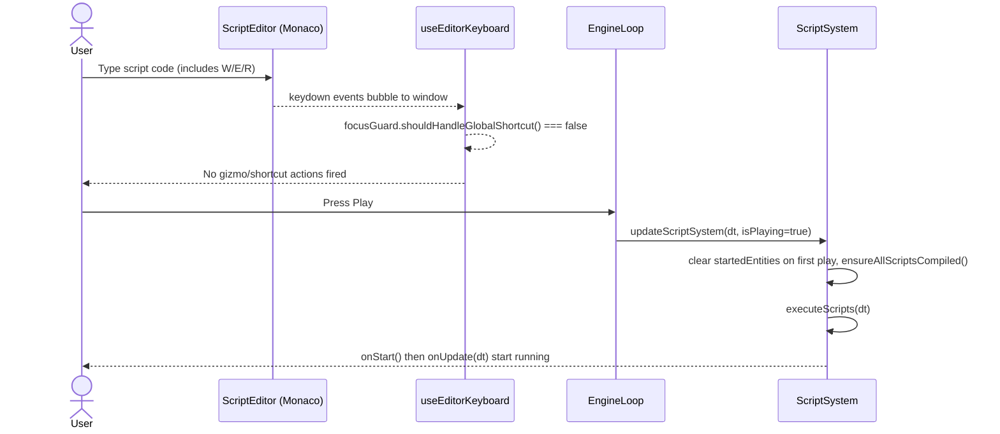

## Three.js Editor Script System Refactor PRD (Focused)

## 1. Overview

### Context & Goals

- **Stabilize the script editing UX** in the Three.js editor so Monaco no longer “blinks”, jumps the caret, or unexpectedly overwrites user input during normal typing.
- **Ensure the `onStart` lifecycle behaves predictably**, firing when play mode starts (or when a script is added while already playing) rather than during idle editor time.
- **Avoid regressions in the existing external script save pipeline** (TS files must keep saving exactly as today); changes should be additive and strictly localized.
- **Preserve current architecture** (ScriptSystem, DirectScriptExecutor, external script flow) and workspace rules (TS path aliases, named exports, logic in hooks, prefer Zod).

### Current Pain Points

- **Monaco editor instability**:
  - Script code occasionally appears to “reset” or the cursor jumps to the top while typing.
  - External syncs (auto-save/load) and modal open/close flows can trigger `model.setValue`, causing visual flicker and lost scroll/caret position.
- **Shortcut conflicts while typing**:
  - `useEditorKeyboard` listens on `window.keydown` and only skips `<input>` / `<textarea>`.
  - Monaco uses a `contentEditable` `<div>`, so viewport shortcuts (W/E/R gizmo modes, Delete, etc.) fire while typing in the script editor.
- **`onStart` lifecycle confusion**:
  - `updateScriptSystem` currently calls `executeScripts` regardless of `isPlaying`, so `onStart` runs the first time the engine loop ticks, even before the user hits Play.
  - When play mode actually starts, `startedEntities` is already populated, so `onStart` is skipped — leading to “onStart doesn’t seem to work” reports.
- **Past refactors risked the TS save pipeline**:
  - Changes that touched the interaction between `ScriptSection`, `ScriptCodeModal`, `scriptComponent.onAdd`, and external APIs made it easy to break “TS file saved to disk” behavior.

---

## 2. Proposed Solution

### High‑level Summary

- **Introduce a minimal editor focus guard** used by `useEditorKeyboard` to detect text-editing contexts (including Monaco) and suppress global shortcuts while typing.
- **Tighten Monaco integration in `ScriptEditor` and `ScriptCodeModal`** without re-architecting external script flows:
  - Treat Monaco as uncontrolled for normal typing.
  - Only push text into the model on clearly external events (e.g., explicit sync from disk), and only when the buffer is clean.
  - Avoid reusing the same “externalCode” path for both user edits and external loads.
- **Make `ScriptSystem` lifecycle execution explicitly play‑mode aware** with minimal changes:
  - Continue compiling and resolving scripts in edit mode (so errors show up early).
  - Only run `onStart` / `onUpdate` when `isPlaying === true`, with edge handling when entering play and when scripts are added mid‑play.
- **Treat the existing external TS save pipeline as out-of-scope**:
  - Keep `ScriptCodeModal` → `/api/script/save` → `scriptRef` updates and `scriptComponent.onAdd` behavior intact.
  - Only add small safety checks around when editor-side code tries to sync from disk into Monaco.

### Architecture & Directory Structure (Delta Only)

```text
src/
├── editor/
│   ├── hooks/
│   │   ├── useEditorKeyboard.ts              # Updated: uses a small focus guard helper
│   │   └── useEditorFocusGuard.ts            # NEW (small): keyboard/text‑focus detection
│   └── components/
│       └── panels/
│           └── InspectorPanel/
│               └── Script/
│                   ├── ScriptEditor.tsx      # Updated: safer Monaco model usage
│                   └── ScriptCodeModal.tsx   # Updated: clearly separates external sync vs typing
└── core/
    └── systems/
        └── ScriptSystem.ts                   # Updated: gate lifecycle execution on isPlaying
```

---

## 3. Implementation Plan

### Phase 1: Small Focus Guard for Keyboard Shortcuts (0.5 day)

1. **Add a minimal `useEditorFocusGuard` helper**:
   - Expose:
     - `isTextInputActive(): boolean` – checks `document.activeElement` for:
       - `<input>`, `<textarea>`, `contentEditable` elements.
       - Elements inside `.monaco-editor` containers.
     - `shouldHandleGlobalShortcut(event: KeyboardEvent): boolean` – returns `false` whenever `isTextInputActive()` is `true`.
2. **Update `useEditorKeyboard` to use the guard**:
   - Replace the current `instanceof HTMLInputElement/HTMLTextAreaElement` check with:
     - `if (!focusGuard.shouldHandleGlobalShortcut(e)) return;`
   - Keep existing shortcut logic (Ctrl+S, Ctrl+N, Delete, W/E/R) otherwise unchanged.
3. **Quick tests / manual QA**:
   - While typing in the script editor:
     - Press W/E/R, Delete, Ctrl+S — confirm gizmo mode and scene don’t change, and no unexpected actions fire.
   - While focused in the viewport / hierarchy:
     - Confirm shortcuts still work exactly as before.

### Phase 2: Monaco Integration & External Sync Safety (1.0 day)

1. **Stabilize `ScriptEditor.tsx`** (no behavioral change to upstream callers):
   - Keep Monaco wired via `@monaco-editor/react` with:
     - `defaultValue={code}` for initial mount.
     - `onChange` calling `onChange(newValue)` for user edits.
   - Avoid feeding the parent’s `code` back into Monaco on every keystroke:
     - Do not introduce a controlled `value` prop.
     - Keep `defaultLanguage`, `language`, `path` stable so Monaco does not re-mount unnecessarily.
2. **Narrow when we call `model.setValue`**:
   - If we keep the `externalCode` prop:
     - Only run `model.setValue(externalCode)` when:
       - `externalCode` is known to come from disk (e.g., initial load, explicit “Reload from file”), and
       - `externalCode !== model.getValue()`.
     - Optionally gate this behind a “buffer is clean” check (e.g., no unsaved changes flag in `ScriptCodeModal`), so we never overwrite active edits.
3. **Clarify responsibilities in `ScriptCodeModal.tsx` (no pipeline changes)**:
   - Preserve:
     - All calls to `/api/script/save` (including hash/mismatch handling and force‑save).
     - All updates to `scriptRef`, `scriptPath`, and `lastModified` via `onUpdate`.
   - Tighten sync logic:
     - Treat responses from `/api/script/load` as external updates:
       - If the modal is open and `hasUnsavedChanges` is `false`, update `scriptData.code` and pass the new string down to `ScriptEditor` via `externalCode` (which will selectively update the model).
       - If `hasUnsavedChanges` is `true`, do not auto‑apply — instead, keep the existing conflict dialog or add a small non-blocking warning (“File changed on disk; click to reload”).
   - Do not change how or when external script IDs are created (avoid touching the auto‑create behavior in `ScriptSection` and `scriptComponent.onAdd`).

### Phase 3: Play‑Mode‑Aware `onStart` Lifecycle (0.75 day)

1. **Gate execution, not compilation, in `ScriptSystem.ts`**:
   - Keep:
     - `scheduler.update()`.
     - `handleNewScriptEntities()` (enter/exit Script components).
     - `compileScripts()` (so that edits in the inspector still surface errors in edit mode).
   - Wrap the `executeScripts` call with `if (isPlaying) { ... }` so lifecycle methods only run during play:
     - Edit mode still compiles scripts and records errors, but does not execute `onStart` / `onUpdate`.
2. **Ensure `onStart` fires on play entry and mid‑play additions**:
   - On the rising edge of `isPlaying`:
     - Clear `startedEntities`.
     - Call `ensureAllScriptsCompiled()` to queue compilation for all enabled Script components with execute flags.
   - Within `executeScripts`:
     - Keep the existing logic:
       - If `!startedEntities.has(eid)` and `executeOnStart[eid]`, run `onStart` and add to `startedEntities`.
       - Always run `onUpdate` for entities with `executeInUpdate[eid]`.
   - When a Script component is added while already in play:
     - The next `updateScriptSystem` tick (with `isPlaying === true`) will:
       - See it via `handleNewScriptEntities`.
       - Queue compilation (via `entitiesToCompile`).
       - Run `executeScripts`, which will call `onStart` once the script is compiled and enabled.
3. **Leave external behaviors untouched**:
   - Do not change:
     - `setScriptEnabled`.
     - `recompileAllScripts`.
     - Script parameter parsing / hashing.
   - The goal is only to change when we call lifecycles, not how compilation, resolution, or saving works.

### Phase 4: Tests & Documentation (0.75 day)

1. **Unit tests (Vitest)**
   - `useEditorKeyboard` / focus guard:
     - Simulate `document.activeElement` inside `.monaco-editor` → shortcuts are skipped.
     - Simulate focus in the viewport → shortcuts fire as before.
   - `ScriptSystem`:
     - With `isPlaying=false`, `executeScripts` is not called and `startedEntities` stays empty.
     - With `isPlaying=true`, `onStart` runs exactly once per script per play session, and `onUpdate` runs each tick.
2. **Manual tests**
   - Play mode:
     - Add a script that logs from `onStart` and `onUpdate`.
     - Confirm:
       - No console output before hitting Play.
       - A single `onStart` log per play session.
       - Continuous `onUpdate` logs while playing.
   - Script editing:
     - Type in the editor for several seconds; confirm no jumps or unexpected resets even when external sync timers fire in the background.
3. **Docs**
   - Update `docs/architecture/2-13-script-system.md` to clarify:
     - `onStart` is play‑mode only.
     - Scripts compile in edit mode but don’t execute until play.

---

## 4. File and Directory Structures (Focused View)

```text
src/editor/hooks/
├── useEditorKeyboard.ts          # Updated to use focus guard
└── useEditorFocusGuard.ts        # NEW: minimal text‑editing detection

src/editor/components/panels/InspectorPanel/Script/
├── ScriptEditor.tsx              # Updated: safer Monaco usage, no controlled value
└── ScriptCodeModal.tsx           # Updated: clearer separation between external sync and typing

src/core/systems/
└── ScriptSystem.ts               # Updated: execute scripts only when isPlaying === true
```

No changes are proposed to:

- `src/core/lib/ecs/components/definitions/ScriptComponent.ts`
- `src/editor/components/panels/InspectorPanel/Script/ScriptSection.tsx`
- External script APIs (`/api/script/save`, `/api/script/load`) or their call sites beyond additional safety checks.

---

## 5. Technical Details (Minimal Deltas)

### 5.1 Focus Guard Helper

```ts
// src/editor/hooks/useEditorFocusGuard.ts
export interface IEditorFocusGuard {
  isTextInputActive: () => boolean;
  shouldHandleGlobalShortcut: (event: KeyboardEvent) => boolean;
}

export const useEditorFocusGuard = (): IEditorFocusGuard => {
  const isTextInputActive = () => {
    const active = document.activeElement as HTMLElement | null;
    if (!active) return false;

    if (active instanceof HTMLInputElement) return true;
    if (active instanceof HTMLTextAreaElement) return true;
    if (active.isContentEditable) return true;

    if (active.closest('.monaco-editor')) return true;

    return false;
  };

  const shouldHandleGlobalShortcut = () => !isTextInputActive();

  return { isTextInputActive, shouldHandleGlobalShortcut };
};
```

### 5.2 Using the Guard in `useEditorKeyboard`

```ts
// src/editor/hooks/useEditorKeyboard.ts (excerpt)
import { useEditorFocusGuard } from './useEditorFocusGuard';

export const useEditorKeyboard = (props: IUseEditorKeyboardProps) => {
  const focusGuard = useEditorFocusGuard();

  useEffect(() => {
    const handleKeyDown = (e: KeyboardEvent) => {
      if (!focusGuard.shouldHandleGlobalShortcut(e)) {
        return;
      }

      // Existing shortcuts: Ctrl+N, Ctrl+S, Ctrl+/, Delete, W/E/R, etc.
    };

    window.addEventListener('keydown', handleKeyDown);
    return () => window.removeEventListener('keydown', handleKeyDown);
  }, [focusGuard /* + existing deps */]);
};
```

### 5.3 ScriptSystem Play‑Mode Guard

```ts
// src/core/systems/ScriptSystem.ts (excerpt)
export async function updateScriptSystem(
  deltaTime: number,
  isPlaying: boolean = false,
): Promise<void> {
  scheduler.update();

  // Still handle entity enter/exit and compilation in all modes
  await handleNewScriptEntities();
  await compileScripts();

  // Only execute lifecycles while playing
  if (isPlaying) {
    // Detect rising edge
    // eslint-disable-next-line @typescript-eslint/no-explicit-any
    const last = (updateScriptSystem as any)._lastIsPlaying as boolean | undefined;
    if (!last) {
      startedEntities.clear();
      ensureAllScriptsCompiled();
    }

    await executeScripts(deltaTime);
  }

  componentWriteSystem();

  // eslint-disable-next-line @typescript-eslint/no-explicit-any
  (updateScriptSystem as any)._lastIsPlaying = isPlaying;
}
```

---

## 6. Usage Examples

### 6.1 Typing Without Gizmo Changes

```ts
// Editor.tsx (unchanged call site)
useEditorKeyboard({
  selectedId,
  setSelectedId,
  isChatExpanded,
  setIsChatExpanded,
  onAddObject: handleAddObject,
  onSave: handleSave,
  onStatusMessage: setStatusMessage,
  gizmoMode,
  setGizmoMode,
});
// With the focus guard, typing W/E/R in the script editor no longer changes gizmo mode.
```

### 6.2 Predictable `onStart`

```ts
// updateScriptSystem still called from EngineLoop
updateScriptSystem(deltaTime * 1000, isPlaying).catch((error) => {
  logger.error('Script system error', { error });
});

// Script author expectation after this change:
// - onStart(): runs once per play session (or when the script is added while already playing).
// - onUpdate(dt): runs every frame only while isPlaying === true.
// - No lifecycle calls happen just from idling in the editor.
```

---

## 7. Testing Strategy

- **Unit tests**
  - `useEditorFocusGuard`:
    - With `document.activeElement` inside `.monaco-editor`, `shouldHandleGlobalShortcut` returns `false`.
    - With focus on `document.body`, `shouldHandleGlobalShortcut` returns `true`.
  - `ScriptSystem.updateScriptSystem`:
    - When `isPlaying=false`, ensure `executeScripts` is not invoked, and `startedEntities` stays empty.
    - When toggling `isPlaying` from `false → true`, `startedEntities` is cleared and `ensureAllScriptsCompiled` is called.
- **Integration / manual**
  - Add a simple script that logs from `onStart` and `onUpdate`; verify logs behavior across play/stop cycles.
  - Type in Monaco for >10 seconds with auto-sync running; verify:
    - No cursor jump to top.
    - No unexpected code resets.
  - Confirm external TS files still save correctly (no change to `/api/script/save` call sites or `scriptRef` wiring).

---

## 8. Edge Cases

| Edge Case                               | Remediation                                                                                     |
| --------------------------------------- | ----------------------------------------------------------------------------------------------- |
| Typing in some other custom text field  | Focus guard checks `contentEditable` and `input`/`textarea`, not just Monaco.                   |
| Scripts added while not playing         | They compile and surface errors in edit mode but `onStart` waits for play.                      |
| Scripts added mid‑play                  | They compile as usual and receive `onStart` the first time `executeScripts` runs while enabled. |
| External script file changes mid‑typing | Auto-sync skips applying external updates when `hasUnsavedChanges` is true.                     |

---

## 9. Sequence Diagram



---

## 10. Risks & Mitigations

| Risk                                              | Mitigation                                                                                                                                   |
| ------------------------------------------------- | -------------------------------------------------------------------------------------------------------------------------------------------- |
| Over‑eager focus guard blocks shortcuts too often | Keep guard logic minimal and restricted to clear text‑editing contexts only.                                                                 |
| Hidden interactions with external script sync     | Avoid changing call order to `/api/script/save` / `/api/script/load`; only add checks before applying text to Monaco.                        |
| Lifecycle gating surprises existing scripts       | Document the new play‑mode semantics; scripts relying on edit‑mode execution can be handled later with an explicit “preview” mode if needed. |

---

## 11. Timeline

- Phase 1 – Focus guard: **0.5 day**
- Phase 2 – Monaco integration & sync safety: **1.0 day**
- Phase 3 – Play‑mode‑aware `onStart`: **0.75 day**
- Phase 4 – Tests & docs: **0.75 day**

**Total:** ~3.0 days.

---

## 12. Acceptance Criteria

- **Editor UX**
  - Typing in the script editor no longer triggers viewport gizmo changes, Delete‑entity operations, or other global shortcuts.
  - Users do not experience cursor jumps or content resets during normal typing.
- **Lifecycle Behavior**
  - `onStart` never runs solely due to idling in the editor; it runs once when entering play or when the script is added mid‑play.
  - `onUpdate` runs only while play mode is active.
- **No Regressions**
  - External TS scripts save and reload as before (verified via `/api/script/save` and `/api/script/load` flows).
  - No changes to external script creation semantics (IDs, paths, `scriptRef` structure).
