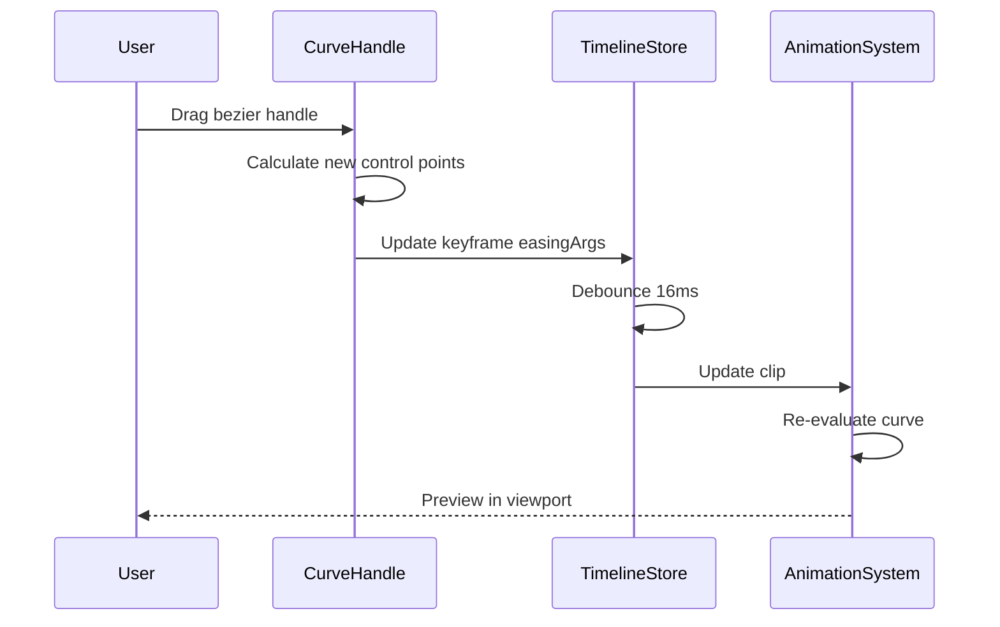

# Timeline Editor UX/UI Improvements PRD

## Overview

### Context & Goals

- **Current State**: Functional timeline editor with basic keyframing, track management, and playback controls
- **Quality Assessment**: ~70% feature complete for a basic timeline, but UX rough edges prevent professional workflows
- **Target**: Polish the existing timeline editor to match Unity/Unreal quality standards
- **Focus**: Fix UX pain points, add missing workflows, improve visual clarity and usability

### Current Pain Points

**Critical UX Issues:**

- **No Curve Visualization**: Keyframes shown as dots, no interpolation curves between them
- **Limited Keyframe Editing**: Can't adjust easing handles visually, limited to dropdown selection
- **No Track Grouping**: All tracks flat, no hierarchy or collapse/expand
- **Missing Multi-Track Selection**: Can't select/move keyframes across multiple tracks
- **No Dope Sheet Mode**: Only timeline view, missing simplified keyframe overview
- **Playhead Not Sticky**: Doesn't follow when zooming/panning
- **No Timeline Markers**: Can't add named markers for important moments
- **Missing Range Selection**: Can't select time ranges for loops or exports
- **No Track Muting/Soloing**: Can't preview individual tracks
- **Limited Copy/Paste**: Works but no visual feedback or offset controls

**Performance Issues:**

- Track rendering not virtualized (lags with 20+ tracks)
- Keyframe dragging causes stutters with many keyframes
- Undo/redo not debounced (too many history entries)

**Missing Visual Feedback:**

- No interpolation curve preview between keyframes
- No visual indication of active/inactive clips
- No track height adjustment
- No timeline minimap for navigation
- No scrub preview (hover to see frame)

## Proposed Solution

### High-level Summary

- **Phase 1**: Curve Visualization & Editing (1.5 days)
- **Phase 2**: Track Management & Organization (1 day)
- **Phase 3**: Advanced Selection & Manipulation (1 day)
- **Phase 4**: Timeline Navigation & Markers (0.75 day)
- **Phase 5**: Performance Optimization (0.75 day)
- **Phase 6**: Visual Polish & Feedback (1 day)

### Architecture & Directory Structure

```
/src/editor/components/panels/TimelinePanel/
  ├── components/
  │   ├── Keyframe.tsx                      # [EXISTING] Enhanced with curve handles
  │   ├── CurvePath.tsx                     # [NEW] SVG curve rendering between keyframes
  │   ├── CurveHandle.tsx                   # [NEW] Bezier handle dragging
  │   ├── TrackRow.tsx                      # [EXISTING] Enhanced with mute/solo/height
  │   ├── TrackGroup.tsx                    # [NEW] Collapsible track groups
  │   ├── TimelineMarker.tsx                # [NEW] Named markers on timeline
  │   ├── RangeSelector.tsx                 # [NEW] Time range selection
  │   ├── Minimap.tsx                       # [NEW] Timeline overview navigation
  │   ├── DopeSheet.tsx                     # [NEW] Simplified keyframe view
  │   └── ScrubPreview.tsx                  # [NEW] Hover frame preview
  ├── hooks/
  │   ├── useCurveEditor.ts                 # [NEW] Curve editing logic
  │   ├── useTrackVirtualization.ts         # [NEW] Virtualize track rendering
  │   ├── useMultiSelection.ts              # [NEW] Multi-track selection
  │   └── useTimelineNavigation.ts          # [NEW] Pan/zoom with minimap
  └── modes/
      ├── TimelineMode.tsx                  # [NEW] Standard timeline view
      └── DopeSheetMode.tsx                 # [NEW] Dope sheet view
```

## Implementation Plan

### Phase 1: Curve Visualization & Editing (1.5 days)

#### Tasks:

1. **SVG Curve Rendering** (0.5 day)

   - Render bezier curves between keyframes as SVG paths
   - Different curve styles for easing types (linear=straight, bezier=curved, step=stairs)
   - Color-code curves by track type
   - Performance: memoize curve generation, only render visible range

2. **Bezier Handle Editing** (0.75 day)

   - Add draggable handles for bezier control points
   - Handle constraints (tangent alignment for smooth curves)
   - Visual feedback during dragging
   - Weighted vs unweighted handles
   - Free vs aligned tangent modes

3. **Curve Editor Modal** (0.25 day)
   - Full-screen curve editor with grid
   - Zoom to fit selected keyframes
   - Frame all / frame selection shortcuts
   - Normalize / flatten curve tools

**Acceptance Criteria:**

- [ ] Curves visible between all keyframes
- [ ] Can drag bezier handles to adjust easing
- [ ] Curve editor modal shows multi-curve editing
- [ ] Performance: 60 FPS with 100+ keyframes visible

### Phase 2: Track Management & Organization (1 day)

#### Tasks:

1. **Track Grouping** (0.5 day)

   - Create track groups (e.g., "Transform", "Materials")
   - Collapse/expand groups
   - Drag tracks into/out of groups
   - Group color-coding and icons

2. **Track Controls** (0.25 day)

   - Mute toggle (disable track evaluation)
   - Solo toggle (mute all others)
   - Lock toggle (prevent editing)
   - Track height adjustment (drag divider)

3. **Track Virtualization** (0.25 day)
   - Use `react-window` or `react-virtualized`
   - Only render visible tracks
   - Smooth scrolling with large track counts
   - Preserve scroll position on updates

**Acceptance Criteria:**

- [ ] Can create and collapse track groups
- [ ] Mute/solo/lock buttons work correctly
- [ ] Adjustable track heights (50px - 200px)
- [ ] No lag with 50+ tracks (virtualized)

### Phase 3: Advanced Selection & Manipulation (1 day)

#### Tasks:

1. **Multi-Track Selection** (0.5 day)

   - Box/marquee selection across tracks
   - Shift+click to add to selection
   - Ctrl+click to toggle selection
   - Select all keyframes in time range

2. **Advanced Copy/Paste** (0.25 day)

   - Copy keyframes with relative time offsets
   - Paste with preview before confirming
   - Duplicate keyframes in place (Ctrl+D)
   - Ripple paste (insert time)

3. **Transform Tools** (0.25 day)
   - Scale selection (compress/expand time)
   - Offset selection (move all by delta)
   - Reverse selection (flip keyframes)
   - Distribute evenly (auto-space keyframes)

**Acceptance Criteria:**

- [ ] Marquee selection works across tracks
- [ ] Paste shows preview before applying
- [ ] Scale tool compresses/expands keyframe timing
- [ ] All operations support undo/redo

### Phase 4: Timeline Navigation & Markers (0.75 day)

#### Tasks:

1. **Timeline Markers** (0.25 day)

   - Add named markers at time positions
   - Jump to marker shortcuts (Ctrl+1-9)
   - Marker color-coding and icons
   - Marker list panel

2. **Range Selection** (0.25 day)

   - Select time ranges (loop regions)
   - Set preview range (only play this section)
   - Export range to new clip
   - Zoom to selection shortcut

3. **Minimap Navigation** (0.25 day)
   - Miniature timeline overview at top
   - Shows all keyframes density
   - Drag viewport window to pan
   - Click to jump to time

**Acceptance Criteria:**

- [ ] Can add/remove markers with keyboard
- [ ] Range selection highlights timeline section
- [ ] Minimap updates in real-time
- [ ] Click minimap to jump to time instantly

### Phase 5: Performance Optimization (0.75 day)

#### Tasks:

1. **Render Optimization** (0.25 day)

   - Memoize track row rendering with React.memo
   - Debounce keyframe drag updates (16ms)
   - Use CSS transforms instead of re-renders
   - Batch state updates with flushSync

2. **History Optimization** (0.25 day)

   - Debounce undo history push (500ms idle)
   - Limit history to 50 entries (configurable)
   - Compress consecutive similar operations
   - Clear history on clip change

3. **Virtualization** (0.25 day)
   - Virtualize keyframe rendering (only visible)
   - Use IntersectionObserver for track visibility
   - Lazy load curve calculations
   - Request animation frame for smooth updates

**Acceptance Criteria:**

- [ ] No frame drops when dragging keyframes
- [ ] Undo/redo doesn't save every drag step
- [ ] Memory usage stable with long editing sessions
- [ ] 60 FPS maintained with 100 tracks, 1000 keyframes

### Phase 6: Visual Polish & Feedback (1 day)

#### Tasks:

1. **Visual Indicators** (0.5 day)

   - Active clip highlight in inspector
   - Playing animation pulsing border
   - Keyframe hover preview (tooltip with value graph)
   - Track recording mode (auto-keyframe)

2. **Scrub Preview** (0.25 day)

   - Hover over ruler to preview frame
   - Thumbnail preview in tooltip
   - Scrub audio waveform (if audio track)
   - Ghost playhead on hover

3. **Polish Details** (0.25 day)
   - Smooth zoom animations
   - Keyframe appear/disappear transitions
   - Track expand/collapse animations
   - Loading states for heavy operations

**Acceptance Criteria:**

- [ ] Hover ruler shows frame preview
- [ ] All animations smooth (no jank)
- [ ] Recording mode auto-creates keyframes
- [ ] Visual feedback for all user actions

**Total Estimated Time: 6 days**

## Technical Details

### Curve Rendering with SVG

```tsx
// src/editor/components/panels/TimelinePanel/components/CurvePath.tsx
import React from 'react';
import type { IKeyframe } from '@core/components/animation/tracks/TrackTypes';

interface ICurvePathProps {
  keyframes: IKeyframe[];
  zoom: number;
  pan: number;
  trackHeight: number;
  color: string;
}

export const CurvePath: React.FC<ICurvePathProps> = React.memo(
  ({ keyframes, zoom, pan, trackHeight, color }) => {
    // Sort keyframes by time
    const sorted = [...keyframes].sort((a, b) => a.time - b.time);

    // Generate SVG path data
    const generatePath = (): string => {
      const paths: string[] = [];

      for (let i = 0; i < sorted.length - 1; i++) {
        const curr = sorted[i];
        const next = sorted[i + 1];

        const x1 = curr.time * zoom - pan;
        const x2 = next.time * zoom - pan;
        const y = trackHeight / 2; // Center vertically

        if (curr.easing === 'step') {
          // Step interpolation: horizontal then vertical
          paths.push(`M ${x1},${y} L ${x2},${y}`);
        } else if (curr.easing === 'linear') {
          // Linear interpolation: straight line
          paths.push(`M ${x1},${y} L ${x2},${y}`);
        } else if (curr.easing === 'bezier' && curr.easingArgs) {
          // Bezier curve with control points
          const [cp1x, cp1y, cp2x, cp2y] = curr.easingArgs;
          const duration = x2 - x1;

          const controlX1 = x1 + duration * cp1x;
          const controlY1 = y - trackHeight * 0.3 * cp1y;
          const controlX2 = x1 + duration * cp2x;
          const controlY2 = y - trackHeight * 0.3 * cp2y;

          paths.push(
            `M ${x1},${y} C ${controlX1},${controlY1} ${controlX2},${controlY2} ${x2},${y}`,
          );
        }
      }

      return paths.join(' ');
    };

    return (
      <svg className="absolute inset-0 pointer-events-none" style={{ overflow: 'visible' }}>
        <path
          d={generatePath()}
          stroke={color}
          strokeWidth={2}
          fill="none"
          strokeLinecap="round"
          opacity={0.6}
        />
      </svg>
    );
  },
);
```

### Bezier Handle Editing

```tsx
// src/editor/components/panels/TimelinePanel/components/CurveHandle.tsx
import React, { useState, useRef } from 'react';

interface ICurveHandleProps {
  keyframeIndex: number;
  trackId: string;
  handleType: 'in' | 'out';
  position: { x: number; y: number };
  onDrag: (dx: number, dy: number) => void;
}

export const CurveHandle: React.FC<ICurveHandleProps> = ({
  keyframeIndex,
  trackId,
  handleType,
  position,
  onDrag,
}) => {
  const [dragging, setDragging] = useState(false);
  const dragStart = useRef({ x: 0, y: 0 });

  const handleMouseDown = (e: React.MouseEvent) => {
    e.stopPropagation();
    setDragging(true);
    dragStart.current = { x: e.clientX, y: e.clientY };
  };

  const handleMouseMove = (e: MouseEvent) => {
    if (!dragging) return;
    const dx = e.clientX - dragStart.current.x;
    const dy = e.clientY - dragStart.current.y;
    onDrag(dx, dy);
  };

  const handleMouseUp = () => {
    setDragging(false);
  };

  React.useEffect(() => {
    if (dragging) {
      document.addEventListener('mousemove', handleMouseMove);
      document.addEventListener('mouseup', handleMouseUp);
      return () => {
        document.removeEventListener('mousemove', handleMouseMove);
        document.removeEventListener('mouseup', handleMouseUp);
      };
    }
  }, [dragging]);

  return (
    <>
      {/* Handle connection line */}
      <line
        x1={position.x}
        y1={position.y}
        x2={position.x + (handleType === 'out' ? 40 : -40)}
        y2={position.y}
        stroke="rgba(100, 200, 255, 0.5)"
        strokeWidth={1}
      />

      {/* Draggable handle */}
      <circle
        cx={position.x + (handleType === 'out' ? 40 : -40)}
        cy={position.y}
        r={5}
        fill="#64C8FF"
        stroke="#fff"
        strokeWidth={2}
        className="cursor-move hover:scale-125 transition-transform"
        onMouseDown={handleMouseDown}
      />
    </>
  );
};
```

### Track Virtualization

```tsx
// src/editor/components/panels/TimelinePanel/hooks/useTrackVirtualization.ts
import { useVirtual } from 'react-virtual';
import { useRef } from 'react';

export function useTrackVirtualization(tracks: ITrack[], trackHeight: number = 56) {
  const parentRef = useRef<HTMLDivElement>(null);

  const rowVirtualizer = useVirtual({
    size: tracks.length,
    parentRef,
    estimateSize: React.useCallback(() => trackHeight, [trackHeight]),
    overscan: 5, // Render 5 extra rows above/below viewport
  });

  return {
    parentRef,
    virtualItems: rowVirtualizer.virtualItems,
    totalSize: rowVirtualizer.totalSize,
  };
}
```

### Marquee Selection

```tsx
// src/editor/components/panels/TimelinePanel/hooks/useMarqueeSelection.ts
import { useState, useCallback } from 'react';

export function useMarqueeSelection() {
  const [marquee, setMarquee] = useState<{
    start: { x: number; y: number };
    end: { x: number; y: number };
    active: boolean;
  } | null>(null);

  const startMarquee = useCallback((x: number, y: number) => {
    setMarquee({ start: { x, y }, end: { x, y }, active: true });
  }, []);

  const updateMarquee = useCallback((x: number, y: number) => {
    setMarquee((prev) => (prev ? { ...prev, end: { x, y } } : null));
  }, []);

  const endMarquee = useCallback(() => {
    setMarquee(null);
  }, []);

  const getSelectionBounds = useCallback(() => {
    if (!marquee) return null;

    const left = Math.min(marquee.start.x, marquee.end.x);
    const right = Math.max(marquee.start.x, marquee.end.x);
    const top = Math.min(marquee.start.y, marquee.end.y);
    const bottom = Math.max(marquee.start.y, marquee.end.y);

    return { left, right, top, bottom };
  }, [marquee]);

  return {
    marquee,
    startMarquee,
    updateMarquee,
    endMarquee,
    getSelectionBounds,
  };
}
```

### Timeline Minimap

```tsx
// src/editor/components/panels/TimelinePanel/components/Minimap.tsx
import React from 'react';
import type { IClip } from '@core/components/animation/AnimationComponent';

interface IMinimapProps {
  clip: IClip;
  currentTime: number;
  viewportStart: number; // In seconds
  viewportEnd: number; // In seconds
  onSeek: (time: number) => void;
}

export const Minimap: React.FC<IMinimapProps> = ({
  clip,
  currentTime,
  viewportStart,
  viewportEnd,
  onSeek,
}) => {
  const width = 800; // Fixed minimap width
  const height = 60;
  const duration = clip.duration;

  // Calculate keyframe density map
  const densityBuckets = React.useMemo(() => {
    const buckets = new Array(100).fill(0);

    clip.tracks.forEach((track) => {
      track.keyframes.forEach((kf) => {
        const bucket = Math.floor((kf.time / duration) * 100);
        buckets[bucket]++;
      });
    });

    return buckets;
  }, [clip]);

  const handleClick = (e: React.MouseEvent<HTMLDivElement>) => {
    const rect = e.currentTarget.getBoundingClientRect();
    const x = e.clientX - rect.left;
    const time = (x / width) * duration;
    onSeek(Math.max(0, Math.min(duration, time)));
  };

  return (
    <div
      className="relative bg-gray-900 border border-gray-700 rounded overflow-hidden"
      style={{ width, height }}
    >
      {/* Keyframe density visualization */}
      <svg width={width} height={height} className="absolute inset-0">
        {densityBuckets.map((count, i) => (
          <rect
            key={i}
            x={i * (width / 100)}
            y={height - count * 2}
            width={width / 100}
            height={count * 2}
            fill="rgba(100, 200, 255, 0.3)"
          />
        ))}
      </svg>

      {/* Viewport window */}
      <div
        className="absolute top-0 bottom-0 bg-primary/20 border-x-2 border-primary cursor-pointer"
        style={{
          left: `${(viewportStart / duration) * width}px`,
          width: `${((viewportEnd - viewportStart) / duration) * width}px`,
        }}
        onClick={handleClick}
      />

      {/* Playhead indicator */}
      <div
        className="absolute top-0 bottom-0 w-0.5 bg-error"
        style={{ left: `${(currentTime / duration) * width}px` }}
      />
    </div>
  );
};
```

## Usage Examples

### Enabling Curve Visualization

```tsx
// In TrackRow, render curves between keyframes
<div className="track-timeline relative">
  <CurvePath
    keyframes={track.keyframes}
    zoom={zoom}
    pan={pan}
    trackHeight={trackHeight}
    color={getTrackColor(track.type)}
  />
  {track.keyframes.map((kf, i) => (
    <Keyframe key={i} {...kf} />
  ))}
</div>
```

### Using Track Groups

```tsx
// Create a transform group
const transformGroup = {
  id: 'transform-group',
  name: 'Transform',
  collapsed: false,
  tracks: [positionTrack, rotationTrack, scaleTrack],
};

// Render grouped tracks
<TrackGroup group={transformGroup}>
  {transformGroup.tracks.map((track) => (
    <TrackRow key={track.id} track={track} />
  ))}
</TrackGroup>;
```

### Marquee Selection

```tsx
// In timeline container
const { startMarquee, updateMarquee, endMarquee, getSelectionBounds } = useMarqueeSelection();

<div
  onMouseDown={(e) => startMarquee(e.clientX, e.clientY)}
  onMouseMove={(e) => updateMarquee(e.clientX, e.clientY)}
  onMouseUp={endMarquee}
>
  {/* Render tracks and keyframes */}
  {/* Find keyframes within selection bounds */}
</div>;
```

## Testing Strategy

### Unit Tests

- Curve path generation correctness (bezier, linear, step)
- Bezier handle constraint logic (tangent alignment)
- Marquee selection bounds calculation
- Track virtualization item calculation
- History debouncing behavior

### Integration Tests

- Curve editing updates keyframe easing
- Track grouping persists on save/load
- Minimap navigation syncs with viewport
- Mute/solo tracks affect playback correctly
- Copy/paste across tracks maintains relative timing

### Visual Regression Tests

- Capture screenshots of timeline states
- Verify curve rendering accuracy
- Check UI polish (animations, transitions)
- Ensure responsive layout at different sizes

### Performance Tests

- Render 100 tracks without lag
- Drag keyframes with 1000+ keyframes smoothly
- Zoom/pan operations maintain 60 FPS
- Memory usage stable after 30 min editing session

## Edge Cases

| Edge Case                          | Remediation                            |
| ---------------------------------- | -------------------------------------- |
| Track with 0 keyframes             | Hide curve, show "Add keyframe" prompt |
| Track with 1 keyframe              | Show hold interpolation (flat line)    |
| Bezier handles outside viewport    | Clamp handle display, allow scroll     |
| Overlapping keyframes at same time | Stack vertically with offset           |
| Extremely long timeline (hours)    | Use scientific notation, auto-zoom     |
| Negative easing values             | Clamp to valid range [0, 1]            |
| Group with 0 tracks                | Show empty state, allow drag-drop      |
| Minimap with >10k keyframes        | Use density sampling, don't render all |
| Undo during playback               | Pause, then undo to avoid conflicts    |
| Paste with no clipboard            | Show warning toast                     |

## Sequence Diagram

### Curve Handle Editing Flow



## Risks & Mitigations

| Risk                                  | Mitigation                                                |
| ------------------------------------- | --------------------------------------------------------- |
| SVG curve rendering performance       | Use canvas fallback for >500 curves; virtualize rendering |
| Complex bezier math errors            | Use tested bezier-easing library; add unit tests          |
| Virtualization bugs with track groups | Test thoroughly; provide non-virtualized fallback         |
| Minimap performance with huge clips   | Sample keyframes instead of rendering all                 |
| Undo/redo history bloat               | Compress consecutive operations; limit to 50 entries      |
| Marquee selection conflicts with drag | Detect drag vs marquee by movement threshold              |

## Timeline

- **Phase 1: Curve Visualization** - 1.5 days
- **Phase 2: Track Management** - 1 day
- **Phase 3: Advanced Selection** - 1 day
- **Phase 4: Navigation & Markers** - 0.75 day
- **Phase 5: Performance** - 0.75 day
- **Phase 6: Visual Polish** - 1 day

**Total: 6 days (~1.2 weeks)**

## Acceptance Criteria

### Visual Quality

- [ ] Curves rendered smoothly between all keyframes
- [ ] Bezier handles draggable with visual feedback
- [ ] All animations smooth (no jank or stutters)
- [ ] UI matches Unity/Unreal quality standards

### Functionality

- [ ] Track grouping works with collapse/expand
- [ ] Mute/solo/lock buttons affect playback correctly
- [ ] Marquee selection works across tracks
- [ ] Minimap navigation syncs instantly
- [ ] All keyboard shortcuts functional

### Performance

- [ ] 60 FPS with 100 tracks, 1000 keyframes
- [ ] No lag when dragging keyframes
- [ ] Undo/redo instant (<16ms)
- [ ] Memory stable after extended use

### Polish

- [ ] Hover tooltips show keyframe details
- [ ] Loading states for operations >100ms
- [ ] Error states handled gracefully
- [ ] Responsive layout (min 1280px width)

## Conclusion

These improvements transform the timeline editor from **functional** to **professional**. The focus on curve visualization, track organization, and performance optimization addresses the most critical UX gaps that prevent efficient animation workflows.

Implementing these 6 phases will result in a timeline editor that:

- Matches Unity Animator and Unreal Sequencer quality
- Handles professional animation workloads (100+ tracks)
- Provides visual feedback for all operations
- Enables fast iteration with advanced tools

Combined with the features in the "80% Coverage PRD" (state machines, blending, skeletal support), this creates a complete, production-ready animation system.

## Assumptions & Dependencies

- **React 18+**: Concurrent rendering for smooth updates
- **SVG Support**: Modern browsers with good SVG performance
- **react-window**: For track virtualization (optional, can use custom)
- **bezier-easing**: Already in project for curve math
- **Performance Target**: 60 FPS on mid-range hardware (GTX 1060, Ryzen 5)
- **Screen Resolution**: Minimum 1280x720, optimized for 1920x1080
- **Browser**: Chrome/Edge 100+, Firefox 100+ (ES2020 support)

## Priority Ranking

If time is limited, implement in this order:

**High Priority** (Must-have for professional use):

1. Phase 1: Curve Visualization (makes keyframe editing visual)
2. Phase 5: Performance Optimization (prevents frustration)
3. Phase 2: Track Management (essential for organization)

**Medium Priority** (Nice-to-have, improves workflow): 4. Phase 3: Advanced Selection (power-user features) 5. Phase 6: Visual Polish (quality of life)

**Low Priority** (Can defer): 6. Phase 4: Navigation & Markers (useful but not critical)

This prioritization ensures the most impactful improvements land first, with the option to ship incrementally.
