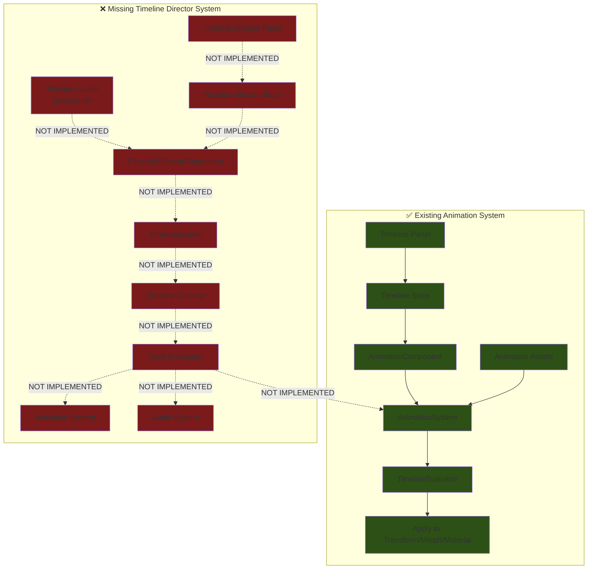
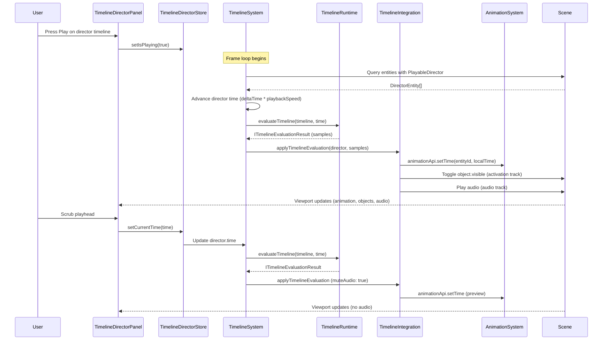

# Unity Timeline Parity - Implementation Review & Detailed Plan

## Overview

### Context & Goals

- **Current State**: The animation system supports per-entity animation clips with timeline editing, but lacks Unity's multi-track director system for sequencing animations, audio, activation events, and cutscenes across multiple entities.
- **Gap Analysis**: The existing PRD (`unity-timeline-parity-prd.md`) defines the complete feature, but **zero implementation exists** - no Timeline assets, no PlayableDirector component, no TimelineSystem, and no director editor UI.
- **Implementation Goal**: Deliver a Unity-style Timeline + PlayableDirector system that enables reusable, asset-backed multi-track sequences for cinematic cutscenes, coordinated events, and complex animations.
- **Architecture Integration**: Build on top of the existing AnimationSystem and asset pipeline while maintaining ECS cleanliness and avoiding duplication with the current per-entity timeline editor.

### Current Pain Points

- **No Global Sequencing**: Cannot orchestrate animations across multiple entities in a unified timeline - each entity's animation is isolated.
- **No Asset Reusability**: Timelines cannot be authored once and reused across scenes/entities - everything is component-bound.
- **Limited Track Types**: Only animation tracks exist - no activation (enable/disable objects), audio, or marker tracks for cutscene events.
- **No Director Model**: Missing the PlayableDirector component pattern where a single entity controls a timeline that affects multiple bound entities.

## Current State Analysis

### What Exists ✅

| Component | Status | Location | Notes |
|-----------|--------|----------|-------|
| AnimationSystem | ✅ Implemented | `src/core/systems/AnimationSystem.ts` | Handles per-entity animation playback, clip evaluation, fade, loop |
| AnimationComponent | ✅ Implemented | `src/core/components/animation/AnimationComponent.ts` | ECS component with `clipBindings`, `activeBindingId`, `playing`, `time` |
| AnimationRegistry | ✅ Implemented | `src/core/animation/AnimationRegistry.ts` | Registry for animation assets |
| Animation Assets | ✅ Implemented | `src/core/animation/assets/defineAnimations.ts` | `defineAnimationClip(s)` helpers for `.animation.tsx` files |
| Timeline Editor (Per-Entity) | ✅ Implemented | `src/editor/components/panels/TimelinePanel/` | Edits single animation clip tied to selected entity |
| Timeline Store | ✅ Implemented | `src/editor/store/timelineStore.ts` | Tracks `activeEntityId`, `activeClip`, playback state, selection, undo/redo |
| TimelineEvaluator | ✅ Implemented | `src/core/lib/animation/TimelineEvaluator.ts` | Evaluates animation clips (keyframe interpolation, events) |
| Asset Pipeline | ✅ Implemented | `src/core/lib/serialization/assets/` | Supports materials, prefabs, inputs, animations via `AssetTypes.ts` |

### What's Missing ❌

| Component | Status | PRD Reference | Impact |
|-----------|--------|---------------|--------|
| Timeline Asset Type | ❌ Not Started | Phase 1 | No `.timeline.tsx` files, no `defineTimeline()` helper, no schema |
| PlayableDirectorComponent | ❌ Not Started | Phase 2 | No ECS component to attach timelines to entities with bindings |
| TimelineSystem | ❌ Not Started | Phase 2 | No runtime evaluation of director timelines |
| Timeline Core Types | ❌ Not Started | Phase 1 | No `ITimeline`, `ITimelineTrack`, `ITimelineClip`, `ITimelineGroup` types |
| Timeline Runtime Evaluator | ❌ Not Started | Phase 2 | No multi-track evaluation (uses existing `TimelineEvaluator` only for animation) |
| Timeline Integration | ❌ Not Started | Phase 3 | No activation track support, no audio track support |
| Timeline Director Editor | ❌ Not Started | Phase 4 | No multi-track UI, no track groups, no director panel |
| Timeline Director Store | ❌ Not Started | Phase 4 | No Zustand store for director-level state (separate from per-entity store) |
| Asset Type Registration | ❌ Not Started | Phase 5 | `AssetTypes.ts` only lists `material`, `prefab`, `input`, `script`, `animation` |
| Scene Timeline References | ❌ Not Started | Phase 5 | No `assetReferences.timelines` in scene serialization |

### Architecture Gap Summary



## Proposed Solution

### High-Level Summary

- **Introduce Timeline Asset Type**: Add `'timeline'` to `AssetTypes.ts`, create `defineTimeline()` helpers, and register `.timeline.tsx` extension in asset pipeline.
- **Implement PlayableDirector ECS Component**: New component type with `timelineAssetRef`, `bindings`, `playOnStart`, `loop`, `playbackSpeed`, `time`, `isPlaying`.
- **Build TimelineSystem**: ECS system that queries PlayableDirector components, loads timeline assets, evaluates multi-track sequences, and dispatches to AnimationSystem/activation/audio.
- **Create Timeline Director UI**: New editor panel for multi-track authoring (groups, animation/activation/audio tracks, clips, scrubbing, playback).
- **Integrate with Existing Systems**: Bridge Timeline evaluation to AnimationSystem (animation tracks), Scene visibility toggles (activation tracks), and sound system (audio tracks).

### Architecture & Directory Structure

```text
/src/core/
  ├── lib/
  │   └── timeline/
  │       ├── TimelineTypes.ts              # NEW - Zod schemas (ITimeline, ITimelineTrack, ITimelineClip, ITimelineGroup)
  │       ├── TimelineRuntime.ts            # NEW - Pure evaluation (evaluateTimeline, computeLocalClipTime)
  │       ├── TimelineTrackEvaluators.ts    # NEW - Track-specific evaluators (animation, activation, audio)
  │       └── TimelineIntegration.ts        # NEW - Bridge to AnimationSystem, activation, audio
  ├── components/
  │   └── timeline/
  │       └── PlayableDirectorComponent.ts  # NEW - ECS component (timelineAssetRef, bindings, playback state)
  ├── systems/
  │   └── TimelineSystem.ts                 # NEW - ECS system (query directors, evaluate, dispatch)
  └── animation/
      └── assets/
          └── defineTimelines.ts            # NEW - defineTimeline() / defineTimelines() helpers

/src/editor/
  ├── store/
  │   └── timelineDirectorStore.ts          # NEW - Director-level UI state (separate from timelineStore)
  └── components/
      └── panels/
          └── TimelineDirectorPanel/
              ├── TimelineDirectorPanel.tsx # NEW - Main panel shell
              ├── TrackRow.tsx              # NEW - Track row with type, bindings, mute/solo
              ├── GroupRow.tsx              # NEW - Collapsible track groups
              ├── ClipItem.tsx              # NEW - Clip UI with trim/move handles
              ├── DirectorRuler.tsx         # NEW - Time ruler with seconds/frames toggle
              ├── DirectorPlayhead.tsx      # NEW - Playhead with scrubbing
              ├── AudioWaveform.tsx         # NEW - Audio waveform preview
              └── hooks/
                  ├── useTimelineDirectorKeyboard.ts # NEW - Director keyboard shortcuts
                  └── useTimelineDirectorPlayback.ts # NEW - Sync playback with TimelineSystem

/src/game/assets/
  └── timelines/
      └── *.timeline.tsx                    # NEW - Timeline asset definitions

/src/core/lib/serialization/assets/
  └── AssetTypes.ts                         # MODIFIED - Add 'timeline' to AssetType union
```

## Implementation Plan

### Phase 0: Pre-Implementation Research (0.25 day)

1. **Verify Assumptions**:
   - Read existing AnimationSystem to understand API surface (`animationApi.play`, `setTime`, `stop`)
   - Confirm sound system exists and has play/stop/seek APIs (if not, stub out audio track support)
   - Review scene serializer to understand how `assetReferences` work for materials/prefabs
   - Check EngineLoop to see where TimelineSystem should be inserted in system execution order

2. **Document Integration Points**:
   - AnimationSystem: Used by animation track evaluator via `animationApi`
   - Activation: Use `componentRegistry.updateComponent()` to toggle `Visible` or custom `Active` component
   - Audio: Identify sound system APIs (or plan to add stubs)
   - Scene Serialization: Add `assetReferences.timelines` array alongside materials/prefabs

### Phase 1: Data Model & Timeline Asset Schema (0.75 day)

**Goal**: Establish the data foundation for Timeline assets.

1. Create `src/core/lib/timeline/TimelineTypes.ts`:
   - Define `TimelineExtrapolationModeSchema`: `z.enum(['none', 'hold', 'loop', 'pingPong'])`
   - Define `TimelineTrackTypeSchema`: `z.enum(['Animation', 'Activation', 'Audio', 'Marker', 'Custom'])`
   - Define `TimelineClipSchema`: `{ id, name, start, duration, extrapolation, payload }`
   - Define `TimelineTrackSchema`: `{ id, type, name, bindingId, muted, solo, clips[] }`
   - Define `TimelineGroupSchema`: `{ id, name, children[] }` (for organizing tracks)
   - Define `TimelineSchema`: `{ id, name, duration, frameRate, tracks[], groups[], version }`
   - Export TypeScript interfaces via `z.infer<typeof Schema>`

2. Create `src/core/animation/assets/defineTimelines.ts`:
   - `TimelineAssetSchema` wrapping `ITimeline` with metadata (tags, description)
   - `defineTimeline(timeline: ITimeline)` helper (single timeline)
   - `defineTimelines(timelines: ITimeline[])` helper (multiple timelines)
   - Return React component wrapper (similar to `defineAnimationClip` pattern)

3. Add example timeline asset:
   - Create `src/game/assets/timelines/` directory
   - Add `src/game/assets/timelines/example.timeline.tsx` with a simple 2-track timeline (1 animation track, 1 activation track)

4. Write unit tests:
   - Test `TimelineSchema` validation (valid/invalid inputs)
   - Test extrapolation modes (none, hold, loop, pingPong)

### Phase 2: Playable Director Component & System (1.0 day)

**Goal**: Implement the ECS component and runtime system to evaluate timelines.

1. Create `src/core/components/timeline/PlayableDirectorComponent.ts`:
   - Define `PlayableDirectorBindingSchema`: `{ bindingId, entityId, componentType? }`
   - Define `PlayableDirectorComponentSchema`: `{ timelineAssetRef, playOnStart, loop, playbackSpeed, time, isPlaying, isPaused, bindings[], version }`
   - Export `IPlayableDirectorComponent` interface
   - Export `IPlayableDirectorComponentData` type

2. Register `PlayableDirector` component in ECS:
   - Add to `KnownComponentTypes` enum
   - Create component definition in `src/core/lib/ecs/components/definitions/playableDirectorComponent.ts`
   - Use BitECS fields for `playOnStart`, `loop`, `playbackSpeed`, `time`, `isPlaying`, `isPaused`
   - Store `timelineAssetRef` and `bindings` as string hashes (JSON serialization)

3. Create `src/core/lib/timeline/TimelineRuntime.ts`:
   - Implement `evaluateTimeline(timeline: ITimeline, time: number): ITimelineEvaluationResult`
   - Return `{ time, samples: ITimelineTrackSample[] }` where each sample contains `{ track, clip, localTime }`
   - Implement `computeLocalClipTime(clip, time)` to handle extrapolation modes:
     - `none`: clamp to `[0, duration]`
     - `hold`: same as none
     - `loop`: modulo duration
     - `pingPong`: bounce back and forth

4. Create `src/core/systems/TimelineSystem.ts`:
   - Query entities with `PlayableDirectorComponent`
   - For each director:
     - Check `isPlaying`, advance `time` by `deltaTime * playbackSpeed`
     - Handle director-level looping (wrap time at timeline duration)
     - Load timeline asset via `AnimationRegistry` or new `TimelineRegistry` (decide which)
     - Call `evaluateTimeline(timeline, time)`
     - Pass samples to `TimelineIntegration.applyTimelineEvaluation()`
   - Update director component with new time and playback state

5. Wire TimelineSystem into EngineLoop:
   - Add to `runECSSystems()` in `EngineLoop.tsx` **after AnimationSystem, before scripts**
   - Ensure it runs in both play mode and editor preview mode

6. Write unit tests:
   - Test `evaluateTimeline` with overlapping clips, gaps, looping
   - Test extrapolation modes at clip boundaries
   - Mock TimelineSystem to verify query and time advancement logic

### Phase 3: Integration with Animation, Activation & Audio (1.0 day)

**Goal**: Connect timeline evaluation to existing systems (animation, activation, audio).

1. Create `src/core/lib/timeline/TimelineTrackEvaluators.ts`:
   - `evaluateAnimationTrack(sample, binding)`: Extract clip payload (e.g. `{ clipId }`), call `animationApi.setTime(entityId, localTime)` or `animationApi.play(entityId, clipId)`
   - `evaluateActivationTrack(sample, binding)`: Extract payload (e.g. `{ active: true }`), toggle object visibility or custom `Active` component via `componentRegistry.updateComponent()`
   - `evaluateAudioTrack(sample, binding)`: Extract payload (e.g. `{ audioClipId, volume }`), call sound system APIs to play/seek/stop audio

2. Create `src/core/lib/timeline/TimelineIntegration.ts`:
   - `applyTimelineEvaluation(context: { director, evaluation })`:
     - Build `bindingsById` map from director bindings
     - For each sample in evaluation:
       - Skip if `track.muted` or no binding
       - Route to track-specific evaluator based on `track.type`
       - Handle missing bindings gracefully (log warning, continue)

3. Implement Activation Track Logic:
   - Use `Scene.traverse()` to find entity's Three.js object
   - Toggle `object.visible` based on clip payload
   - Optionally: add `ActiveComponent` to ECS for canonical enable/disable state

4. Implement Audio Track Logic:
   - Research existing sound system APIs (or stub out if missing)
   - Ensure audio plays at correct time, seeks when scrubbing, stops when clip ends

5. Write integration tests:
   - Create test scene with PlayableDirector, 2 entities (one with animation, one with activation)
   - Load timeline with animation track + activation track
   - Verify animation plays, object visibility toggles at correct times

### Phase 4: Timeline Director Editor Panel (1.5 days)

**Goal**: Build the multi-track editor UI for authoring director timelines.

1. Create `src/editor/store/timelineDirectorStore.ts`:
   - State: `activeTimelineId`, `activeDirectorEntityId`, `currentTime`, `isPlaying`, `loop`, `zoom`, `pan`, `selection`, `snap`
   - Actions: `setActiveDirector()`, `play()`, `pause()`, `setCurrentTime()`, `addTrack()`, `removeTrack()`, `addClip()`, `moveClip()`, `trimClip()`, `duplicateClip()`, `addGroup()`, `removeGroup()`
   - **Separation**: Keep this store independent of `timelineStore` (which is per-entity animation editing)

2. Create `src/editor/components/panels/TimelineDirectorPanel/TimelineDirectorPanel.tsx`:
   - Layout: Toolbar at top, track list on left, timeline ruler + clips on right, playhead overlay
   - Show active director's timeline (if PlayableDirector component selected)
   - Display "No Director Selected" state when no PlayableDirector selected
   - Include zoom/pan controls, unit toggle (seconds/frames), loop button

3. Implement `TrackRow.tsx`:
   - Display track type icon (animation, activation, audio)
   - Show binding info (e.g. "Entity: Hero (Animation)")
   - Mute/solo buttons, track name editable inline

4. Implement `GroupRow.tsx`:
   - Collapsible track group with chevron icon
   - Indent child tracks visually
   - Drag-and-drop to reorganize tracks into groups

5. Implement `ClipItem.tsx`:
   - Rendered as rectangle at `start * zoom`, width `duration * zoom`
   - Handles for trim (start/end drag)
   - Move via drag-and-drop
   - Right-click context menu (duplicate, delete, properties)
   - Show extrapolation mode via visual indicator (loop icon, ping-pong arrows)

6. Implement `DirectorRuler.tsx`:
   - Time axis with tick marks (seconds or frames based on toggle)
   - Frame rate configurable (30 fps default)
   - Snap guides when dragging clips

7. Implement `DirectorPlayhead.tsx`:
   - Vertical line at `currentTime * zoom`
   - Draggable to scrub timeline (updates `timelineDirectorStore.currentTime`)
   - Snaps to grid if snap enabled

8. Implement `AudioWaveform.tsx`:
   - Placeholder for now (render simple waveform bars)
   - Future: precompute waveform samples from audio asset metadata

9. Keyboard shortcuts (`useTimelineDirectorKeyboard.ts`):
   - Space: toggle play/pause
   - Ctrl+C/V: copy/paste clips
   - Delete: remove selected clips
   - F: frame selected clip in view

10. Playback sync (`useTimelineDirectorPlayback.ts`):
    - When director store is playing, call `TimelineSystem.preview()` or update director component directly
    - Mute audio during scrubbing (only play audio in play mode)

### Phase 5: Asset & Scene Integration (1.0 day)

**Goal**: Integrate timeline assets into the asset pipeline and scene serialization.

1. Extend `src/core/lib/serialization/assets/AssetTypes.ts`:
   - Add `'timeline'` to `AssetType` union
   - Add `'.timeline.tsx'` to `ASSET_EXTENSIONS`
   - Add `{ single: 'defineTimeline', plural: 'defineTimelines' }` to `ASSET_DEFINE_FUNCTIONS`

2. Update `src/plugins/assets-api/createAssetsApi.ts`:
   - Add `'timeline'` to allowlist in POST `/api/assets/:type/save`
   - Implement load/save/list/delete routes for timeline assets

3. Update `src/plugins/assets-api/FsAssetStore.ts`:
   - Add `defineTimelines` to import map for `.timeline.tsx` files
   - Ensure timeline assets are discovered and loaded

4. Update `src/core/lib/serialization/SceneSerializer.ts`:
   - Add `assetReferences.timelines` array to scene data schema
   - Extract `timelineAssetRef` from PlayableDirector components
   - Resolve library vs scene-local references (prefer `@/` for library, `./` for scene-local)

5. Update `src/core/lib/serialization/SceneDeserializer.ts`:
   - Load timeline assets from `assetReferences.timelines`
   - Populate TimelineRegistry (or AnimationRegistry if reusing)

6. Create Timeline Browser Modal (optional MVP):
   - Reuse generic asset browser pattern from materials/prefabs
   - List available timeline assets, allow selection when creating PlayableDirector

### Phase 6: Usability & Parity Features (0.75 day)

**Goal**: Polish editor UX to match Unity Timeline usability.

1. **F Key Framing**:
   - Select clip → press F → zoom/pan timeline to fit clip in view
   - Select track → press F → fit track's entire duration

2. **Clip Manipulation Shortcuts**:
   - Ctrl+D: duplicate selected clip
   - Alt+Drag: duplicate clip while dragging
   - Shift+Drag: constrain to horizontal movement only

3. **Loop Region**:
   - Add loop bar at top of timeline (drag to set loop start/end)
   - When playing, loop playback within region

4. **Track Grouping Presets**:
   - Add "Create Camera Group", "Create Character Group", "Create Audio Group" buttons
   - Automatically organize tracks by common patterns

5. **Scrubbing Behavior**:
   - Scrubbing updates viewport immediately (animation visible)
   - Audio muted during scrub, only plays in play mode
   - Throttle updates to avoid performance issues (requestAnimationFrame)

6. **Snap Settings**:
   - Snap to grid (configurable interval: 0.1s, 0.5s, 1s)
   - Snap to keyframes
   - Snap to clip boundaries

### Phase 7: Testing, Diagnostics & Polish (0.5 day)

**Goal**: Ensure correctness, add diagnostics, and write tests.

1. **Unit Tests**:
   - Test all Zod schemas (`TimelineSchema`, `PlayableDirectorComponentSchema`)
   - Test `evaluateTimeline` with edge cases (empty timeline, no tracks, overlapping clips)
   - Test extrapolation modes (none, hold, loop, pingPong) at boundaries
   - Test track evaluators (animation, activation, audio) with mock bindings

2. **Integration Tests**:
   - Create test scene: door entity with animation, light entity with activation, audio source
   - Timeline with 3 tracks: door opens (animation), light toggles (activation), sound plays (audio)
   - Verify playback over 10 seconds produces expected visual/audio output
   - Test scene serialization round-trip (save scene with PlayableDirector, reload, verify bindings)

3. **Diagnostics**:
   - Add `Logger` calls in TimelineSystem (play/stop/marker events)
   - Optional: overlay in viewport showing current director time and active clips
   - Emit events via `emit('timeline:play')`, `emit('timeline:marker')` for debugging

4. **Edge Case Validation**:
   - Timeline with no tracks → no-op, show empty state in editor
   - Track with no clips → skip during evaluation, show warning icon
   - Overlapping clips on same track → define precedence (e.g. last-created wins) or prevent in editor
   - Missing binding → skip at runtime, highlight in editor
   - Missing timeline asset → log error, disable director playback

## File and Directory Structures

### New Files (Complete List)

```text
/src/core/lib/timeline/
  TimelineTypes.ts                      # Zod schemas + TypeScript interfaces
  TimelineRuntime.ts                    # Pure evaluation logic (evaluateTimeline, computeLocalClipTime)
  TimelineTrackEvaluators.ts            # Track-specific evaluators (animation, activation, audio)
  TimelineIntegration.ts                # Bridge to AnimationSystem, activation, audio

/src/core/components/timeline/
  PlayableDirectorComponent.ts          # ECS component definition

/src/core/lib/ecs/components/definitions/
  playableDirectorComponent.ts          # BitECS component registration

/src/core/systems/
  TimelineSystem.ts                     # ECS system (query, evaluate, dispatch)

/src/core/animation/assets/
  defineTimelines.ts                    # defineTimeline() / defineTimelines() helpers

/src/editor/store/
  timelineDirectorStore.ts              # Zustand store for director UI state

/src/editor/components/panels/TimelineDirectorPanel/
  TimelineDirectorPanel.tsx             # Main panel shell
  TrackRow.tsx                          # Track row component
  GroupRow.tsx                          # Group row component
  ClipItem.tsx                          # Clip rectangle component
  DirectorRuler.tsx                     # Time ruler component
  DirectorPlayhead.tsx                  # Playhead component
  AudioWaveform.tsx                     # Audio waveform component
  hooks/
    useTimelineDirectorKeyboard.ts      # Keyboard shortcuts hook
    useTimelineDirectorPlayback.ts      # Playback sync hook

/src/game/assets/timelines/
  example.timeline.tsx                  # Example timeline asset
```

### Modified Files

```text
/src/core/lib/serialization/assets/AssetTypes.ts      # Add 'timeline' type
/src/plugins/assets-api/createAssetsApi.ts            # Add timeline routes
/src/plugins/assets-api/FsAssetStore.ts               # Add timeline import map
/src/core/lib/serialization/SceneSerializer.ts        # Add assetReferences.timelines
/src/core/lib/serialization/SceneDeserializer.ts      # Load timeline references
/src/core/components/EngineLoop.tsx                   # Wire TimelineSystem into loop
/src/core/lib/ecs/IComponent.ts                       # Add PLAYABLE_DIRECTOR to KnownComponentTypes
```

## Technical Details

### Core Types & Schemas

```typescript
// src/core/lib/timeline/TimelineTypes.ts
import { z } from 'zod';

export const TimelineExtrapolationModeSchema = z.enum(['none', 'hold', 'loop', 'pingPong']);
export type ITimelineExtrapolationMode = z.infer<typeof TimelineExtrapolationModeSchema>;

export const TimelineTrackTypeSchema = z.enum([
  'Animation',
  'Activation',
  'Audio',
  'Marker',
  'Custom',
]);
export type ITimelineTrackType = z.infer<typeof TimelineTrackTypeSchema>;

export const TimelineClipSchema = z.object({
  id: z.string(),
  name: z.string(),
  start: z.number().nonnegative(),
  duration: z.number().positive(),
  extrapolation: TimelineExtrapolationModeSchema.default('none'),
  payload: z.record(z.string(), z.unknown()), // Track-specific data
});
export type ITimelineClip = z.infer<typeof TimelineClipSchema>;

export const TimelineTrackSchema = z.object({
  id: z.string(),
  type: TimelineTrackTypeSchema,
  name: z.string(),
  bindingId: z.string().optional(),
  muted: z.boolean().default(false),
  solo: z.boolean().default(false),
  clips: z.array(TimelineClipSchema).default([]),
});
export type ITimelineTrack = z.infer<typeof TimelineTrackSchema>;

export const TimelineGroupSchema = z.object({
  id: z.string(),
  name: z.string(),
  children: z.array(z.string()).default([]), // Track/group IDs
});
export type ITimelineGroup = z.infer<typeof TimelineGroupSchema>;

export const TimelineSchema = z.object({
  id: z.string(),
  name: z.string(),
  duration: z.number().positive(),
  frameRate: z.number().positive().default(30),
  tracks: z.array(TimelineTrackSchema).default([]),
  groups: z.array(TimelineGroupSchema).default([]),
  version: z.literal(1).default(1),
});
export type ITimeline = z.infer<typeof TimelineSchema>;
```

### Playable Director Component

```typescript
// src/core/components/timeline/PlayableDirectorComponent.ts
import { z } from 'zod';

export const PlayableDirectorBindingSchema = z.object({
  bindingId: z.string(),
  entityId: z.number(),
  componentType: z.string().optional(), // 'Animation', 'AudioSource', etc.
});
export type IPlayableDirectorBinding = z.infer<typeof PlayableDirectorBindingSchema>;

export const PlayableDirectorComponentSchema = z.object({
  timelineAssetRef: z.string(), // '@/timelines/introCutscene'
  playOnStart: z.boolean().default(true),
  loop: z.boolean().default(false),
  playbackSpeed: z.number().positive().default(1),
  time: z.number().nonnegative().default(0),
  isPlaying: z.boolean().default(false),
  isPaused: z.boolean().default(false),
  bindings: z.array(PlayableDirectorBindingSchema).default([]),
  version: z.literal(1).default(1),
});
export type IPlayableDirectorComponentData = z.infer<typeof PlayableDirectorComponentSchema>;

export interface IPlayableDirectorComponent {
  type: 'PLAYABLE_DIRECTOR';
  data: IPlayableDirectorComponentData;
}
```

### Timeline Runtime Evaluation

```typescript
// src/core/lib/timeline/TimelineRuntime.ts
import type { ITimeline, ITimelineClip, ITimelineTrack } from './TimelineTypes';

export interface ITimelineTrackSample {
  track: ITimelineTrack;
  clip: ITimelineClip | null;
  localTime: number; // Time inside clip
}

export interface ITimelineEvaluationResult {
  time: number;
  samples: ITimelineTrackSample[];
}

export const evaluateTimeline = (
  timeline: ITimeline,
  time: number
): ITimelineEvaluationResult => {
  const clampedTime = Math.max(0, Math.min(time, timeline.duration));

  const samples = timeline.tracks.map((track) => {
    const activeClip = track.clips.find(
      (clip) => clampedTime >= clip.start && clampedTime <= clip.start + clip.duration
    ) || null;

    if (!activeClip) {
      return { track, clip: null, localTime: 0 };
    }

    const localTime = computeLocalClipTime(activeClip, clampedTime);

    return { track, clip: activeClip, localTime };
  });

  return { time: clampedTime, samples };
};

const computeLocalClipTime = (clip: ITimelineClip, time: number): number => {
  const t = time - clip.start;

  switch (clip.extrapolation) {
    case 'none':
    case 'hold':
      return Math.max(0, Math.min(t, clip.duration));
    case 'loop': {
      const loops = Math.floor(t / clip.duration);
      if (loops < 0) return 0;
      return t % clip.duration;
    }
    case 'pingPong': {
      const cycle = clip.duration * 2;
      const cycleTime = ((t % cycle) + cycle) % cycle;
      return cycleTime <= clip.duration ? cycleTime : cycle - cycleTime;
    }
    default:
      return Math.max(0, Math.min(t, clip.duration));
  }
};
```

### Timeline Integration (Conceptual)

```typescript
// src/core/lib/timeline/TimelineIntegration.ts
import type { ITimelineEvaluationResult } from './TimelineRuntime';
import type { IPlayableDirectorComponentData } from '@core/components/timeline/PlayableDirectorComponent';
import { animationApi } from '@core/systems/AnimationSystem';
import { componentRegistry } from '@core/lib/ecs/ComponentRegistry';

export interface ITimelineIntegrationContext {
  director: IPlayableDirectorComponentData;
  evaluation: ITimelineEvaluationResult;
}

export const applyTimelineEvaluation = (ctx: ITimelineIntegrationContext): void => {
  const { director, evaluation } = ctx;
  const bindingsById = new Map(director.bindings.map((b) => [b.bindingId, b]));

  evaluation.samples.forEach((sample) => {
    const { track, clip, localTime } = sample;
    if (!clip || track.muted) return;

    const binding = track.bindingId ? bindingsById.get(track.bindingId) : undefined;
    if (!binding) return;

    switch (track.type) {
      case 'Animation':
        // Extract animation clip ID from payload
        const clipId = (clip.payload as any).clipId;
        if (clipId) {
          animationApi.setTime(binding.entityId, localTime);
        }
        break;

      case 'Activation':
        // Toggle entity active state (object.visible)
        const active = (clip.payload as any).active ?? true;
        // TODO: Implement activation logic (toggle object visibility)
        break;

      case 'Audio':
        // Play/seek audio
        // TODO: Implement audio logic (soundSystem.play/seek)
        break;

      default:
        break;
    }
  });
};
```

## Usage Examples

### Authoring a Timeline Asset

```typescript
// src/game/assets/timelines/introCutscene.timeline.tsx
import { defineTimeline } from '@core/animation/assets/defineTimelines';

export default defineTimeline({
  id: 'introCutscene',
  name: 'Intro Cutscene',
  duration: 10,
  frameRate: 30,
  tracks: [
    {
      id: 'cameraTrack',
      type: 'Activation',
      name: 'Main Camera',
      bindingId: 'mainCamera',
      clips: [
        {
          id: 'cameraOn',
          name: 'Camera On',
          start: 0,
          duration: 10,
          extrapolation: 'hold',
          payload: { active: true },
        },
      ],
    },
    {
      id: 'heroAnimation',
      type: 'Animation',
      name: 'Hero',
      bindingId: 'hero',
      clips: [
        {
          id: 'heroWalkIn',
          name: 'Walk In',
          start: 0,
          duration: 4,
          extrapolation: 'hold',
          payload: { clipId: 'Hero_Walk' },
        },
      ],
    },
  ],
});
```

### Attaching a Playable Director to an Entity

```typescript
// In a scene file
{
  id: 100,
  name: 'CutsceneDirector',
  components: {
    Transform: { position: [0, 0, 0] },
    PlayableDirector: {
      timelineAssetRef: '@/timelines/introCutscene',
      playOnStart: true,
      loop: false,
      playbackSpeed: 1,
      bindings: [
        { bindingId: 'mainCamera', entityId: 1, componentType: 'Camera' },
        { bindingId: 'hero', entityId: 2, componentType: 'Animation' },
      ],
    },
  },
}
```

### Editor: Scrubbing the Director Timeline

```typescript
// Pseudocode inside TimelineDirectorPanel
const { currentTime, setCurrentTime } = useTimelineDirectorStore();

const handleScrub = (time: number) => {
  setCurrentTime(time);
  // Preview timeline at this time without playing audio
  // TimelineSystem will evaluate and apply (audio muted in scrub mode)
};
```

## Testing Strategy

### Unit Tests

- **TimelineTypes.ts**:
  - Valid/invalid timeline schemas
  - Extrapolation mode edge cases (negative time, time > duration)
  - Track/clip/group validation

- **TimelineRuntime.ts**:
  - `evaluateTimeline` with no tracks, empty timeline, overlapping clips
  - `computeLocalClipTime` for all extrapolation modes at boundaries (0, duration, 2*duration)
  - Looping and pingPong behavior verification

- **TimelineTrackEvaluators.ts**:
  - Mock animation track → verify `animationApi.setTime` called with correct params
  - Mock activation track → verify component update or visibility toggle
  - Mock audio track → verify sound system calls

### Integration Tests

- **Cutscene Playback**:
  - Scene with PlayableDirector, 3 entities (door, light, audio source)
  - Timeline: door animates (0-3s), light toggles (2-5s), audio plays (1-4s)
  - Verify animation plays, light toggles at 2s, audio starts at 1s

- **Scene Serialization**:
  - Create scene with PlayableDirector referencing `@/timelines/test`
  - Serialize scene → verify `assetReferences.timelines` contains `@/timelines/test`
  - Deserialize scene → verify PlayableDirector component loaded with correct bindings

- **Editor Interactions**:
  - Open TimelineDirectorPanel, add animation track, add clip
  - Move clip to t=2s, verify clip.start updated
  - Trim clip duration, verify clip.duration updated
  - Scrub playhead → verify viewport updates (animation visible)

## Edge Cases

| Edge Case | Remediation |
|-----------|-------------|
| Timeline has no tracks | Treat as no-op; editor shows empty state with "Add Track" button |
| Track has no clips | Skip during evaluation; display warning icon in editor track row |
| Clips overlap on same track | Define last-created priority OR prevent overlaps via editor snapping/validation |
| Missing binding for a track | Skip at runtime; highlight track as unbound in editor (red border) |
| Missing timeline asset referenced by scene | Log error, disable director playback, show error badge in inspector |
| Extremely long timelines (100+ seconds) | Use virtualization in editor (only render visible clips), zoom controls |
| Audio during scrubbing | Mute audio outside play mode; only seek visually |
| Multi-director conflicts on same entity | Document precedence (last-updated wins) and surface diagnostics in console |
| Timeline duration shorter than clip end | Validate in editor (prevent adding clips beyond duration), clamp at runtime |
| Negative playbackSpeed | Allow (reverse playback) but document behavior, test carefully |

## Sequence Diagram



## Risks & Mitigations

| Risk | Mitigation |
|------|------------|
| Overlap with existing per-entity timeline editor | Keep director timeline separate; reuse low-level components (Ruler, Playhead) but different stores/panels |
| Performance impact for complex timelines (100+ tracks) | Use pure, allocation-free evaluation; memoize track lookups; virtualize editor UI |
| Asset/scene versioning complexity | Version timeline schema (`version: 1`); provide migration utilities in `TimelineAsset` |
| Conflicts between scripts and timeline control | Document precedence rules (timeline wins during playback); provide explicit enable/disable flags per track |
| Audio desync or stutter | Drive audio from same `TimelineSystem` tick; avoid double scheduling; mute during scrub |
| UX complexity for new users | Provide presets (camera group, character group); in-editor tooltips; sample timeline assets |
| Breaking changes to AnimationSystem | Minimal risk - only using `animationApi` (play/setTime/stop), which are stable; add integration tests to catch breaks |
| Missing audio system APIs | Stub out audio track evaluator initially; implement when sound system mature; document limitation |

## Timeline

**Total Estimated Time: ~6.25 days** (reduced from 6.5 due to pre-implementation research streamlining)

- **Phase 0**: Pre-Implementation Research – **0.25 day**
- **Phase 1**: Data Model & Timeline Asset Schema – **0.75 day**
- **Phase 2**: Playable Director Component & System – **1.0 day**
- **Phase 3**: Integration with Animation, Activation & Audio – **1.0 day**
- **Phase 4**: Timeline Director Editor Panel – **1.5 days**
- **Phase 5**: Asset & Scene Integration – **1.0 day**
- **Phase 6**: Usability & Parity Features – **0.75 day**
- **Phase 7**: Testing, Diagnostics & Polish – **0.5 day**

### Gantt Chart

```mermaid
gantt
    title Unity Timeline Parity Implementation
    dateFormat  YYYY-MM-DD
    section Research
    Phase 0: Pre-Implementation Research    :research, 2025-01-01, 0.25d
    section Core
    Phase 1: Data Model & Asset Schema       :phase1, after research, 0.75d
    Phase 2: Director Component & System     :phase2, after phase1, 1d
    Phase 3: Integration (Anim/Act/Audio)    :phase3, after phase2, 1d
    section Editor
    Phase 4: Timeline Director Editor Panel  :phase4, after phase3, 1.5d
    section Integration
    Phase 5: Asset & Scene Integration       :phase5, after phase4, 1d
    section Polish
    Phase 6: Usability & Parity Features     :phase6, after phase5, 0.75d
    Phase 7: Testing, Diagnostics & Polish   :phase7, after phase6, 0.5d
```

## Acceptance Criteria

- ✅ **Timeline Asset Type Exists**: `'timeline'` added to `AssetTypes.ts`, `.timeline.tsx` files can be authored via `defineTimeline()`, asset pipeline routes work.
- ✅ **PlayableDirector Component Works**: Can attach to entity in scene, references timeline asset via `timelineAssetRef`, bindings map to entity IDs.
- ✅ **TimelineSystem Evaluates Correctly**: System queries directors, advances time, evaluates timelines, dispatches to integration layer.
- ✅ **Animation Tracks Functional**: Animation track clips play bound entity animations via `animationApi.setTime()`.
- ✅ **Activation Tracks Functional**: Activation track clips toggle object visibility (or custom Active component).
- ✅ **Audio Tracks Stubbed**: Audio track evaluator exists (stubs if sound system incomplete).
- ✅ **Timeline Director Panel Exists**: Multi-track UI with track rows, groups, clips, ruler, playhead, toolbar.
- ✅ **Scrubbing Works**: Dragging playhead updates viewport (animation visible, audio muted).
- ✅ **Playback Works**: Press play → timeline plays, loops if enabled, stops at end.
- ✅ **Scene Serialization Works**: Scenes with PlayableDirector serialize `assetReferences.timelines`, reload correctly.
- ✅ **Tests Pass**: Unit tests for schemas, evaluation, extrapolation; integration test for cutscene playback.
- ✅ **No Regression**: Existing per-entity timeline editor (`TimelinePanel`) still works independently.

## Conclusion

This implementation plan delivers a **Unity-style Timeline + PlayableDirector system** for VibeCoder3D, enabling reusable multi-track sequences for cutscenes, coordinated events, and complex animations. By building on the existing AnimationSystem, asset pipeline, and ECS architecture, it adds global sequencing capabilities without disrupting the current per-entity timeline editor. The phased approach ensures incremental progress, testability, and low risk of integration conflicts.

**Next Steps**:
1. Review and approve this plan
2. Begin Phase 0 research (verify assumptions about sound system, scene serialization)
3. Implement Phase 1 (data model and timeline asset schema)
4. Iterate through remaining phases with continuous testing and validation

## Assumptions & Dependencies

- **AnimationSystem is stable**: `animationApi` (play, setTime, stop) is the integration point and won't change significantly.
- **Asset Pipeline Extensibility**: Adding `'timeline'` to `AssetTypes.ts` and asset API routes follows existing patterns for materials/prefabs.
- **Sound System Exists**: Assumption that sound system has play/stop/seek APIs; if not, audio track evaluator will be stubbed.
- **Scene Serialization is Extensible**: `assetReferences` can be extended with `timelines` array alongside materials/prefabs.
- **Editor Layout Supports New Panels**: TimelineDirectorPanel can be added to existing panel system without major refactoring.
- **BitECS for PlayableDirector**: PlayableDirector component uses BitECS fields for primitive values, string hashes for complex data (same pattern as AnimationComponent).
- **No Breaking Changes to ECS**: ComponentRegistry and component lifecycle APIs remain stable during implementation.
- **React + Zustand for Editor**: Editor state management continues to use Zustand stores; no migration to different state library.
